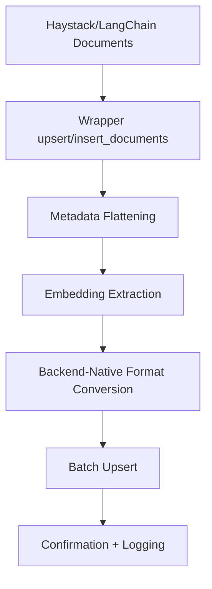

# Core: Databases

## 1. What This Feature Is

This module provides unified wrapper classes for five vector databases (Chroma, Milvus, Pinecone, Qdrant, Weaviate), giving Haystack and LangChain feature pipelines a consistent interface for:

- Collection/index lifecycle management
- Document insertion with embeddings
- Dense, sparse, and hybrid search
- Metadata filtering with backend-native expression formats
- Multi-tenancy via namespaces, partitions, or tenant-scoped collections

Each wrapper (`ChromaVectorDB`, `MilvusVectorDB`, `PineconeVectorDB`, `QdrantVectorDB`, `WeaviateVectorDB`) handles the low-level translation between framework document objects (Haystack `Document`, LangChain `Document`) and the native formats each database expects.

## 2. Why It Exists in Retrieval/RAG

Vector databases have fundamentally different APIs, authentication models, and query capabilities. Without this abstraction layer, every Haystack and LangChain feature module would need to implement five separate backend paths.

This layer exists to:

- **Unify document formats**: Automatically convert between Haystack/LangChain `Document` objects and backend-specific formats (Pinecone vectors, Qdrant points, Weaviate objects, Milvus entities, Chroma records).
- **Standardize operations**: Expose consistent method names (`create_collection`, `upsert`/`insert_documents`, `search`/`query`, `hybrid_search`) across all backends.
- **Handle metadata complexity**: Each backend has different metadata constraints (Chroma requires flat key-value pairs, Pinecone requires scalar values, Milvus uses JSON fields, Qdrant/Weaviate use native payload schemas).
- **Enable multi-tenancy**: Provide backend-appropriate isolation mechanisms (Pinecone namespaces, Weaviate tenants, Milvus partition keys, Qdrant payload filtering, Chroma tenant-suffixed collections).
- **Abstract filter syntax**: While filters are backend-specific, the wrappers provide consistent filter dictionary formats that are translated to native expressions at runtime.

## 3. Indexing Pipeline: Step-by-Step



### Step-by-Step Flow (Example: PineconeVectorDB.upsert)

1. **Input validation**: Checks if data is Haystack Documents or Pinecone-formatted dicts.
2. **Metadata flattening**: Calls `flatten_metadata()` to convert nested dicts to underscore notation (`user.id` → `user_id`).
3. **Format conversion**: Uses `PineconeDocumentConverter.prepare_haystack_documents_for_upsert()` to extract IDs, vectors, text, and metadata.
4. **Batch processing**: Splits documents into batches of 100 (configurable) for efficient API calls.
5. **Namespace routing**: Applies `namespace` parameter for tenant isolation.
6. **Upsert execution**: Calls `index.upsert(vectors=batch, namespace=namespace)`.
7. **Progress logging**: Logs batch completion and total upserted count.

### Backend-Specific Indexing Variations

| Backend | Method | Key Steps |
|---------|--------|-----------|
| **Chroma** | `upsert(data)` | Flatten metadata → ChromaDocumentConverter → `collection.upsert(ids, embeddings, documents, metadatas)` |
| **Milvus** | `insert_documents(documents, namespace)` | Extract content/metadata/embedding/sparse → Assign partition key → `client.insert(collection, data)` |
| **Pinecone** | `upsert(data, namespace)` | Flatten metadata → PineconeDocumentConverter → Batch upsert in chunks of 100 |
| **Qdrant** | `index_documents(documents, scope)` | Inject `tenant_id` into metadata → QdrantDocumentConverter → `client.upsert(points, wait=False)` |
| **Weaviate** | `upsert(data)` | Extract vector/UUID/properties → Batch dynamic context → `batch.add_object()` → Check failed_objects |

## 4. Search Pipeline: Step-by-Step

```mermaid
flowchart TD
    A[Query + Embedding] --> B[Wrapper search/query Method]
    B --> C[Filter Expression Building]
    C --> D[Tenant/Scope Resolution]
    D --> E[Backend Query Execution]
    E --> F[Result Conversion to Documents]
    F --> G[Score Normalization]
    G --> H[Return List[Document]]
```

### Step-by-Step Flow (Example: QdrantVectorDB.search)

1. **Scope resolution**: Consolidates `scope` or `tenant_id` parameters.
2. **Filter construction**: Calls `_get_tenant_filter(effective_scope)` to create Qdrant `Filter(must=[...])`.
3. **User filter merging**: If additional filters provided, merges with tenant filter using `Filter(must=[tenant_filter, user_filter])`.
4. **Search type routing**: Routes to dense/sparse/hybrid/mmr search logic.
5. **Query execution**: For hybrid, creates `Prefetch` objects for dense and sparse, then `client.query_points(fusion=Fusion.RRF)`.
6. **Result conversion**: Converts `ScoredPoint` objects to Haystack `Document` with `score`, `meta`, `content`, and optionally `embedding`.
7. **Score normalization**: Backend distance scores converted to similarity scores (higher = better).

### Backend-Specific Search Variations

| Backend | Method | Filter Format | Score Normalization |
|---------|--------|---------------|---------------------|
| **Chroma** | `query(query_embedding, where)` | `{"field": {"$op": value}}` | `score = 1.0 - distance` (cosine distance 0-2 → 0-1) |
| **Milvus** | `search(query_embedding, filters)` | Boolean expression string | Direct COSINE similarity (0-1) |
| **Pinecone** | `query(vector, filter, namespace)` | MongoDB-style (`$eq`, `$and`) | Direct similarity score |
| **Qdrant** | `search(query_vector, query_filter)` | `Filter(must=[FieldCondition(...)])` | Direct similarity score |
| **Weaviate** | `query(vector, filters)` | `Filter.by_property(...).equal(...)` | `score = 1 - distance` |

## 5. When to Use It

Use these database wrappers when:

- **Building framework-agnostic features**: Your Haystack or LangChain pipeline should work across multiple backends without rewriting logic.
- **Need consistent document handling**: Automatic conversion between framework `Document` objects and backend formats saves boilerplate.
- **Multi-tenancy is required**: Backend-specific tenant isolation (namespaces, partitions, tenants) is abstracted behind consistent `scope` parameters.
- **Hybrid search is needed**: Dense+sparse retrieval is implemented consistently across backends that support it (Pinecone, Qdrant, Milvus, Weaviate).
- **Metadata filtering varies by backend**: You want to use a common filter dictionary format that gets translated to backend-native expressions.
- **Operational simplicity matters**: Connection management, lazy initialization, and configuration loading are handled uniformly.

## 6. When Not to Use It

Avoid these wrappers when:

- **You need backend-specific advanced features**: Some cutting-edge backend features (Qdrant discovery, Weaviate GraphQL, Pinecone Serverless specs) may not be exposed.
- **Maximum performance is critical**: Direct backend SDK usage can sometimes bypass abstraction overhead for latency-sensitive applications.
- **You're using a single backend exclusively**: If you're certain you'll never switch backends, direct SDK usage may be simpler.
- **Custom schema design is needed**: The wrappers use opinionated schemas (JSON metadata, fixed field names); custom schemas require direct SDK usage.
- **You need async operations**: These wrappers are synchronous; async applications should use backend async SDKs directly.

## 7. What This Codebase Provides

### Core Classes (all in `src/vectordb/databases/`)

```python
from vectordb.databases import (
    ChromaVectorDB,
    MilvusVectorDB,
    PineconeVectorDB,
    QdrantVectorDB,
    WeaviateVectorDB,
)
```

### Common Methods Across All Wrappers

| Method | Purpose | Returns |
|--------|---------|---------|
| `create_collection(...)` | Create index/collection with schema | `None` |
| `upsert(data, ...)` / `insert_documents(documents, ...)` | Insert/update documents | `None` or count |
| `search(...)` / `query(...)` | Similarity search with filters | `List[Document]` |
| `hybrid_search(...)` | Dense+sparse retrieval | `List[Document]` |
| `delete(ids, ...)` | Remove documents by ID | `None` |
| `delete_collection(name)` | Drop entire collection | `None` |
| `list_collections()` | List all collections | `List[str]` |
| `with_tenant(tenant, ...)` | Clone with tenant context | New wrapper instance |

### Utility Methods

- **Metadata flattening**: `flatten_metadata(metadata)` - Recursive dict flattening for backend compatibility.
- **Filter building**: `_build_filter(filters)` - Convert MongoDB-style dicts to backend-native filters.
- **Document conversion**: `query_to_documents(response)` - Convert backend responses to Haystack `Document`.

### Configuration Loading

All wrappers support three configuration sources (priority order):

1. Constructor parameters
2. Config dict or YAML file path
3. Environment variables

Example:

```python
db = QdrantVectorDB(
    config_path="configs/qdrant.yaml",  # Loads from file
    # Or direct: config={"qdrant": {"url": "...", "api_key": "..."}}
)
```

## 8. Backend-Specific Behavior Differences

### ChromaVectorDB

**Connection Model**: Three client modes:

- `EphemeralClient`: In-memory only, no persistence.
- `PersistentClient`: Local file storage (default for local dev).
- `HttpClient`: Remote Chroma or Chroma Cloud.

**Metadata Constraints**:

- Requires flat key-value pairs with scalar values.
- Nested dicts converted to dot notation (`parent.child.key`).
- Lists preserved only if uniform scalar types; otherwise serialized to strings.

**Search API**:

- Uses experimental `Search` API when `host` is configured (Chroma 0.6+).
- Falls back to `query()` for local deployments.

**Multi-tenancy**:

- Tenant-suffixed collection naming (`<base>_<tenant>`).
- `with_tenant()` clones wrapper with different tenant/database context.

### MilvusVectorDB

**Schema**: Fixed schema with:

- `INT64` auto primary key
- `FLOAT_VECTOR` dense embedding
- `SPARSE_FLOAT_VECTOR` (optional)
- `VARCHAR` content field
- `JSON` metadata field
- `VARCHAR` partition key (optional)

**Indexing**:

- HNSW index with cosine similarity on dense field.
- `SPARSE_INVERTED_INDEX` with inner product for sparse.

**Filter Syntax**: Boolean expression strings:

```python
filters = 'metadata["category"] == "tech" && metadata["year"] > 2020'
```

**Multi-tenancy**:

- `use_partition_key=True` adds partition key field.
- Physical routing to different partitions based on key value.
- More efficient than post-search filtering.

### PineconeVectorDB

**Connection Model**:

- Lazy initialization (GRPC client).
- Serverless indexes (AWS `us-east-1` default).

**Namespace Isolation**:

- All operations accept `namespace` parameter.
- `list_namespaces()` from index statistics.
- `delete_namespace(namespace)` removes all vectors.

**Metadata Constraints**:

- Flat key-value pairs with underscore notation (`user_id`).
- Lists preserved only if all strings; otherwise converted.

**Hybrid Search**:

- `query_with_sparse(vector, sparse_vector)` passes both to native hybrid endpoint.
- Sparse format: `{"indices": [...], "values": [...]}`.

### QdrantVectorDB

**Connection Model**:

- gRPC preferred (lower latency).
- Supports local (`localhost:6333`) or Cloud HTTPS.

**Named Vectors**:

- Hybrid mode creates separate `"dense"` and `"sparse"` vector spaces.
- Configurable via `dense_vector_name`, `sparse_vector_name`.

**Quantization**:

- Scalar (INT8): ~4x memory reduction.
- Binary: ~32x reduction.
- Configured via `quantization.type` in config.

**Tenant Optimization**:

- `create_namespace_index()` creates payload index with `is_tenant=True`.
- Optimized for high-cardinality tenant filtering (Qdrant 1.16+).

**MMR Reranking**:

- Built-in `mmr_rerank()` using cosine similarity.
- Fetches extra candidates, then applies `λ*relevance - (1-λ)*redundancy`.

### WeaviateVectorDB

**Connection Model**:

- Eager connection (fails fast on config errors).
- Weaviate Cloud requires API key authentication.

**Collection Design**:

- Optional vectorizer configs (`text2vec_openai`).
- Optional generative configs (`openai` for built-in RAG).
- Multi-tenancy enabled per collection.

**Query Types**:

- `near_vector`: Dense vector search.
- `near_text`: Text-based semantic search.
- `hybrid`: Vector + BM25 with `alpha` weight.
- `generate()`: Built-in RAG with `single_prompt` or `grouped_task`.

**Batch Upsert**:

- Uses `collection.batch.dynamic()` context.
- Tracks failed objects; raises `RuntimeError` if any fail.

## 9. Configuration Semantics

### ChromaVectorDB

| Key | Type | Default | Description |
|-----|------|---------|-------------|
| `host` | str | `None` | Remote server hostname |
| `port` | int | `8000` | Server port |
| `api_key` | str | `None` | Chroma Cloud API key |
| `tenant` | str | `"default_tenant"` | Multi-tenant context |
| `database` | str | `"default_database"` | Database within tenant |
| `path` | str | `"./chroma"` | Local persistent storage path |
| `persistent` | bool | `True` | Use persistent storage locally |
| `collection_name` | str | `None` | Default collection |

**Environment**: `CHROMA_HOST`, `CHROMA_PORT`, `CHROMA_API_KEY`, `CHROMA_TENANT`, `CHROMA_DATABASE`

### MilvusVectorDB

| Key | Type | Default | Description |
|-----|------|---------|-------------|
| `uri` | str | `"http://localhost:19530"` | Server URI or Zilliz Cloud endpoint |
| `token` | str | `""` | Zilliz Cloud API token |
| `collection_name` | str | `None` | Default collection |

**Zilliz Cloud Setup**:

```python
db = MilvusVectorDB(
    uri="https://in03-xxxxx.api.gcp-us-west1.zillizcloud.com",
    token="your-api-token",
)
```

### PineconeVectorDB

| Key | Type | Default | Description |
|-----|------|---------|-------------|
| `api_key` | str | Required | Pinecone API key |
| `index_name` | str | Required | Index name |
| `host` | str | `None` | Custom host (self-hosted) |
| `proxy_url` | str | `None` | Proxy for GRPC |
| `ssl_verify` | bool | `True` | Verify SSL certificates |

**Environment**: `PINECONE_API_KEY`, `PINECONE_INDEX_NAME`

### QdrantVectorDB

| Key | Type | Default | Description |
|-----|------|---------|-------------|
| `url` | str | `"http://localhost:6333"` | Qdrant server URL |
| `api_key` | str | `None` | Cloud authentication |
| `collection_name` | str | `"haystack_collection"` | Default collection |
| `dense_vector_name` | str | `"dense"` | Named vector for hybrid |
| `sparse_vector_name` | str | `"sparse"` | Named vector for hybrid |
| `quantization.type` | str | `None` | `"scalar"` or `"binary"` |

**Environment**: `QDRANT_URL`, `QDRANT_API_KEY`

### WeaviateVectorDB

| Key | Type | Default | Description |
|-----|------|---------|-------------|
| `cluster_url` | str | Required | Weaviate Cloud URL |
| `api_key` | str | Required | Cloud API key |
| `headers` | dict | `{}` | Additional HTTP headers |

**Example Headers**:

```python
db = WeaviateVectorDB(
    cluster_url="https://xxx.weaviate.cloud",
    api_key="xxx",
    headers={"X-OpenAI-Api-Key": "sk-..."},  # For vectorizer
)
```

## 10. Failure Modes and Edge Cases

### Common Failure Modes

| Failure | Cause | Mitigation |
|---------|-------|------------|
| **Connection timeout** | Wrong URI, firewall, server down | Validate URI, check network, use eager connection (Weaviate) |
| **Authentication failure** | Missing/invalid API key | Verify env vars, check key permissions |
| **Schema mismatch** | Collection exists with different schema | Use `recreate=True` or drop manually |
| **Metadata flattening errors** | Complex nested structures | Ensure metadata is dict-friendly; lists must be uniform |
| **Filter syntax errors** | Backend-specific expression format | Use wrapper's `_build_filter()`; test filters incrementally |
| **Empty collection search** | No documents indexed yet | Handle empty results gracefully; check indexing logs |
| **Namespace not found** | Typo in namespace/scope | Use `list_namespaces()` to verify; namespaces created implicitly on first upsert |

### Backend-Specific Edge Cases

**Chroma**:

- Empty metadata dicts cause issues in older versions → Add dummy `{"_": "_"}` field.
- `Search` API only available on hosted Chroma 0.6+ → Falls back to `query()` for local.
- Distance scores (0-2 for cosine) must be normalized → `score = 1.0 - distance`.

**Milvus**:

- Partition key filtering requires exact field name match → Use `partition_key_field` consistently.
- JSON path indexing requires explicit `create_json_index()` call → Index before filtering.
- Filter expressions must escape quotes → Wrapper's `_escape_expr_string()` handles this.

**Pinecone**:

- `describe_index_stats()` returns total count, not filtered count → `estimate_match_count()` is approximate.
- Fetch limited to 1000 IDs per request → Batch manually for larger sets.
- `delete_all=True` is irreversible → Use namespace-specific deletions.

**Qdrant**:

- Upsert is async (`wait=False`) → Documents not immediately searchable.
- Hybrid search requires dict query_vector with both dense and sparse → Validate input format.
- MMR requires extra candidate fetch → `candidate_multiplier = 4` by default.

**Weaviate**:

- Batch upsert tracks failed objects → Check `collection.batch.failed_objects`.
- Generative search requires `single_prompt` or `grouped_task` → Validate at call time.
- Multi-tenancy must be enabled at collection creation → Cannot add later.

## 11. Practical Usage Examples

### Example 1: Multi-Tenant Pinecone Indexing

```python
from vectordb.databases import PineconeVectorDB
from haystack import Document

db = PineconeVectorDB(
    api_key="pc-xxx",
    index_name="rag-docs",
)

# Create index
db.create_index(dimension=768, metric="cosine")

# Index documents for different tenants
docs_tenant_a = [Document(content="...", embedding=[...])]
docs_tenant_b = [Document(content="...", embedding=[...])]

db.upsert(docs_tenant_a, namespace="tenant-a")
db.upsert(docs_tenant_b, namespace="tenant-b")

# Query tenant-a only
results = db.query(
    vector=query_embedding,
    top_k=5,
    namespace="tenant-a",
    include_metadata=True,
)
```

### Example 2: Hybrid Search with Qdrant

```python
from vectordb.databases import QdrantVectorDB
from haystack.dataclasses import SparseEmbedding

db = QdrantVectorDB(config_path="configs/qdrant.yaml")

# Create hybrid collection
db.create_collection(dimension=768, use_sparse=True)
db.create_namespace_index()  # Optimized tenant filtering

# Index with sparse embeddings
docs = [...]  # Documents with both dense and sparse embeddings
db.index_documents(docs, scope="tenant-1")

# Hybrid search
results = db.search(
    query_vector={"dense": dense_vec, "sparse": sparse_vec},
    scope="tenant-1",
    search_type="hybrid",
    top_k=10,
)
```

### Example 3: Milvus Partition-Key Multi-Tenancy

```python
from vectordb.databases import MilvusVectorDB
from haystack import Document

db = MilvusVectorDB(
    uri="http://localhost:19530",
    collection_name="multi-tenant-docs",
)

# Create collection with partition keys
db.create_collection(
    collection_name="multi-tenant-docs",
    dimension=768,
    use_partition_key=True,
    partition_key_field="tenant_id",
)

# Insert documents (automatically routed to partitions)
docs = [Document(content="...", embedding=[...])]
db.insert_documents(docs, namespace="acme-corp")

# Search with partition filtering
results = db.search(
    query_embedding=query_vec,
    scope="acme-corp",  # Routes to correct partition
    top_k=5,
)
```

### Example 4: Weaviate Generative Search

```python
from vectordb.databases import WeaviateVectorDB
from weaviate.classes.config import Configure

db = WeaviateVectorDB(
    cluster_url="https://xxx.weaviate.cloud",
    api_key="xxx",
    headers={"X-OpenAI-Api-Key": "sk-..."},
)

# Create collection with generative config
db.create_collection(
    "Articles",
    enable_multi_tenancy=True,
    generative_config=Configure.Generative.openai(),
)

db.create_tenants(["tenant-a"])

# Generative RAG
response = db.generate(
    query_string="What is RAG?",
    grouped_task="Summarize the retrieved context into a coherent answer.",
    limit=5,
    filters={"category": {"$eq": "ai"}},
)
```

### Example 5: Chroma Metadata Filtering

```python
from vectordb.databases import ChromaVectorDB

db = ChromaVectorDB(
    persistent=True,
    path="./chroma-data",
    collection_name="docs",
)

db.create_collection("docs")

# Upsert with metadata
db.upsert({
    "ids": ["doc1", "doc2"],
    "texts": ["Content A", "Content B"],
    "embeddings": [[...], [...]],
    "metadatas": [
        {"category": "tech", "year": 2024},
        {"category": "science", "year": 2023},
    ],
})

# Query with filter
results = db.query(
    query_embedding=query_vec,
    n_results=5,
    where={"year": {"$gte": 2024}},
)

documents = db.query_to_documents(results)
```

## 12. Source Walkthrough Map

### Core Wrapper Files

| File | Lines | Key Classes |
|------|-------|-------------|
| `src/vectordb/databases/chroma.py` | 631 | `ChromaVectorDB` |
| `src/vectordb/databases/milvus.py` | 814 | `MilvusVectorDB` |
| `src/vectordb/databases/pinecone.py` | 692 | `PineconeVectorDB` |
| `src/vectordb/databases/qdrant.py` | 975 | `QdrantVectorDB` |
| `src/vectordb/databases/weaviate.py` | 722 | `WeaviateVectorDB` |

### Supporting Files

| File | Purpose |
|------|---------|
| `src/vectordb/databases/__init__.py` | Module exports |
| `src/vectordb/databases/README.md` | Architecture overview |

### Document Converters (in `src/vectordb/utils/`)

| File | Purpose |
|------|---------|
| `chroma_document_converter.py` | Haystack ↔ Chroma format |
| `milvus_document_converter.py` | Haystack ↔ Milvus entities |
| `pinecone_document_converter.py` | Haystack ↔ Pinecone vectors |
| `qdrant_document_converter.py` | Haystack ↔ Qdrant points |
| `weaviate_document_converter.py` | Haystack ↔ Weaviate objects |

### Configuration Examples

YAML configs for each backend are typically placed in feature module `configs/` directories (e.g., `src/vectordb/haystack/metadata_filtering/configs/`).

Example structure:

```yaml
# qdrant.yaml
qdrant:
  url: "http://localhost:6333"
  api_key: null
  collection_name: "my-collection"
  quantization:
    type: "scalar"
    quantile: 0.99
```

---

**Next Steps**: After understanding database wrappers, proceed to:

- **Dataloaders** (`docs/core/dataloaders.md`) for dataset loading patterns.
- **Framework-specific features** (`docs/haystack/` or `docs/langchain/`) for retrieval pipelines.
