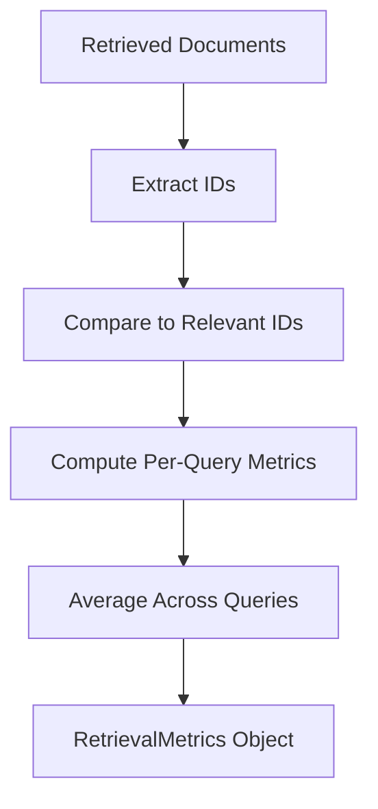

# Core: Shared Utilities

## 1. What This Feature Is

Shared utilities centralize cross-framework concerns used by both Haystack and LangChain pipelines:

- **Configuration loading**: YAML parsing with environment variable substitution (`${VAR}` syntax).
- **Evaluation metrics**: Standard IR metrics (Recall@k, Precision@k, MRR, NDCG@k, Hit Rate).
- **Document conversion**: Backend-specific converters (Chroma, Pinecone, Qdrant, Weaviate formats ↔ framework documents).
- **ID management**: Deterministic document ID generation and coercion.
- **Scope injection**: Multi-tenancy/namespace metadata injection and filter building.
- **Sparse embeddings**: Normalization and backend-specific format conversion (Milvus, Pinecone, Qdrant).
- **Logging**: Centralized logger factory with config-based initialization.
- **Output models**: Structured output types for retrieval results and pipeline outputs.

These utilities ensure consistency across all feature modules and backends.

## 2. Why It Exists in Retrieval/RAG

Without shared utilities, every feature module would need to reimplement:

- **Config parsing**: Each pipeline would handle YAML loading and env var substitution differently.
- **Evaluation**: Metrics would be implemented inconsistently, making cross-feature comparisons meaningless.
- **Document conversion**: Backend-specific format handling would be duplicated across Haystack and LangChain modules.
- **Multi-tenancy**: Scope injection logic would diverge, causing tenant isolation bugs.
- **Sparse embeddings**: Each backend wrapper would implement its own sparse vector format conversion.

This module exists to:

- **Ensure consistency**: Same config loading, same metrics, same conversion logic everywhere.
- **Reduce duplication**: One implementation, reused across 35+ feature modules.
- **Centralize fixes**: Bug fixes or improvements apply to all pipelines automatically.
- **Standardize interfaces**: Common types (`RetrievalMetrics`, `QueryResult`, `PipelineOutput`) enable consistent result handling.

## 3. Configuration Loading: Step-by-Step

```mermaid
flowchart TD
    A[YAML Config File] --> B[load_config Path]
    B --> C[yaml.safe_load]
    C --> D[resolve_env_vars Recursive]
    D --> E[${VAR} Pattern Match]
    E --> F[os.environ Lookup]
    F --> G[Resolved Config Dict]
    G --> H[Pipeline Initialization]
```

### Step-by-Step Flow

1. **File loading**: `load_config("config.yaml")` opens and parses YAML file.
2. **Initial parsing**: `yaml.safe_load(f)` returns nested dict.
3. **Env var resolution**: `resolve_env_vars(config)` recursively processes all values:
   - Matches pattern `\$\{([^}]+)\}` (e.g., `${PINECONE_API_KEY}`).
   - For `${VAR:-default}`, splits on `:-` and uses default if VAR not set.
   - For `${VAR}`, uses empty string if VAR not set.
   - Handles multiple vars in one string: `"http://${HOST}:${PORT}"`.
4. **Recursive processing**: Applies resolution to dicts, lists, and nested structures.
5. **Return resolved config**: All `${...}` patterns replaced with actual values.

### Example Config Resolution

```yaml
# Before resolution
pinecone:
  api_key: "${PINECONE_API_KEY}"
  index_name: "my-index-${ENV:-dev}"

qdrant:
  url: "${QDRANT_URL:-http://localhost:6333}"
```

```python
import os
os.environ["PINECONE_API_KEY"] = "pc-xxx"
os.environ["ENV"] = "prod"

from vectordb.utils.config import load_config
config = load_config("config.yaml")

# After resolution:
# config["pinecone"]["api_key"] = "pc-xxx"
# config["pinecone"]["index_name"] = "my-index-prod"
# config["qdrant"]["url"] = "http://localhost:6333" (default used)
```

## 4. Evaluation Metrics: Step-by-Step



### Metric Computation Flow

For each query:

1. **Retrieve documents**: Pipeline returns ranked list of document IDs.
2. **Extract IDs**: `retrieved_ids = [doc.id for doc in results[:k]]`.
3. **Compare to ground truth**: `relevant_ids = {q.relevant_doc_ids for q in queries}`.
4. **Compute per-query metrics**:
   - `recall@k = |relevant ∩ retrieved| / |relevant|`
   - `precision@k = |relevant ∩ retrieved| / k`
   - `mrr = 1 / rank_of_first_relevant`
   - `ndcg@k = DCG@k / IDCG@k`
   - `hit_rate = 1 if any relevant in top-k else 0`
5. **Aggregate**: Average metrics across all queries.
6. **Return**: `RetrievalMetrics` dataclass with all aggregated scores.

### NDCG Calculation Details

```python
def compute_dcg_at_k(retrieved_ids, relevant_ids, k):
    """DCG@k = Σ (rel_i / log2(i+2)) for i in 0..k-1"""
    dcg = 0.0
    for i, doc_id in enumerate(retrieved_ids[:k]):
        if doc_id in relevant_ids:
            dcg += 1.0 / np.log2(i + 2)  # +2 for 0-indexed
    return dcg

def compute_ndcg_at_k(retrieved_ids, relevant_ids, k):
    """NDCG@k = DCG@k / IDCG@k"""
    dcg = compute_dcg_at_k(retrieved_ids, relevant_ids, k)
    # IDCG: ideal ranking (all relevant docs first)
    ideal_retrieved = list(relevant_ids)[:k]
    idcg = compute_dcg_at_k(ideal_retrieved, relevant_ids, k)
    return dcg / idcg if idcg > 0 else 0.0
```

## 5. When to Use It

Use shared utilities when:

- **Loading pipeline configs**: All feature modules should use `load_config()` for consistent env var handling.
- **Evaluating retrieval quality**: Use `compute_recall_at_k()`, `compute_mrr()`, `compute_ndcg_at_k()` for standard metrics.
- **Converting backend formats**: Use `ChromaDocumentConverter`, `PineconeDocumentConverter`, etc., for framework document conversion.
- **Managing document IDs**: Use `get_doc_id()`, `coerce_id()`, `set_doc_id()` for deterministic ID handling.
- **Implementing multi-tenancy**: Use `inject_scope_to_metadata()`, `build_scope_filter_expr()` for tenant isolation.
- **Working with sparse embeddings**: Use `normalize_sparse()`, `to_milvus_sparse()`, `to_pinecone_sparse()` for format conversion.
- **Setting up logging**: Use `LoggerFactory` or `setup_logger()` for consistent log formatting.

## 6. When Not to Use It

Avoid shared utilities when:

- **Custom metrics needed**: Your evaluation requires domain-specific metrics beyond standard IR metrics.
- **Non-standard config format**: Your configs use JSON, TOML, or other formats (extend `load_config()` instead).
- **Backend not supported**: You're using a vector DB not in the supported list (add new converter instead).
- **Performance-critical paths**: Some utilities add overhead; inline critical code for latency-sensitive operations.

## 7. What This Codebase Provides

### Configuration Utilities (`src/vectordb/utils/config.py`)

```python
from vectordb.utils.config import (
    load_config,              # Load YAML with env var resolution
    resolve_env_vars,         # Recursively resolve ${VAR} patterns
    setup_logger,             # Initialize logger from config
    resolve_embedding_model,  # Resolve model aliases (qwen3 → full path)
    get_dataset_limits,       # Get default index/eval limits per dataset
)
```

**Environment Variable Resolution**:

```python
import os
from vectordb.utils.config import resolve_env_vars

os.environ["HOST"] = "localhost"
os.environ["PORT"] = "8080"

# Multiple variables in one string are supported
value = resolve_env_vars("http://${HOST}:${PORT}")
# Returns: "http://localhost:8080"

# Default values with :- syntax
value = resolve_env_vars("${MISSING:-default_value}")
# Returns: "default_value"

# Works recursively on nested structures
config = resolve_env_vars({
    "api": {"url": "http://${HOST}:${PORT}/api"},
    "debug": True,
})
# Returns: {"api": {"url": "http://localhost:8080/api"}, "debug": True}
```

**Embedding Model Aliases**:

```python
EMBEDDING_MODEL_ALIASES = {
    "qwen3": "Qwen/Qwen3-Embedding-0.6B",
    "minilm": "sentence-transformers/all-MiniLM-L6-v2",
    "mpnet": "sentence-transformers/all-mpnet-base-v2",
}
```

### Evaluation Metrics (`src/vectordb/utils/evaluation.py`)

```python
from vectordb.utils.evaluation import (
    # Metric functions (per-query)
    compute_recall_at_k,
    compute_precision_at_k,
    compute_mrr,
    compute_dcg_at_k,
    compute_ndcg_at_k,
    compute_hit_rate,

    # Full evaluation
    evaluate_retrieval,

    # Data classes
    RetrievalMetrics,    # Aggregated metrics container
    QueryResult,         # Single query result
    EvaluationResult,    # Complete evaluation with metadata
)
```

**Usage Example**:

```python
from vectordb.utils.evaluation import evaluate_retrieval

results = [
    pipeline.search(q.query, top_k=10)
    for q in queries
]

evaluation = evaluate_retrieval(
    results=results,
    queries=queries,
    k=10,
)

print(f"Recall@10: {evaluation.metrics.recall_at_k:.2%}")
print(f"MRR: {evaluation.metrics.mrr:.3f}")
print(f"NDCG@10: {evaluation.metrics.ndcg_at_k:.3f}")
```

### Document Converters (`src/vectordb/utils/`)

```python
from vectordb.utils.chroma_document_converter import ChromaDocumentConverter
from vectordb.utils.pinecone_document_converter import PineconeDocumentConverter
from vectordb.utils.qdrant_document_converter import QdrantDocumentConverter
from vectordb.utils.weaviate_document_converter import WeaviateDocumentConverter
```

**Common Methods**:

- `prepare_haystack_documents_for_upsert(documents)` → Backend format
- `convert_query_results_to_haystack_documents(response)` → Haystack Documents

### ID Management (`src/vectordb/utils/ids.py`)

```python
from vectordb.utils.ids import (
    get_doc_id,         # Extract ID from Haystack Document
    coerce_id,          # Convert any value to string ID
    set_doc_id,         # Set ID on document object
)
```

**Usage**:

```python
from vectordb.utils.ids import get_doc_id, coerce_id
from haystack import Document

# Extract ID from Haystack Document (uses doc.id, then meta, then generates UUID)
doc = Document(content="This is the document content", id="doc-123")
doc_id = get_doc_id(doc)
# Returns: "doc-123"

# Coerce to string, generate UUID if None
doc_id = coerce_id(None)  # Generates UUID
doc_id = coerce_id(12345)  # Returns: "12345"
```

### Scope Injection (`src/vectordb/utils/scope.py`)

```python
from vectordb.utils.scope import (
    inject_scope_to_metadata,    # Add tenant_id to document metadata
    inject_scope_to_filter,      # Add tenant filter to query filter
    build_scope_filter_expr,     # Build backend-specific filter expression
)
```

**Usage**:

```python
from vectordb.utils.scope import inject_scope_to_metadata, inject_scope_to_filter

# Index-time: inject tenant into metadata
doc = inject_scope_to_metadata(doc, scope="tenant-1")
# doc.meta["tenant_id"] = "tenant-1"

# Query-time: add tenant to filter
filters = inject_scope_to_filter(
    existing_filters={"category": "tech"},
    scope="tenant-1",
)
# Returns: {"$and": [{"category": "tech"}, {"tenant_id": "tenant-1"}]}
```

### Sparse Embeddings (`src/vectordb/utils/sparse.py`)

```python
from vectordb.utils.sparse import (
    normalize_sparse,         # Convert to dict {index: value}
    to_milvus_sparse,         # Convert to Milvus SparseEmbedding
    to_pinecone_sparse,       # Convert to Pinecone {"indices": [...], "values": [...]}
    to_qdrant_sparse,         # Convert to Qdrant SparseVector
    get_doc_sparse_embedding, # Extract sparse embedding from document
)
```

**Usage**:

```python
from haystack.dataclasses import SparseEmbedding
from vectordb.utils.sparse import normalize_sparse, to_pinecone_sparse

sparse = SparseEmbedding(indices=[0, 5, 10], values=[0.2, 0.5, 0.8])
normalized = normalize_sparse(sparse)  # {0: 0.2, 5: 0.5, 10: 0.8}
pinecone_format = to_pinecone_sparse(normalized)
# {"indices": [0, 5, 10], "values": [0.2, 0.5, 0.8]}
```

### Logging (`src/vectordb/utils/logging.py`)

```python
from vectordb.utils.logging import LoggerFactory

factory = LoggerFactory(logger_name="my-pipeline", log_level="INFO")
logger = factory.get_logger()
logger.info("Pipeline initialized")
```

### Output Models (`src/vectordb/utils/output.py`)

```python
from vectordb.utils.output import (
    RetrievedDocument,     # Single retrieved doc with score
    RetrievalOutput,       # List of retrieved docs + metadata
    PipelineOutput,        # Full pipeline result (retrieval + generation)
)
```

## 8. Backend-Specific Behavior Differences

### Document Conversion

| Backend | Format | Metadata Handling |
|---------|--------|-------------------|
| **Chroma** | `{"ids": [...], "documents": [...], "metadatas": [...]}` | Flattened to dot notation |
| **Pinecone** | `{"id": "...", "values": [...], "metadata": {...}}` | Flattened to underscore notation |
| **Qdrant** | `models.PointStruct(id, vector, payload)` | Native payload (nested OK) |
| **Weaviate** | `{"id": "...", "vector": [...], "properties": {...}}` | Native properties (nested OK) |
| **Milvus** | `{"id": "...", "embedding": [...], "content": "...", "metadata": {...}}` | JSON field (nested OK) |

### Sparse Embedding Formats

| Backend | Format | Example |
|---------|--------|---------|
| **Milvus** | `SparseEmbedding(indices, values)` | `SparseEmbedding(indices=[0,5], values=[0.2,0.8])` |
| **Pinecone** | `{"indices": [...], "values": [...]}` | `{"indices": [0, 5], "values": [0.2, 0.8]}` |
| **Qdrant** | `models.SparseVector(indices, values)` | `SparseVector(indices=[0,5], values=[0.2,0.8])` |
| **Weaviate** | Native BM25 (not SPLADE) | Uses `hybrid(alpha=...)` with BM25 |

### Filter Expression Formats

| Backend | Format | Example |
|---------|--------|---------|
| **Chroma** | `{"field": {"$op": value}}` | `{"year": {"$gte": 2020}}` |
| **Pinecone** | MongoDB-style | `{"$and": [{"year": {"$gte": 2020}}]}` |
| **Qdrant** | `models.Filter(must=[...])` | `Filter(must=[FieldCondition(key="year", range=Range(gte=2020))])` |
| **Milvus** | Boolean expression string | `'metadata["year"] >= 2020'` |
| **Weaviate** | `Filter.by_property(...).equal(...)` | `Filter.by_property("year").greater_or_equal(2020)` |

## 9. Configuration Semantics

### Environment Variable Syntax

| Syntax | Behavior | Example |
|--------|----------|---------|
| `${VAR}` | Substitute with env var, empty string if unset | `${PINECONE_API_KEY}` |
| `${VAR:-default}` | Substitute with VAR if set, else default | `${QDRANT_URL:-http://localhost:6333}` |
| Multiple in one string | All patterns resolved | `"http://${HOST}:${PORT}"` |

### Dataset Limits

```python
from vectordb.utils.config import get_dataset_limits

limits = get_dataset_limits("triviaqa")
# Returns: {"index_limit": 500, "eval_limit": 100}
```

| Dataset | Default Index Limit | Default Eval Limit |
|---------|---------------------|-------------------|
| TriviaQA | 500 | 100 |
| ARC | 1000 | 200 |
| PopQA | 500 | 100 |
| FActScore | 500 | 100 |
| Earnings Calls | 300 | 50 |

### Logger Configuration

```yaml
logging:
  level: "INFO"  # DEBUG, INFO, WARNING, ERROR, CRITICAL
  name: "my-pipeline"  # Logger name
```

```python
from vectordb.utils.config import setup_logger

logger = setup_logger(config)
# Initializes logger with configured level and name
```

## 10. Failure Modes and Edge Cases

### Configuration Loading

| Failure | Cause | Mitigation |
|---------|-------|------------|
| **FileNotFoundError** | Config path doesn't exist | Verify path, use absolute paths |
| **YAMLError** | Malformed YAML syntax | Validate YAML with linter |
| **Env var not set** | `${VAR}` with no default and VAR not in env | Use `${VAR:-default}` syntax |
| **Nested env vars** | Env var value contains `${...}` patterns | Resolution is single-pass; pre-resolve env vars |

### Evaluation Metrics

| Failure | Cause | Mitigation |
|---------|-------|------------|
| **Division by zero** | Empty relevant set | Metrics return 0.0 for empty relevant sets |
| **k > len(retrieved)** | Fewer results than k | Metrics use `retrieved[:k]` (handles shorter lists) |
| **ID mismatch** | Retrieved IDs don't match relevant ID format | Normalize IDs before evaluation (use `coerce_id()`) |

### Document Conversion

| Failure | Cause | Mitigation |
|---------|-------|------------|
| **Metadata flattening errors** | Complex nested structures | Ensure metadata is dict-friendly; lists must be uniform |
| **Missing required fields** | Backend format missing `id`, `vector`, etc. | Validate format before conversion |
| **Vector dimension mismatch** | Embedding dim doesn't match collection dim | Verify embedding model consistency |

### Sparse Embeddings

| Failure | Cause | Mitigation |
|---------|-------|------------|
| **Index out of bounds** | Sparse indices exceed vocabulary size | Validate indices against model vocab |
| **Values not normalized** | Sparse values not in expected range | Apply normalization if needed |
| **Backend format mismatch** | Wrong sparse format for backend | Use backend-specific `to_*_sparse()` functions |

### Scope Injection

| Failure | Cause | Mitigation |
|---------|-------|------------|
| **Tenant leakage** | Scope not injected consistently | Always use `inject_scope_to_metadata()` at index time |
| **Filter syntax errors** | Scope filter combined incorrectly with user filters | Use `inject_scope_to_filter()` which handles combination logic |
| **Missing tenant_id field** | Backend schema doesn't have tenant_id field | Ensure collection schema includes tenant_id metadata |

## 11. Practical Usage Examples

### Example 1: Config Loading with Env Vars

```python
from vectordb.utils.config import load_config, get_dataset_limits

# Load config with env var resolution
config = load_config("src/vectordb/haystack/semantic_search/configs/pinecone_triviaqa.yaml")

# Access resolved values
api_key = config["pinecone"]["api_key"]  # From ${PINECONE_API_KEY}
index_name = config["pinecone"]["index_name"]

# Get dataset limits
limits = get_dataset_limits("triviaqa")
print(f"Index {limits['index_limit']} documents, evaluate on {limits['eval_limit']} queries")
```

### Example 2: Full Evaluation Pipeline

```python
from vectordb.dataloaders import DataloaderCatalog
from vectordb.haystack.semantic_search import SemanticSearchPipeline
from vectordb.utils.evaluation import evaluate_retrieval

# Load dataset and queries
loader = DataloaderCatalog.create("triviaqa", split="test", limit=500)
dataset = loader.load()
queries = dataset.evaluation_queries(limit=100)

# Index documents
pipeline = SemanticSearchPipeline(config_path="configs/pinecone_triviaqa.yaml")
pipeline.run(documents=dataset.to_haystack())

# Evaluate retrieval
results = [
    pipeline.search(q.query, top_k=10)
    for q in queries
]

evaluation = evaluate_retrieval(
    results=results,
    queries=queries,
    k=10,
)

print(f"Recall@10: {evaluation.metrics.recall_at_k:.2%}")
print(f"MRR: {evaluation.metrics.mrr:.3f}")
print(f"NDCG@10: {evaluation.metrics.ndcg_at_k:.3f}")
```

### Example 3: Multi-Tenancy with Scope Injection

```python
from vectordb.utils.scope import inject_scope_to_metadata, inject_scope_to_filter
from vectordb.databases import PineconeVectorDB

db = PineconeVectorDB(api_key="pc-xxx", index_name="multi-tenant")

# Index documents with tenant isolation
docs = [...]  # Haystack documents
for doc in docs:
    doc = inject_scope_to_metadata(doc, scope="acme-corp")
    # doc.meta["tenant_id"] = "acme-corp"

db.upsert(docs, namespace="acme-corp")

# Query with tenant filter
filters = inject_scope_to_filter(
    existing_filters={"category": "tech"},
    scope="acme-corp",
)
# filters = {"$and": [{"category": "tech"}, {"tenant_id": "acme-corp"}]}

results = db.query(
    vector=query_embedding,
    filter=filters,
    namespace="acme-corp",
)
```

### Example 4: Sparse Embedding Conversion

```python
from haystack.dataclasses import SparseEmbedding
from vectordb.utils.sparse import normalize_sparse, to_pinecone_sparse, to_qdrant_sparse

# Create sparse embedding (e.g., from SPLADE model)
sparse = SparseEmbedding(indices=[0, 5, 10, 100], values=[0.2, 0.5, 0.8, 0.1])

# Convert to backend-specific formats
normalized = normalize_sparse(sparse)  # {0: 0.2, 5: 0.5, 10: 0.8, 100: 0.1}

pinecone_format = to_pinecone_sparse(normalized)
# {"indices": [0, 5, 10, 100], "values": [0.2, 0.5, 0.8, 0.1]}

qdrant_format = to_qdrant_sparse(normalized)
# models.SparseVector(indices=[0, 5, 10, 100], values=[0.2, 0.5, 0.8, 0.1])
```

### Example 5: Deterministic Document IDs

```python
from vectordb.utils.ids import get_doc_id, coerce_id, set_doc_id
from haystack import Document

# Generate deterministic ID from content
content = "This is the document content"
doc_id = get_doc_id(content)
# Returns: SHA-256 hash (first 32 chars)

# Create document with deterministic ID
doc = Document(content=content, id=doc_id)

# Or use coerce_id to ensure ID exists
doc_no_id = Document(content=content)
doc_no_id = coerce_id(doc_no_id, content=content)
# Generates ID if missing

# Set ID on existing document
set_doc_id(doc, new_id="custom-id-123")
```

### Example 6: Custom Evaluation with Per-Query Results

```python
from vectordb.utils.evaluation import (
    compute_recall_at_k,
    compute_mrr,
    compute_ndcg_at_k,
    QueryResult,
    RetrievalMetrics,
)

# Per-query evaluation
query_results = []
for q, results in zip(queries, retrieval_results):
    retrieved_ids = [doc.id for doc in results[:10]]
    relevant_ids = set(q.relevant_doc_ids)

    result = QueryResult(
        query=q.query,
        retrieved_ids=retrieved_ids,
        relevant_ids=relevant_ids,
    )
    query_results.append(result)

# Aggregate metrics
recall_scores = [
    compute_recall_at_k(r.retrieved_ids, r.relevant_ids, k=10)
    for r in query_results
]
mrr_scores = [
    compute_mrr(r.retrieved_ids, r.relevant_ids)
    for r in query_results
]

metrics = RetrievalMetrics(
    recall_at_k=sum(recall_scores) / len(recall_scores),
    mrr=sum(mrr_scores) / len(mrr_scores),
    k=10,
    num_queries=len(query_results),
)

print(f"Average Recall@10: {metrics.recall_at_k:.2%}")
print(f"Average MRR: {metrics.mrr:.3f}")
```

## 12. Source Walkthrough Map

### Core Utility Files

| File | Lines | Key Functions/Classes |
|------|-------|----------------------|
| `src/vectordb/utils/config.py` | ~150 | `load_config`, `resolve_env_vars`, `setup_logger`, `get_dataset_limits` |
| `src/vectordb/utils/evaluation.py` | ~315 | `compute_recall_at_k`, `compute_mrr`, `compute_ndcg_at_k`, `RetrievalMetrics` |
| `src/vectordb/utils/ids.py` | ~80 | `get_doc_id`, `coerce_id`, `set_doc_id` |
| `src/vectordb/utils/scope.py` | ~100 | `inject_scope_to_metadata`, `inject_scope_to_filter`, `build_scope_filter_expr` |
| `src/vectordb/utils/sparse.py` | ~120 | `normalize_sparse`, `to_milvus_sparse`, `to_pinecone_sparse`, `to_qdrant_sparse` |
| `src/vectordb/utils/logging.py` | ~60 | `LoggerFactory` |
| `src/vectordb/utils/output.py` | ~80 | `RetrievedDocument`, `RetrievalOutput`, `PipelineOutput` |

### Document Converters

| File | Lines | Key Classes |
|------|-------|-------------|
| `src/vectordb/utils/chroma_document_converter.py` | ~100 | `ChromaDocumentConverter` |
| `src/vectordb/utils/pinecone_document_converter.py` | ~120 | `PineconeDocumentConverter` |
| `src/vectordb/utils/qdrant_document_converter.py` | ~150 | `QdrantDocumentConverter` |
| `src/vectordb/utils/weaviate_document_converter.py` | ~100 | `WeaviateDocumentConverter` |

### Supporting Files

| File | Purpose |
|------|---------|
| `src/vectordb/utils/__init__.py` | Module exports |
| `src/vectordb/utils/config_loader.py` | `ConfigLoader` class for advanced config management |

### Test Files

| File | Coverage |
|------|----------|
| `tests/utils/test_config.py` | Config loading, env var resolution |
| `tests/utils/test_evaluation.py` | Metric computation, edge cases |
| `tests/utils/test_ids.py` | ID generation, coercion |
| `tests/utils/test_scope.py` | Scope injection, filter building |
| `tests/utils/test_sparse.py` | Sparse embedding conversion |
| `tests/utils/test_converters.py` | Document conversion for all backends |

---

**Next Steps**: After understanding shared utilities, proceed to:

- **Framework overviews** (`docs/haystack/overview.md`, `docs/langchain/overview.md`) for feature catalogs.
- **Specific feature modules** for deep dives into retrieval patterns.
