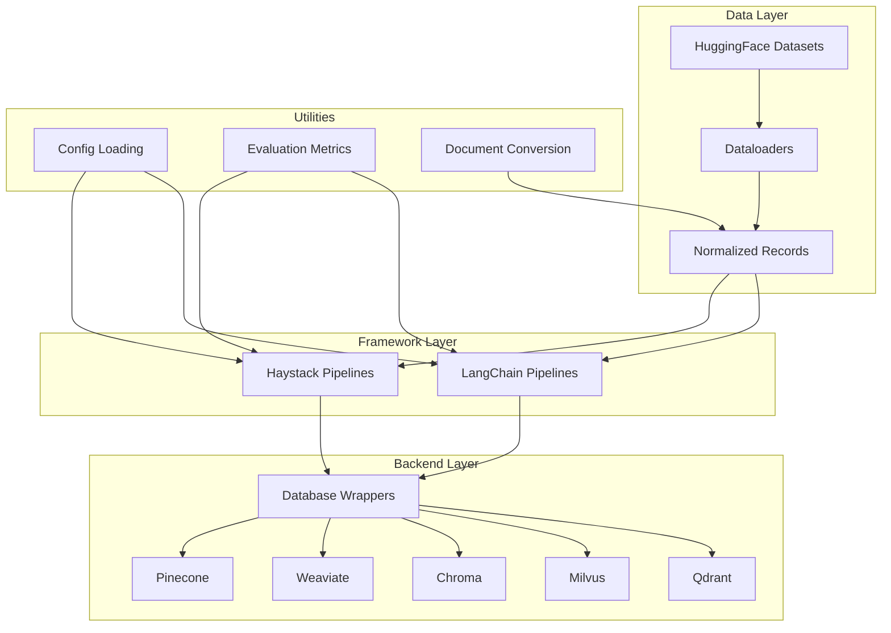
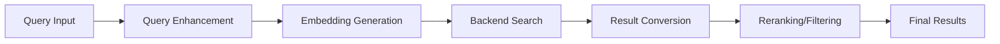

# Core: VectorDB

## 1. What This Feature Is

VectorDB is a Python toolkit for building, comparing, and benchmarking retrieval and Retrieval-Augmented Generation (RAG) pipelines across:

- **Five vector databases**: Pinecone, Weaviate, Chroma, Milvus, Qdrant
- **Two AI frameworks**: Haystack and LangChain
- **Fifteen retrieval features**: Semantic search, hybrid indexing, reranking, filtering, compression, agentic RAG, and more

The package provides:

- **Backend wrappers** (`vectordb.databases`): Unified interface to five vector DBs
- **Feature modules** (`vectordb.haystack`, `vectordb.langchain`): Parallel implementations of 15 retrieval patterns
- **Dataloaders** (`vectordb.dataloaders`): Benchmark dataset loading and normalization
- **Shared utilities** (`vectordb.utils`): Config loading, evaluation metrics, document conversion, sparse embeddings

## 2. Why It Exists in Retrieval/RAG

Modern RAG systems require evaluation across multiple dimensions before production deployment:

- **Backend selection**: Different vector databases have different performance, cost, and feature tradeoffs.
- **Framework choice**: Haystack and LangChain have different component models and pipeline abstractions.
- **Feature tuning**: Retrieval quality depends on choosing the right features (hybrid vs. dense, reranking, filtering, etc.).
- **Reproducibility**: Benchmarks require consistent datasets, limits, and evaluation metrics.

This codebase exists to:

- **Enable fair comparisons**: Same datasets, same configs, same metrics across all backend/framework/feature combinations.
- **Reduce duplication**: One implementation per feature per framework, reused across all backends.
- **Accelerate iteration**: Swap backends or features with config changes, not code rewrites.
- **Standardize evaluation**: Built-in metrics (Recall@k, MRR, NDCG) for objective quality measurement.

## 3. Architecture Overview



### Module Boundaries

| Module | Responsibility | Key Classes |
|--------|----------------|-------------|
| `vectordb.databases` | Backend wrappers with consistent API | `ChromaVectorDB`, `MilvusVectorDB`, `PineconeVectorDB`, `QdrantVectorDB`, `WeaviateVectorDB` |
| `vectordb.dataloaders` | Dataset loading and normalization | `DataloaderCatalog`, `LoadedDataset`, `DatasetRecord`, `EvaluationQuery` |
| `vectordb.haystack` | Haystack feature implementations | `*IndexingPipeline`, `*SearchPipeline` per feature |
| `vectordb.langchain` | LangChain feature implementations | `*IndexingPipeline`, `*SearchPipeline` per feature |
| `vectordb.utils` | Shared utilities | Config loaders, metrics, converters, sparse helpers |

## 4. Indexing Patterns

All feature modules follow a consistent indexing pattern:


### Common Indexing Flow

1. **Config loading**: YAML file with env var substitution (`${VAR}` syntax).
2. **Dataset loading**: `DataloaderCatalog.create(name, split, limit).load()`.
3. **Document conversion**: `dataset.to_haystack()` or `dataset.to_langchain()`.
4. **Embedding**: Framework-specific embedder (SentenceTransformers, OpenAI, etc.).
5. **Backend upsert**: Wrapper's `upsert()` or `insert_documents()` method.
6. **Confirmation**: Log indexed count, timing, any errors.

### Backend-Specific Variations

| Backend | Indexing Method | Special Handling |
|---------|-----------------|------------------|
| **Pinecone** | `upsert(vectors, namespace)` | Metadata flattening, namespace routing |
| **Weaviate** | `upsert(data)` with batch context | UUID extraction, property mapping |
| **Chroma** | `upsert(ids, embeddings, documents, metadatas)` | Metadata flattening to dot notation |
| **Milvus** | `insert_documents(documents, namespace)` | Partition key assignment, JSON metadata |
| **Qdrant** | `index_documents(documents, scope)` | Named vectors for hybrid, tenant payload injection |

## 5. Search Patterns

All feature modules follow a consistent search pattern:



### Common Search Flow

1. **Query input**: Raw query string or enhanced query (multi-query, HyDE, etc.).
2. **Embedding**: Text embedder generates query vector.
3. **Backend search**: Wrapper's `search()` or `query()` method with filters.
4. **Result conversion**: Backend response → framework `Document` objects.
5. **Optional reranking**: Cross-encoder, MMR, or diversity filtering.
6. **Optional generation**: RAG pipeline with LLM for answer synthesis.

### Backend-Specific Search Variations

| Backend | Search Method | Filter Format | Score Normalization |
|---------|---------------|---------------|---------------------|
| **Pinecone** | `query(vector, filter, namespace)` | MongoDB-style (`$eq`, `$and`) | Direct similarity score |
| **Weaviate** | `query(vector, filters)` | `Filter.by_property(...).equal(...)` | `score = 1 - distance` |
| **Chroma** | `query(query_embedding, where)` | `{"field": {"$op": value}}` | `score = 1.0 - distance` |
| **Milvus** | `search(query_embedding, filters)` | Boolean expression string | Direct COSINE similarity |
| **Qdrant** | `search(query_vector, query_filter)` | `Filter(must=[...])` | Direct similarity score |

## 6. When to Use VectorDB

Use this toolkit when:

- **Evaluating backends**: Need to compare Pinecone vs. Weaviate vs. Qdrant on the same datasets.
- **Benchmarking features**: Want to measure impact of reranking, hybrid search, or filtering on retrieval quality.
- **Framework comparison**: Deciding between Haystack and LangChain for your RAG stack.
- **Reproducible research**: Need deterministic dataset limits, query deduplication, and standard metrics.
- **Production prototyping**: Building POCs that can switch backends/features via config changes.
- **Team alignment**: Multiple engineers need consistent retrieval patterns across projects.

## 7. When Not to Use VectorDB

Avoid this toolkit when:

- **Single backend commitment**: You've already chosen a backend and framework; use their native SDKs directly.
- **Custom data pipelines**: Your data comes from live databases, not static HuggingFace datasets.
- **Real-time updates**: Need streaming document updates (this toolkit is batch-oriented).
- **Highly customized retrieval**: Your retrieval logic doesn't fit the 15 feature patterns provided.
- **Non-Python environments**: This is a Python-only toolkit.

## 8. What This Codebase Provides

### Package Structure

```
src/vectordb/
├── __init__.py              # Package exports
├── databases/               # Backend wrappers
│   ├── chroma.py
│   ├── milvus.py
│   ├── pinecone.py
│   ├── qdrant.py
│   └── weaviate.py
├── dataloaders/             # Dataset loading
│   ├── catalog.py
│   ├── types.py
│   ├── dataset.py
│   ├── converters.py
│   ├── evaluation.py
│   └── datasets/            # Per-dataset loaders
├── haystack/                # Haystack features (15 modules)
│   ├── agentic_rag/
│   ├── components/
│   ├── contextual_compression/
│   ├── cost_optimized_rag/
│   ├── diversity_filtering/
│   ├── hybrid_indexing/
│   ├── json_indexing/
│   ├── metadata_filtering/
│   ├── mmr/
│   ├── multi_tenancy/
│   ├── namespaces/
│   ├── overview.md
│   ├── parent_document_retrieval/
│   ├── query_enhancement/
│   ├── reranking/
│   ├── semantic_search/
│   ├── sparse_indexing/
│   └── utils/
├── langchain/               # LangChain features (15 modules)
│   └── [parallel structure to haystack/]
└── utils/                   # Shared utilities
    ├── config.py
    ├── evaluation.py
    ├── ids.py
    ├── logging.py
    ├── sparse.py
    └── [converters, scope, output]
```

### Key Imports

```python
# Dataloaders
from vectordb.dataloaders import DataloaderCatalog, LoadedDataset

# Databases
from vectordb.databases import (
    ChromaVectorDB,
    MilvusVectorDB,
    PineconeVectorDB,
    QdrantVectorDB,
    WeaviateVectorDB,
)

# Haystack features
from vectordb.haystack.semantic_search import SemanticSearchPipeline
from vectordb.haystack.metadata_filtering import MetadataFilteringSearchPipeline
from vectordb.haystack.reranking import RerankingSearchPipeline

# LangChain features
from vectordb.langchain.agentic_rag import AgenticRAGPipeline
from vectordb.langchain.hybrid_indexing import HybridIndexingPipeline

# Utilities
from vectordb.utils import (
    load_config,
    RetrievalMetrics,
    compute_recall_at_k,
    compute_mrr,
)
```

### Evaluation Metrics

```python
from vectordb.utils.evaluation import (
    compute_recall_at_k,      # Fraction of relevant docs retrieved
    compute_precision_at_k,   # Fraction of retrieved docs that are relevant
    compute_mrr,              # Mean reciprocal rank of first relevant doc
    compute_dcg_at_k,         # Discounted cumulative gain
    compute_ndcg_at_k,        # Normalized DCG
    compute_hit_rate,         # Binary: any relevant doc in top-k
    evaluate_retrieval,       # Full evaluation with all metrics
)
```

## 9. Backend Support Matrix

| Feature | Pinecone | Weaviate | Chroma | Milvus | Qdrant |
|---------|----------|----------|--------|--------|--------|
| **Semantic Search** | Yes | Yes | Yes | Yes | Yes |
| **Hybrid Search** | Yes | Yes | Partial (limited) | Yes | Yes |
| **Metadata Filtering** | Yes | Yes | Yes | Yes | Yes |
| **MMR Reranking** | Yes | Yes | Yes | Yes | Yes (built-in) |
| **Reranking** | Yes | Yes | Yes | Yes | Yes |
| **Multi-Tenancy** | Yes (namespaces) | Yes (tenants) | Yes (collections) | Yes (partitions) | Yes (payload) |
| **Namespaces** | Yes | Partial (tenants) | Yes | Partial (partitions) | Yes |
| **Sparse Indexing** | Yes | Yes (BM25) | Partial (experimental) | Yes | Yes |
| **Parent Document Retrieval** | Yes | Yes | Yes | Yes | Yes |
| **Query Enhancement** | Yes | Yes | Yes | Yes | Yes |
| **Contextual Compression** | Yes | Yes | Yes | Yes | Yes |
| **Agentic RAG** | Yes | Yes | Yes | Yes | Yes |
| **Cost-Optimized RAG** | Yes | Yes | Yes | Yes | Yes |
| **Diversity Filtering** | Yes | Yes | Yes | Yes | Yes |
| **JSON Indexing** | Partial (flat) | Yes | Partial (flat) | Yes (JSON) | Yes (payload) |

Legend: Yes = Full support | Partial = Partial/limited support

## 10. Configuration Overview

### YAML Config Structure

All pipelines use YAML configuration with environment variable substitution:

```yaml
# Database configuration
pinecone:
  api_key: "${PINECONE_API_KEY}"
  index_name: "my-index"
  metric: "cosine"

# Embedding configuration
embeddings:
  model: "sentence-transformers/all-MiniLM-L6-v2"
  device: "cpu"
  batch_size: 32
  trust_remote_code: false

# Dataset configuration
dataloader:
  dataset: "triviaqa"
  split: "test"
  limit: 500

# Search configuration
search:
  top_k: 10

# RAG configuration (optional)
rag:
  enabled: true
  model: "llama-3.3-70b-versatile"
  api_key: "${GROQ_API_KEY}"
  temperature: 0.7
  max_tokens: 2048

# Logging configuration
logging:
  level: "INFO"
  name: "my-pipeline"
```

### Environment Variable Syntax

- `${VAR}`: Substitute with environment variable, empty string if unset
- `${VAR:-default}`: Substitute with variable if set, otherwise use default

Example:

```yaml
qdrant:
  url: "${QDRANT_URL:-http://localhost:6333}"
  api_key: "${QDRANT_API_KEY}"
```

### Dataset Limits

Default limits are defined in `utils/config.py`:

```python
from vectordb.utils.config import get_dataset_limits

limits = get_dataset_limits("triviaqa")
# Returns: {"index_limit": 500, "eval_limit": 100}
```

| Dataset | Default Index Limit | Default Eval Limit |
|---------|---------------------|-------------------|
| TriviaQA | 500 | 100 |
| ARC | 1000 | 200 |
| PopQA | 500 | 100 |
| FActScore | 500 | 100 |
| Earnings Calls | 300 | 50 |

## 11. Practical Usage Examples

### Example 1: Quick Start with Semantic Search

```python
from vectordb.dataloaders import DataloaderCatalog
from vectordb.haystack.semantic_search import SemanticSearchPipeline

# Load dataset
loader = DataloaderCatalog.create("triviaqa", split="test", limit=500)
dataset = loader.load()

# Index documents
indexer = SemanticSearchPipeline(
    config_path="src/vectordb/haystack/semantic_search/configs/pinecone_triviaqa.yaml"
)
indexer.run(documents=dataset.to_haystack())

# Search
results = indexer.search("What is retrieval augmented generation?", top_k=5)
for doc in results:
    print(doc.content, doc.score)
```

### Example 2: Backend Comparison

```python
from vectordb.dataloaders import DataloaderCatalog
from vectordb.haystack.metadata_filtering.search import (
    PineconeMetadataFilteringSearchPipeline,
    WeaviateMetadataFilteringSearchPipeline,
)

# Load once
loader = DataloaderCatalog.create("arc", split="test", limit=1000)
dataset = loader.load()

# Compare Pinecone vs. Weaviate on same queries
queries = dataset.evaluation_queries(limit=100)

pinecone_pipeline = PineconeMetadataFilteringSearchPipeline(
    "configs/pinecone_arc.yaml"
)
weaviate_pipeline = WeaviateMetadataFilteringSearchPipeline(
    "configs/weaviate_arc.yaml"
)

for q in queries:
    pinecone_results = pinecone_pipeline.search(q.query)
    weaviate_results = weaviate_pipeline.search(q.query)
    # Compare results...
```

### Example 3: Feature Benchmarking

```python
from vectordb.utils.evaluation import evaluate_retrieval

# Baseline: semantic search
semantic_pipeline = SemanticSearchPipeline(config_path="...")
semantic_results = [
    semantic_pipeline.search(q.query, top_k=10)
    for q in queries
]
semantic_metrics = evaluate_retrieval(semantic_results, queries)

# Enhanced: semantic + reranking
rerank_pipeline = RerankingSearchPipeline(config_path="...")
rerank_results = [
    rerank_pipeline.search(q.query, top_k=10)
    for q in queries
]
rerank_metrics = evaluate_retrieval(rerank_results, queries)

print(f"Recall@10 improvement: {rerank_metrics['recall@10'] - semantic_metrics['recall@10']:.2%}")
```

### Example 4: Multi-Tenancy

```python
from vectordb.haystack.multi_tenancy import (
    PineconeMultitenancyIndexingPipeline,
    PineconeMultitenancySearchPipeline,
    TenantContext,
)

# Index for multiple tenants
tenant_a_docs = [...]
tenant_b_docs = [...]

indexer = PineconeMultitenancyIndexingPipeline(
    config_path="configs/pinecone_triviaqa.yaml",
    tenant_context=TenantContext(tenant_id="acme"),
)
indexer.run(documents=tenant_a_docs)

indexer = PineconeMultitenancyIndexingPipeline(
    config_path="configs/pinecone_triviaqa.yaml",
    tenant_context=TenantContext(tenant_id="globex"),
)
indexer.run(documents=tenant_b_docs)

# Query tenant-specific data
search = PineconeMultitenancySearchPipeline(
    config_path="configs/pinecone_triviaqa.yaml",
    tenant_context=TenantContext(tenant_id="acme"),
)
results = search.query("question for acme", top_k=5)
# Results only from tenant "acme"
```

## 12. Source Walkthrough Map

### Root Package Files

| File | Purpose |
|------|---------|
| `src/vectordb/__init__.py` | Package exports and docstrings |
| `src/vectordb/README.md` | Architecture overview and usage guide |

### Core Subsystems

| Directory | Files | Purpose |
|-----------|-------|---------|
| `databases/` | 5 backend wrappers + README | Unified vector DB interface |
| `dataloaders/` | 6 core modules + 5 dataset loaders | Dataset loading and normalization |
| `haystack/` | 15 feature modules | Haystack retrieval patterns |
| `langchain/` | 15 feature modules | LangChain retrieval patterns |
| `utils/` | 12 utility modules | Config, metrics, conversion, logging |

### Configuration Files

Each feature module has per-backend configs:

```
src/vectordb/haystack/semantic_search/configs/
├── chroma_triviaqa.yaml
├── milvus_triviaqa.yaml
├── pinecone_triviaqa.yaml
├── qdrant_triviaqa.yaml
└── weaviate_triviaqa.yaml
```

Total config files: ~100+ across all feature modules.

### Test Files

```
tests/
├── databases/           # Backend wrapper tests
├── dataloaders/         # Dataset loader tests
├── haystack/            # Haystack feature tests
├── langchain/           # LangChain feature tests
└── utils/               # Utility function tests
```

Total test files: 400+ with comprehensive coverage.

---

**Next Steps**: After understanding the package architecture, proceed to:

- **Framework overviews** (`docs/haystack/overview.md`, `docs/langchain/overview.md`) for feature catalogs.
- **Specific feature modules** for deep dives into retrieval patterns.
- **Reference docs** (`docs/reference/public-api.md`, `docs/reference/config-reference.md`) for API inventories.
