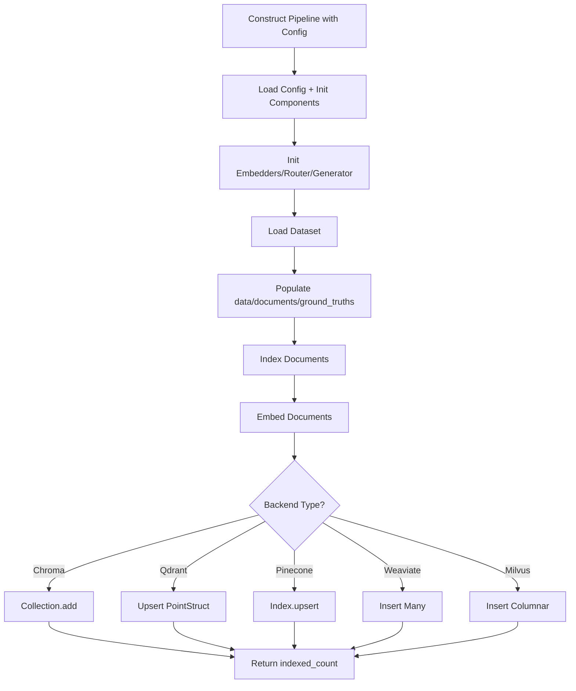
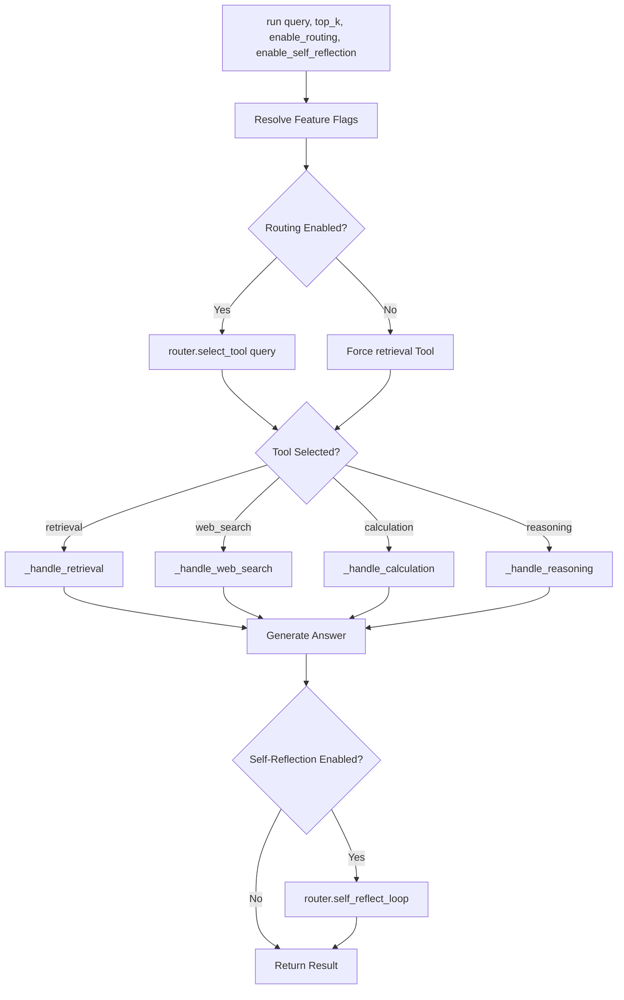

# Haystack: Agentic RAG

## 1. What This Feature Is

Agentic RAG is a family of RAG pipelines that adds an **agent-style control loop** on top of vector retrieval. Instead of always doing a fixed retrieve-then-generate pass, the pipeline can:

1. **Route** a query to one of four tools (`retrieval`, `web_search`, `calculation`, `reasoning`)
2. **Execute** the selected tool
3. **Optionally run self-reflection** to refine the answer

The shared orchestration lives in `BaseAgenticRAGPipeline` (`base.py`). Storage/retrieval is implemented per backend in:

| Backend | Pipeline Class |
|---------|----------------|
| **Chroma** | `ChromaAgenticRAGPipeline` |
| **Milvus** | `MilvusAgenticRAGPipeline` |
| **Pinecone** | `PineconeAgenticRAGPipeline` |
| **Qdrant** | `QdrantAgenticRAGPipeline` |
| **Weaviate** | `WeaviateAgenticRAGPipeline` |

All five pipelines use Haystack `Document` objects, sentence-transformer embedders, and an OpenAI-compatible generator client.

## 2. Why It Exists in Retrieval/RAG

**Single-pass RAG** works well for straightforward factual lookup, but often breaks on:

- **Mixed-intent queries**: Factual + reasoning/calculation needs
- **Questions needing broader synthesis**: Multi-hop reasoning
- **Responses incomplete on first pass**: Need refinement

This module addresses that with **explicit decision points** in `run()`:

| Decision Point | Config Option |
|----------------|---------------|
| **Routing** | `routing_enabled`: Decide which tool path to execute |
| **Self-reflection** | `self_reflection_enabled`: Run iterative quality-based answer refinement |

**Tradeoff**: Higher latency/cost for better query handling flexibility and answer quality.

## 3. Indexing Pipeline: Step-by-Step



### Indexing Flow

1. **Construct backend pipeline** with YAML config path
2. **`BaseAgenticRAGPipeline.__init__`**:
   - Loads config
   - Initializes embedders/router/generator/dataloader
   - Calls backend `_connect()` and `_create_index()`
3. **`load_dataset(...)`**:
   - Instantiates dataloader via `get_dataloader_instance()` through `DataloaderCatalog.create(...)`
   - Populates: `self.data`, `self.documents` (Haystack `Document` list), `self.ground_truths` (question/answer pairs)
4. **`index_documents()`** on backend pipeline
5. **Every backend** calls `embed_documents()` first:
   - Validates `self.documents` exists
   - Runs `SentenceTransformersDocumentEmbedder.run(documents=...)`
   - Returns embedded docs
6. **Backend-specific batch writes**:
   - **Chroma**: `collection.add(ids, embeddings, documents, metadatas)`
   - **Qdrant**: `upsert` of `PointStruct(id, vector, payload={content, metadata})`
   - **Pinecone**: `index.upsert(vectors=[(id, embedding, metadata)])`
   - **Weaviate**: `collection.data.insert_many([{properties, vector}, ...])`
   - **Milvus**: `insert` with columnar lists (`content`, JSON `metadata`, `embedding`)
7. Each backend returns number of indexed documents

### Behavior Backed by Tests

- Empty embedding output returns `0` and logs warning
- Batching honored (`batch_size` from config) and tested with >100 docs
- Missing collection/index created lazily during indexing for all backends

## 4. Search Pipeline: Step-by-Step



### Search Flow

1. **`run(query, top_k=None, enable_routing=None, enable_self_reflection=None)`**
2. **`top_k`** defaults from `retrieval.top_k_default` (default fallback: `10`)
3. **Resolve feature flags** from runtime args or config:
   - Routing from `_get_routing_enabled()`
   - Reflection from `_get_self_reflection_enabled()`
4. **Tool selection**:
   - If routing enabled: `self.router.select_tool(query)`
   - Else: Force `retrieval`
5. **Tool execution**:
   - `retrieval` → `_handle_retrieval(query, top_k)`
   - `web_search` → `_handle_web_search(query)` (stubbed fallback message)
   - `calculation` → `_handle_calculation(query)` (LLM-only)
   - `reasoning` → `_handle_reasoning(query, top_k)` (retrieval + structured reasoning prompt)
   - Unknown tool → Fallback to retrieval
6. **Retrieval path details**:
   - Backend `_retrieve(query, top_k)` embeds query using `SentenceTransformersTextEmbedder.run(text=query)`
   - Executes vector query in backend client
   - Maps hits to Haystack `Document(content, meta, score)`
7. **Answer generation** (`_generate_answer`) for retrieval/reasoning:
   - If no docs: Return `"No relevant documents found."`
   - Builds context from top `retrieval.context_top_k` docs (default `5` in code)
   - Calls `OpenAIGenerator.run(prompt=...)`
8. **Optional reflection loop**:
   - Builds reflection context from first `agentic_rag.reflection_context_top_k` docs (default `3`)
   - Calls `router.self_reflect_loop(...)` with `max_iterations` and `quality_threshold`
   - Updates `result["answer"]` and sets `result["refined"] = True`
9. **Exception handling**: Any exception in `run()` returns safe fallback:
   - `{"documents": [], "answer": "Error occurred.", "tool": "error"}`

## 5. When to Use It

Use this feature when you need **query-type-sensitive behavior** in one API:

- **Mixed workloads**: Some questions factual retrieval, some reasoning, some calculation
- **Higher-importance QA**: Iterative refinement worth extra latency
- **Backend-agnostic experiments**: Same orchestration, different vector DB backends
- **Evaluation loops**: Tool usage/refinement metrics via `evaluate()`

### Tool Selection Guide

| Query Type | Recommended Tool |
|------------|------------------|
| **Factual lookup** | `retrieval` |
| **Current events** | `web_search` (placeholder) |
| **Math/logic** | `calculation` |
| **Complex reasoning** | `reasoning` |
| **Uncertain** | Let router decide |

## 6. When Not to Use It

Avoid this feature when:

- **Low latency is strict**: Routing + generation + reflection adds extra LLM calls
- **Only need basic vector retrieval**: Single-pass RAG suffices
- **No stable LLM API access**: Requires API key configuration
- **Need real live web search**: This code path is intentionally a placeholder response, not implemented crawling/search

## 7. What This Codebase Provides

### Core API Exported

```python
from vectordb.haystack.agentic_rag import (
    "BaseAgenticRAGPipeline",
    "ChromaAgenticRAGPipeline",
    "MilvusAgenticRAGPipeline",
    "PineconeAgenticRAGPipeline",
    "QdrantAgenticRAGPipeline",
    "WeaviateAgenticRAGPipeline",
)
```

### Important Methods from `BaseAgenticRAGPipeline`

| Method | Purpose |
|--------|---------|
| **Setup/Loading** | `_init_embedders`, `_init_router`, `_init_generator`, `_load_dataloader`, `load_dataset` |
| **Orchestration** | `_handle_retrieval`, `_handle_web_search`, `_handle_calculation`, `_handle_reasoning`, `_generate_answer`, `run` |
| **Indexing Support** | `embed_documents` + backend `index_documents` |
| **Evaluation** | `evaluate` (tracks total docs retrieved, per-tool counts, avg docs, refinement rate) |

### Test-Backed Behavioral Contracts

- Routing can be enabled/disabled and overridden at runtime
- Unknown tool falls back to retrieval
- Generator failures return graceful text errors in handlers
- Backend retrieval failures return empty list instead of crashing
- Dataloader load errors surface clearly (`ValueError` from helper, explicit logging)

## 8. Backend-Specific Behavior Differences

| Backend | Connection Strategy | Index/Collection Creation | Storage Shape | Retrieval Score Mapping |
|---------|---------------------|---------------------------|---------------|------------------------|
| **Chroma** | `PersistentClient` if `persist_directory`; else `HttpClient`; fallback to ephemeral | `get_or_create_collection(..., metadata={"hnsw:space": "cosine"})` | `ids`, `embeddings`, raw doc text, metadata | `score = 1.0 - distance` |
| **Qdrant** | `QdrantClient(url, api_key)` | Create collection on first indexing with `VectorParams(size, COSINE)` | `PointStruct` payload keeps `content` + nested `metadata` | Uses native `result.score` |
| **Pinecone** | API key from config or env | If missing, create index with inferred dimension + cosine metric | Vector tuples `(id, embedding, metadata)` with `content` inside metadata | Uses native `match.score` |
| **Weaviate** | API key path uses `connect_to_custom`; no key uses `connect_to_local` | Checks existence first, creates with `Vectorizer.none()` on indexing | Object with `properties` + explicit vector | `score = 1.0 - distance` |
| **Milvus** | `MilvusClient(uri, token?)` | Create collection with schema fields (`id`, `content`, `metadata`, `embedding`) | Metadata stored as JSON string | `score = 1.0 - distance` |

### Additional Behavior Differences (Validated by Unit Tests)

- **Chroma**: Handles missing `metadatas` and `distances` keys with safe defaults
- **Milvus**: Handles invalid JSON metadata by falling back to `{}`
- **Qdrant/Pinecone**: Gracefully handle missing content/metadata fields
- **Weaviate**: Handles missing distance metadata by defaulting score to `1.0`

## 9. Configuration Semantics

### Core Sections Used at Runtime

```yaml
# Backend section (one of)
chroma:
  persist_directory: "./chroma"
  collection_name: "agentic-demo"

qdrant:
  url: "http://localhost:6333"
  api_key: null
  collection_name: "agentic-demo"

pinecone:
  api_key: "${PINECONE_API_KEY}"
  index_name: "agentic-index"

weaviate:
  cluster_url: "https://xxx.weaviate.cloud"
  api_key: "xxx"
  collection_name: "AgenticDemo"

milvus:
  uri: "http://localhost:19530"
  token: ""
  collection_name: "agentic-demo"

# Collection identifier
collection:
  name: "agentic-demo"

# Dataloader
dataloader:
  type: "triviaqa"
  dataset_name: "trivia_qa"
  split: "test"
  limit: 200

# Embeddings
embeddings:
  model: "sentence-transformers/all-MiniLM-L6-v2"
  batch_size: 32

# Generator
generator:
  model: "llama-3.3-70b-versatile"
  api_key: "${GROQ_API_KEY}"
  api_base_url: "https://api.groq.com/openai/v1"
  max_tokens: 2048

# Agentic RAG configuration
agentic_rag:
  model: "llama-3.3-70b-versatile"
  api_key: "${GROQ_API_KEY}"
  routing_enabled: true
  self_reflection_enabled: true
  max_iterations: 2
  quality_threshold: 75

# Retrieval
retrieval:
  top_k_default: 10
  context_top_k: 5

# Indexing
indexing:
  batch_size: 32
```

### Important Nuances from Code

| Config Key | Behavior |
|------------|----------|
| **Embedder model aliases** | `qwen3` and `minilm` normalized in `_init_embedders` |
| **Generator API key fallback** | If `generator.api_key` missing, reads `GROQ_API_KEY` env |
| **`generator.temperature`** | Appears in YAMLs but not wired into `OpenAIGenerator` call |
| **`agentic_rag.fallback_tool`** | Present in configs/tests but not used by `run()` |
| **`max_retries`, `retry_delay_seconds`** | Configured but not used |
| **`reflection_context_top_k`** | Used when provided, otherwise defaults to `3` |

## 10. Failure Modes and Edge Cases

### Observed Failure/Edge Behavior

| Failure | Behavior | Mitigation |
|---------|----------|------------|
| **No dataset/documents before embedding** | `embed_documents()` raises `ValueError("No documents loaded. Call load_dataset() first.")` | Call `load_dataset()` first |
| **Dataloader initialization failure** | Logs warning, leaves dataloader/data/documents/ground_truths as `None` | Check logs |
| **Dataloader creation failure in `load_dataset()`** | Logs error and raises | Handle exception |
| **Generation errors** | Retrieval answer generation returns `"Answer generation failed."` | Check API key |
| **Calculation/reasoning failures** | Returns `"Calculation failed."` / `"Reasoning failed."` | Check LLM access |
| **Router/tooling errors in `run()`** | Top-level catch returns tool `error` with safe message | Check query |
| **Empty retrieval hits** | Returns empty doc list, then generator returns `"No relevant documents found."` | Accept |
| **Backend query/index errors** | Retrieval methods catch exceptions and return `[]` | Check backend |
| **Evaluate without loaded dataset** | Returns error payload (`{"questions": 0, "metrics": {}, "error": "No dataset loaded"}`) | Load dataset first |

## 11. Practical Usage Examples

### Example 1: Instantiate Backend Pipeline

```python
from vectordb.haystack.agentic_rag import MilvusAgenticRAGPipeline

pipeline = MilvusAgenticRAGPipeline(
    "src/vectordb/haystack/agentic_rag/configs/milvus_triviaqa.yaml"
)
```

### Example 2: Index + Query

```python
# Load dataset and index
pipeline.load_dataset(limit=200)
indexed = pipeline.index_documents()
print(f"Indexed {indexed} documents")

# Query with routing
result = pipeline.run(
    "Who wrote The Old Man and the Sea?",
    top_k=8,
    enable_routing=True,
    enable_self_reflection=True,
)
print(f"Tool used: {result['tool']}")
print(f"Answer: {result['answer']}")
```

### Example 3: Switch Dataset Type at Runtime

```python
# Supported by load_dataset
pipeline.load_dataset(dataset_type="arc", limit=50)
```

### Example 4: Use Different Backends

```python
from vectordb.haystack.agentic_rag import (
    ChromaAgenticRAGPipeline,
    PineconeAgenticRAGPipeline,
    QdrantAgenticRAGPipeline,
    WeaviateAgenticRAGPipeline,
)

chroma = ChromaAgenticRAGPipeline(
    "src/vectordb/haystack/agentic_rag/configs/chroma_arc.yaml"
)
qdrant = QdrantAgenticRAGPipeline(
    "src/vectordb/haystack/agentic_rag/configs/qdrant_popqa.yaml"
)
pinecone = PineconeAgenticRAGPipeline(
    "src/vectordb/haystack/agentic_rag/configs/pinecone_factscore.yaml"
)
weaviate = WeaviateAgenticRAGPipeline(
    "src/vectordb/haystack/agentic_rag/configs/weaviate_triviaqa.yaml"
)
```

### Example 5: Evaluate Pipeline

```python
# Evaluate retrieval quality
report = pipeline.evaluate(
    queries=[
        {"query": "What is Paris?", "relevant_ids": ["doc1"]},
        {"query": "What is Milvus?", "relevant_ids": ["doc7", "doc8"]},
    ],
    top_k=5,
)
print(f"Metrics: {report['metrics']}")
```

## 12. Source Walkthrough Map

### Core Orchestration

| File | Purpose |
|------|---------|
| `base.py` | `BaseAgenticRAGPipeline`: routing, reflection, tool execution |

### Backend Implementations

| File | Backend |
|------|---------|
| `chroma_agentic_rag.py` | Chroma |
| `qdrant_agentic_rag.py` | Qdrant |
| `pinecone_agentic_rag.py` | Pinecone |
| `weaviate_agentic_rag.py` | Weaviate |
| `milvus_agentic_rag.py` | Milvus |

### Public Export Surface

| File | Purpose |
|------|---------|
| `__init__.py` | Module exports |

### Module-Local Reference

| File | Purpose |
|------|---------|
| `README.md` | High-level overview |

### Config Set

| Directory | Purpose |
|-----------|---------|
| `configs/*.yaml` | Per-backend, per-dataset configurations |

---

**Related Documentation**:

- **Query Enhancement** (`docs/haystack/query-enhancement.md`): Query transformation before retrieval
- **Components** (`docs/haystack/components.md`): Reusable components including `AgenticRouter`
- **Reranking** (`docs/haystack/reranking.md`): Post-retrieval scoring
