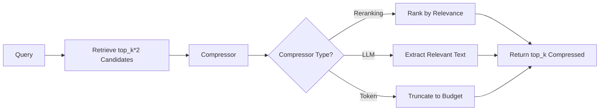
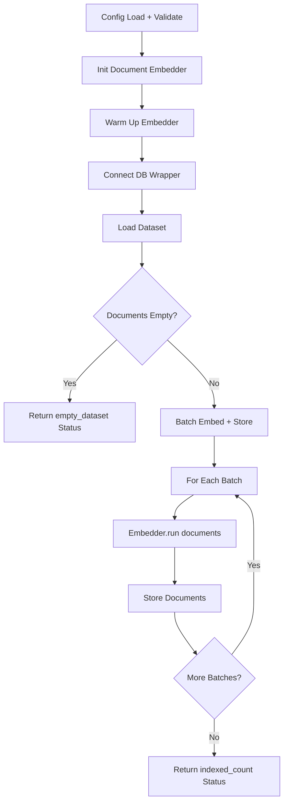
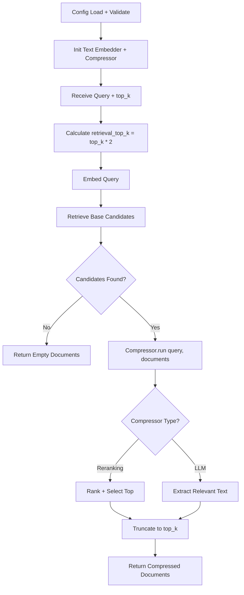

# Haystack: Contextual Compression

## 1. What This Feature Is

Contextual compression is a **two-stage retrieval pattern** that:

1. **Retrieves** a broad candidate set from a vector database
2. **Compresses** that set to the most query-relevant context before returning documents

The compression stage is pluggable and created by `CompressorFactory`:

| Compressor Type | Description | Use Case |
|-----------------|-------------|----------|
| **Reranking** | Ranks docs with cross-encoder, keeps best | Precision improvement |
| **LLM Extraction** | Uses LLM to extract query-relevant text | Context trimming |
| **Token Compression** | Truncates to token budget | Context window limits |

This module implements both **indexing** and **search** pipelines:

| Component | Purpose |
|-----------|---------|
| **Indexing** | Load datasets, embed documents, store with metadata |
| **Search** | Retrieve candidates, compress, return results |

Core orchestration lives in `BaseContextualCompressionPipeline` (`base.py`) and `BaseIndexingPipeline` (`indexing/base_indexing.py`), while each backend implements retrieval adapters under `search/` and `indexing/`.

## 2. Why It Exists in Retrieval/RAG

**Problem**: Dense retrieval is **recall-oriented** — it brings back partially relevant or noisy chunks. In RAG:

- Noise becomes **prompt budget waste**
- Irrelevant context can **reduce answer grounding quality**
- Long contexts **increase LLM costs**

**Solution**: Intentionally **over-retrieve first**, then **narrow down**:



### Compression Benefits

| Benefit | Impact |
|---------|--------|
| **Better precision** | Remove irrelevant candidates |
| **Lower token costs** | Compress context before LLM |
| **Improved grounding** | Focus on most relevant evidence |
| **Flexible tradeoffs** | Tune recall/precision balance |

## 3. Indexing Pipeline: Step-by-Step



### Indexing Flow (`BaseIndexingPipeline`)

Indexing prepares the candidate set for search-time compression:

1. **Pipeline initialization**: `BaseIndexingPipeline.__init__` loads YAML config via `load_config`
2. **Embedder initialization**: `_init_embedders()` creates `SentenceTransformersDocumentEmbedder`
   - Model aliases normalized: `qwen3` → `Qwen/Qwen3-Embedding-0.6B`, `minilm` → MiniLM
   - Embedder warmed up immediately
3. **Run method**: `run(batch_size=32)` starts by loading documents
4. **Load dataset**: `_load_dataset()` reads `dataset.type/name/split/limit`
   - Uses `DataloaderCatalog.create(...)` → `loader.load().to_haystack()`
   - Missing `dataset.type` raises `ValueError`
5. **Empty dataset check**: Returns `{"indexed_count": 0, "status": "empty_dataset"}`
6. **Batch processing**: Loop through documents in batches
   - Calls `dense_embedder.run(documents=batch)` per batch
   - Forwards embedded docs to `_store_documents()`
7. **Backend storage**: Backend-specific `_store_documents()` behavior
8. **Return**: `{"indexed_count": <N>, "status": "success", "batch_size": <batch_size>}`

### Error Handling

| Error Type | Return Value |
|------------|--------------|
| **Dataset load error** | `{"indexed_count": 0, "status": "error", "error": "..."}` |
| **Embedding error** | `{"indexed_count": 0, "status": "error", "error": "..."}` |
| **Storage error** | `{"indexed_count": 0, "status": "error", "error": "..."}` |

### Backend-Specific Storage

| Backend | Storage Method | Special Handling |
|---------|----------------|------------------|
| **Chroma** | `collection.add(ids, embeddings, documents, metadatas)` | Cosine space metadata |
| **Pinecone** | `index.upsert(vectors=[{"id","values","metadata"}])` | Truncates content to 50K chars |
| **Qdrant** | `client.upsert(points=[PointStruct(...)])` | UUID IDs, payload fields |
| **Milvus** | Insert into schema-backed collection | JSON metadata string |
| **Weaviate** | Batch add objects with external vectors | `metadata_json` property |

### Indexing Configuration

```yaml
# Embeddings configuration
embeddings:
  model: "sentence-transformers/all-MiniLM-L6-v2"
  dimension: 384  # Must match model output

# Dataset configuration
dataset:
  type: "triviaqa"  # Required - missing raises ValueError
  name: "trivia_qa"
  split: "test"
  limit: 500

# Backend configuration (example: Milvus)
milvus:
  host: "localhost"
  port: 19530
  collection_name: "compression-demo"
  drop_existing: false  # Control recreate behavior

# Run configuration
run:
  batch_size: 32  # Per-call embedding/storage chunk size
```

### When to Use Indexing

Use this indexing module when:

- **Setting up contextual compression**: Fresh backend index/collection
- **Changing embedding model**: Re-indexing with new dimension/model
- **Reproducible benchmarks**: Dataset-based indexing with controlled split/limit
- **Backend-specific collections**: Prepare schema for compression search

### When Not to Use Indexing

Avoid when:

- **Backend already populated**: Index exists with correct schema/embeddings
- **Query-time experimentation only**: Only tuning compression parameters
- **Switching compression config**: No document storage changes needed

## 4. Search Pipeline: Step-by-Step



### Search Flow (`BaseContextualCompressionPipeline`)

1. **Initialize pipeline**: Load config, logger, text embedder, connect backend
2. **Verify collection/index**: Ensure exists before search
3. **Initialize compressor**: `_init_compressor()` via `CompressorFactory.create_compressor(config)`
4. **Calculate retrieval depth**: `retrieval_top_k = config.retrieval.top_k or top_k * 2`
5. **Retrieve base candidates**: `backend._retrieve_base_results(query, retrieval_top_k)`
6. **Early return**: If no docs retrieved, return `{"documents": []}`
7. **Compress**: `self.compressor.run(query=query, documents=base_docs)`
8. **Truncate**: Read `compressed["documents"]`, truncate to requested `top_k`
9. **Return**: `{"documents": final_docs}`
10. **Error handling**: Any exception → `{"documents": []}`

### Compressor Types

**Reranking Compressor**:

```python
# Ranks documents by query relevance
compressor = RerankerCompressor(
    model="cross-encoder/ms-marco-MiniLM-L-6-v2",
    top_k=top_k,
)
compressed = compressor.run(query=query, documents=retrieved_docs)
```

**LLM Extraction Compressor**:

```python
# Extracts query-relevant text using LLM
compressor = LLMExtractionCompressor(
    model="llama-3.3-70b-versatile",
    api_key="${GROQ_API_KEY}",
)
compressed = compressor.run(query=query, documents=retrieved_docs)
```

## 5. When to Use It

Use contextual compression when:

- **Retrieval is broad**: Need to fetch many candidates to avoid missed evidence
- **Chunks are long/noisy**: Retrieved text inflates generation token costs
- **Multiple compressors needed**: Support reranker + LLM extraction behind one interface
- **Cross-backend consistency**: Same compression abstraction across all vector DBs

### Ideal Use Cases

| Use Case | Recommended Compressor |
|----------|------------------------|
| **High recall retrieval** | Reranking (precision boost) |
| **Long documents** | LLM extraction (trim to relevant) |
| **Token budget limits** | Token compression (truncate) |
| **Noisy retrieval** | Reranking (remove irrelevant) |

## 6. When Not to Use It

Avoid contextual compression when:

- **Retrieval already high-precision**: Short chunks, low noise
- **Strict latency targets**: Reranker/LLM adds 100-2000ms
- **Base retrieval unstable**: Compression can't recover missed evidence
- **No compressor credentials**: Missing API keys for reranker/LLM

### Latency Breakdown

| Stage | Reranking | LLM Extraction |
|-------|-----------|----------------|
| **Query embedding** | 10-50ms | 10-50ms |
| **Base retrieval** | 50-200ms | 50-200ms |
| **Compression** | 100-500ms | 500-2000ms |
| **Total** | ~160-750ms | ~560-2250ms |
| **Without compression** | ~60-250ms | ~60-250ms |

## 7. What This Codebase Provides

### Public API

```python
from vectordb.haystack.contextual_compression import (
    # Base pipeline
    "BaseContextualCompressionPipeline",

    # Backend search adapters
    "QdrantCompressionSearch",
    "WeaviateCompressionSearch",
    "MilvusCompressionSearch",
    "PineconeCompressionSearch",
    "ChromaCompressionSearch",

    # Indexing pipelines
    "BaseIndexingPipeline",
    "ChromaIndexingPipeline",
    "MilvusIndexingPipeline",
    "PineconeIndexingPipeline",
    "QdrantIndexingPipeline",
    "WeaviateIndexingPipeline",

    # Utilities
    "CompressorFactory",
    "TokenCounter",
    "RankerResult",
    "CompressionEvaluator",
)
```

### Compressor Factory

```python
from vectordb.haystack.contextual_compression.compression_utils import CompressorFactory

# Reranking compressor
compressor = CompressorFactory.create_compressor({
    "compression": {
        "type": "reranking",
        "reranker": {
            "type": "cross_encoder",
            "model": "cross-encoder/ms-marco-MiniLM-L-6-v2",
            "top_k": 10,
        }
    }
})

# LLM extraction compressor
compressor = CompressorFactory.create_compressor({
    "compression": {
        "type": "llm_extraction",
        "llm": {
            "model": "llama-3.3-70b-versatile",
            "api_key": "${GROQ_API_KEY}",
        }
    }
})
```

### Supported Reranker Types

| Type | Model | Provider |
|------|-------|----------|
| **`cross_encoder`** | `ms-marco-MiniLM-L-6-v2` | HuggingFace |
| **`cross_encoder_light`** | `ms-marco-TinyBERT-L-2-v2` | HuggingFace |
| **`cross_encoder_qwen`** | `Qwen cross-encoder` | HuggingFace |
| **`cohere`** | Cohere rerank API | Cohere |
| **`voyage`** | Voyage rerank API | Voyage AI |
| **`bge`** | BGE reranker | HuggingFace |

### Utility Helpers

```python
from vectordb.haystack.contextual_compression import (
    prepare_retrieval_batch,  # Chunk documents for batch processing
    format_compression_results,  # Structured output summaries
    TokenCounter,  # Estimate tokens with chars/token heuristic
    CompressionEvaluator,  # NDCG, MRR, Recall@K metrics
)
```

## 8. Backend-Specific Behavior Differences

### Common Contract

All backends share the same pipeline contract:

1. Retrieve base candidates via backend-native search
2. Apply compressor in Python (backend-agnostic)
3. Return compressed results

### Backend Retrieval Differences

| Backend | Retrieval Method | Score Handling |
|---------|------------------|----------------|
| **Chroma** | `collection.query(..., include=["documents","metadatas","distances"])` | `score = 1 - distance` |
| **Pinecone** | `index.query(..., include_metadata=True)` | Direct `score` as relevance |
| **Qdrant** | `client.search(..., query_filter=...)` | Direct `score` from points |
| **Milvus** | `client.search(..., metric_type="IP")` | Exposed as `distance` |
| **Weaviate** | `collection.query.near_vector(..., return_metadata=...)` | `score = 1 - distance` |

### Storage Differences

| Backend | Content Handling | Metadata Format |
|---------|------------------|-----------------|
| **Chroma** | Full content | Flat dict |
| **Pinecone** | Truncated to 50K chars | Flattened underscore notation |
| **Qdrant** | Full content in payload | JSON-serialized metadata |
| **Milvus** | Full content | JSON string field |
| **Weaviate** | Full content | `metadata_json` property |

### Backend Config Keys

| Backend | Required Keys | Optional Keys |
|---------|---------------|---------------|
| **Milvus** | `host`, `port`, `collection_name` | `drop_existing` |
| **Pinecone** | `api_key`, `index_name` | `metric`, `cloud`, `region` |
| **Qdrant** | `url` | `api_key`, `collection_name` |
| **Chroma** | `collection_name` | `path`, `persist_directory` |
| **Weaviate** | `url` | `api_key`, `collection_name` |

## 9. Configuration Semantics

### Common Configuration Keys

```yaml
# Embeddings (for retrieval and indexing)
embeddings:
  model: "sentence-transformers/all-MiniLM-L6-v2"
  dimension: 384

# Retrieval configuration
retrieval:
  top_k: 20  # Pre-compression candidate count (default: top_k * 2)

# Compression configuration
compression:
  type: "reranking"  # or "llm_extraction"

  # For reranking
  reranker:
    type: "cross_encoder"
    model: "cross-encoder/ms-marco-MiniLM-L-6-v2"
    top_k: 10

  # For LLM extraction
  llm:
    model: "llama-3.3-70b-versatile"
    api_key: "${GROQ_API_KEY}"
    api_base_url: "https://api.groq.com/openai/v1"

# Backend section (one of)
chroma:
  collection_name: "compression-demo"
  persist_dir: "./chroma"

pinecone:
  api_key: "${PINECONE_API_KEY}"
  index_name: "compression-index"

qdrant:
  url: "http://localhost:6333"
  collection_name: "compression-demo"
```

### Resolution Order for Compressor

```python
# 1. Check compression.type
config["compression"]["type"]  # "reranking" or "llm_extraction"

# 2. Check nested config
if type == "reranking":
    compressor_config = config["compression"]["reranker"]
elif type == "llm_extraction":
    compressor_config = config["compression"]["llm"]

# 3. Legacy fallback
else:
    # Check top-level reranker or llm_compression keys
    compressor_config = config.get("reranker") or config.get("llm_compression")
```

### Real Config Examples

| Config File | Backend | Compressor |
|-------------|---------|------------|
| `configs/chroma/arc/reranking.yaml` | Chroma | Reranking |
| `configs/qdrant/triviaqa/llm_extraction.yaml` | Qdrant | LLM Extraction |
| `configs/milvus/factscore/reranking.yaml` | Milvus | Reranking |
| `configs/pinecone/popqa/reranking.yaml` | Pinecone | Reranking |
| `configs/weaviate/earnings_calls/llm_extraction.yaml` | Weaviate | LLM Extraction |

## 10. Failure Modes and Edge Cases

### Configuration Failures

| Failure | Cause | Mitigation |
|---------|-------|------------|
| **Missing dataset.type** | Indexing config incomplete | Raises `ValueError` |
| **Missing Pinecone credentials** | No `api_key` or `index_name` | Init error |
| **Invalid compressor type** | Unknown `compression.type` | Falls back to legacy keys |
| **Dimension mismatch** | `embeddings.dimension` ≠ model output | Verify model config |

### Runtime Edge Cases

| Case | Behavior | Mitigation |
|------|----------|------------|
| **Empty retrieval** | Returns `{"documents": []}` | Not an error |
| **Compressor exception** | Caught, returns `{"documents": []}` | Check logs |
| **Metadata decode failure** | Falls back to empty metadata | JSON parse → `ast.literal_eval` |
| **Empty dataset** | Returns `{"indexed_count": 0, "status": "empty_dataset"}` | No embedding calls |

### Backend-Specific Issues

| Backend | Issue | Mitigation |
|---------|-------|------------|
| **Pinecone** | Content truncation to 50K chars | May lose long document context |
| **Milvus** | Score exposed as `distance` | No normalized `score` set |
| **Qdrant** | Metadata as JSON or dict string | Parser tries both formats |
| **Chroma** | Distance → similarity conversion | Applied automatically |
| **Weaviate** | Collection must exist | Verify before search |

### Compressor-Specific Failures

| Compressor | Failure Mode | Mitigation |
|------------|--------------|------------|
| **Reranking** | Model load failure (OOM) | Use smaller model |
| **LLM Extraction** | API timeout/rate limit | Retry with backoff |
| **Token Compression** | Invalid token budget | Validate before use |

### Storage Exceptions

| Backend | Exception Handling |
|---------|-------------------|
| **All** | Backend insert/upsert/batch errors logged and re-raised; `run()` wraps into `status=error` |

### Metadata Handling

| Case | Behavior |
|------|----------|
| **`doc.meta is None`** | Normalized to `{}` in JSON-serialized backends |
| **`doc.meta == {}`** | Stored as empty dict |

### Collection Existence

| Backend | Semantics |
|---------|-----------|
| **Milvus** | Explicit keep-vs-drop via `drop_existing` |
| **Others** | Mostly create-if-missing or reuse-if-present |

## 11. Practical Usage Examples

### Example 1: Indexing with Milvus

```python
from vectordb.haystack.contextual_compression.indexing import MilvusIndexingPipeline

pipeline = MilvusIndexingPipeline(
    "src/vectordb/haystack/contextual_compression/configs/milvus/triviaqa/reranking.yaml"
)
result = pipeline.run(batch_size=32)
print(f"Indexed {result['indexed_count']} documents")
```

### Example 2: Reranking Search with Chroma

```python
from vectordb.haystack.contextual_compression import ChromaCompressionSearch

pipeline = ChromaCompressionSearch(
    "src/vectordb/haystack/contextual_compression/configs/chroma/arc/reranking.yaml"
)
result = pipeline.run(
    query="What is the capital of France?",
    top_k=5,
)
print(f"Compressed to {len(result['documents'])} documents")
```

### Example 3: LLM Extraction Search with Qdrant

```python
from vectordb.haystack.contextual_compression import QdrantCompressionSearch

pipeline = QdrantCompressionSearch(
    "src/vectordb/haystack/contextual_compression/configs/qdrant/triviaqa/llm_extraction.yaml"
)
result = pipeline.run(
    query="Who discovered penicillin?",
    top_k=3,
)
# LLM extracts only relevant portions from retrieved documents
```

### Example 4: Pinecone Indexing

```python
from vectordb.haystack.contextual_compression.indexing import PineconeIndexingPipeline

pipeline = PineconeIndexingPipeline(
    "src/vectordb/haystack/contextual_compression/configs/pinecone/arc/reranking.yaml"
)
result = pipeline.run(batch_size=64)
print(f"Status: {result['status']}")
```

### Example 5: Qdrant with Recreate

```python
from vectordb.haystack.contextual_compression.indexing import QdrantIndexingPipeline

config = {
    "qdrant": {
        "url": "http://localhost:6333",
        "collection_name": "compression-demo",
        "drop_existing": True,  # Recreate collection
    },
    "embeddings": {"model": "minilm", "dimension": 384},
    "dataset": {"type": "triviaqa", "limit": 500},
}

pipeline = QdrantIndexingPipeline(config)
result = pipeline.run()
```

### Example 6: Chroma Persistent Storage

```python
from vectordb.haystack.contextual_compression.indexing import ChromaIndexingPipeline

config = {
    "chroma": {
        "collection_name": "compression-demo",
        "persist_directory": "./chroma-data",
    },
    "embeddings": {"model": "sentence-transformers/all-MiniLM-L6-v2"},
    "dataset": {"type": "arc", "split": "test", "limit": 200},
}

pipeline = ChromaIndexingPipeline(config)
result = pipeline.run(batch_size=32)
```

### Example 7: Token Counting Utility

```python
from vectordb.haystack.contextual_compression import TokenCounter

# Estimate tokens for document
text = "This is a sample document for token counting."
tokens = TokenCounter.estimate_tokens(text)
print(f"Estimated {tokens} tokens")  # Uses chars/token heuristic
```

### Example 8: Compression Evaluation

```python
from vectordb.haystack.contextual_compression.evaluation import CompressionEvaluator

evaluator = CompressionEvaluator()

# Evaluate compression quality
metrics = evaluator.evaluate(
    retrieved_docs=retrieved,
    compressed_docs=compressed,
    ground_truth=relevant,
)

print(f"NDCG@10: {metrics['ndcg@10']:.3f}")
print(f"Compression ratio: {metrics['compression_ratio']:.2%}")
```

### Example 9: Custom Compressor Configuration

```yaml
# config.yaml
compression:
  type: "reranking"
  reranker:
    type: "cross_encoder_qwen"
    model: "Qwen/Qwen3-Embedding-0.6B"
    top_k: 10
    device: "cuda"

retrieval:
  top_k: 30  # Retrieve 30, compress to 10
```

```python
from vectordb.haystack.contextual_compression import PineconeCompressionSearch

pipeline = PineconeCompressionSearch("config.yaml")
result = pipeline.run(query="machine learning basics", top_k=10)
```

### Example 10: Error Handling

```python
from vectordb.haystack.contextual_compression.indexing import WeaviateIndexingPipeline

try:
    pipeline = WeaviateIndexingPipeline("invalid_config.yaml")
    result = pipeline.run()
    if result["status"] == "error":
        print(f"Indexing failed: {result['error']}")
    elif result["status"] == "empty_dataset":
        print("No documents to index")
    else:
        print(f"Successfully indexed {result['indexed_count']} documents")
except ValueError as e:
    print(f"Configuration error: {e}")
```

## 12. Source Walkthrough Map

### Core Orchestration and Utilities

| File | Purpose |
|------|---------|
| `base.py` | `BaseContextualCompressionPipeline`, `BaseIndexingPipeline` |
| `compression_utils.py` | `CompressorFactory`, compressor implementations |
| `evaluation.py` | `CompressionEvaluator`, metrics |
| `__init__.py` | Public API exports |

### Search Adapters

| File | Backend |
|------|---------|
| `search/chroma_search.py` | Chroma |
| `search/pinecone_search.py` | Pinecone |
| `search/qdrant_search.py` | Qdrant |
| `search/milvus_search.py` | Milvus |
| `search/weaviate_search.py` | Weaviate |
| `search/__init__.py` | Search exports |

### Indexing Adapters

| File | Backend |
|------|---------|
| `indexing/chroma_indexing.py` | Chroma |
| `indexing/pinecone_indexing.py` | Pinecone |
| `indexing/qdrant_indexing.py` | Qdrant |
| `indexing/milvus_indexing.py` | Milvus |
| `indexing/weaviate_indexing.py` | Weaviate |
| `indexing/__init__.py` | Indexing exports |

### Configuration Examples

| Directory | Compressor Type |
|-----------|-----------------|
| `configs/chroma/arc/` | Reranking |
| `configs/qdrant/triviaqa/` | LLM Extraction |
| `configs/milvus/factscore/` | Reranking |
| `configs/pinecone/popqa/` | Reranking |
| `configs/weaviate/earnings_calls/` | LLM Extraction |

---

**Related Documentation**:

- **Reranking** (`docs/haystack/reranking.md`): Standalone reranking pipeline
- **Query Enhancement** (`docs/haystack/query-enhancement.md`): Query-side transformation
- **Core Databases** (`docs/core/databases.md`): Backend wrapper details
