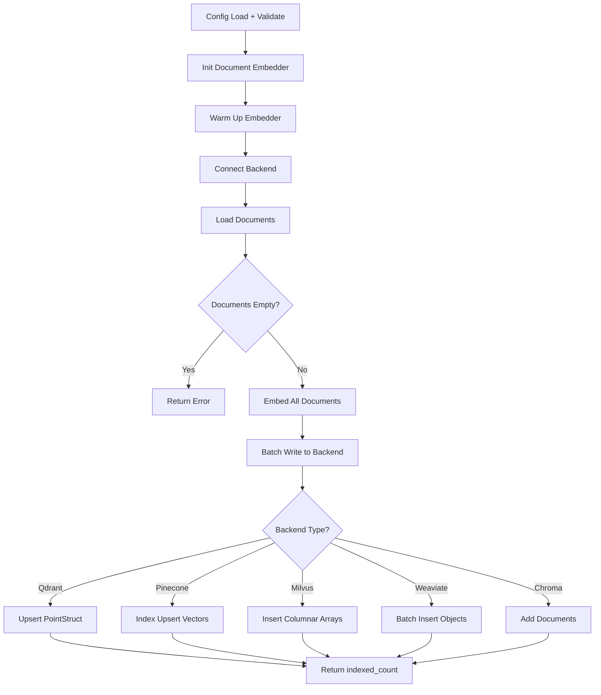
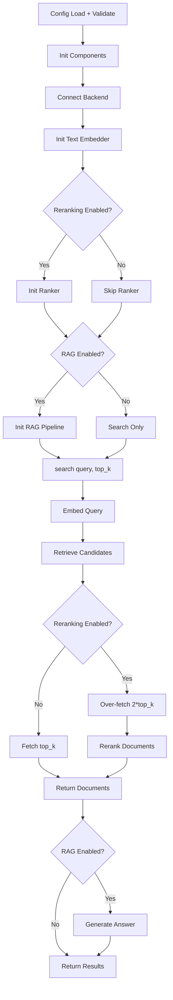

# Haystack: Cost-Optimized RAG

## 1. What This Feature Is

Cost-optimized RAG is a **multi-backend Retrieval-Augmented Generation implementation** that optimizes cost by controlling:

1. **Embedding/indexing compute**: Batch processing, local models
2. **Vector DB query and payload transfer**: Configurable `top_k`, result capping
3. **LLM token usage**: Generation limits, context compression

This module implements **five backend-specific pipeline pairs**:

| Backend | Indexing Pipeline | Search Pipeline |
|---------|-------------------|-----------------|
| **Chroma** | `ChromaIndexingPipeline` | `ChromaSearchPipeline` |
| **Milvus** | `MilvusIndexingPipeline` | `MilvusSearchPipeline` |
| **Pinecone** | `PineconeIndexingPipeline` | `PineconeSearchPipeline` |
| **Qdrant** | `QdrantIndexingPipeline` | `QdrantSearchPipeline` |
| **Weaviate** | `WeaviateIndexingPipeline` | `WeaviateSearchPipeline` |

All use typed YAML config (`RAGConfig`) with env-var resolution, Haystack `Document` objects, sentence-transformer embedders, and OpenAI-compatible generators (including Groq).

## 2. Why It Exists in Retrieval/RAG

RAG cost increases at **three layers**:

| Layer | Cost Driver | Optimization |
|-------|-------------|--------------|
| **Embedding/indexing** | Compute for document embeddings | Local models, batch processing |
| **Vector DB query** | Query latency, payload transfer | `top_k` control, over-fetch only when reranking |
| **LLM generation** | Token usage for answers | `max_tokens` limit, context truncation |

This codebase addresses costs with concrete mechanisms:

- **Batched indexing**: `embeddings.batch_size` controls write chunks
- **Local embedding/reranking**: No per-call API charges
- **Search result capping**: Configurable `top_k`
- **Over-fetch control**: `2 * top_k` candidates only when reranking enabled
- **Generation limits**: `generator.max_tokens` caps output
- **Output compaction**: `format_search_results(..., include_embeddings=False)`

## 3. Indexing Pipeline: Step-by-Step



### Indexing Flow

1. **`__init__(config_path)`**:
   - Calls `load_config()` (Pydantic validation + env var expansion)
   - Creates logger with `create_logger()`
   - Initializes `SentenceTransformersDocumentEmbedder` using `embeddings.model` and `embeddings.batch_size`
   - Calls `warm_up()`
   - Connects to backend, ensures collection/schema/index exists

2. **`run()`**:
   - Calls `load_documents_from_config(config)`
   - Uses `DataloaderCatalog.create(...)` with dataset alias mapping:
     - `triviaqa` → `trivia_qa`
     - `arc` → `ai2_arc`
     - `popqa` → `akariasai/PopQA`
     - `factscore` → `dskar/FActScore`
     - `earnings_calls` → `lamini/earnings-calls-qa`
   - Converts loaded data with `.to_haystack()`
   - Embeds all documents with `embedder.run(documents=...)`
   - Writes embedded docs in backend-specific batch methods

3. **Backend-specific writes**:
   - **Qdrant**: `_upsert_documents()` builds `PointStruct` payloads, calls `client.upsert(...)` in batches
   - **Pinecone**: `_upsert_documents()` builds vector dicts, upserts to namespace `collection.name`
   - **Milvus**: `_insert_documents()` inserts columnar arrays, builds IVF index, loads collection
   - **Weaviate**: `_insert_documents()` uses batch context manager; metadata as JSON string
   - **Chroma**: `_add_documents()` flattens metadata (non-primitives JSON-serialized), adds in batches

## 4. Search Pipeline: Step-by-Step



### Search Flow

1. **`__init__(config_path)`**:
   - `load_config()` and logger creation
   - `_connect()` to backend
   - `_init_embedder()` with `SentenceTransformersTextEmbedder` + `warm_up()`
   - `_init_ranker()` only when `search.reranking_enabled` is true
   - `_init_rag_pipeline()` only when `generator.enabled` is true AND `generator.api_key` is non-empty

2. **`search(query, top_k=None)`**:
   - Effective `top_k = top_k or config.search.top_k`
   - Builds query embedding with `embedder.run(text=query)`
   - Uses backend query with `search_top_k = top_k * 2` when reranker exists; otherwise `top_k`
   - Converts backend responses to Haystack `Document` objects
   - If reranker exists, calls `ranker.run(query=query, documents=...)` and truncates to `top_k`
   - Returns `format_search_results(documents)`

3. **`search_with_rag(query, top_k=None)`**:
   - Calls `search(...)`
   - Rehydrates results into `Document` list for prompt input
   - If `rag_pipeline` exists and docs present, runs:
     - `PromptBuilder(template=RAG_ANSWER_TEMPLATE)`
     - `OpenAIGenerator(...generation_kwargs={temperature, max_tokens})`
   - Returns: `{"documents": [...], "answer": <str|None>}`

4. **No-doc / no-generator behavior**:
   - If no docs or generator pipeline disabled, answer is `None`

## 5. When to Use It

Use this module when you need:

- **One RAG behavior model** across different vector databases
- **Predictable cost controls**: `top_k`, rerank toggle, `max_tokens`
- **Local embeddings/reranking**: No per-call API charges
- **API-based generation**: OpenAI-compatible endpoints (including Groq)
- **Backend-agnostic experiments**: Same interface, different backends
- **Evaluation loops**: Tool usage/refinement metrics via `evaluate()`

## 6. When Not to Use It

Avoid when your requirements depend on **configured but not wired** features:

| Config Key | Status | Issue |
|------------|--------|-------|
| `search.hybrid_enabled` | Configured but not used | Hybrid fusion not implemented in search paths |
| `search.metadata_filtering_enabled` | Configured but not used | Filter DSL not plumbed to query construction |
| `indexing.quantization` | Configured but not applied | No indexer applies quantization logic |
| `reranker.use_crossencoder` | Configured but not used | Ranker selection doesn't use this |
| `cohere_enabled` | Configured but not used | Cohere integration not wired |

If you require first-class hybrid fusion, filter plumbing, or true quantization activation, this implementation needs extension.

## 7. What This Codebase Provides

### Core Configuration and Utilities

```python
from vectordb.haystack.cost_optimized_rag.base.config import (
    load_config,  # ${VAR} and ${VAR:-default} support
    RAGConfig,    # Typed model with nested sections
)
from vectordb.haystack.cost_optimized_rag.base.fusion import (
    ResultFuser,  # reciprocal_rank_fusion, weighted_fusion, merge_search_results
)
from vectordb.haystack.cost_optimized_rag.base.metrics import (
    RetrievalMetrics,  # Container for retrieval metrics
    MetricsAggregator, # Aggregate metrics across queries
)
```

### Pipeline Classes

**Indexing**:

```python
from vectordb.haystack.cost_optimized_rag.indexing.qdrant_indexer import QdrantIndexingPipeline
from vectordb.haystack.cost_optimized_rag.indexing.pinecone_indexer import PineconeIndexingPipeline
from vectordb.haystack.cost_optimized_rag.indexing.milvus_indexer import MilvusIndexingPipeline
from vectordb.haystack.cost_optimized_rag.indexing.weaviate_indexer import WeaviateIndexingPipeline
from vectordb.haystack.cost_optimized_rag.indexing.chroma_indexer import ChromaIndexingPipeline
```

**Search**:

```python
from vectordb.haystack.cost_optimized_rag.search.qdrant_searcher import QdrantSearchPipeline
from vectordb.haystack.cost_optimized_rag.search.pinecone_searcher import PineconeSearchPipeline
from vectordb.haystack.cost_optimized_rag.search.milvus_searcher import MilvusSearchPipeline
from vectordb.haystack.cost_optimized_rag.search.weaviate_searcher import WeaviateSearchPipeline
from vectordb.haystack.cost_optimized_rag.search.chroma_searcher import ChromaSearchPipeline
```

### Prompt Templates

```python
from vectordb.haystack.cost_optimized_rag.utils.prompt_templates import (
    RAG_ANSWER_TEMPLATE,
    RAG_ANSWER_WITH_SOURCES_TEMPLATE,
    COST_OPTIMIZED_RAG_TEMPLATE,
)
```

## 8. Backend-Specific Behavior Differences

### Qdrant

| Aspect | Behavior |
|--------|----------|
| **Collection** | Recreates during indexing setup |
| **Payload indexes** | Applies from `indexing.payload_indexes` with schema-type mapping |
| **Score** | Uses `scored_point.score` directly |

### Pinecone

| Aspect | Behavior |
|--------|----------|
| **Index creation** | Creates if absent (`metric="cosine"`, serverless spec hardcoded to AWS us-west-2) |
| **Namespace** | Uses namespace equal to `collection.name` for upsert/query |
| **Metadata** | Search extraction removes `content` from metadata, uses as document content |

### Milvus

| Aspect | Behavior |
|--------|----------|
| **Collection** | Drops and recreates with explicit schema (`id`, `embedding`, `content`, `metadata`) |
| **Partitions** | Optional partition creation when `indexing.partitions.enabled` |
| **Index** | Builds IVF_FLAT with `metric_type="L2"`, `nlist=128` |
| **Score** | `hit.distance` (L2 distance, lower is better) |

### Weaviate

| Aspect | Behavior |
|--------|----------|
| **Class schema** | Recreates each indexing run |
| **Metadata** | Stored as JSON string field |
| **Search** | Uses GraphQL `near_vector` chain |
| **Metadata parsing** | Invalid JSON → fallback `{"raw": <string>}` |
| **Score** | Fixed as `1.0` in output document construction |

### Chroma

| Aspect | Behavior |
|--------|----------|
| **Storage** | Local persistent storage path |
| **Metadata** | Flattens; nested/complex values JSON-serialized |
| **Score conversion** | Distances → similarity: `1 / (1 + distance)` |

## 9. Configuration Semantics

### Most Important Active Knobs

```yaml
# Embeddings (used by both document and query embedders)
embeddings:
  model: "sentence-transformers/all-MiniLM-L6-v2"
  batch_size: 32  # Controls embedding batch size and backend write batch

# Collection identifier
collection:
  name: "rag-demo"

# Search configuration
search:
  top_k: 10  # Default retrieval depth when call-time top_k omitted
  reranking_enabled: true  # Enables ranker initialization and over-fetch

# Reranker configuration (when enabled)
reranker:
  model: "cross-encoder/ms-marco-MiniLM-L-6-v2"
  top_k: 10

# Generator configuration
generator:
  enabled: true
  api_key: "${GROQ_API_KEY}"
  api_base_url: "https://api.groq.com/openai/v1"
  model: "llama-3.3-70b-versatile"
  temperature: 0.7
  max_tokens: 2048  # Generation hard limit
```

### Backend Connection Blocks

One of these is required by corresponding pipeline classes:

```yaml
qdrant:
  url: "http://localhost:6333"
  api_key: null

pinecone:
  api_key: "${PINECONE_API_KEY}"
  index_name: "rag-index"

milvus:
  uri: "http://localhost:19530"
  token: ""

weaviate:
  cluster_url: "https://xxx.weaviate.cloud"
  api_key: "xxx"

chroma:
  persist_dir: "./chroma"
  collection_name: "rag-demo"
```

### Semantics Validated by Tests

- Empty config file fails load
- Missing config file raises `FileNotFoundError`
- Env var expansion works for scalar, dict, and list values
- When `top_k` omitted in evaluator, uses `config.search.top_k`

## 10. Failure Modes and Edge Cases

### Config and Startup Failures

| Failure | Cause | Mitigation |
|---------|-------|------------|
| **Missing backend section** | No `qdrant`/`pinecone`/etc. in config | Immediate constructor `ValueError` |
| **Empty YAML config** | Empty file | Raises `ValueError` |

### Data/Embedding Edge Cases

| Case | Behavior |
|------|----------|
| **Documents with `embedding=None`** | Skipped during indexing inserts/upserts |
| **Chroma nested metadata** | Serialized; consumers must parse if expecting structured values |

### Search Edge Cases

| Case | Behavior |
|------|----------|
| **Empty backend result sets** | Return empty lists |
| **Weaviate invalid metadata JSON** | Preserved as raw string under `metadata.raw` |
| **`search_with_rag` no docs** | Returns `answer=None` |
| **`search_with_rag` generator disabled** | Returns `answer=None` |
| **Missing API key** | Generator disabled, `answer=None` |

### Metric/Fusion Edge Cases

| Case | Behavior |
|------|----------|
| **`MetricsAggregator.aggregate()` no results** | Raises |
| **`weighted_fusion` weights** | Enforces sum near 1.0 |
| **`merge_search_results()` empty inputs** | Returns empty for empty inputs |
| **Unknown fusion method** | Raises |

## 11. Practical Usage Examples

### Example 1: Index and Query with Qdrant

```python
from vectordb.haystack.cost_optimized_rag.indexing.qdrant_indexer import QdrantIndexingPipeline
from vectordb.haystack.cost_optimized_rag.search.qdrant_searcher import QdrantSearchPipeline

config_path = "src/vectordb/haystack/cost_optimized_rag/configs/qdrant/triviaqa.yaml"

# Index documents
QdrantIndexingPipeline(config_path).run()

# Search
searcher = QdrantSearchPipeline(config_path)
results = searcher.search("What is the capital of France?", top_k=5)

# Search with RAG
rag_result = searcher.search_with_rag("What is the capital of France?", top_k=3)
print(f"Answer: {rag_result.get('answer')}")
```

### Example 2: Switching Backend

```python
from vectordb.haystack.cost_optimized_rag.search.pinecone_searcher import PineconeSearchPipeline

config_path = "src/vectordb/haystack/cost_optimized_rag/configs/pinecone/triviaqa.yaml"
searcher = PineconeSearchPipeline(config_path)
results = searcher.search("Explain retrieval-augmented generation", top_k=10)
```

### Example 3: Evaluate Retrieval Quality

```python
from vectordb.haystack.cost_optimized_rag.evaluation.evaluator import RAGEvaluator

evaluator = RAGEvaluator(searcher.config, searcher)
report = evaluator.evaluate_batch(
    [
        {"query_id": "q1", "query": "What is Paris?", "relevant_ids": ["doc1"]},
        {"query_id": "q2", "query": "What is Milvus?", "relevant_ids": ["doc7", "doc8"]},
    ],
    top_k=5,
)
print(f"Metrics: {report['metrics']}")
```

### Example 4: Cost-Controlled Configuration

```yaml
# config.yaml
embeddings:
  model: "sentence-transformers/all-MiniLM-L6-v2"  # Local, no API cost
  batch_size: 64  # Efficient batching

search:
  top_k: 5  # Limit retrieval depth
  reranking_enabled: false  # Skip reranking for latency

generator:
  enabled: true
  model: "llama-3.3-70b-versatile"
  max_tokens: 512  # Limit output tokens
  temperature: 0.5  # Lower = more deterministic
```

## 12. Source Walkthrough Map

### Primary Module Root

| File | Purpose |
|------|---------|
| `src/vectordb/haystack/cost_optimized_rag/__init__.py` | Module exports |

### Configuration and Shared Logic

| File | Purpose |
|------|---------|
| `base/config.py` | `load_config`, `RAGConfig` typed model |
| `base/fusion.py` | `ResultFuser`, RRF/weighted fusion |
| `base/metrics.py` | `RetrievalMetrics`, `MetricsAggregator` |

### Indexing Implementations

| File | Backend |
|------|---------|
| `indexing/qdrant_indexer.py` | Qdrant |
| `indexing/pinecone_indexer.py` | Pinecone |
| `indexing/milvus_indexer.py` | Milvus |
| `indexing/weaviate_indexer.py` | Weaviate |
| `indexing/chroma_indexer.py` | Chroma |

### Search Implementations

| File | Backend |
|------|---------|
| `search/qdrant_searcher.py` | Qdrant |
| `search/pinecone_searcher.py` | Pinecone |
| `search/milvus_searcher.py` | Milvus |
| `search/weaviate_searcher.py` | Weaviate |
| `search/chroma_searcher.py` | Chroma |

### Evaluation and Utilities

| File | Purpose |
|------|---------|
| `evaluation/evaluator.py` | `RAGEvaluator` |
| `utils/common.py` | Shared utilities |
| `utils/prompt_templates.py` | RAG prompt templates |

### Reference Configuration Tree

| Directory | Backend + Dataset |
|-----------|-------------------|
| `configs/chroma/` | Chroma + TriviaQA, ARC |
| `configs/milvus/` | Milvus + TriviaQA, ARC |
| `configs/pinecone/` | Pinecone + TriviaQA, ARC |
| `configs/qdrant/` | Qdrant + TriviaQA, ARC |
| `configs/weaviate/` | Weaviate + TriviaQA, Earnings Calls |

---

**Related Documentation**:

- **Contextual Compression** (`docs/haystack/contextual-compression.md`): Context trimming
- **Reranking** (`docs/haystack/reranking.md`): Post-retrieval scoring
- **Semantic Search** (`docs/haystack/semantic-search.md`): Baseline retrieval
