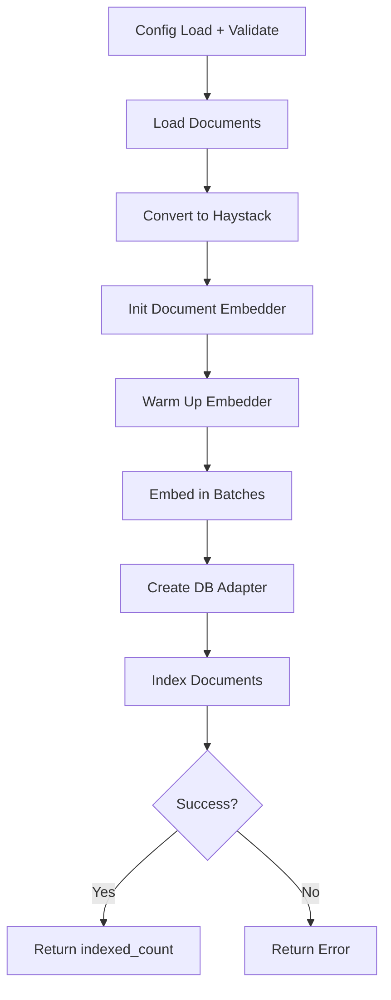
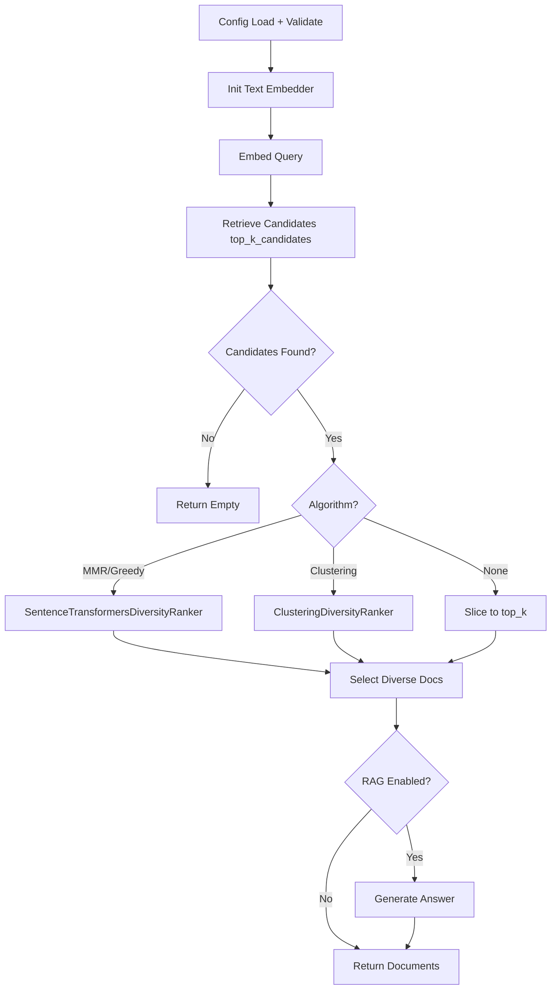

# Haystack: Diversity Filtering

## 1. What This Feature Is

Diversity filtering is a **retrieval-stage post-processing step** that reduces semantic redundancy in search results before returning to downstream RAG generation.

This module supports **three algorithms** via config:

| Algorithm | Implementation | Description |
|-----------|----------------|-------------|
| **maximum_margin_relevance** | Haystack `SentenceTransformersDiversityRanker` | MMR-style relevance-diversity balance |
| **greedy_diversity_order** | Haystack `SentenceTransformersDiversityRanker` | Greedy variety across ranked list |
| **clustering** | Custom `ClusteringDiversityRanker` | KMeans clustering, pick representatives |

All **five vector backends** share the same high-level flow:

1. Embed query
2. Retrieve larger candidate pool (`retrieval.top_k_candidates`)
3. Re-rank/filter to smaller diverse set (`diversity.top_k`)
4. Optionally generate answer with dataset-specific prompts

## 2. Why It Exists in Retrieval/RAG

**Problem**: Pure nearest-neighbor retrieval often returns **many near-duplicates**:

- Good for top-1 precision
- Bad for context coverage when answer needs multiple complementary facts

**Example**:

```
Query: "What causes climate change?"

Without diversity (top-5):
1. "Climate change is caused by greenhouse gases..." ← Same idea
2. "Global warming results from CO2 emissions..."     ← Same idea
3. "The greenhouse effect traps heat..."              ← Same idea
4. "Carbon dioxide traps infrared radiation..."       ← Same idea
5. "Human activities increase atmospheric CO2..."     ← Same idea

With diversity (top-5):
1. "Climate change is caused by greenhouse gases..."  ← Relevance #1
2. "Deforestation reduces carbon absorption..."       ← Different aspect
3. "Industrial processes emit methane..."             ← Different aspect
4. "Agricultural practices contribute nitrous oxide..." ← Different aspect
5. "Black carbon from soot accelerates ice melt..."   ← Different aspect
```

This feature exists to **improve coverage** by selecting documents that are both:

- **Relevant** to the query
- **Non-redundant** (diverse from each other)

## 3. Indexing Pipeline: Step-by-Step



### Indexing Flow

Indexing modules: `pipelines/qdrant_indexing.py`, `pipelines/pinecone_indexing.py`, `pipelines/weaviate_indexing.py`, `pipelines/chroma_indexing.py`, `pipelines/milvus_indexing.py`

**Shared runtime sequence**:

1. **ConfigLoader.load(config_path)** validates and resolves env vars into `DiversityFilteringConfig`
2. **load_documents(config)** calls `DataloaderCatalog.create(name, split, limit)`
3. Loaded dataset converted with `.to_haystack()` to `haystack.Document` objects
4. **SentenceTransformersDocumentEmbedder** created from `embedding.model`, `embedding.batch_size`, `embedding.device`
5. **embedder.warm_up()** called
6. Documents embedded in batches and accumulated
7. Backend-specific `*VectorDB` adapter created
8. **db.index_documents(embedded_docs)** called
9. Summary dict returned (`documents_indexed`, embedding metadata, batch count)

### Behavior Verified by Tests

- Empty dataset returns `{"documents_indexed": 0, "error": "No documents loaded"}`
- Batch embedding path exercised and passed to DB `index_documents`
- Backend constructor arguments validated per backend

## 4. Search Pipeline: Step-by-Step



### Search Flow

Search modules: `pipelines/qdrant_search.py`, `pipelines/pinecone_search.py`, `pipelines/weaviate_search.py`, `pipelines/milvus_search.py`, `pipelines/chroma_search.py`

**Function-based pipelines (`run_search`)**:

1. Load config with `ConfigLoader.load`
2. Create and warm `SentenceTransformersTextEmbedder`
3. Encode query via `embedder.run(text=query)["embedding"]`
4. Query backend DB for `retrieval.top_k_candidates`
5. If no candidates: return empty `documents`, `num_diverse = 0`, `answer = None`
6. **Select diversity algorithm**:
   - `maximum_margin_relevance` or `greedy_diversity_order`: `SentenceTransformersDiversityRanker`
   - `clustering`: `ClusteringDiversityRanker`
   - Otherwise: plain slice to `diversity.top_k`
7. Convert selected `Document` objects to serializable dicts
8. If `rag.enabled`:
   - Pick prompt via `get_prompt_template(dataset.name)`
   - Format docs via `format_documents(...)`
   - Build prompt via `PromptBuilder`
   - Generate via `OpenAIGenerator`

**Chroma-specific class** (`ChromaDiversitySearchPipeline`) does same logical flow, but pre-initializes and reuses embedder/ranker/DB/generator in `__init__` for repeated queries.

## 5. When to Use It

Use diversity filtering when:

- **Retrieved chunks are repetitive**: Hurts answer quality
- **Queries need multi-faceted evidence**: Comparison, synthesis, multi-hop context
- **Can afford larger candidate pool**: Retrieving `top_k_candidates` before final selection
- **Want one retrieval abstraction**: Works across Qdrant, Pinecone, Weaviate, Chroma, Milvus

### Ideal Use Cases

| Use Case | Recommended Algorithm |
|----------|----------------------|
| **Multi-faceted queries** | `maximum_margin_relevance` |
| **Broad coverage needed** | `greedy_diversity_order` |
| **Topical clustering** | `clustering` |
| **Simple dedup** | Plain slice (no diversity) |

## 6. When Not to Use It

Avoid or defer diversity filtering when:

- **Only need top-1 precision**: Exact nearest-neighbor ranking sufficient
- **Candidate retrieval recall weak**: Diversification cannot recover missing evidence
- **Latency budget tight**: Embedding + reranking overhead unacceptable
- **Embedding dimension inconsistent**: Across indexing and querying

## 7. What This Codebase Provides

### Core Configuration and Validation

```python
from vectordb.haystack.diversity_filtering.utils.config_loader import (
    ConfigLoader,  # load(path) / load_dict(data)
    DiversityFilteringConfig,  # Pydantic models
)
```

**Strict Pydantic models** for:

- Dataset, embedding, retrieval, diversity, RAG, and backend blocks
- Env var substitution only for full-string `${VAR_NAME}` values

### Prompt Utilities

```python
from vectordb.haystack.diversity_filtering.utils.prompts import (
    get_prompt_template,  # Dataset-specific templates
    format_documents,     # Format docs for prompt
)
```

**Dataset templates** for: `triviaqa`, `arc`, `popqa`, `factscore`, `earnings_calls`

### Diversity Rankers

```python
from haystack import Document
from haystack.components.rankers import SentenceTransformersDiversityRanker
from vectordb.haystack.diversity_filtering.rankers import ClusteringDiversityRanker
```

**Haystack built-in** for MMR/greedy:

- `SentenceTransformersDiversityRanker` with `strategy="maximum_margin_relevance"` or `"greedy_diversity_order"`

**Custom clustering ranker**:

- Embeds query and docs
- KMeans (`n_clusters = top_k`)
- Picks best doc per cluster by query similarity
- Returns selected docs sorted by original `doc.score` descending

### Pipelines

| Type | Entrypoint |
|------|------------|
| **Indexing** | `run_indexing(config_path)` for each backend |
| **Search** | `run_search(config_path, query)` for four backends |
| **Reusable** | `ChromaDiversitySearchPipeline.search(query)` |

## 8. Backend-Specific Behavior Differences

### Constructor-Level Differences

| Backend | Connection | Special Handling |
|---------|------------|------------------|
| **Qdrant** | `url` + optional `api_key` | `recreate_index=config.index.recreate` |
| **Pinecone** | `api_key` + `vectordb.pinecone.index_name` | `index.name` in metadata |
| **Weaviate** | `url` + optional `api_key` | Local vs cloud connection |
| **Chroma** | `host`, `port`, `is_persistent` | Class-based reusable pipeline |
| **Milvus** | `host`, `port`, `db_name` | Standard connection |

### Search Logic

Search logic and result shape are **intentionally uniform** across backends.

## 9. Configuration Semantics

### High-Impact Knobs

```yaml
# Candidate pool size before diversity filtering
retrieval:
  top_k_candidates: 50

# Final returned document count
diversity:
  top_k: 10
  algorithm: "maximum_margin_relevance"  # or "greedy_diversity_order", "clustering"
  similarity_metric: "cosine"  # or "dot_product"
  mmr_lambda: 0.5  # Validated but not passed to ranker (inert)

# Indexing configuration
index:
  recreate: true  # Qdrant: destructive recreate

# RAG configuration
rag:
  enabled: true
  provider: "groq"
  model: "llama-3.3-70b-versatile"
  temperature: 0.7
  max_tokens: 2048

# Embedding configuration
embedding:
  model: "sentence-transformers/all-MiniLM-L6-v2"
  dimension: 384
  batch_size: 32
  device: "cpu"
```

### Validation Semantics

| Constraint | Validation |
|------------|------------|
| **Dataset/backend types** | Strict enums |
| **diversity.top_k** | `>= 1` |
| **mmr_lambda** | Constrained to `[0.0, 1.0]` |
| **Missing env vars** | Fail fast with `ValueError` |
| **Partial strings** | `prefix_${VAR}` not interpolated |

### Inert Configuration

| Config Key | Issue |
|------------|-------|
| **`diversity.mmr_lambda`** | Validated in config model, but **not passed** to ranker constructors |
| **Sample YAML keys** | Some use `document_store` and `algorithm: mmr`, but loader expects `vectordb` and `maximum_margin_relevance` |

## 10. Failure Modes and Edge Cases

### Configuration Failures

| Failure | Cause | Mitigation |
|---------|-------|------------|
| **Missing config file** | File not found | `FileNotFoundError` |
| **Malformed YAML** | Parse/validation errors | Load-time error |
| **Empty retrieval** | Clean empty response | Returns `num_diverse = 0` |

### RAG Generation Failures

| Backend | Behavior |
|---------|----------|
| **Chroma class pipeline** | Returns generic fallback message |
| **Other search pipelines** | Returns `"Error generating answer: ..."` |

### Algorithm/Config Mismatch Risk

| Issue | Cause | Mitigation |
|-------|-------|------------|
| **Sample YAMLs use wrong keys** | `document_store` vs `vectordb`, `mmr` vs `maximum_margin_relevance` | Transform YAMLs or update config |

### Embedding/DB Dimension Mismatch

| Risk | Mitigation |
|------|------------|
| **`embedding.dimension`** must align with backend index/collection vector schema and actual model output | Verify config consistency |

## 11. Practical Usage Examples

### Example 1: Index Documents into Qdrant

```python
from vectordb.haystack.diversity_filtering.pipelines.qdrant_indexing import run_indexing

result = run_indexing(
    "src/vectordb/haystack/diversity_filtering/configs/triviaqa_diversity_config.yaml"
)
print(result)
```

### Example 2: Search with Pinecone + Diversity Filtering

```python
from vectordb.haystack.diversity_filtering.pipelines.pinecone_search import run_search

result = run_search(
    "src/vectordb/haystack/diversity_filtering/configs/popqa_diversity_config.yaml",
    query="Who discovered penicillin?",
)
print(f"Diverse docs: {result['num_diverse']}, Total: {len(result['documents'])}")
```

### Example 3: Reuse Chroma Search Pipeline

```python
from vectordb.haystack.diversity_filtering.pipelines.chroma_search import ChromaDiversitySearchPipeline

pipeline = ChromaDiversitySearchPipeline(
    "src/vectordb/haystack/diversity_filtering/configs/factscore_diversity_config.yaml"
)

r1 = pipeline.search("What did the company report about margins?")
r2 = pipeline.search("How did guidance change quarter-over-quarter?")
```

### Example 4: Use Clustering Ranker Directly

```python
from haystack import Document
from vectordb.haystack.diversity_filtering.rankers import ClusteringDiversityRanker

ranker = ClusteringDiversityRanker(top_k=5, similarity="cosine")
ranker.warm_up()

docs = [
    Document(content="A", score=0.9),
    Document(content="B", score=0.8),
]
diverse = ranker.run(query="example", documents=docs)["documents"]
```

### Example 5: Algorithm Comparison

```python
from vectordb.haystack.diversity_filtering.pipelines.qdrant_search import run_search

# MMR
result_mmr = run_search(
    "config_mmr.yaml",
    query="climate change causes",
)

# Greedy diversity
result_greedy = run_search(
    "config_greedy.yaml",
    query="climate change causes",
)

# Clustering
result_cluster = run_search(
    "config_clustering.yaml",
    query="climate change causes",
)

print(f"MMR: {len(result_mmr['documents'])} docs")
print(f"Greedy: {len(result_greedy['documents'])} docs")
print(f"Clustering: {len(result_cluster['documents'])} docs")
```

## 12. Source Walkthrough Map

### Top-Level Package

| File | Purpose |
|------|---------|
| `src/vectordb/haystack/diversity_filtering/__init__.py` | Public exports |
| `src/vectordb/haystack/diversity_filtering/README.md` | Feature overview |

### Configuration + Prompts

| File | Purpose |
|------|---------|
| `utils/config_loader.py` | Config loading with validation |
| `utils/prompts.py` | Dataset-specific prompt templates |

### Rankers

| File | Purpose |
|------|---------|
| `rankers/__init__.py` | Ranker exports |
| `rankers/clustering_ranker.py` | Custom clustering diversity ranker |

### Pipelines Package

| File | Purpose |
|------|---------|
| `pipelines/__init__.py` | Pipeline exports |

### Indexing Pipelines

| File | Backend |
|------|---------|
| `pipelines/qdrant_indexing.py` | Qdrant |
| `pipelines/pinecone_indexing.py` | Pinecone |
| `pipelines/weaviate_indexing.py` | Weaviate |
| `pipelines/chroma_indexing.py` | Chroma |
| `pipelines/milvus_indexing.py` | Milvus |

### Search Pipelines

| File | Backend |
|------|---------|
| `pipelines/qdrant_search.py` | Qdrant |
| `pipelines/pinecone_search.py` | Pinecone |
| `pipelines/weaviate_search.py` | Weaviate |
| `pipelines/chroma_search.py` | Chroma (class-based) |
| `pipelines/milvus_search.py` | Milvus |

### Configuration Examples

| Directory | Dataset |
|-----------|---------|
| `configs/triviaqa_diversity_config.yaml` | TriviaQA |
| `configs/arc_diversity_config.yaml` | ARC |
| `configs/popqa_diversity_config.yaml` | PopQA |
| `configs/factscore_diversity_config.yaml` | FActScore |
| `configs/earnings_calls_diversity_config.yaml` | Earnings Calls |

---

**Related Documentation**:

- **MMR** (`docs/haystack/mmr.md`): Maximal Marginal Relevance retrieval
- **Reranking** (`docs/haystack/reranking.md`): Relevance-based reranking
- **Metadata Filtering** (`docs/haystack/metadata-filtering.md`): Constraint-based retrieval
