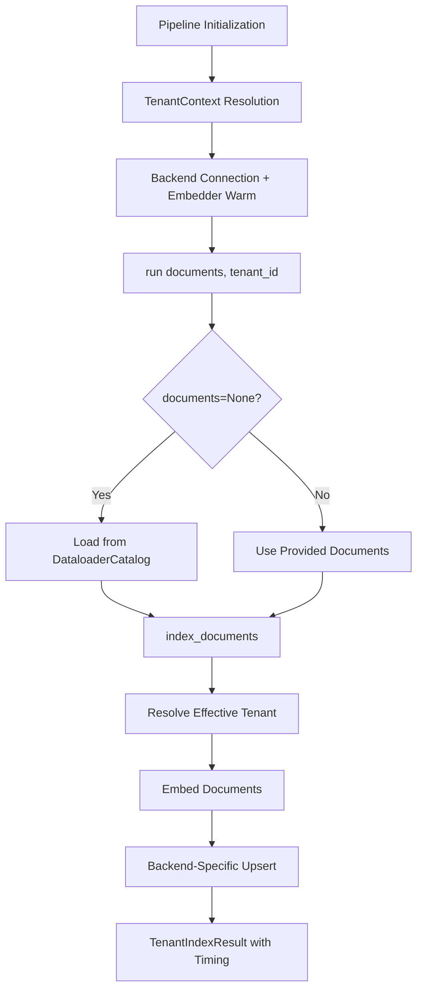
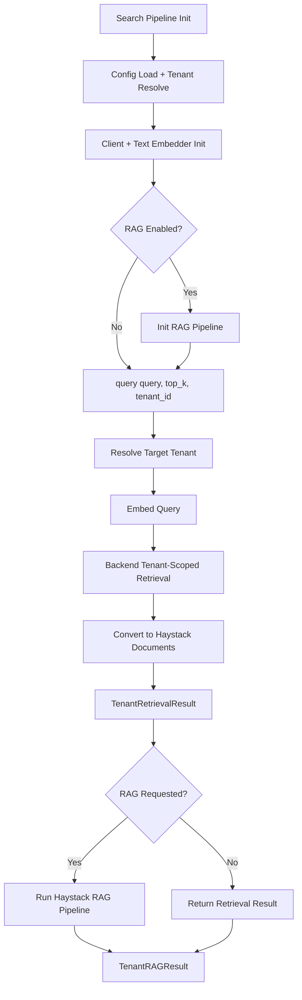

# Haystack: Multi-Tenancy

## 1. What This Feature Is

Multi-tenancy provides tenant-isolated indexing and retrieval pipelines for Haystack-based RAG across five vector backends. Each backend implements isolation differently:

| Backend | Isolation Mechanism |
|---------|---------------------|
| **Milvus** | Partition-key isolation (`tenant_id` field + filter expression) |
| **Weaviate** | Native multi-tenancy (tenant-scoped shards via `.with_tenant(...)`) |
| **Pinecone** | Namespace isolation (`namespace=<tenant_id>`) |
| **Qdrant** | Payload-filter isolation (`tenant_id` payload + filter) |
| **Chroma** | Collection-per-tenant naming plus tenant metadata filtering |

Each backend has two pipeline classes:

- **Indexing pipelines**: Subclass `BaseMultitenancyPipeline` and handle document ingestion
- **Search pipelines**: Standalone classes with similar interface and optional RAG

The shared contract is defined through `TenantContext`, typed result dataclasses (`TenantIndexResult`, `TenantRetrievalResult`, `TenantRAGResult`), and embedding/RAG helpers in `common/`.

## 2. Why It Exists in Retrieval/RAG

RAG systems frequently host multiple customers, teams, or applications on shared infrastructure. Without strict tenant boundaries, retrieval can leak context across tenants and produce incorrect or unsafe answers.

This implementation exists to enforce tenant boundaries **inside the retrieval path itself**, not only at API boundaries:

- **Index-time**: Tenant tagging or physical separation of documents
- **Query-time**: Tenant-scoped retrieval calls and filters
- **Result wrapping**: Tenant-aware result objects (`TenantRetrievalResult`, `TenantRAGResult`) for audit trails

Key design goals:

- **Zero cross-tenant leakage**: Retrieval must never return documents from other tenants
- **Consistent interface**: Same API across all five backends despite different isolation mechanisms
- **Tenant-aware observability**: Timing metrics and result wrappers include tenant context for debugging
- **Flexible tenant resolution**: Support explicit context, environment variables, or config-based tenant identification

## 3. Indexing Pipeline: Step-by-Step



### Step-by-Step Flow

1. **Pipeline initialization**: `PineconeMultitenancyIndexingPipeline(config_path, tenant_context=ctx)`
2. **BaseMultitenancyPipeline.**init****:
   - Loads YAML via `_load_config_static(config_path)`
   - Resolves environment placeholders using `_resolve_env_vars`
   - Resolves tenant via `TenantContext.resolve()` with priority: explicit context > `TENANT_ID` env > `tenant.id` config
   - Calls `_connect()` backend hook
3. **Backend _connect()**:
   - Establishes DB client
   - Ensures collection/index exists (backend-specific)
   - Warms document embedder from `common.embeddings.create_document_embedder()`
4. **run(documents=None, tenant_id=None)**:
   - Starts timer
   - If `documents is None`, loads from `DataloaderCatalog.create(...).load().to_haystack()` using `dataloader.dataset` + params
   - If empty docs, returns `TenantIndexResult` with zero counts
   - Otherwise calls `index_documents(...)`
5. **index_documents(...)**:
   - Resolves effective tenant (`tenant_id` arg or context tenant)
   - Embeds docs via `embedder.run(documents=...)`
   - Applies optional embedding truncation via `truncate_embeddings(..., output_dimension)`
   - Applies backend isolation write behavior (see section 8)
6. **Returns**: `TenantIndexResult` with indexed count and timing metrics

### Backend-Specific Indexing

| Backend | Isolation Write Behavior |
|---------|-------------------------|
| **Pinecone** | Upsert vectors in `namespace=tenant`, batch size 100 |
| **Weaviate** | Ensure class, ensure tenant exists, batch add objects with `tenant=...` |
| **Qdrant** | Upsert points with payload `tenant_id` + `content`; payload index created in `_connect()` |
| **Milvus** | Insert with `tenant_id` metadata into partition-key-enabled collection |
| **Chroma** | Write into tenant-suffixed collection (`<base>_<tenant>`) with `tenant_id` metadata |

## 4. Search Pipeline: Step-by-Step



### Step-by-Step Flow

1. **Pipeline initialization**: Backend search pipeline with config path or dict
2. **Config loading**: `common.config.load_config(...)`, resolves tenant via `TenantContext.resolve(...)`
3. **Component init**: Client and text embedder (`create_text_embedder(...)`), optionally RAG pipeline if `rag.enabled` is true
4. **query(query, top_k=10, tenant_id=None)**:
   - Resolve target tenant
   - Start timer
   - Embed query via text embedder
   - Optionally truncate query vector if `embedding.output_dimension` is set
   - Execute backend tenant-scoped retrieval (see table below)
   - Convert matches to Haystack `Document` objects
   - Build `TenantRetrievalResult` with scores and timing
5. **rag(query, top_k, tenant_id)**:
   - Raises `ValueError` if RAG pipeline not enabled/configured
   - Calls `query(...)` first
   - Runs Haystack pipeline with `prompt_builder` fed with query + retrieved docs
   - Generator reply extraction from `result["generator"]["replies"][0]`
   - Returns `TenantRAGResult`

### Backend-Specific Search

| Backend | Tenant-Scoped Retrieval |
|---------|------------------------|
| **Pinecone** | `index.query(..., namespace=tenant, include_metadata=True)` |
| **Weaviate** | Query chain with `.with_tenant(tenant).with_near_vector(...).with_limit(top_k)` |
| **Qdrant** | `search(..., query_filter=Filter(must=[tenant_id==...]))` |
| **Milvus** | `retrieve(..., filters={"tenant_id": tenant})` |
| **Chroma** | `query(..., where={"tenant_id": tenant})` on tenant-scoped collection |

## 5. When to Use It

Use multi-tenancy when:

- **Multi-customer SaaS**: Multiple customers share infrastructure and must never see each other's retrieved context
- **Department isolation**: Different teams/departments need isolated knowledge bases on shared vector DB
- **Compliance requirements**: Data residency or privacy rules require logical isolation per tenant
- **Unified codebase**: You need one code-level interface across Milvus/Weaviate/Pinecone/Qdrant/Chroma
- **Consistent semantics**: Retrieval-only and RAG flows should share identical tenant-resolution behavior
- **Observability needs**: Tenant-aware result objects and timing metrics for debugging and auditing

## 6. When Not to Use It

Avoid multi-tenancy when:

- **Single tenant**: You have only one tenant and no isolation requirement (use simpler pipelines)
- **Cross-tenant analytics**: You need search/analytics across all tenants (this module enforces isolation)
- **Strict tenant lifecycle**: You need explicit tenant provisioning/deprovisioning APIs on all backends (some backends use implicit-on-write)
- **Graceful error handling required**: Many runtime client exceptions propagate directly without wrapping
- **Complex tenant hierarchies**: Your use case requires nested tenants or hierarchical isolation (not supported)

## 7. What This Codebase Provides

### Public API (from `src/vectordb/haystack/multi_tenancy/__init__.py`)

```python
from vectordb.haystack.multi_tenancy import (
    # Base class
    "BaseMultitenancyPipeline",

    # Indexing pipelines (per backend)
    "MilvusMultitenancyIndexingPipeline",
    "WeaviateMultitenancyIndexingPipeline",
    "PineconeMultitenancyIndexingPipeline",
    "QdrantMultitenancyIndexingPipeline",
    "ChromaMultitenancyIndexingPipeline",

    # Search pipelines (per backend)
    "MilvusMultitenancySearchPipeline",
    "WeaviateMultitenancySearchPipeline",
    "PineconeMultitenancySearchPipeline",
    "QdrantMultitenancySearchPipeline",
    "ChromaMultitenancySearchPipeline",

    # Shared types
    "TenantContext",
    "TenantIsolationStrategy",
    "TenantIndexResult",
    "TenantRetrievalResult",
    "TenantRAGResult",
    "TenantQueryResult",
    "TenantStats",
    "TenantStatus",
)
```

### Type Definitions

```python
from dataclasses import dataclass

@dataclass(frozen=True)
class TenantContext:
    tenant_id: str           # Required tenant identifier
    tenant_name: str | None  # Optional human-readable name
    metadata: dict           # Additional metadata for auditing

@dataclass
class TenantIndexResult:
    documents_indexed: int
    tenant_id: str
    timing_ms: float

@dataclass
class TenantRetrievalResult:
    documents: list[Document]
    tenant_id: str
    timing_ms: float
    scores: list[float]

@dataclass
class TenantRAGResult:
    answer: str
    retrieval_result: TenantRetrievalResult
    tenant_id: str
```

### Shared Behavior

- **Tenant resolution precedence**: Deterministic (explicit > env > config)
- **Embedding helpers**: Standardize model, `trust_remote_code`, batch size/prefix, dimension truncation
- **RAG helper**: Two-component Haystack pipeline (`PromptBuilder` → `OpenAIGenerator` for Groq endpoint)
- **Timing**: All operations include millisecond-precision timing in result objects

## 8. Backend-Specific Behavior Differences

### Pinecone

| Aspect | Behavior |
|--------|----------|
| **Isolation** | Namespace-based at read/write |
| **Index creation** | Auto-created if missing in `_connect()` |
| **Tenant stats** | `describe_index_stats(filter={"tenant_id": ...})` relies on metadata patterns |
| **Write batching** | Upserts in chunks of 100 |
| **Tenant existence** | Implicit on first upsert; no explicit tenant creation API |

### Weaviate

| Aspect | Behavior |
|--------|----------|
| **Isolation** | Explicit tenant APIs with `.with_tenant(...)` query scoping |
| **Class creation** | `multiTenancyConfig: {enabled: true}`, `vectorizer: none` |
| **Tenant creation** | Explicit via tenant API; handles fallback on schema errors |
| **Query scoping** | All queries include `.with_tenant(tenant)` |

### Qdrant

| Aspect | Behavior |
|--------|----------|
| **Isolation** | Payload-based with `tenant_id` field |
| **Index creation** | Payload index on `tenant_id` created in `_connect()` |
| **Query filtering** | `Filter(must=[FieldCondition(key="tenant_id", ...)]` |
| **Tenant listing** | Scrolls records and deduplicates payload values |

### Milvus

| Aspect | Behavior |
|--------|----------|
| **Isolation** | Partition-key mode with `tenant_id` partition key |
| **Collection schema** | Created with partition key field |
| **Query filtering** | Always applies tenant filtering |
| **Wrapper usage** | Uses `MilvusVectorDB` methods for all operations |

### Chroma

| Aspect | Behavior |
|--------|----------|
| **Isolation** | Tenant-suffixed collection naming (`<base>_<tenant>`) + metadata filtering |
| **Collection creation** | One collection per tenant (closest to physical isolation) |
| **Character normalization** | Collection names sanitized for Chroma naming rules |
| **Metadata filtering** | Additional `where={"tenant_id": tenant}` filter on queries |

## 9. Configuration Semantics

### Primary Configuration Keys

```yaml
# Tenant configuration (required)
tenant:
  id: "acme-prod"              # Required unless TENANT_ID env set
  name: "Acme Production"      # Optional human-readable name
  metadata:                    # Optional metadata for auditing
    department: "engineering"
    tier: "enterprise"

# Embedding configuration
embedding:
  model: "sentence-transformers/all-MiniLM-L6-v2"
  trust_remote_code: false
  batch_size: 32
  query_prefix: ""
  output_dimension: 384        # Optional truncation

# RAG configuration (optional)
rag:
  enabled: true
  prompt_template: "Answer based on context: {context}\n\nQuestion: {query}"
  generator:
    model: "llama-3.3-70b-versatile"
    api_key: "${GROQ_API_KEY}"
    temperature: 0.7
    max_tokens: 2048

# Backend configuration (example: Pinecone)
pinecone:
  api_key: "${PINECONE_API_KEY}"
  index: "my-index"
  metric: "cosine"
  cloud: "aws"
  region: "us-east-1"

# Dataloader configuration (for run(documents=None))
dataloader:
  dataset: "triviaqa"
  split: "test"
  limit: 500

# Multi-tenancy specific config
multitenancy:
  strategy: "namespace"        # namespace, partition, payload, tenant, collection
  field_name: "tenant_id"
  auto_create_tenant: true
  partition_key_isolation: true
  num_partitions: 10
```

### Tenant Resolution Priority

1. **Explicit `tenant_context` parameter** (highest priority)
2. **`TENANT_ID` environment variable**
3. **`tenant.id` in YAML config** (lowest priority)

### Environment Variable Syntax

- `${VAR}`: Substitute with env var, empty string if unset
- `${VAR:-default}`: Substitute with VAR if set, else default

Example:

```yaml
pinecone:
  api_key: "${PINECONE_API_KEY:-pc-default-key}"
  index: "${PINECONE_INDEX}"  # Required, no default
```

### Important Semantic Caveats

- Some YAML examples use `embedding.model_name` but runtime reads `embedding.model`
- `database.index_name` vs `pinecone.index`: backend-specific blocks use different keys
- Mismatched keys may silently apply defaults; verify config keys match runtime expectations

## 10. Failure Modes and Edge Cases

### Tenant Resolution Failures

| Failure | Cause | Mitigation |
|---------|-------|------------|
| **TenantContextError** | No explicit context, no `TENANT_ID`, no `tenant.id` config | Provide one of the three sources |
| **Empty tenant_id** | `tenant_id=""` passed | Validate tenant_id before passing; `TenantContext` rejects empty strings |
| **Type mismatch** | `tenant_id` is not a string | `TenantContext.__post_init__` validates type |

### Indexing Failures

| Failure | Cause | Mitigation |
|---------|-------|------------|
| **Empty documents** | `documents=[]` passed to `run()` | Returns `TenantIndexResult(documents_indexed=0)` without error |
| **Embedding failure** | Embedder model unavailable | Verify model name; check network for HF models |
| **Backend connection error** | Invalid API key, network issue | Validate credentials; check connectivity |
| **Index/collection exists** | Index already exists with different schema | Use `recreate=True` or drop manually |

### Search Failures

| Failure | Cause | Mitigation |
|---------|-------|------------|
| **RAG not enabled** | `rag()` called with `rag.enabled=false` | Raises `ValueError`; check config before calling |
| **Backend query error** | Invalid filter syntax, network timeout | Backend-specific exceptions propagate; wrap in try/except |
| **Empty results** | No documents for tenant | Returns empty `TenantRetrievalResult`; not an error |
| **Config returns None** | Empty YAML file | `load_config()` returns `None`; downstream code expects dict |

### Environment Interpolation Issues

| Issue | Cause | Mitigation |
|-------|-------|------------|
| **Partial resolution** | `base._resolve_env_vars` only resolves full-string patterns | Use `common.config.resolve_env_vars` for interpolation inside longer strings |
| **Nested vars not resolved** | Env var value contains `${...}` | Resolution is single-pass; pre-resolve env vars |

### Backend-Specific Edge Cases

**Chroma**:

- Tenant existence check is coarse (`_collection is not None`)
- Not a strict per-tenant catalog API

**Pinecone/Qdrant/Milvus**:

- `create_tenant()` reflects implicit-on-first-write behavior
- No guaranteed provisioning semantics

**Weaviate**:

- Explicit tenant creation required
- Class/tenant creation has fallback paths on schema errors

## 11. Practical Usage Examples

### Example 1: Basic Multi-Tenant Indexing (Pinecone)

```python
from vectordb.haystack.multi_tenancy import (
    TenantContext,
    PineconeMultitenancyIndexingPipeline,
    PineconeMultitenancySearchPipeline,
)

# Create explicit tenant context
ctx = TenantContext(tenant_id="acme-prod", tenant_name="Acme Production")

# Initialize indexing pipeline
indexing = PineconeMultitenancyIndexingPipeline(
    "src/vectordb/haystack/multi_tenancy/configs/pinecone_triviaqa.yaml",
    tenant_context=ctx,
)

# Index documents
from haystack import Document
docs = [Document(content="Acme-specific knowledge base article")]
result = indexing.run(documents=docs)
print(f"Indexed {result.documents_indexed} documents for tenant {result.tenant_id}")

# Initialize search pipeline
search = PineconeMultitenancySearchPipeline(
    "src/vectordb/haystack/multi_tenancy/configs/pinecone_triviaqa.yaml",
    tenant_context=ctx,
)

# Query tenant-specific data
retrieval = search.query("What is our return policy?", top_k=5)
print(f"Retrieved {len(retrieval.documents)} documents for tenant {retrieval.tenant_id}")
```

### Example 2: Tenant Override at Query Time

```python
from vectordb.haystack.multi_tenancy import WeaviateMultitenancySearchPipeline

# Pipeline initialized without explicit tenant context
pipeline = WeaviateMultitenancySearchPipeline(
    "src/vectordb/haystack/multi_tenancy/configs/weaviate_triviaqa.yaml"
)

# Override tenant at call time
result = pipeline.query(
    "tenant-specific question",
    tenant_id="org-b",  # Override tenant for this query only
    top_k=10,
)
# Result is scoped to "org-b" regardless of pipeline's default tenant
```

### Example 3: Multi-Tenant RAG

```python
from vectordb.haystack.multi_tenancy import (
    TenantContext,
    QdrantMultitenancySearchPipeline,
)

ctx = TenantContext(tenant_id="tenant-42")

pipeline = QdrantMultitenancySearchPipeline(
    "src/vectordb/haystack/multi_tenancy/configs/qdrant_triviaqa.yaml",
    tenant_context=ctx,
)

# RAG query (requires rag.enabled=true in config)
rag_result = pipeline.rag(
    query="What is the capital of France?",
    top_k=5,
    tenant_id="tenant-42",
)

print(f"Answer: {rag_result.answer}")
print(f"Retrieved {len(rag_result.retrieval_result.documents)} documents")
```

### Example 4: Environment-Based Tenant Resolution

```python
import os
from vectordb.haystack.multi_tenancy import PineconeMultitenancyIndexingPipeline

# Set tenant via environment variable
os.environ["TENANT_ID"] = "env-tenant-123"
os.environ["TENANT_NAME"] = "Environment Tenant"

# Pipeline resolves tenant from environment (no explicit context needed)
pipeline = PineconeMultitenancyIndexingPipeline(
    "src/vectordb/haystack/multi_tenancy/configs/pinecone_triviaqa.yaml"
)
# pipeline.tenant_context.tenant_id == "env-tenant-123"
```

### Example 5: Config-Based Tenant Resolution

```yaml
# config.yaml
tenant:
  id: "config-tenant"
  name: "Config-Based Tenant"
  metadata:
    environment: "production"

pinecone:
  api_key: "${PINECONE_API_KEY}"
  index: "my-index"
```

```python
from vectordb.haystack.multi_tenancy import PineconeMultitenancySearchPipeline

# Pipeline resolves tenant from config (no explicit context, no env var)
pipeline = PineconeMultitenancySearchPipeline("config.yaml")
# pipeline.tenant_context.tenant_id == "config-tenant"
```

### Example 6: Multi-Tenant Loop

```python
from vectordb.haystack.multi_tenancy import (
    TenantContext,
    ChromaMultitenancyIndexingPipeline,
    ChromaMultitenancySearchPipeline,
)

tenants = ["acme", "globex", "initech"]
docs_per_tenant = {
    "acme": [...],  # Documents for each tenant
    "globex": [...],
    "initech": [...],
}

# Index for all tenants
for tenant_id in tenants:
    ctx = TenantContext(tenant_id=tenant_id)
    indexer = ChromaMultitenancyIndexingPipeline(
        "src/vectordb/haystack/multi_tenancy/configs/chroma_triviaqa.yaml",
        tenant_context=ctx,
    )
    indexer.run(documents=docs_per_tenant[tenant_id])

# Query each tenant
for tenant_id in tenants:
    ctx = TenantContext(tenant_id=tenant_id)
    search = ChromaMultitenancySearchPipeline(
        "src/vectordb/haystack/multi_tenancy/configs/chroma_triviaqa.yaml",
        tenant_context=ctx,
    )
    results = search.query("company policies", top_k=3)
    print(f"{tenant_id}: {len(results.documents)} results")
```

## 12. Source Walkthrough Map

### Core Orchestration and Contracts

| File | Purpose |
|------|---------|
| `src/vectordb/haystack/multi_tenancy/__init__.py` | Public API exports |
| `src/vectordb/haystack/multi_tenancy/base.py` | `BaseMultitenancyPipeline` abstract base class |
| `src/vectordb/haystack/multi_tenancy/vectordb_multitenancy_type.py` | Type definitions and enums |

### Common Utilities

| File | Purpose |
|------|---------|
| `src/vectordb/haystack/multi_tenancy/common/tenant_context.py` | `TenantContext` resolution logic |
| `src/vectordb/haystack/multi_tenancy/common/types.py` | `TenantIndexResult`, `TenantRetrievalResult`, `TenantRAGResult` |
| `src/vectordb/haystack/multi_tenancy/common/config.py` | Config loading utilities |
| `src/vectordb/haystack/multi_tenancy/common/embeddings.py` | Embedder creation and truncation |
| `src/vectordb/haystack/multi_tenancy/common/rag.py` | RAG pipeline helper |
| `src/vectordb/haystack/multi_tenancy/common/timing.py` | Timing context manager |

### Backend Implementations

| Backend | Indexing | Search |
|---------|----------|--------|
| **Pinecone** | `pinecone/indexing.py` | `pinecone/search.py` |
| **Weaviate** | `weaviate/indexing.py` | `weaviate/search.py` |
| **Qdrant** | `qdrant/indexing.py` | `qdrant/search.py` |
| **Milvus** | `milvus/indexing.py` | `milvus/search.py` |
| **Chroma** | `chroma/indexing.py` | `chroma/search.py` |

### Configuration Examples

| File | Backend + Dataset |
|------|-------------------|
| `src/vectordb/haystack/multi_tenancy/configs/pinecone_triviaqa.yaml` | Pinecone + TriviaQA |
| `src/vectordb/haystack/multi_tenancy/configs/weaviate_triviaqa.yaml` | Weaviate + TriviaQA |
| `src/vectordb/haystack/multi_tenancy/configs/qdrant_triviaqa.yaml` | Qdrant + TriviaQA |
| `src/vectordb/haystack/multi_tenancy/configs/milvus_triviaqa.yaml` | Milvus + TriviaQA |
| `src/vectordb/haystack/multi_tenancy/configs/chroma_triviaqa.yaml` | Chroma + TriviaQA |

### Test Files

| Directory | Coverage |
|-----------|----------|
| `tests/haystack/multi_tenancy/test_base.py` | Base class, tenant resolution |
| `tests/haystack/multi_tenancy/test_tenant_context.py` | TenantContext resolution logic |
| `tests/haystack/multi_tenancy/test_pinecone.py` | Pinecone indexing and search |
| `tests/haystack/multi_tenancy/test_weaviate.py` | Weaviate indexing and search |
| `tests/haystack/multi_tenancy/test_qdrant.py` | Qdrant indexing and search |
| `tests/haystack/multi_tenancy/test_milvus.py` | Milvus indexing and search |
| `tests/haystack/multi_tenancy/test_chroma.py` | Chroma indexing and search |

---

**Related Documentation**:

- **Namespaces** (`docs/haystack/namespaces.md`): Logical data segmentation (related but distinct from multi-tenancy)
- **Metadata Filtering** (`docs/haystack/metadata-filtering.md`): Filter documents by metadata (used within tenant scope)
- **Core Databases** (`docs/core/databases.md`): Backend wrapper details
