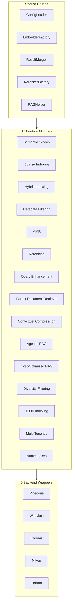

# Haystack Framework Overview

## 1. What This Integration Is

The Haystack integration provides **15 retrieval feature implementations** for Haystack 2.x, each with:

- Backend-specific indexing pipelines (5 backends × 15 features)
- Backend-specific search pipelines (5 backends × 15 features)
- Shared utilities and components
- Comprehensive test coverage

**Scope**: Complete Haystack-native RAG toolkit spanning semantic search, hybrid retrieval, reranking, filtering, compression, query enhancement, agentic RAG, and multi-tenancy.

## 2. Why Haystack Integration Exists

### Benefits Over Raw Vector DB APIs

| Benefit | Description |
|---------|-------------|
| **Unified interface** | Same API across Pinecone, Weaviate, Chroma, Milvus, Qdrant |
| **Haystack components** | Native integration with Haystack embedders, rankers, generators |
| **Feature parity** | All 15 features implemented consistently across backends |
| **Test coverage** | Comprehensive tests validate behavior across all backends |
| **Config-driven** | YAML configs with env var resolution for all pipelines |

### Benefits Over LangChain Integration

| Aspect | Haystack | LangChain |
|--------|----------|-----------|
| **Component model** | Explicit component sockets | Chain-based composition |
| **Streaming** | Native streaming support | Varies by integration |
| **Evaluation** | Haystack evaluation primitives | Custom evaluation needed |
| **Document handling** | Haystack Document with embeddings | LangChain Document |

## 3. Architecture Overview



### Module Boundaries

| Module | Responsibility |
|--------|----------------|
| **Feature modules** | Indexing/search orchestration per feature |
| **Backend wrappers** | Vector DB API abstraction (`vectordb.databases`) |
| **Shared utilities** | Config, embeddings, fusion, filtering, RAG |
| **Components** | Reusable advanced-RAG components |

## 4. Feature Catalog

### Retrieval Core

| Feature | Purpose | When to Use |
|---------|---------|-------------|
| **Semantic Search** | Dense vector similarity | Baseline retrieval |
| **Sparse Indexing** | Lexical/keyword matching | Exact term matching |
| **Hybrid Indexing** | Dense + sparse fusion | Best of both worlds |

### Ranking & Diversity

| Feature | Purpose | When to Use |
|---------|---------|-------------|
| **Reranking** | Cross-encoder second-pass scoring | High precision needed |
| **MMR** | Relevance-diversity balance | Avoid redundant results |
| **Diversity Filtering** | Post-retrieval diversity | Multi-faceted queries |

### Query/Context Transformation

| Feature | Purpose | When to Use |
|---------|---------|-------------|
| **Query Enhancement** | Multi-query, HyDE, step-back | Ambiguous queries |
| **Contextual Compression** | Reranking/LLM extraction | Token budget limits |
| **Agentic RAG** | Tool routing + self-reflection | Complex queries |

### Data Shaping & Isolation

| Feature | Purpose | When to Use |
|---------|---------|-------------|
| **Metadata Filtering** | Structured constraints | Domain/time filtering |
| **JSON Indexing** | JSON-aware schema/filtering | Structured documents |
| **Parent Document Retrieval** | Chunk indexing, parent return | Long documents |
| **Namespaces** | Logical partitioning | Environment separation |
| **Multi-Tenancy** | Tenant isolation | Multi-customer SaaS |

### Cost/Governance

| Feature | Purpose | When to Use |
|---------|---------|-------------|
| **Cost-Optimized RAG** | Typed config + cost controls | Budget constraints |

## 5. Indexing Patterns

### Common Indexing Flow

All feature modules follow this pattern:


### Backend-Specific Variations

| Backend | Collection Creation | Write Method |
|---------|---------------------|--------------|
| **Chroma** | `create_collection()` | `upsert()` |
| **Milvus** | `create_collection()` | `insert_documents()` |
| **Pinecone** | `create_index()` | `upsert()` |
| **Qdrant** | `create_collection()` | `index_documents()` |
| **Weaviate** | `create_collection()` | `upsert_documents()` |

## 6. Search Patterns

### Common Search Flow

All feature modules follow this pattern:


### Post-Processing Types

| Type | Features |
|------|----------|
| **Fusion** | Hybrid Indexing |
| **Reranking** | Reranking, MMR, Contextual Compression |
| **Filtering** | Metadata Filtering, Diversity Filtering |
| **Transformation** | Query Enhancement, Contextual Compression |
| **Agentic** | Agentic RAG |

## 7. When to Use Haystack

Use Haystack integration when:

- **Haystack ecosystem**: Already using Haystack for RAG
- **Component model**: Prefer explicit component sockets
- **Native streaming**: Need streaming response support
- **Evaluation primitives**: Haystack evaluation integration
- **Feature parity**: Same features across all backends

## 8. When Not to Use Haystack

Consider alternatives when:

- **LangChain stack**: Already invested in LangChain
- **Custom component model**: Need different composition pattern
- **Raw API control**: Need direct backend SDK access
- **Non-Python**: Different language ecosystem

## 9. Core Abstractions

### Pipeline Interface

All pipelines implement consistent interface:

```python
# Indexing pipeline
indexer = FeatureIndexingPipeline(config_path)
result = indexer.run()  # Returns {"documents_indexed": int}

# Search pipeline
searcher = FeatureSearchPipeline(config_path)
result = searcher.search(query="...", top_k=10)
# Returns {"documents": [...], "query": "...", "db": "..."}
```

### Document Model

All features use Haystack `Document`:

```python
from haystack import Document

doc = Document(
    content="Document text",
    meta={"key": "value"},
    embedding=[0.1, 0.2, ...],
    score=0.95,
)
```

### Configuration Model

All features use YAML configs with env var resolution:

```yaml
embeddings:
  model: "sentence-transformers/all-MiniLM-L6-v2"
  device: "${DEVICE:-cpu}"

backend:
  api_key: "${API_KEY}"
  collection_name: "my-collection"
```

## 10. Backend Support Matrix

| Feature | Pinecone | Weaviate | Chroma | Milvus | Qdrant |
|---------|----------|----------|--------|--------|--------|
| **Semantic Search** | Yes | Yes | Yes | Yes | Yes |
| **Sparse Indexing** | Yes | Yes (BM25) | Partial | Yes | Yes |
| **Hybrid Indexing** | Yes | Yes | Yes | Yes | Yes |
| **Metadata Filtering** | Yes | Yes | Yes | Yes | Yes |
| **MMR** | Yes | Yes | Yes | Yes | Yes |
| **Reranking** | Yes | Yes | Yes | Yes | Yes |
| **Query Enhancement** | Yes | Yes | Yes | Yes | Yes |
| **Parent Document Retrieval** | Yes | Yes | Yes | Yes | Yes |
| **Contextual Compression** | Yes | Yes | Yes | Yes | Yes |
| **Agentic RAG** | Yes | Yes | Yes | Yes | Yes |
| **Cost-Optimized RAG** | Yes | Yes | Yes | Yes | Yes |
| **Diversity Filtering** | Yes | Yes | Yes | Yes | Yes |
| **JSON Indexing** | Partial | Yes | Partial | Yes | Yes |
| **Multi-Tenancy** | Yes | Yes | Yes | Yes | Yes |
| **Namespaces** | Yes | Yes | Yes | Yes | Yes |

Legend: Yes = Full support | Partial = Partial/limited support

## 11. Configuration Overview

### Required Sections

```yaml
# Embeddings (required for all features)
embeddings:
  model: "sentence-transformers/all-MiniLM-L6-v2"
  device: "cpu"
  batch_size: 32

# Backend section (one required)
pinecone:
  api_key: "${PINECONE_API_KEY}"
  index_name: "my-index"

# Dataloader (for indexing)
dataloader:
  type: "triviaqa"
  split: "test"
  limit: 500

# Search (for search pipelines)
search:
  top_k: 10

# RAG (optional)
rag:
  enabled: true
  model: "llama-3.3-70b-versatile"
  api_key: "${GROQ_API_KEY}"
```

### Environment Variable Syntax

| Syntax | Behavior |
|--------|----------|
| **`${VAR}`** | Env value or empty string |
| **`${VAR:-default}`** | Env value if set, else default |

### Model Aliases

| Alias | Resolves To |
|-------|-------------|
| **qwen3** | `Qwen/Qwen3-Embedding-0.6B` |
| **minilm** | `sentence-transformers/all-MiniLM-L6-v2` |
| **mpnet** | `sentence-transformers/all-mpnet-base-v2` |

## 12. Source Map

### Directory Structure

```
src/vectordb/haystack/
├── __init__.py                    # Package exports
├── README.md                      # Framework overview
├── agentic_rag/                   # Agentic RAG pipelines
├── components/                    # Reusable components
├── contextual_compression/        # Context compression
├── cost_optimized_rag/            # Cost-optimized RAG
├── diversity_filtering/           # Diversity filtering
├── hybrid_indexing/               # Hybrid retrieval
├── json_indexing/                 # JSON indexing
├── metadata_filtering/            # Metadata filtering
├── mmr/                           # MMR retrieval
├── multi_tenancy/                 # Multi-tenancy
├── namespaces/                    # Namespace management
├── parent_document_retrieval/     # Parent document retrieval
├── query_enhancement/             # Query enhancement
├── reranking/                     # Reranking
├── semantic_search/               # Semantic search
├── sparse_indexing/               # Sparse indexing
└── utils/                         # Shared utilities
```

### Key Entry Points

| File | Purpose |
|------|---------|
| `__init__.py` | Package exports |
| `README.md` | Framework overview |
| `*/__init__.py` | Feature module exports |
| `utils/__init__.py` | Utility exports |
| `components/__init__.py` | Component exports |

### Test Structure

```
tests/haystack/
├── agentic_rag/
├── components/
├── contextual_compression/
├── cost_optimized_rag/
├── diversity_filtering/
├── hybrid_indexing/
├── json_indexing/
├── metadata_filtering/
├── mmr/
├── multi_tenancy/
├── namespaces/
├── parent_document_retrieval/
├── query_enhancement/
├── reranking/
├── semantic_search/
├── sparse_indexing/
└── utils/
```

### Configuration Examples

```
src/vectordb/haystack/*/configs/
├── chroma/
├── milvus/
├── pinecone/
├── qdrant/
└── weaviate/
```

Each backend directory contains per-dataset configs (TriviaQA, ARC, PopQA, FActScore, Earnings Calls).

---

**Next Steps**:

- **Feature deep dives**: See individual feature docs for detailed implementation
- **Components**: `docs/haystack/components.md` for reusable components
- **Utils**: `docs/haystack/utils.md` for shared utilities
- **Reference**: `docs/reference/public-api.md` for complete API inventory

**Related Documentation**:

- **LangChain Overview** (`docs/langchain/overview.md`): LangChain integration comparison
- **Core VectorDB** (`docs/core/vectordb.md`): Package architecture
- **Core Databases** (`docs/core/databases.md`): Backend wrapper details
