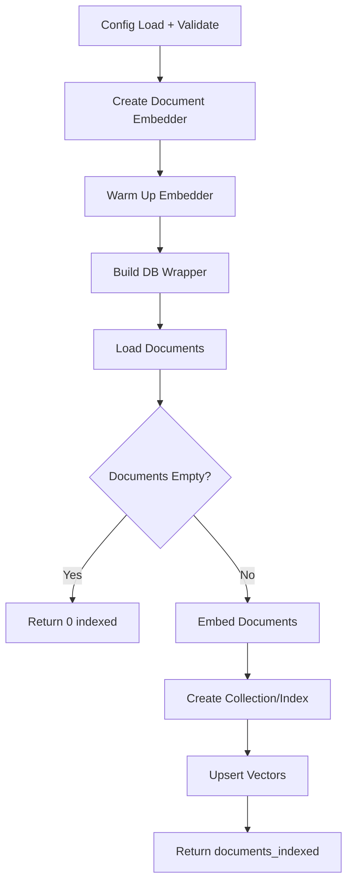
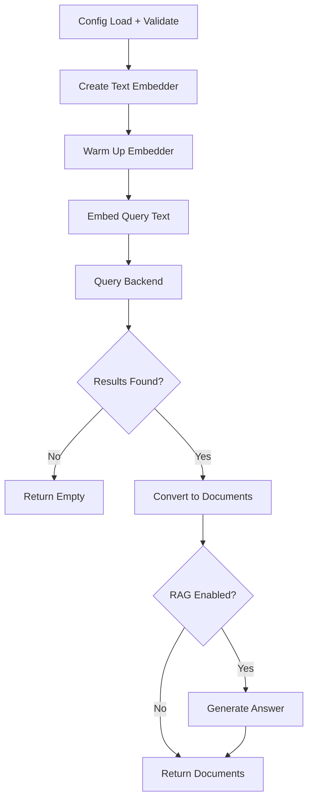

# Haystack: Semantic Search

## 1. What This Feature Is

Semantic search uses **dense embeddings** to retrieve conceptually similar content beyond keyword overlap. This is the foundational retrieval pattern upon which all other advanced features (hybrid, MMR, reranking, filtering) are built.

This module implements **five backend-specific pipeline pairs**:

| Backend | Indexing Pipeline | Search Pipeline |
|---------|-------------------|-----------------|
| **Chroma** | `ChromaSemanticIndexingPipeline` | `ChromaSemanticSearchPipeline` |
| **Milvus** | `MilvusSemanticIndexingPipeline` | `MilvusSemanticSearchPipeline` |
| **Pinecone** | `PineconeSemanticIndexingPipeline` | `PineconeSemanticSearchPipeline` |
| **Qdrant** | `QdrantSemanticIndexingPipeline` | `QdrantSemanticSearchPipeline` |
| **Weaviate** | `WeaviateSemanticIndexingPipeline` | `WeaviateSemanticSearchPipeline` |

All are exported from `vectordb.haystack.semantic_search`.

## 2. Why It Exists in Retrieval/RAG

**Keyword search** matches on exact term overlap but fails on:

- Synonyms ("car" vs "automobile")
- Paraphrases ("How do I reset my password?" vs "Password reset instructions")
- Conceptual similarity ("heart attack" vs "myocardial infarction")

**Semantic search** addresses these gaps by:

- Encoding documents and queries into dense vector space
- Retrieving based on vector similarity (cosine, dot product, Euclidean)
- Capturing semantic meaning beyond surface forms

### Use Case Fit

| Use Case | Why Semantic Search |
|----------|---------------------|
| **Open-domain QA** | Match questions to answers with different wording |
| **Document exploration** | Find conceptually related content |
| **RAG baseline** | Foundation for advanced retrieval features |
| **Cross-lingual retrieval** | Embeddings capture meaning across languages |

## 3. Indexing Pipeline: Step-by-Step



### Common Indexing Sequence

All indexing pipelines follow this sequence:

1. **Load config**: Via config loader with env var resolution
2. **Validate sections**: Required: `dataloader`, `embeddings`, `<backend>`
3. **Create document embedder**: `SentenceTransformersDocumentEmbedder` or similar
4. **Warm up embedder**: Load model into memory
5. **Build DB wrapper**: Backend-specific connection
6. **Load documents**: `DataloaderCatalog.create(...).load().to_haystack()`
7. **Early return**: If empty, return `{"documents_indexed": 0}`
8. **Embed documents**: `embedder.run(documents=documents)`
9. **Create collection/index**: Backend-specific method
10. **Upsert vectors**: With metadata
11. **Return**: `{"documents_indexed": <count>}`

### Backend-Specific Indexing

| Backend | Collection Creation | Write Method | Special Handling |
|---------|---------------------|--------------|------------------|
| **Chroma** | `create_collection(collection_name, dimension)` | `upsert(ids, embeddings, documents, metadatas)` | Persistent or ephemeral mode |
| **Milvus** | `create_collection(collection_name, dimension)` | `insert_documents(documents)` | HNSW index with COSINE |
| **Pinecone** | `create_index(name, dimension, metric)` | `upsert(vectors, namespace)` | Serverless index creation |
| **Qdrant** | `create_collection(dimension)` | `index_documents(documents)` | Named vectors optional |
| **Weaviate** | `create_collection(collection_name, dimension)` | `upsert_documents(documents)` | Vectorizer config optional |

## 4. Search Pipeline: Step-by-Step



### Common Search Sequence

All search pipelines follow this sequence:

1. **Load config**: Via config loader with env var resolution
2. **Validate sections**: Required: `embeddings`, `<backend>`, `search`
3. **Create text embedder**: `SentenceTransformersTextEmbedder`
4. **Warm up embedder**: Load model into memory
5. **Embed query**: `text_embedder.run(text=query)` → `result["embedding"]`
6. **Query backend**: Backend-specific search method
7. **Convert results**: To Haystack `Document` objects
8. **Optional RAG**: If `rag.enabled=true`, generate answer
9. **Return**: Documents or RAG result

### Backend-Specific Search

| Backend | Search Method | Similarity Metric | Notes |
|---------|---------------|-------------------|-------|
| **Chroma** | `query(query_embedding, n_results, where)` | Cosine (default) | Distance → similarity conversion |
| **Milvus** | `search(query_embedding, top_k, filter)` | COSINE | HNSW index |
| **Pinecone** | `query(vector, top_k, namespace, filter)` | Configured at index creation | Namespace isolation |
| **Qdrant** | `search(query_vector, top_k, query_filter)` | Cosine (default) | Payload filtering |
| **Weaviate** | `query.near_vector(vector, limit)` | Cosine | Distance → similarity conversion |

## 5. When to Use It

Use semantic search when:

- **Conceptual matching needed**: Synonyms, paraphrases, cross-lingual
- **RAG baseline**: Foundation for advanced features
- **Natural language queries**: Questions, statements, descriptions
- **Document exploration**: Find related content

### Ideal First Step

> **Start with semantic search to establish a quality and latency baseline before adding complexity (hybrid, reranking, filtering).**

## 6. When Not to Use It

Avoid relying solely on semantic search when:

- **Exact term matching critical**: IDs, product codes, specific names
- **Keyword-heavy queries**: "H2O2 decomposition catalyst"
- **Low-latency requirements**: Embedding adds overhead vs. inverted index
- **Highly specialized domain**: Generic embeddings may miss domain semantics

### Complement with

| Limitation | Solution |
|------------|----------|
| **Exact terms** | Add sparse/hybrid indexing |
| **Precision needed** | Add reranking stage |
| **Constraints** | Add metadata filtering |
| **Redundancy** | Add MMR/diversity filtering |

## 7. What This Codebase Provides

### Public API

```python
from vectordb.haystack.semantic_search import (
    # Indexing pipelines
    "MilvusSemanticIndexingPipeline",
    "QdrantSemanticIndexingPipeline",
    "PineconeSemanticIndexingPipeline",
    "WeaviateSemanticIndexingPipeline",
    "ChromaSemanticIndexingPipeline",

    # Search pipelines
    "MilvusSemanticSearchPipeline",
    "QdrantSemanticSearchPipeline",
    "PineconeSemanticSearchPipeline",
    "WeaviateSemanticSearchPipeline",
    "ChromaSemanticSearchPipeline",
)
```

### Pipeline Interface

**Indexing**:

```python
pipeline = MilvusSemanticIndexingPipeline(config_path)
result = pipeline.run()  # Returns {"documents_indexed": int}
```

**Search**:

```python
pipeline = MilvusSemanticSearchPipeline(config_path)
result = pipeline.search(query="...", top_k=10)
# Returns {"documents": [...], "query": "...", "db": "milvus"}
```

### Shared Utilities

```python
from vectordb.haystack.utils.embeddings import (
    create_document_embedder,  # Document embedding
    create_text_embedder,      # Query embedding
)
from vectordb.haystack.utils.config import load_config  # Config loading
from vectordb.haystack.utils.rag import RAGHelper  # Optional RAG
```

## 8. Backend-Specific Behavior Differences

### Chroma

| Aspect | Behavior |
|--------|----------|
| **Client modes** | Ephemeral, Persistent, HTTP |
| **Metadata** | Flattened to dot notation |
| **Distance** | Cosine (0-2) → similarity (1-distance) |
| **Search API** | Experimental `Search` API for hosted; `query()` fallback |

### Milvus

| Aspect | Behavior |
|--------|----------|
| **Index type** | HNSW with COSINE metric |
| **Schema** | Fixed: id, embedding, content, metadata |
| **Filter syntax** | Boolean expression strings |
| **Connection** | `uri` + optional `token` for Zilliz Cloud |

### Pinecone

| Aspect | Behavior |
|--------|----------|
| **Index creation** | Serverless (AWS us-east-1 default) |
| **Namespace** | Logical isolation for multi-tenancy |
| **Metadata** | Flattened to underscore notation |
| **Metric** | Set at index creation (cosine, euclidean, dotproduct) |

### Qdrant

| Aspect | Behavior |
|--------|----------|
| **Protocol** | gRPC preferred (lower latency) |
| **Named vectors** | Optional for hybrid expansion |
| **Quantization** | Scalar/binary for memory efficiency |
| **Filtering** | Payload-based with `Filter` objects |

### Weaviate

| Aspect | Behavior |
|--------|----------|
| **Connection** | Eager (fails fast on config errors) |
| **Vectorizer** | Optional (text2vec_openai, etc.) |
| **Generative** | Optional built-in RAG |
| **Distance** | Cosine, L2, dot product options |

## 9. Configuration Semantics

### Required Sections

```yaml
# Dataloader (for indexing)
dataloader:
  type: "triviaqa"
  split: "test"
  limit: 500

# Embeddings (required for both indexing and search)
embeddings:
  model: "sentence-transformers/all-MiniLM-L6-v2"
  device: "cpu"
  batch_size: 32

# Backend section (one of)
chroma:
  collection_name: "semantic-demo"
  persist_dir: "./chroma"

milvus:
  uri: "http://localhost:19530"
  collection_name: "semantic-demo"

pinecone:
  api_key: "${PINECONE_API_KEY}"
  index_name: "semantic-index"

qdrant:
  url: "http://localhost:6333"
  collection_name: "semantic-demo"

weaviate:
  cluster_url: "https://xxx.weaviate.cloud"
  api_key: "xxx"
  collection_name: "SemanticDemo"
```

### Model Aliases

```python
EMBEDDING_MODEL_ALIASES = {
    "qwen3": "Qwen/Qwen3-Embedding-0.6B",
    "minilm": "sentence-transformers/all-MiniLM-L6-v2",
    "mpnet": "sentence-transformers/all-mpnet-base-v2",
}
```

### Environment Variables

| Syntax | Behavior |
|--------|----------|
| `${VAR}` | Env value or empty string |
| `${VAR:-default}` | Env value if set, else default |

### Search Configuration

```yaml
search:
  top_k: 10  # Default result count

rag:
  enabled: true
  model: "llama-3.3-70b-versatile"
  api_key: "${GROQ_API_KEY}"
  prompt_template: "Answer based on: {context}\n\nQuestion: {query}"
```

## 10. Failure Modes and Edge Cases

### Configuration Failures

| Failure | Cause | Mitigation |
|---------|-------|------------|
| **Missing sections** | No `embeddings` or backend section | Raises `ValueError` at init |
| **Invalid model name** | Unknown model alias | Falls back to full HF path or fails |
| **Missing API key** | `${VAR}` resolves to empty | Validate credentials explicitly |

### Runtime Edge Cases

| Case | Behavior | Mitigation |
|------|----------|------------|
| **Empty dataset** | Returns `{documents_indexed: 0}` | Check warning logs |
| **Index/collection exists** | Backend-specific handling | Use `recreate` flag or drop manually |
| **Embedding dimension mismatch** | Index dim ≠ model dim | Verify config consistency |

### Backend-Specific Issues

| Backend | Issue | Mitigation |
|---------|-------|------------|
| **Chroma** | `Search` API only on hosted 0.6+ | Falls back to `query()` for local |
| **Pinecone** | Index creation async | `wait_for_index_ready()` polls |
| **Milvus** | Partition key requires schema setup | Configure at collection creation |
| **Qdrant** | gRPC may need extra deps | Use HTTP if gRPC unavailable |
| **Weaviate** | Eager connection fails on bad config | Validate config before init |

### Search Result Edge Cases

| Case | Behavior |
|------|----------|
| **No results found** | Returns empty document list |
| **Score is None** | Normalized to `0.0` |
| **Distance vs similarity** | Backend-specific conversion applied |

## 11. Practical Usage Examples

### Example 1: Milvus Indexing + Search

```python
from vectordb.haystack.semantic_search import (
    MilvusSemanticIndexingPipeline,
    MilvusSemanticSearchPipeline,
)

# Index documents
indexer = MilvusSemanticIndexingPipeline(
    "src/vectordb/haystack/semantic_search/configs/milvus_triviaqa.yaml"
)
stats = indexer.run()
print(f"Indexed {stats['documents_indexed']} documents")

# Search
searcher = MilvusSemanticSearchPipeline(
    "src/vectordb/haystack/semantic_search/configs/milvus_triviaqa.yaml"
)
results = searcher.search(query="Who discovered penicillin?", top_k=5)

for doc in results["documents"]:
    print(f"Score {doc.score}: {doc.content[:100]}")
```

### Example 2: Pinecone with Namespace

```python
from vectordb.haystack.semantic_search import (
    PineconeSemanticIndexingPipeline,
    PineconeSemanticSearchPipeline,
)

config_path = "src/vectordb/haystack/semantic_search/configs/pinecone_triviaqa.yaml"

# Index to namespace
indexer = PineconeSemanticIndexingPipeline(config_path)
indexer.run()

# Search within namespace
searcher = PineconeSemanticSearchPipeline(config_path)
results = searcher.search(
    query="machine learning basics",
    top_k=10,
)
```

### Example 3: Qdrant with RAG

```yaml
# config.yaml
qdrant:
  url: "http://localhost:6333"
  collection_name: "rag-demo"

embeddings:
  model: "sentence-transformers/all-MiniLM-L6-v2"

rag:
  enabled: true
  model: "llama-3.3-70b-versatile"
  api_key: "${GROQ_API_KEY}"
```

```python
from vectordb.haystack.semantic_search import QdrantSemanticSearchPipeline

searcher = QdrantSemanticSearchPipeline("config.yaml")
result = searcher.search(query="What is RAG?", top_k=5)

if result.get("answer"):
    print(f"Answer: {result['answer']}")
```

### Example 4: Chroma Persistent Storage

```python
from vectordb.haystack.semantic_search import ChromaSemanticIndexingPipeline

config = {
    "chroma": {
        "collection_name": "my-docs",
        "persist_dir": "./chroma-data",
    },
    "embeddings": {"model": "minilm"},
    "dataloader": {"type": "arc", "limit": 200},
}

indexer = ChromaSemanticIndexingPipeline(config)
indexer.run()  # Data persists across restarts
```

### Example 5: Weaviate with Generative Search

```python
from vectordb.haystack.semantic_search import WeaviateSemanticSearchPipeline

config_path = "src/vectordb/haystack/semantic_search/configs/weaviate_triviaqa.yaml"

searcher = WeaviateSemanticSearchPipeline(config_path)
results = searcher.search(query="Explain quantum entanglement", top_k=5)
```

### Example 6: Custom Embedding Model

```yaml
# config.yaml
embeddings:
  model: "Qwen/Qwen3-Embedding-0.6B"
  device: "cuda"
  batch_size: 64
  trust_remote_code: true
```

```python
from vectordb.haystack.semantic_search import MilvusSemanticIndexingPipeline

indexer = MilvusSemanticIndexingPipeline("config.yaml")
indexer.run()
```

## 12. Source Walkthrough Map

### Primary Module Files

| File | Purpose |
|------|---------|
| `src/vectordb/haystack/semantic_search/__init__.py` | Public API exports |
| `src/vectordb/haystack/semantic_search/README.md` | Feature overview |

### Indexing Implementations

| File | Backend |
|------|---------|
| `indexing/chroma.py` | Chroma |
| `indexing/milvus.py` | Milvus |
| `indexing/pinecone.py` | Pinecone |
| `indexing/qdrant.py` | Qdrant |
| `indexing/weaviate.py` | Weaviate |

### Search Implementations

| File | Backend |
|------|---------|
| `search/chroma.py` | Chroma |
| `search/milvus.py` | Milvus |
| `search/pinecone.py` | Pinecone |
| `search/qdrant.py` | Qdrant |
| `search/weaviate.py` | Weaviate |

### Configuration Examples

| Directory | Backend + Datasets |
|-----------|-------------------|
| `configs/chroma/` | Chroma + TriviaQA, ARC, PopQA |
| `configs/milvus/` | Milvus + TriviaQA, ARC |
| `configs/pinecone/` | Pinecone + TriviaQA, ARC |
| `configs/qdrant/` | Qdrant + TriviaQA, ARC |
| `configs/weaviate/` | Weaviate + TriviaQA, Earnings Calls |

### Test Files

| File | Coverage |
|------|----------|
| `tests/haystack/semantic_search/test_indexing.py` | Indexing pipeline tests |
| `tests/haystack/semantic_search/test_search.py` | Search pipeline tests |
| `tests/haystack/semantic_search/test_*.py` | Per-backend integration tests |

### Shared Utilities

| File | Purpose |
|------|---------|
| `src/vectordb/haystack/utils/embeddings.py` | Embedder factory |
| `src/vectordb/haystack/utils/config.py` | Config loading |
| `src/vectordb/haystack/utils/rag.py` | RAG helper |

---

**Related Documentation**:

- **Hybrid Indexing** (`docs/haystack/hybrid-indexing.md`): Dense+sparse retrieval
- **Sparse Indexing** (`docs/haystack/sparse-indexing.md`): Lexical-only retrieval
- **Reranking** (`docs/haystack/reranking.md`): Second-stage scoring
- **Metadata Filtering** (`docs/haystack/metadata-filtering.md`): Constraint-based retrieval
