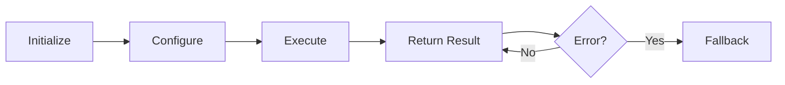

# LangChain: Components

## 1. What This Feature Is

`vectordb.langchain.components` is the codebase's **reusable advanced-RAG component layer**. It exports three concrete classes that can be composed into larger LangChain chains:

| Component | Purpose | Use Case |
|-----------|---------|----------|
| **AgenticRouter** | LLM-based tool routing + self-reflection | Multi-tool RAG, answer refinement |
| **ContextCompressor** | LLM-based context compression | Token budget control |
| **QueryEnhancer** | Query expansion (multi-query, HyDE, step-back) | Recall improvement |

These are **LangChain-native primitives** designed for composition into LangChain chains and RetrievalQA pipelines.

## 2. Why It Exists in Retrieval/RAG

RAG systems usually fail in **repeatable ways**:

| Failure Mode | Component Solution |
|--------------|-------------------|
| **Query too narrow** | `QueryEnhancer` expands intent |
| **Retrieved context noisy** | `ContextCompressor` shrinks context |
| **Answers not refined** | `AgenticRouter` self-reflection loop |

This module exists to handle those **quality gaps explicitly** with reusable components.

## 3. Component Lifecycle

Components follow a consistent lifecycle:



### Initialization

All components require **API key configuration**:

```python
from vectordb.langchain.components import AgenticRouter, QueryEnhancer, ContextCompressor

# All require GROQ_API_KEY env var or explicit api_key
router = AgenticRouter()  # Requires GROQ_API_KEY
enhancer = QueryEnhancer()  # Requires GROQ_API_KEY
compressor = ContextCompressor()  # Requires GROQ_API_KEY
```

### Execution Pattern

| Component | Input | Output |
|-----------|-------|--------|
| **AgenticRouter** | query, answer, context | tool selection, refined answer |
| **QueryEnhancer** | query, enhancement_type | enhanced queries |
| **ContextCompressor** | context, query, compression_type | compressed context |

## 4. AgenticRouter Component

### Purpose

LLM-based tool routing plus self-reflection loop for answer improvement.

### Constructor

```python
from vectordb.langchain.components import AgenticRouter

router = AgenticRouter(
    api_key="groq-key",  # Or GROQ_API_KEY env var
    api_base_url="https://api.groq.com/openai/v1",
    model="llama-3.3-70b-versatile",
    temperature=0,  # Deterministic routing
    max_tokens=1024,
)
```

### Key Methods

| Method | Purpose | Returns |
|--------|---------|---------|
| **route(query)** | Choose tool: `search | reflect | generate | calculate` | Tool name |
| **evaluate_answer_quality(query, answer, context)** | LLM judges relevance/completeness/grounding | Eval dict with scores |
| **should_refine_answer(eval_result, threshold)** | Check if avg score < threshold | Boolean |
| **self_reflect_loop(query, answer, context, max_iterations, quality_threshold)** | Evaluate → refine loop | Refined answer |

### Behavior

- **Tool validation**: Validates output against fixed list, falls back to `search`
- **Evaluation JSON**: Expects `{relevance, completeness, grounding, issues, suggestions}`
- **Fallback on error**: Zero-score payload on parse/runtime error
- **Refinement loop**: Early exit when threshold met

## 5. QueryEnhancer Component

### Purpose

Query expansion using multi-query, HyDE-style hypothetical text generation, and step-back abstraction.

### Constructor

```python
from vectordb.langchain.components import QueryEnhancer

enhancer = QueryEnhancer(
    api_key="groq-key",
    model="llama-3.3-70b-versatile",
    temperature=0.7,  # Creative for query diversity
    max_tokens=1024,
)
```

### Enhancement Types

| Type | Method | Description |
|------|--------|-------------|
| **multi_query** | `generate_multi_queries(query, num_queries)` | Generate query variations |
| **hyde** | `generate_hypothetical_documents(query, num_docs)` | Generate hypothetical answers |
| **step_back** | `generate_step_back_query(query)` | Generate broader question |
| **generate_queries** | `generate_queries(query, enhancement_type, ...)` | Dispatch by type |

### Behavior

- **Enforces constraints**: `num_queries >= 1`, `num_docs >= 1`
- **Always includes original**: First item always original query
- **Fallback on error**: Returns `[query]` on LLM failure

## 6. ContextCompressor Component

### Purpose

LLM-based context compression for token budget control.

### Constructor

```python
from vectordb.langchain.components import ContextCompressor

compressor = ContextCompressor(
    api_key="groq-key",
    model="llama-3.3-70b-versatile",
    temperature=0,  # Deterministic compression
    max_tokens=2048,
)
```

### Compression Types

| Type | Method | Description |
|------|--------|-------------|
| **abstractive** | `compress_abstractive(context, query, max_tokens)` | LLM summary |
| **extractive** | `compress_extractive(context, query, num_sentences)` | Select top sentences |
| **relevance_filter** | `filter_by_relevance(context, query, threshold)` | Filter by threshold |
| **compress** | `compress(context, query, compression_type, ...)` | Dispatch by type |

### Behavior

- **Logs compression ratio**: For abstractive compression
- **Returns original on error**: Fallback to full context
- **Validates config**: `validate_config(config)` lowercases type for validation

## 7. When to Use Components

### AgenticRouter

Use when:

- Multi-tool RAG workflows needed
- Answer refinement via self-reflection valuable
- Query-type-sensitive behavior required

### QueryEnhancer

Use when:

- Recall weak due to query phrasing
- Underspecified queries common
- Multi-query expansion beneficial

### ContextCompressor

Use when:

- Context too long/noisy for LLM
- Token budget constraints
- Query-aware trimming needed

## 8. When Not to Use Components

### Avoid When

| Component | Avoid When |
|-----------|------------|
| **AgenticRouter** | Strict fail-fast behavior needed |
| **QueryEnhancer** | No ChatGroq or OpenAI-compatible endpoint |
| **ContextCompressor** | Indexing/storage logic needed |

## 9. Configuration Semantics

### Key Runtime Knobs

| Component | Knob | Default | Impact |
|-----------|------|---------|--------|
| **AgenticRouter** | `temperature` | 0 | Deterministic routing |
| **AgenticRouter** | `max_tokens` | 1024 | Output length |
| **QueryEnhancer** | `temperature` | 0.7 | Query diversity |
| **QueryEnhancer** | `num_queries` | N/A | Expansion count |
| **ContextCompressor** | `temperature` | 0 | Deterministic compression |
| **ContextCompressor** | `max_tokens` | 2048 | Output length |

### API Key Configuration

All LLM-based components require API key:

```python
# Option 1: Environment variable
# export GROQ_API_KEY="your-key"

router = AgenticRouter()  # Reads GROQ_API_KEY

# Option 2: Explicit parameter
router = AgenticRouter(api_key="your-key")
```

### OpenAI-Compatible Endpoints

All components support any OpenAI-compatible endpoint:

```python
router = AgenticRouter(
    api_base_url="https://api.groq.com/openai/v1",  # Default
    # Or any OpenAI-compatible endpoint
    api_base_url="https://custom-endpoint.com/v1",
)
```

## 10. Failure Modes and Edge Cases

### AgenticRouter

| Failure | Behavior | Mitigation |
|---------|----------|------------|
| **Missing API key** | Raises `ValueError` at init | Set GROQ_API_KEY |
| **Invalid tool output** | Falls back to `search` | Accept fallback |
| **Invalid JSON from eval** | Zero-score fallback | Check LLM output |
| **Missing eval keys** | Treated as 0, forces refinement | Provide complete eval |
| **max_iterations=0** | Returns original answer | Set >0 for refinement |

### QueryEnhancer

| Failure | Behavior | Mitigation |
|---------|----------|------------|
| **Missing API key** | Raises `ValueError` at init | Set GROQ_API_KEY |
| **Invalid num_queries/num_docs** | Raises `ValueError` | Use >= 1 |
| **LLM failure** | Returns original query | Accept fallback |
| **Invalid enhancement_type** | Raises `ValueError` | Use valid type |

### ContextCompressor

| Failure | Behavior | Mitigation |
|---------|----------|------------|
| **Missing API key** | Raises `ValueError` at init | Set GROQ_API_KEY |
| **Invalid compression_type** | Raises `ValueError` | Use valid type |
| **LLM failure** | Returns original context | Accept fallback |
| **Empty context** | Handled gracefully | Not an error |

## 11. Practical Usage Examples

### Example 1: Complete Component Pipeline

```python
from vectordb.langchain.components import (
    AgenticRouter,
    QueryEnhancer,
    ContextCompressor,
)
from langchain_core.documents import Document

# Initialize components
router = AgenticRouter()
enhancer = QueryEnhancer()
compressor = ContextCompressor()

# Enhance query
queries = enhancer.generate_queries(
    query="What are retrieval failure modes?",
    enhancement_type="multi_query",
    num_queries=3,
)

# Example retriever outputs (from external retrievers)
docs = [
    Document(page_content="Dense A", metadata={"score": 0.82}),
    Document(page_content="Dense B", metadata={"score": 0.67}),
]

# Compress context
context = "\n\n".join(doc.page_content for doc in docs)
compressed = compressor.compress(
    context=context,
    query=queries[0],
    compression_type="extractive",
    num_sentences=5,
)

# Generate answer (external generator)
answer = "Draft answer from your generator"

# Self-reflection
final_answer = router.self_reflect_loop(
    query=queries[0],
    answer=answer,
    context=compressed,
    max_iterations=2,
    quality_threshold=75,
)
```

### Example 2: Query Enhancement Types

```python
from vectordb.langchain.components import QueryEnhancer

enhancer = QueryEnhancer()

# Multi-query
queries = enhancer.generate_queries(
    query="What causes climate change?",
    enhancement_type="multi_query",
    num_queries=5,
)

# HyDE
hypothetical_docs = enhancer.generate_queries(
    query="What is quantum computing?",
    enhancement_type="hyde",
    num_docs=3,
)

# Step-back
step_back_queries = enhancer.generate_queries(
    query="How does transformer attention work?",
    enhancement_type="step_back",
)
```

### Example 3: Context Compression Types

```python
from vectordb.langchain.components import ContextCompressor

compressor = ContextCompressor()

# Abstractive
compressed = compressor.compress(
    context=long_context,
    query="Summarize the key points",
    compression_type="abstractive",
    max_tokens=500,
)

# Extractive
compressed = compressor.compress(
    context=long_context,
    query="Find relevant sentences",
    compression_type="extractive",
    num_sentences=5,
)

# Relevance filtering
compressed = compressor.compress(
    context=long_context,
    query="Filter by relevance",
    compression_type="relevance_filter",
    relevance_threshold=0.7,
)
```

### Example 4: Agentic Routing

```python
from vectordb.langchain.components import AgenticRouter

router = AgenticRouter()

# Route query to appropriate tool
tool = router.route("What is the capital of France?")
# Returns: "search"

tool = router.route("Calculate 2 + 2")
# Returns: "calculate"

tool = router.route("Reflect on this answer: ...")
# Returns: "reflect"
```

## 12. Source Walkthrough Map

### Public Export Surface

| File | Purpose |
|------|---------|
| `src/vectordb/langchain/components/__init__.py` | `__all__` exports |

### Component Implementations

| File | Component |
|------|-----------|
| `agentic_router.py` | Tool routing, quality evaluation, refinement loop |
| `query_enhancer.py` | Multi-query/HyDE/step-back transformations |
| `context_compressor.py` | Abstractive/extractive/relevance compression |

### Test Files

| File | Coverage |
|------|----------|
| `tests/langchain/components/test_agentic_router.py` | Router tests |
| `tests/langchain/components/test_query_enhancer.py` | Enhancer tests |
| `tests/langchain/components/test_context_compressor.py` | Compressor tests |

### Module Reference

| File | Purpose |
|------|---------|
| `README.md` | High-level summary (runtime authority is in Python modules/tests) |

---

**Related Documentation**:

- **Agentic RAG** (`docs/langchain/agentic-rag.md`): Full agentic pipeline
- **Query Enhancement** (`docs/langchain/query-enhancement.md`): Query transformation
- **Contextual Compression** (`docs/langchain/contextual-compression.md`): Context trimming
