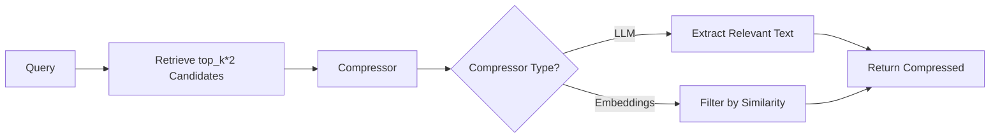
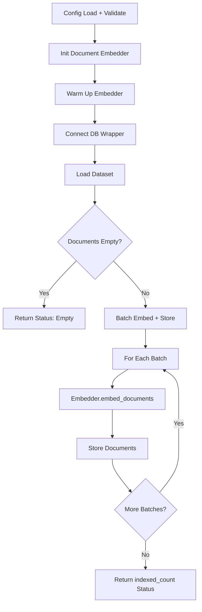
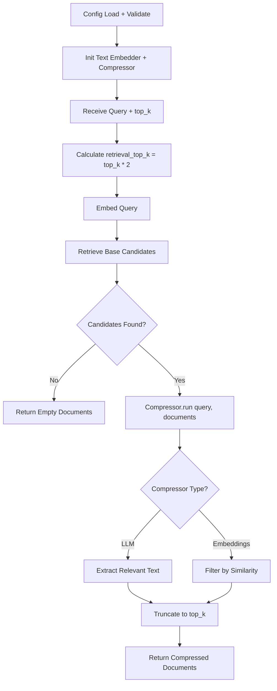

# LangChain: Contextual Compression

## 1. What This Feature Is

Contextual compression is a **two-stage retrieval pattern** that:

1. **Retrieves** a broad candidate set from a vector database
2. **Compresses** that set to the most query-relevant context before passing to LLM

The compression stage is pluggable and uses LangChain's `ContextualCompressionRetriever`:

| Compressor Type | Description | Use Case |
|-----------------|-------------|----------|
| **LLM Chain Extractor** | Uses LLM to extract relevant sentences | Precise extraction |
| **Embeddings Filter** | Filters by embedding similarity | Fast filtering |
| **Embeddings Redundant Filter** | Removes redundant documents | Diversity |

This module implements **five backend-specific pipeline pairs** using LangChain components:

| Backend | Indexing Pipeline | Search Pipeline |
|---------|-------------------|-----------------|
| **Chroma** | `ChromaContextualCompressionIndexingPipeline` | `ChromaContextualCompressionSearchPipeline` |
| **Milvus** | `MilvusContextualCompressionIndexingPipeline` | `MilvusContextualCompressionSearchPipeline` |
| **Pinecone** | `PineconeContextualCompressionIndexingPipeline` | `PineconeContextualCompressionSearchPipeline` |
| **Qdrant** | `QdrantContextualCompressionIndexingPipeline` | `QdrantContextualCompressionSearchPipeline` |
| **Weaviate** | `WeaviateContextualCompressionIndexingPipeline` | `WeaviateContextualCompressionSearchPipeline` |

All are exported from `vectordb.langchain.contextual_compression`.

## 2. Why It Exists in Retrieval/RAG

**Problem**: Dense retrieval is **recall-oriented** — it brings back partially relevant or noisy chunks. In RAG:

- Noise becomes **prompt budget waste**
- Irrelevant context can **reduce answer grounding quality**
- Long contexts **increase LLM costs**

**Solution**: Intentionally **over-retrieve first**, then **narrow down**:



### Compression Benefits

| Benefit | Impact |
|---------|--------|
| **Better precision** | Remove irrelevant candidates |
| **Lower token costs** | Compress context before LLM |
| **Improved grounding** | Focus on most relevant evidence |
| **Flexible tradeoffs** | Tune recall/precision balance |

## 3. Indexing Pipeline: Step-by-Step



### Indexing Flow

1. **Load config**: `ConfigLoader.load(config_path)` with env resolution
2. **Initialize embedders**: `EmbedderHelper.create_embedder()` creates embeddings
   - Model aliases normalized: `qwen3` → `Qwen/Qwen3-Embedding-0.6B`, `minilm` → MiniLM
   - Embedder warmed up immediately
3. **Load dataset**: `_load_dataset()` reads `dataset.type/name/split/limit`
   - Uses `DataloaderCatalog.create(...)` → `loader.load().to_langchain()`
   - Missing `dataset.type` raises `ValueError`
4. **Batch processing**: `run(batch_size=32)` loops through documents
   - Calls `embedder.embed_documents(documents=batch)` per batch
   - Forwards embedded docs to `_store_documents()`
5. **Backend storage**: Backend-specific `_store_documents()` behavior
6. **Return**: `{"indexed_count": n, "status": "success", "batch_size": batch_size}`

### Backend-Specific Storage

| Backend | Storage Method | Special Handling |
|---------|----------------|------------------|
| **Chroma** | `collection.add(ids, embeddings, documents, metadatas)` | Cosine space metadata |
| **Pinecone** | `index.upsert(vectors=[{"id","values","metadata"}])` | Truncates content to 50K chars |
| **Qdrant** | `client.upsert(points=[PointStruct(...)])` | UUID IDs and payload fields |
| **Milvus** | Inserts `content`, `embedding`, `metadata` JSON string | Schema-backed collection |
| **Weaviate** | Batch adds objects with external vectors | `metadata_json` property |

## 4. Search Pipeline: Step-by-Step



### Search Flow

1. **Initialize pipeline**: Load config, logger, text embedder, connect backend
2. **Verify collection/index**: Ensure exists before search
3. **Initialize compressor**: `ContextualCompressionRetriever` with base retriever
4. **Calculate retrieval depth**: `retrieval_top_k = config.retrieval.top_k or top_k * 2`
5. **Retrieve base candidates**: `base_retriever.get_relevant_documents(query)`
6. **Early return**: If no docs retrieved, return `{"documents": []}`
7. **Compress**: `compressor.compress_documents(query=query, documents=base_docs)`
8. **Truncate**: Read `compressed["documents"]`, truncate to requested `top_k`
9. **Return**: `{"documents": final_docs}`
10. **Error handling**: Any exception during run is logged and converted to `{"documents": []}`

### Compressor Types

**LLM Chain Extractor**:

```python
from langchain.retrievers.document_compression import LLMChainExtractor

extractor = LLMChainExtractor.from_llm(
    llm=chat_model,
    prompt=prompt_template,
)
compressed = extractor.compress_documents(documents=retrieved_docs, query=query)
```

**Embeddings Filter**:

```python
from langchain.retrievers.document_compression import EmbeddingsFilter

filter = EmbeddingsFilter(
    embeddings=embeddings,
    similarity_threshold=0.7,
)
compressed = filter.compress_documents(documents=retrieved_docs, query=query)
```

## 5. When to Use It

Use contextual compression when:

- **Retrieval is broad**: Need to fetch many candidates to avoid missed evidence
- **Chunks are long/noisy**: Retrieved text inflates generation token costs
- **Multiple compressors needed**: Support LLM + embeddings behind one interface
- **Cross-backend consistency**: Same compression abstraction across all vector DBs

### Ideal Use Cases

| Use Case | Recommended Compressor |
|----------|------------------------|
| **High recall retrieval** | LLM extractor (precision boost) |
| **Long documents** | LLM extraction (trim to relevant) |
| **Token budget limits** | Embeddings filter (fast compression) |
| **Noisy retrieval** | Embeddings redundant filter (remove duplicates) |

## 6. When Not to Use It

Avoid contextual compression when:

- **Retrieval already high-precision**: Short chunks, low noise
- **Strict latency targets**: LLM compressor adds 500-2000ms
- **Base retrieval unstable**: Compression can't recover missed evidence
- **No compressor credentials**: Missing API keys for LLM compressor

### Latency Breakdown

| Stage | LLM Compressor | Embeddings Filter |
|-------|----------------|-------------------|
| **Query embedding** | 10-50ms | 10-50ms |
| **Base retrieval** | 50-200ms | 50-200ms |
| **Compression** | 500-2000ms | 50-200ms |
| **Total** | ~560-2250ms | ~110-450ms |
| **Without compression** | ~60-250ms | ~60-250ms |

## 7. What This Codebase Provides

### Public API

```python
from vectordb.langchain.contextual_compression import (
    # Base pipeline
    "BaseContextualCompressionPipeline",

    # Backend search adapters
    "QdrantCompressionSearch",
    "WeaviateCompressionSearch",
    "MilvusCompressionSearch",
    "PineconeCompressionSearch",
    "ChromaCompressionSearch",

    # Utilities
    "TokenCounter",
)
```

### Compressor Factory

```python
from langchain.retrievers.document_compression import (
    LLMChainExtractor,
    EmbeddingsFilter,
    EmbeddingsRedundantFilter,
)

# LLM extractor
compressor = LLMChainExtractor.from_llm(
    llm=chat_model,
)

# Embeddings filter
compressor = EmbeddingsFilter(
    embeddings=embeddings,
    similarity_threshold=0.7,
)

# Combined compressor
from langchain.retrievers.document_compression import DocumentCompressorPipeline

pipeline = DocumentCompressorPipeline(
    transformers=[
        EmbeddingsRedundantFilter(embeddings=embeddings),
        EmbeddingsFilter(embeddings=embeddings, similarity_threshold=0.7),
    ]
)
```

### Utility Helpers

```python
from vectordb.langchain.contextual_compression import (
    TokenCounter,  # Estimate tokens with chars/token heuristic
)

# Estimate tokens
tokens = TokenCounter.estimate_tokens("short text")
```

## 8. Backend-Specific Behavior Differences

### Common Contract

All backends share the same pipeline contract:

1. Retrieve base candidates via backend-native search
2. Apply compressor in Python (backend-agnostic)
3. Return compressed results

### Backend Retrieval Differences

| Backend | Retrieval Method | Score Handling |
|---------|------------------|----------------|
| **Chroma** | `collection.query(..., include=["documents","metadatas","distances"])` | `score = 1 - distance` |
| **Pinecone** | `index.query(..., include_metadata=True)` | Direct `score` as relevance |
| **Qdrant** | `client.search(..., query_filter=...)` | Direct `score` from points |
| **Milvus** | `client.search(..., metric_type="IP")` | Exposed as `distance` |
| **Weaviate** | `collection.query.near_vector(..., return_metadata=...)` | `score = 1 - distance` |

### Storage Differences

| Backend | Content Handling | Metadata Format |
|---------|------------------|-----------------|
| **Chroma** | Full content | Flat dict |
| **Pinecone** | Truncated to 50K chars | Flattened underscore notation |
| **Qdrant** | Full content in payload | JSON-serialized metadata |
| **Milvus** | Full content | JSON string field |
| **Weaviate** | Full content | `metadata_json` property |

## 9. Configuration Semantics

### Common Configuration Keys

```yaml
# Embeddings (for retrieval)
embeddings:
  model: "sentence-transformers/all-MiniLM-L6-v2"
  dimension: 384

# Retrieval configuration
retrieval:
  top_k: 20  # Pre-compression candidate count (default: top_k * 2)

# Compression configuration
compression:
  type: "llm"  # or "embeddings"

  # For LLM compression
  llm:
    model: "llama-3.3-70b-versatile"
    api_key: "${GROQ_API_KEY}"
    api_base_url: "https://api.groq.com/openai/v1"

  # For embeddings compression
  embeddings:
    similarity_threshold: 0.7
    k: 10  # Top-k similar documents

# Backend section (one of)
chroma:
  collection_name: "compression-demo"
  persist_dir: "./chroma"

pinecone:
  api_key: "${PINECONE_API_KEY}"
  index_name: "compression-index"

qdrant:
  url: "http://localhost:6333"
  collection_name: "compression-demo"
```

### Resolution Order for Compressor

```python
# 1. Check compression.type
config["compression"]["type"]  # "llm" or "embeddings"

# 2. Check nested config
if type == "llm":
    compressor_config = config["compression"]["llm"]
elif type == "embeddings":
    compressor_config = config["compression"]["embeddings"]
```

### Real Config Examples

| Config File | Backend | Compressor |
|-------------|---------|------------|
| `configs/chroma/arc/llm.yaml` | Chroma | LLM Extraction |
| `configs/qdrant/triviaqa/embeddings.yaml` | Qdrant | Embeddings Filter |
| `configs/milvus/factscore/llm.yaml` | Milvus | LLM Extraction |
| `configs/pinecone/popqa/embeddings.yaml` | Pinecone | Embeddings Filter |
| `configs/weaviate/earnings_calls/llm.yaml` | Weaviate | LLM Extraction |

## 10. Failure Modes and Edge Cases

### Configuration Failures

| Failure | Cause | Mitigation |
|---------|-------|------------|
| **Missing dataset.type** | Indexing config incomplete | Raises `ValueError` |
| **Missing Pinecone credentials** | No `api_key` or `index_name` | Init error |
| **Invalid compressor type** | Unknown `compression.type` | Falls back to default |

### Runtime Edge Cases

| Case | Behavior | Mitigation |
|------|----------|------------|
| **Empty retrieval** | Returns `{"documents": []}` | Not an error |
| **Compressor exception** | Caught, returns `{"documents": []}` | Check logs |
| **Metadata decode failure** | Falls back to empty metadata | JSON parse → fallback |

### Backend-Specific Issues

| Backend | Issue | Mitigation |
|---------|-------|------------|
| **Pinecone** | Content truncation to 50K chars | May lose long document context |
| **Milvus** | Score exposed as `distance` | No normalized `score` set |
| **Qdrant** | Metadata as JSON or dict string | Parser tries both formats |
| **Chroma** | Distance → similarity conversion | Applied automatically |
| **Weaviate** | Collection must exist | Verify before search |

### Compressor-Specific Failures

| Compressor | Failure Mode | Mitigation |
|------------|--------------|------------|
| **LLM** | Model load failure (OOM) | Use smaller model |
| **LLM** | API timeout/rate limit | Retry with backoff |
| **Embeddings** | Invalid threshold | Validate 0-1 range |

## 11. Practical Usage Examples

### Example 1: LLM Compression Search with Chroma

```python
from vectordb.langchain.contextual_compression import ChromaCompressionSearch

pipeline = ChromaCompressionSearch(
    "src/vectordb/langchain/contextual_compression/configs/chroma_arc_llm.yaml"
)
result = pipeline.run(
    query="What is the capital of France?",
    top_k=5,
)
print(f"Compressed to {len(result['documents'])} documents")
```

### Example 2: Embeddings Compression Search with Qdrant

```python
from vectordb.langchain.contextual_compression import QdrantCompressionSearch

pipeline = QdrantCompressionSearch(
    "src/vectordb/langchain/contextual_compression/configs/qdrant_triviaqa_embeddings.yaml"
)
result = pipeline.run(
    query="Who discovered penicillin?",
    top_k=3,
)
# Embeddings filter extracts only relevant portions
```

### Example 3: Indexing Before Search

```python
from vectordb.langchain.contextual_compression.indexing.milvus_indexing import (
    MilvusIndexingPipeline,
)

indexer = MilvusIndexingPipeline(
    "src/vectordb/langchain/contextual_compression/configs/milvus_triviaqa.yaml"
)
stats = indexer.run(batch_size=32)
print(f"Indexed {stats['indexed_count']} documents")
```

### Example 4: Token Counting Utility

```python
from vectordb.langchain.contextual_compression import TokenCounter

# Estimate tokens for document
text = "This is a sample document for token counting."
tokens = TokenCounter.estimate_tokens(text)
print(f"Estimated {tokens} tokens")  # Uses chars/token heuristic
```

### Example 5: Custom Compressor Configuration

```yaml
# config.yaml
compression:
  type: "llm"
  llm:
    model: "llama-3.3-70b-versatile"
    api_key: "${GROQ_API_KEY}"
    temperature: 0  # Deterministic extraction

retrieval:
  top_k: 30  # Retrieve 30, compress to 10
```

```python
from vectordb.langchain.contextual_compression import PineconeCompressionSearch

pipeline = PineconeCompressionSearch("config.yaml")
result = pipeline.run(query="machine learning basics", top_k=10)
```

## 12. Source Walkthrough Map

### Core Orchestration and Utilities

| File | Purpose |
|------|---------|
| `base.py` | `BaseContextualCompressionPipeline` |
| `__init__.py` | Public API exports |

### Search Adapters

| File | Backend |
|------|---------|
| `search/chroma_search.py` | Chroma |
| `search/pinecone_search.py` | Pinecone |
| `search/qdrant_search.py` | Qdrant |
| `search/milvus_search.py` | Milvus |
| `search/weaviate_search.py` | Weaviate |

### Indexing Adapters

| File | Backend |
|------|---------|
| `indexing/chroma_indexing.py` | Chroma |
| `indexing/pinecone_indexing.py` | Pinecone |
| `indexing/qdrant_indexing.py` | Qdrant |
| `indexing/milvus_indexing.py` | Milvus |
| `indexing/weaviate_indexing.py` | Weaviate |

### Configuration Examples

| Directory | Compressor Type |
|-----------|-----------------|
| `configs/chroma/arc/` | LLM, Embeddings |
| `configs/qdrant/triviaqa/` | LLM, Embeddings |
| `configs/milvus/factscore/` | LLM, Embeddings |
| `configs/pinecone/popqa/` | LLM, Embeddings |
| `configs/weaviate/earnings_calls/` | LLM, Embeddings |

### LangChain Native Compressors

| Compressor | LangChain Class |
|------------|-----------------|
| **LLM Extractor** | `LLMChainExtractor` |
| **Embeddings Filter** | `EmbeddingsFilter` |
| **Redundant Filter** | `EmbeddingsRedundantFilter` |
| **Pipeline** | `DocumentCompressorPipeline` |

---

**Related Documentation**:

- **Reranking** (`docs/langchain/reranking.md`): Standalone reranking pipeline
- **Query Enhancement** (`docs/langchain/query-enhancement.md`): Query-side transformation
- **Contextual Compression Indexing** (`docs/langchain/contextual-compression-indexing.md`): Compression at index time
