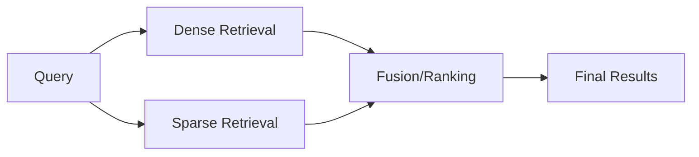
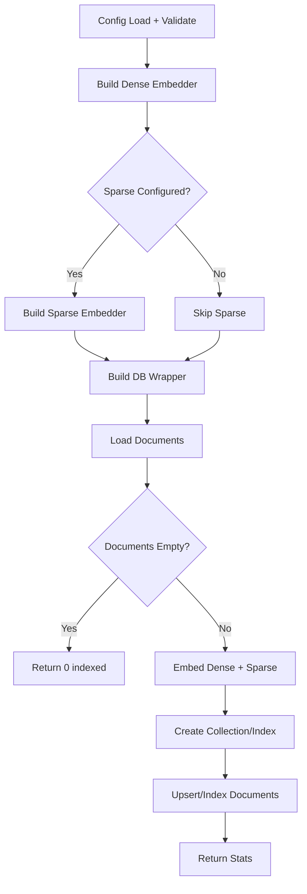
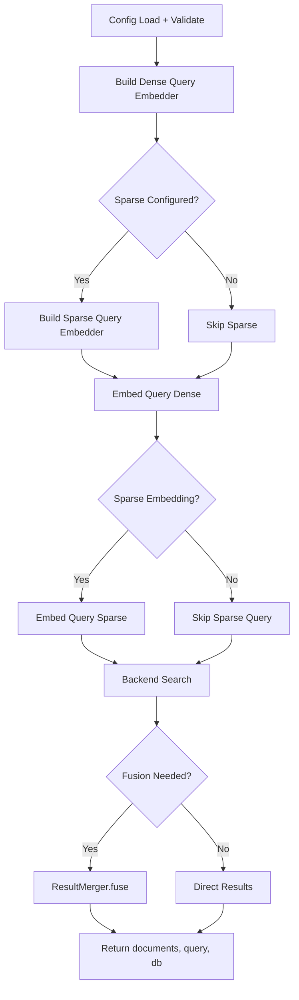

# LangChain: Hybrid Indexing

## 1. What This Feature Is

Hybrid indexing stores and queries **two retrieval signals** for the same corpus:

| Signal | Purpose | Strength |
|--------|---------|----------|
| **Dense vectors** | Semantic similarity | Paraphrase, intent matching |
| **Sparse vectors** | Lexical/keyword matching | Exact terms, IDs, acronyms |

This module implements **five backend-specific pipeline pairs** using LangChain components:

| Backend | Indexing Pipeline | Search Pipeline |
|---------|-------------------|-----------------|
| **Chroma** | `ChromaHybridIndexingPipeline` | `ChromaHybridSearchPipeline` |
| **Milvus** | `MilvusHybridIndexingPipeline` | `MilvusHybridSearchPipeline` |
| **Pinecone** | `PineconeHybridIndexingPipeline` | `PineconeHybridSearchPipeline` |
| **Qdrant** | `QdrantHybridIndexingPipeline` | `QdrantHybridSearchPipeline` |
| **Weaviate** | `WeaviateHybridIndexingPipeline` | `WeaviateHybridSearchPipeline` |

All are exported from `vectordb.langchain.hybrid_indexing`.

## 2. Why It Exists in Retrieval/RAG

**Dense-only retrieval** is strong on paraphrase and intent, but weak on:

- Exact lexical constraints (acronyms, IDs, product strings)
- Keyword-heavy queries ("H2O2 decomposition")
- Named entities with specific spelling

**Lexical retrieval** has the opposite profile:

- Strong on exact term matching
- Weak on semantic similarity and paraphrase

**Hybrid retrieval** combines both signals to reduce blind spots:



### Implementation Patterns

| Pattern | Backends | Description |
|---------|----------|-------------|
| **Backend-native hybrid APIs** | Milvus, Pinecone, Qdrant, Weaviate | Single call combines both signals |
| **Manual dual-search + fusion** | Chroma | Separate dense+sparse searches, then merge |

This aligns with official ecosystem concepts:

- **LangChain**: Supports dense and sparse embedders as separate components
- **Pinecone/Qdrant/Milvus**: Expose hybrid-style dense+sparse query capability
- **Weaviate**: Hybrid search combines vector + BM25 with `alpha` balance

## 3. Indexing Pipeline: Step-by-Step



### Common Indexing Sequence

All indexing pipelines follow this conceptual flow:

1. **Load and validate config**: `ConfigLoader.load(...)` + `ConfigLoader.validate(config, "<db>")`
2. **Build dense embedder**: `EmbedderHelper.create_embedder(config)`
3. **Build sparse embedder** (optional): Only if top-level `"sparse"` exists in config
4. **Build DB wrapper**: Backend connection parameters
5. **Load documents**: `DataloaderCatalog.create(type, split, limit)` → `loader.load().to_langchain()`
6. **Early return**: If empty, return `{ "documents_indexed": 0, "db": ... }`
7. **Embed documents**: Dense first, then sparse (if configured)
8. **Create collection/index**: Backend-specific arguments
9. **Upsert/index**: Batched for all except Pinecone (batch settings in one call)
10. **Return stats**: Backend identifier + collection/index name

### Backend-Specific Indexing Calls

| Backend | Collection Creation | Write Method | Special Handling |
|---------|---------------------|--------------|------------------|
| **Chroma** | `create_collection(..., use_sparse=bool(sparse_embedder))` | Batched `upsert(...)` | Sparse flag at creation |
| **Milvus** | `create_collection(..., use_sparse=..., recreate=...)` | Batched `upsert(...)` | Recreate option |
| **Qdrant** | `create_collection(dimension, use_sparse, recreate)` | Batched `index_documents(...)` | Uses `index_documents` |
| **Weaviate** | `create_collection(collection_name, dimension)` | Batched `upsert(...)` | Dimension required |
| **Pinecone** | `describe_index(...)` (warning-only if missing) | `upsert(..., namespace, batch_size, show_progress)` | Best-effort index check |

## 4. Search Pipeline: Step-by-Step



### Common Search Pattern

All search pipelines return the same envelope:

```python
{
    "documents": [...],
    "query": "...",
    "db": "chroma"|"milvus"|"pinecone"|"qdrant"|"weaviate"
}
```

**Shared search flow**:

1. **Load/validate config** for backend
2. **Build dense query embedder**: `EmbedderHelper.create_embedder(config)`
3. **Build sparse query embedder** (optional): Only if top-level `"sparse"` exists
4. **Embed query**: `embedder.embed_query(query)`
5. **Call backend search**: Backend-specific method
6. **Return structured dict**: `documents` / `query` / `db`

### Backend-Specific Search Behavior

| Backend | Search Method | Fusion Strategy | Notes |
|---------|---------------|-----------------|-------|
| **Chroma** | Dense search (`top_k*2`) + Sparse search (`top_k*2`) → `ResultMerger.fuse()` | `rrf` (default) or `linear` | Manual fusion; dense-only fallback |
| **Milvus** | `db.search(query_embedding=..., query_sparse_embedding=..., ranker_type=...)` | `rrf` (default) or `weighted` | Native hybrid call |
| **Qdrant** | `db.search(..., query_vector, query_sparse_vector, search_type="hybrid")` | RRF (built-in) | Native hybrid mode |
| **Pinecone** | `db.hybrid_search(..., alpha=..., namespace=...)` | Alpha weighting | Query-time weight control |
| **Weaviate** | `db.hybrid_search(query=<text>, query_embedding=<dense>, alpha=...)` | Alpha weighting | BM25 side is backend-native; no sparse embedder used |

## 5. When to Use It

Use hybrid indexing when:

- **Mixed query types**: Queries mix natural-language intent and exact lexical constraints
- **Keyword blind spots**: Dense-only retrieval misses obvious keyword hits
- **Single retrieval layer**: Want one layer serving both semantic and keyword-heavy workloads
- **Can afford complexity**: Dual embedding/indexing complexity is acceptable

### Ideal Use Cases

| Use Case | Why Hybrid Helps |
|----------|------------------|
| **Technical documentation** | API names, version numbers need exact matching |
| **Scientific literature** | Chemical formulas, gene names, acronyms |
| **Legal/financial** | Specific terms, section numbers, citations |
| **Product catalogs** | SKUs, model numbers, brand names |

## 6. When Not to Use It

Avoid or defer hybrid indexing when:

- **Dense-only suffices**: Simple corpus/query style already meets quality targets
- **Tight budget**: Infrastructure cost/latency doesn't allow dual embedding
- **No evaluation loop**: Can't tune fusion weights/strategies
- **Config mismatch**: Config sets only `embeddings.sparse_model` but not top-level `sparse` (sparse embedders won't activate)

### Cost Considerations

| Factor | Impact |
|--------|--------|
| **Indexing time** | ~2x (dense + sparse embedding) |
| **Storage** | ~1.5-2x (sparse vectors add overhead) |
| **Query latency** | ~1.5x (dual retrieval + fusion) |
| **Complexity** | Higher (fusion tuning, config management) |

## 7. What This Codebase Provides

### Top-Level Exports

```python
from vectordb.langchain.hybrid_indexing import (
    # Indexing pipelines
    "ChromaHybridIndexingPipeline",
    "MilvusHybridIndexingPipeline",
    "PineconeHybridIndexingPipeline",
    "QdrantHybridIndexingPipeline",
    "WeaviateHybridIndexingPipeline",

    # Search pipelines
    "ChromaHybridSearchPipeline",
    "MilvusHybridSearchPipeline",
    "PineconeHybridSearchPipeline",
    "QdrantHybridSearchPipeline",
    "WeaviateHybridSearchPipeline",
)
```

### Concrete Behavior Guaranteed

| Behavior | Implementation |
|----------|----------------|
| **Config validation** | Fails fast when required sections missing |
| **Empty dataset handling** | Returns early with `{documents_indexed: 0}` |
| **Structured search results** | Always returns `documents/query/db` envelope |
| **Filter pass-through** | Passed to backend where supported |
| **Chroma fusion** | Manual fusion with dense-only fallback |

### Configuration Validation

Required sections per pipeline:

```python
required_sections = ["dataloader", "embeddings", "<backend>"]
# Raises ValueError if any missing
```

## 8. Backend-Specific Behavior Differences

### Chroma

| Aspect | Behavior |
|--------|----------|
| **Hybrid approach** | Manual dual-search + fusion |
| **Search calls** | Dense (`top_k*2`) + Sparse (`top_k*2`) |
| **Fusion** | `ResultMerger.fuse()` with `rrf` or `linear` |
| **Fallback** | Dense-only if sparse unavailable/empty |
| **Fusion strategy** | From `chroma.fusion_strategy` (default `rrf`) |

### Milvus

| Aspect | Behavior |
|--------|----------|
| **Hybrid approach** | Native single `search()` call |
| **Ranker type** | `rrf` (default) or `weighted` |
| **Config key** | `milvus.ranker_type` |
| **Recreate** | Supports `recreate` collection behavior |

### Qdrant

| Aspect | Behavior |
|--------|----------|
| **Hybrid approach** | Native `search_type="hybrid"` |
| **Write method** | `index_documents()` (not `upsert`) |
| **Recreate** | Supports `recreate` and local `path` |

### Pinecone

| Aspect | Behavior |
|--------|----------|
| **Hybrid approach** | Native `hybrid_search()` call |
| **Alpha weighting** | Query-time control via `pinecone.alpha` |
| **Namespace** | Namespace-aware indexing/search |
| **Index check** | `describe_index()` best-effort (logs warning on failure) |

### Weaviate

| Aspect | Behavior |
|--------|----------|
| **Hybrid approach** | Vector + BM25 in backend |
| **Sparse embedder** | Not used in search pipeline |
| **Alpha control** | `weaviate.alpha` controls BM25/vector mixture |
| **Indexing** | Can run sparse embedder if configured, but search doesn't consume sparse embeddings |

## 9. Configuration Semantics

### Core Required Sections

```yaml
# Required for all backends
dataloader:
  type: "triviaqa"
  split: "test"
  limit: 500

embeddings:
  model: "sentence-transformers/all-MiniLM-L6-v2"
  device: "cpu"
  batch_size: 32

# Backend section (one of)
chroma:
  host: "localhost"
  port: 8000
  collection_name: "hybrid-demo"
  dimension: 384
  batch_size: 100
  fusion_strategy: "rrf"  # or "linear"
```

### Sparse Embedding Configuration

**Important**: Sparse mode is enabled **only** when top-level `sparse` exists:

```yaml
# This enables sparse embedders
sparse:
  model: "naver/splade-cocondenser-ensembledistil"
  max_length: 512

# This does NOT enable sparse (only sets attribute)
embeddings:
  model: "sentence-transformers/all-MiniLM-L6-v2"
  sparse_model: "naver/splade-cocondenser-ensembledistil"  # Ignored!
```

### Backend-Specific Knobs

| Backend | Key Knobs | Default |
|---------|-----------|---------|
| **Chroma** | `fusion_strategy` | `"rrf"` |
| **Milvus** | `ranker_type` | `"rrf"` |
| **Pinecone** | `alpha`, `namespace` | `0.5`, `""` |
| **Qdrant** | `recreate`, `path` | `false`, `None` |
| **Weaviate** | `alpha` | `0.5` |

### Practical Config Caveat

Several example YAMLs set `embeddings.sparse_model` but **not** top-level `sparse`:

```yaml
# This does NOT enable sparse embedders in hybrid pipelines
embeddings:
  model: "sentence-transformers/all-MiniLM-L6-v2"
  sparse_model: "naver/splade-cocondenser-ensembledistil"  # Ignored!
```

**Fix**: Add top-level `sparse` section:

```yaml
sparse:
  model: "naver/splade-cocondenser-ensembledistil"
```

## 10. Failure Modes and Edge Cases

### Configuration Failures

| Failure | Cause | Mitigation |
|---------|-------|------------|
| **Missing backend section** | No `chroma`/`milvus`/etc. in config | Raises `ValueError` at init |
| **Sparse model missing** | `sparse` exists but no `sparse.model` | Raises `KeyError` at embedder creation |
| **Sparse silently inactive** | Top-level `sparse` absent | Check config; add `sparse` section |

### Runtime Edge Cases

| Case | Behavior | Mitigation |
|------|----------|------------|
| **Empty dataset** | Returns `{documents_indexed: 0}` | Check warning logs |
| **Chroma sparse unavailable** | Falls back to dense-only `dense_docs[:top_k]` | Verify sparse embedding config |
| **Pinecone describe_index fails** | Logs warning, continues to upsert | Check index exists manually |
| **Filters pass-through** | Backend-dependent expression format | Test per backend |

### Search Behavior Differences

| Backend | top_k Expansion | Notes |
|---------|-----------------|-------|
| **Chroma** | `top_k * 2` for both dense+sparse | Fusion selects final top_k |
| **Milvus** | Requested `top_k` | Native hybrid handles ranking |
| **Qdrant** | Requested `top_k` | Native hybrid mode |
| **Pinecone** | Requested `top_k` | Alpha weighting applied |
| **Weaviate** | Requested `top_k` | BM25+vector in backend |

### Index Creation Issues

| Backend | Issue | Mitigation |
|---------|-------|------------|
| **Pinecone** | `describe_index()` may fail | Index created on first upsert if missing |
| **Milvus/Qdrant** | `recreate=true` drops existing data | Use with caution in production |
| **Weaviate** | Collection must exist before upsert | `create_collection()` called explicitly |

## 11. Practical Usage Examples

### Example 1: Milvus Hybrid Indexing + Search

```python
from vectordb.langchain.hybrid_indexing import (
    MilvusHybridIndexingPipeline,
    MilvusHybridSearchPipeline,
)

# Index documents
indexer = MilvusHybridIndexingPipeline(
    "src/vectordb/langchain/hybrid_indexing/configs/milvus_triviaqa.yaml"
)
index_stats = indexer.run()
print(f"Indexed {index_stats['documents_indexed']} documents")

# Search with hybrid retrieval
searcher = MilvusHybridSearchPipeline(
    "src/vectordb/langchain/hybrid_indexing/configs/milvus_triviaqa.yaml"
)
results = searcher.run(query="Who discovered penicillin?", top_k=10)
print(f"Retrieved {len(results['documents'])} documents")
```

### Example 2: Chroma Search with Manual Fusion

```python
from vectordb.langchain.hybrid_indexing.search.chroma import ChromaHybridSearchPipeline

searcher = ChromaHybridSearchPipeline(
    "src/vectordb/langchain/hybrid_indexing/configs/chroma_triviaqa.yaml"
)
results = searcher.run(query="transformer architecture", top_k=5)

# Results fused via RRF (default fusion_strategy)
for doc in results["documents"]:
    print(f"Score {doc.metadata.get('score')}: {doc.page_content[:100]}")
```

### Example 3: Weaviate Hybrid (BM25 + Vector)

```python
from vectordb.langchain.hybrid_indexing import WeaviateHybridSearchPipeline

searcher = WeaviateHybridSearchPipeline(
    "src/vectordb/langchain/hybrid_indexing/configs/weaviate_triviaqa.yaml"
)

# Alpha controls BM25 vs vector weight
# alpha=0.0 = pure BM25, alpha=1.0 = pure vector
results = searcher.run(query="federal reserve rate hike", top_k=8)
```

### Example 4: Pinecone with Namespace and Alpha

```yaml
# config.yaml
pinecone:
  api_key: "${PINECONE_API_KEY}"
  index_name: "hybrid-index"
  namespace: "tenant-1"
  alpha: 0.7  # 70% vector, 30% sparse

sparse:
  model: "naver/splade-cocondenser-ensembledistil"
```

```python
from vectordb.langchain.hybrid_indexing import PineconeHybridSearchPipeline

searcher = PineconeHybridSearchPipeline("config.yaml")
results = searcher.run(query="machine learning basics", top_k=10)
```

### Example 5: Qdrant with Recreate

```python
from vectordb.langchain.hybrid_indexing import QdrantHybridIndexingPipeline

# Recreate collection (drops existing data)
indexer = QdrantHybridIndexingPipeline(
    "src/vectordb/langchain/hybrid_indexing/configs/qdrant_triviaqa.yaml"
)
index_stats = indexer.run()
```

### Example 6: Tuning Fusion Strategy (Chroma)

```yaml
# config.yaml
chroma:
  collection_name: "hybrid-demo"
  dimension: 384
  fusion_strategy: "linear"  # Alternative to default "rrf"
  linear_weights:
    dense: 0.6
    sparse: 0.4
```

```python
from vectordb.langchain.hybrid_indexing import ChromaHybridSearchPipeline

searcher = ChromaHybridSearchPipeline("config.yaml")
results = searcher.run(query="custom fusion weights", top_k=5)
```

## 12. Source Walkthrough Map

### Primary Module Files

| File | Purpose |
|------|---------|
| `src/vectordb/langchain/hybrid_indexing/__init__.py` | Main module exports |
| `src/vectordb/langchain/hybrid_indexing/README.md` | Feature overview |

### Indexing Implementations

| File | Backend |
|------|---------|
| `indexing/chroma.py` | Chroma |
| `indexing/milvus.py` | Milvus |
| `indexing/pinecone.py` | Pinecone |
| `indexing/qdrant.py` | Qdrant |
| `indexing/weaviate.py` | Weaviate |

### Search Implementations

| File | Backend |
|------|---------|
| `search/chroma.py` | Chroma (manual fusion) |
| `search/milvus.py` | Milvus (native hybrid) |
| `search/pinecone.py` | Pinecone (native hybrid) |
| `search/qdrant.py` | Qdrant (native hybrid) |
| `search/weaviate.py` | Weaviate (BM25+vector) |

### Configuration Examples

| File | Backend + Dataset |
|------|-------------------|
| `configs/chroma_triviaqa.yaml` | Chroma + TriviaQA |
| `configs/milvus_triviaqa.yaml` | Milvus + TriviaQA |
| `configs/pinecone_triviaqa.yaml` | Pinecone + TriviaQA |
| `configs/qdrant_triviaqa.yaml` | Qdrant + TriviaQA |
| `configs/weaviate_triviaqa.yaml` | Weaviate + TriviaQA |

### Shared Utilities

| File | Purpose |
|------|---------|
| `src/vectordb/langchain/utils/embeddings.py` | Embedder factory |
| `src/vectordb/langchain/utils/sparse_embeddings.py` | Sparse embedder |
| `src/vectordb/langchain/utils/fusion.py` | Result fusion (RRF, weighted) |
| `src/vectordb/langchain/utils/config.py` | Config loading |

---

**Related Documentation**:

- **Semantic Search** (`docs/langchain/semantic-search.md`): Dense-only retrieval baseline
- **Sparse Indexing** (`docs/langchain/sparse-indexing.md`): Sparse-only retrieval
- **MMR** (`docs/langchain/mmr.md`): Diversity-aware reranking (alternative to fusion)
- **Core Databases** (`docs/core/databases.md`): Backend wrapper details
