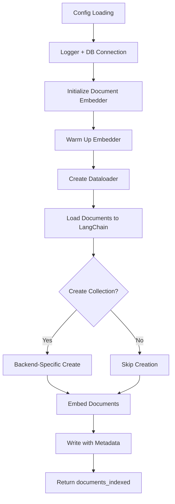
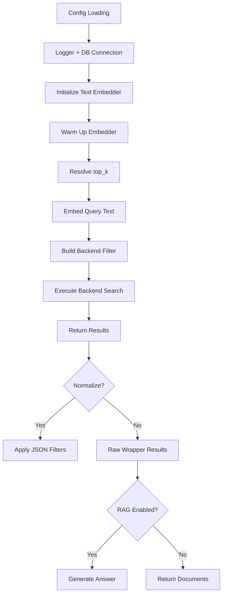

# LangChain: JSON Indexing

## 1. What This Feature Is

JSON indexing provides a backend-portable pattern for storing and retrieving LangChain `Document` objects where:

- **`Document.page_content`**: Embedded for semantic similarity search
- **`Document.metadata`**: Retained for structured metadata filtering from JSON fields

This module implements five explicit backend pairs (not one generic runtime class):

| Backend | Indexer | Searcher |
|---------|---------|----------|
| **Milvus** | `MilvusJsonIndexingPipeline` | `MilvusJsonSearchPipeline` |
| **Qdrant** | `QdrantJsonIndexingPipeline` | `QdrantJsonSearchPipeline` |
| **Pinecone** | `PineconeJsonIndexingPipeline` | `PineconeJsonSearchPipeline` |
| **Weaviate** | `WeaviateJsonIndexingPipeline` | `WeaviateJsonSearchPipeline` |
| **Chroma** | `ChromaJsonIndexingPipeline` | `ChromaJsonSearchPipeline` |

All are exported from `vectordb.langchain.json_indexing`.

## 2. Why It Exists in Retrieval/RAG

RAG retrieval often needs **two constraints simultaneously**:

1. **Semantic relevance**: Vector similarity over document content
2. **Structured eligibility**: Metadata constraints from JSON fields (category, tenant, time, status)

This module codifies that combination so each vector backend can be driven with the same high-level LangChain interface:

- `pipeline.run()` for indexing
- `pipeline.search(query, filters, top_k)` for retrieval

### Design Alignment

This approach aligns with official platform behavior:

- **LangChain**: Uses `HuggingFaceEmbeddings` for both document and query embedding
- **Vector DBs**: Expose backend-specific metadata filtering constructs:
  - Milvus: Boolean expression strings
  - Qdrant: `Filter` objects with `FieldCondition`
  - Weaviate: `Filter` class with property-based API
  - Pinecone/Chroma: MongoDB-style dict syntax

## 3. Indexing Pipeline: Step-by-Step



### Common Indexing Sequence

All indexers follow this high-level sequence:

1. **Load config**: `ConfigLoader.load(config_or_path)` with env var resolution
2. **Build logger**: From config logging settings
3. **Connect DB wrapper**: Backend-specific connection
4. **Initialize embedder**: `EmbedderHelper.create_embedder()`
5. **Create dataloader**: `DataloaderCatalog.create(...)`
6. **Load documents**: `loader.load()` to LangChain format
7. **Log limit**: Optionally log configured limit
8. **Create collection/index**: Backend-specific method
9. **Embed documents**: Via embedder
10. **Write documents**: Backend wrapper method
11. **Return**: `{"documents_indexed": len(documents)}`

### Backend-Specific Indexing

| Backend | Collection Creation | Write Method | Special Handling |
|---------|---------------------|--------------|------------------|
| **Milvus** | `create_collection(collection_name, dimension, use_sparse=False)` | `insert_documents()` | Probes embedding dimension first |
| **Qdrant** | `create_collection(dimension)` | `index_documents()` | Injects `collection.name` into config |
| **Pinecone** | Delegated to wrapper | `upsert_documents(namespace=...)` | No explicit index creation |
| **Weaviate** | `create_collection(collection_name, skip_vectorization=False)` | `upsert_documents()` | Requires `cluster_url` + `api_key` |
| **Chroma** | `create_collection(collection_name=...)` | `upsert_documents()` | Wrapper-config driven |

## 4. Search Pipeline: Step-by-Step



### Common Search Sequence

All searchers follow this sequence:

1. **Load config**: `ConfigLoader.load(config_or_path)`
2. **Build logger**: From config logging settings
3. **Connect DB wrapper**: Backend-specific connection
4. **Initialize embedder**: `EmbedderHelper.create_embedder()`
5. **Resolve top_k**: Explicit arg → `search.top_k` → default `10`
6. **Embed query**: Via embedder
7. **Convert filters**: Generic dict → backend-native filter form
8. **Execute search**: Backend wrapper search method
9. **Apply JSON metadata filters**: `DocumentFilter.filter_by_metadata_json()`
10. **Return**: LangChain documents with optional RAG answer

### Backend-Specific Search

| Backend | Search Method | Filter Builder | Filter Type |
|---------|---------------|----------------|-------------|
| **Milvus** | `vector_db.search(..., filter_expr=...)` | `build_milvus_filter(filters, json_field_name)` | Expression string |
| **Qdrant** | `vector_db.search(..., query_filter=...)` | `build_qdrant_filter(filters)` | `Filter` object |
| **Pinecone** | `vector_db.search(..., filter=...)` | `build_pinecone_filter(filters)` | Dict |
| **Weaviate** | `vector_db.hybrid_search(..., where=...)` | `build_weaviate_filter(filters)` | `Filter` object |
| **Chroma** | `vector_db.search(..., where=...)` | `build_chroma_filter(filters)` | `where` dict |

## 5. When to Use It

Use JSON indexing when **all** of the following are true:

- **You want semantic retrieval over free text (`Document.page_content`)**
- **You need precise metadata filtering from `Document.metadata` (JSON fields)**
- **You need the same indexing/search contract across multiple backends**

### Typical Use Cases

| Use Case | Example |
|----------|---------|
| **API response data** | Endpoint docs with method, path, parameters |
| **Product catalogs** | Product docs with price, category, brand |
| **Configuration files** | Config docs with section, key, value |
| **Event streams** | Event logs with timestamp, type, source |
| **Structured knowledge** | Entity-relation-attribute triples |

## 6. When Not to Use It

Avoid this module when:

- **Pure semantic retrieval**: You only need vector similarity, no filters
- **Complex boolean logic**: Nested OR trees not supported by filter builders
- **Strict cross-backend equivalence**: Operator support differs across backends
- **Volatile metadata schema**: Filter key stability is low
- **Deeply nested JSON**: Without explicit flattening strategy

### Operator Support Gaps

| Operator | Milvus | Qdrant | Weaviate | Pinecone | Chroma |
|----------|--------|--------|----------|----------|--------|
| `$eq` | Yes | Yes | Yes | Yes | Yes |
| `$ne` | Yes | Yes (must_not) | Yes | Yes | Yes |
| `$gt`, `$gte` | Yes | Yes | Yes | Yes | Yes |
| `$lt`, `$lte` | Yes | Yes | Yes | Yes | Yes |
| `$in`, `$nin` | No | No | No | Yes | Yes |
| `$contains` | Yes | No | No | No | No |

**Note**: Spec declares `$in/$nin` as supported, but Milvus/Qdrant/Weaviate translators don't implement them.

## 7. What This Codebase Provides

### Concrete Runtime Classes

```python
from vectordb.langchain.json_indexing import (
    # Indexers
    "ChromaJsonIndexingPipeline",
    "MilvusJsonIndexingPipeline",
    "PineconeJsonIndexingPipeline",
    "QdrantJsonIndexingPipeline",
    "WeaviateJsonIndexingPipeline",

    # Searchers
    "ChromaJsonSearchPipeline",
    "MilvusJsonSearchPipeline",
    "PineconeJsonSearchPipeline",
    "QdrantJsonSearchPipeline",
    "WeaviateJsonSearchPipeline",
)
```

### Shared Utilities

```python
from vectordb.langchain.utils import (
    ConfigLoader,        # Config loading with env resolution
    EmbedderHelper,      # HuggingFaceEmbeddings creation
    DocumentFilter,      # JSON metadata filtering
    RAGHelper,           # LLM creation and generation
)
```

### Filter Builders

```python
from vectordb.langchain.utils.filters import (
    build_milvus_filter,
    build_qdrant_filter,
    build_pinecone_filter,
    build_weaviate_filter,
    build_chroma_filter,
)
```

### Operator Specification

```python
SUPPORTED_OPERATORS = {"$eq", "$ne", "$gt", "$gte", "$lt", "$lte", "$in", "$nin"}

def validate_filter_operator(op: str) -> None:
    """Validate filter operator against supported set."""
```

## 8. Backend-Specific Behavior Differences

### Connection and Collection Bootstrap

| Backend | Connection Fields | Collection Creation | Config Mutation |
|---------|-------------------|---------------------|-----------------|
| **Milvus** | `milvus.uri`, `milvus.token` | Explicit `create_collection()` | None |
| **Qdrant** | `qdrant.url`, `qdrant.api_key` | Explicit `create_collection()` | Injects `collection.name` |
| **Pinecone** | Wrapper-config driven | Delegated to wrapper | None |
| **Weaviate** | `weaviate.cluster_url`, `weaviate.api_key` | Explicit `create_collection()` | None |
| **Chroma** | Wrapper-config driven | Explicit `create_collection()` | None |

### Search Method Differences

| Backend | Method Used | Collection Arg | Filter Arg |
|---------|-------------|----------------|------------|
| **Milvus** | `search()` | `collection_name` | `filter_expr` (string) |
| **Qdrant** | `search()` | `collection_name` | `query_filter` (Filter object) |
| **Pinecone** | `search()` | None (from wrapper) | `filter` (dict) |
| **Weaviate** | `hybrid_search()` | `collection_name` | `where` (Filter object) |
| **Chroma** | `search()` | `collection_name` | `where` (dict) |

### Filter Translation Details

**Milvus**:

- Builds string expressions with JSON path syntax
- Supports `$contains` → `json_contains(metadata["field"], value)`
- Example: `'metadata["category"] == "tech" && metadata["year"] > 2020'`

**Qdrant**:

- Builds typed `Filter(must, must_not)` objects
- `$ne` mapped to `must_not` clause
- Mixed clauses split between `must` and `must_not`

**Weaviate**:

- Builds composable `Filter.by_property(...).<op>(...)` objects
- Combined via `&` operator
- Unsupported operators skipped (may yield weaker filters)

**Pinecone**:

- Passes operator dicts through
- Wraps scalars as `$eq`
- Supports full MongoDB-style syntax

**Chroma**:

- Emits single condition or `{"$and": [...]}` for multiple conditions
- MongoDB-style dict syntax

## 9. Configuration Semantics

### Config Input Formats

```python
# Python dict
config = {
    "embeddings": {"model": "qwen3"},
    "search": {"top_k": 10},
}

# YAML file path
config = "src/vectordb/langchain/json_indexing/configs/chroma/triviaqa.yaml"

# Both work
indexer = ChromaJsonIndexingPipeline(config)
```

### Environment Variable Substitution

| Syntax | Behavior | Example |
|--------|----------|---------|
| `${VAR}` | Env value or empty string | `${PINECONE_API_KEY}` |
| `${VAR:-default}` | Env value if set, else default | `${QDRANT_URL:-http://localhost:6333}` |

Applied recursively to nested dict/list values.

### Keys Consumed by Runtime

```yaml
# Logging
logging:
  name: "json-indexing-pipeline"
  level: "INFO"

# Embeddings
embeddings:
  model: "sentence-transformers/all-MiniLM-L6-v2"  # Or "qwen3", "minilm"
  device: "cpu"
  batch_size: 32

# Search
search:
  top_k: 10

# Collection
collection:
  name: "json_indexed"  # Default fallback

# Dataloader
dataloader:
  type: "triviaqa"
  split: "test"
  limit: 500
  dataset_name: "trivia_qa"

# Backend-specific
milvus:
  uri: "http://localhost:19530"
  token: ""

qdrant:
  url: "http://localhost:6333"
  api_key: null

pinecone:
  api_key: "${PINECONE_API_KEY}"
  index: "my-index"
  namespace: "tenant-1"  # Optional

weaviate:
  cluster_url: "https://xxx.weaviate.cloud"
  api_key: "xxx"

chroma:
  path: "./chroma_data"
  collection_name: "json_docs"

# JSON-specific
search:
  text_field: "description"
  metadata_fields:
    - "category"
    - "status"
    - "region"
```

### Defaults That Affect Behavior

| Setting | Default | Impact |
|---------|---------|--------|
| `embeddings.model` | `sentence-transformers/all-MiniLM-L6-v2` | Embedding quality/size |
| `model aliases` | `qwen3` → `Qwen/Qwen3-Embedding-0.6B` | Shortcut resolution |
| `top_k` | `10` | Search result count |
| `collection.name` | `json_indexed` | Collection identifier |

## 10. Failure Modes and Edge Cases

### Configuration Issues

| Failure | Cause | Mitigation |
|---------|-------|------------|
| **Empty YAML returns None** | `yaml.safe_load()` on empty file | Validate config before use |
| **Missing env vars** | `${VAR}` resolves to empty string | Use `${VAR:-default}` syntax |
| **Invalid credentials** | Empty API key from missing env | Validate credentials explicitly |

### Operator Support Mismatches

| Issue | Backend | Mitigation |
|-------|---------|------------|
| **`$in/$nin` not implemented** | Milvus, Qdrant, Weaviate | Use `$eq` with OR logic manually |
| **`$contains` not in spec** | Milvus only | Document as Milvus-specific feature |
| **Unsupported operators skipped** | Weaviate | Log warnings; verify filter strength |

### Filter Translation Edge Cases

| Case | Behavior | Workaround |
|------|----------|------------|
| **`$ne` in Qdrant** | Mapped to `must_not` clause | Correct for inequality; splits mixed clauses |
| **Nested OR logic** | Not supported | Flatten to AND conditions where possible |
| **Complex boolean trees** | Varies by backend | Test per backend; document limitations |

### JSON Handling Edge Cases

| Issue | Cause | Mitigation |
|-------|-------|------------|
| **Deeply nested JSON** | No flattening strategy | Use dot-notation keys (`user.city`) |
| **Unstable schema** | Different field names/formats | Define schema conventions |
| **Non-primitive values** | Lists, dicts in metadata | Stringify or extract primitives |

### Result Handling

| Issue | Cause | Mitigation |
|-------|-------|------------|
| **Haystack→LangChain conversion** | Search returns Haystack docs | Convert to LangChain `Document` |
| **Empty results** | No documents match filters | Returns empty list; not an error |
| **Limit not enforced post-load** | `dataloader.limit` passed to catalog | Indexers log but don't slice |

### Qdrant-Specific Issues

| Issue | Cause | Mitigation |
|-------|-------|------------|
| **Config mutation** | Indexer injects `collection.name` into `qdrant.collection_name` | Searcher doesn't mutate; be aware of difference |
| **Must/must_not splitting** | Mixed clauses split between must and must_not | Understand Filter semantics |

## 11. Practical Usage Examples

### Example 1: Chroma Indexing and Search

```python
from vectordb.langchain.json_indexing import (
    ChromaJsonIndexingPipeline,
    ChromaJsonSearchPipeline,
)

config_path = "src/vectordb/langchain/json_indexing/configs/chroma/triviaqa.yaml"

# Index documents
index_stats = ChromaJsonIndexingPipeline(config_path).run()
print(f"Indexed {index_stats['documents_indexed']} documents")

# Search with metadata filters
results = ChromaJsonSearchPipeline(config_path).search(
    query="Who discovered penicillin?",
    filters={"category": "science", "year": {"$gte": 1900}},
    top_k=5,
)

for doc in results:
    print(f"Score: {doc.metadata.get('score', 'N/A')}")
    print(f"Content: {doc.page_content[:100]}")
```

### Example 2: Qdrant with Dict Config

```python
from vectordb.langchain.json_indexing import (
    QdrantJsonIndexingPipeline,
    QdrantJsonSearchPipeline,
)

cfg = {
    "qdrant": {
        "url": "${QDRANT_URL:-http://localhost:6333}",
        "api_key": "${QDRANT_API_KEY:-}",
    },
    "collection": {"name": "triviaqa_json_indexed"},
    "dataloader": {"type": "triviaqa", "split": "test", "limit": 100},
    "embeddings": {"model": "qwen3"},
    "search": {"top_k": 10},
}

# Index
QdrantJsonIndexingPipeline(cfg).run()

# Search with inequality filter
results = QdrantJsonSearchPipeline(cfg).search(
    query="neural network basics",
    filters={"category": "AI", "difficulty": {"$ne": "hard"}},
)
```

### Example 3: JSON Metadata Filtering

```python
from vectordb.langchain.json_indexing import MilvusJsonSearchPipeline

config_path = "src/vectordb/langchain/json_indexing/configs/milvus/earnings_calls.yaml"

pipeline = MilvusJsonSearchPipeline(config_path)

# Search with multiple conditions (AND logic)
results = pipeline.search(
    query="revenue growth",
    filters={
        "conditions": [
            {"field": "metadata.company", "value": "Apple", "operator": "equals"},
            {"field": "metadata.quarter", "value": "Q4", "operator": "equals"},
            {"field": "metadata.year", "value": 2023, "operator": "greater_than"},
        ]
    },
    top_k=10,
)
```

### Example 4: Pinecone with Namespace

```python
from vectordb.langchain.json_indexing import (
    PineconeJsonIndexingPipeline,
    PineconeJsonSearchPipeline,
)

config = {
    "pinecone": {
        "api_key": "${PINECONE_API_KEY}",
        "index": "my-index",
        "namespace": "tenant-1",  # Multi-tenancy via namespace
    },
    "embeddings": {"model": "minilm"},
    "dataloader": {"type": "triviaqa", "limit": 500},
}

# Index to specific namespace
PineconeJsonIndexingPipeline(config).run()

# Search within namespace
results = PineconeJsonSearchPipeline(config).search(
    query="machine learning",
    filters={"source": "wikipedia"},
)
```

### Example 5: Weaviate with Complex Filters

```python
from vectordb.langchain.json_indexing import (
    WeaviateJsonIndexingPipeline,
    WeaviateJsonSearchPipeline,
)

config_path = "src/vectordb/langchain/json_indexing/configs/weaviate/earnings_calls.yaml"

# Index
WeaviateJsonIndexingPipeline(config_path).run()

# Search with multiple conditions
results = WeaviateJsonSearchPipeline(config_path).search(
    query="revenue growth",
    filters={
        "$and": [
            {"company": {"$eq": "Apple"}},
            {"quarter": {"$eq": "Q4"}},
            {"year": {"$gte": 2023}},
        ]
    },
    top_k=10,
)
```

### Example 6: Chroma with Local Persistence

```python
from vectordb.langchain.json_indexing import (
    ChromaJsonIndexingPipeline,
    ChromaJsonSearchPipeline,
)

config = {
    "chroma": {
        "path": "./chroma-data",
        "collection_name": "my-docs",
    },
    "embeddings": {"model": "sentence-transformers/all-MiniLM-L6-v2"},
    "dataloader": {"type": "arc", "split": "test", "limit": 200},
}

# Index to persistent storage
ChromaJsonIndexingPipeline(config).run()

# Search later (data persists)
results = ChromaJsonSearchPipeline(config).search(
    query="photosynthesis process",
    filters={"subject": "biology"},
)
```

### Example 7: RAG with JSON Indexing

```python
from vectordb.langchain.json_indexing import QdrantJsonSearchPipeline

config = {
    "qdrant": {
        "url": "http://localhost:6333",
        "api_key": "",
    },
    "collection": {"name": "triviaqa_json"},
    "embeddings": {"model": "qwen3"},
    "rag": {
        "enabled": True,
        "model": "llama-3.3-70b-versatile",
        "api_key": "${GROQ_API_KEY}",
        "temperature": 0.7,
        "max_tokens": 2048,
    },
}

pipeline = QdrantJsonSearchPipeline(config)

# Search with RAG answer generation
result = pipeline.search(
    query="What is the capital of France?",
    filters={"category": "geography"},
    top_k=5,
)

print(f"Answer: {result.get('answer', 'N/A')}")
print(f"Documents: {len(result.get('documents', []))}")
```

## 12. Source Walkthrough Map

### Public API Surface

| File | Purpose |
|------|---------|
| `src/vectordb/langchain/json_indexing/__init__.py` | Main module exports |
| `src/vectordb/langchain/json_indexing/indexing/__init__.py` | Indexer exports |
| `src/vectordb/langchain/json_indexing/search/__init__.py` | Searcher exports |

### Indexing Implementations

| File | Backend |
|------|---------|
| `indexing/chroma.py` | Chroma |
| `indexing/milvus.py` | Milvus |
| `indexing/pinecone.py` | Pinecone |
| `indexing/qdrant.py` | Qdrant |
| `indexing/weaviate.py` | Weaviate |

### Search Implementations

| File | Backend |
|------|---------|
| `search/chroma.py` | Chroma |
| `search/milvus.py` | Milvus |
| `search/pinecone.py` | Pinecone |
| `search/qdrant.py` | Qdrant |
| `search/weaviate.py` | Weaviate |

### Shared Runtime Utilities

| File | Purpose |
|------|---------|
| `src/vectordb/langchain/utils/config.py` | Config loading with env resolution |
| `src/vectordb/langchain/utils/embeddings.py` | Embedder creation and embedding utilities |
| `src/vectordb/langchain/utils/filters.py` | JSON metadata filtering |
| `src/vectordb/langchain/utils/rag.py` | RAG pipeline helper |

### Configuration Examples

| File | Backend + Dataset |
|------|-------------------|
| `configs/chroma/triviaqa.yaml` | Chroma + TriviaQA |
| `configs/milvus/triviaqa.yaml` | Milvus + TriviaQA |
| `configs/pinecone/triviaqa.yaml` | Pinecone + TriviaQA |
| `configs/qdrant/triviaqa.yaml` | Qdrant + TriviaQA |
| `configs/weaviate/triviaqa.yaml` | Weaviate + TriviaQA |
| `configs/*/earnings_calls.yaml` | Earnings Calls dataset |
| `configs/*/arc.yaml` | ARC dataset |
| `configs/*/factscore.yaml` | FActScore dataset |
| `configs/*/popqa.yaml` | PopQA dataset |

---

**Related Documentation**:

- **Metadata Filtering** (`docs/langchain/metadata-filtering.md`): Alternative filter-focused approach
- **Multi-Tenancy** (`docs/langchain/multi-tenancy.md`): Tenant isolation (often uses namespace + filters)
- **Core Databases** (`docs/core/databases.md`): Backend wrapper details and filter formats
- **Utils** (`docs/langchain/utils.md`): Shared utilities (ConfigLoader, EmbedderHelper, etc.)
