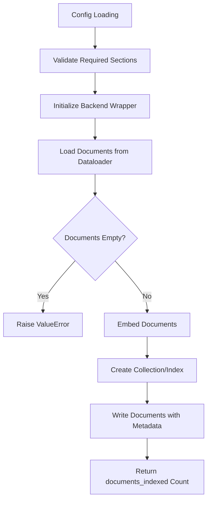
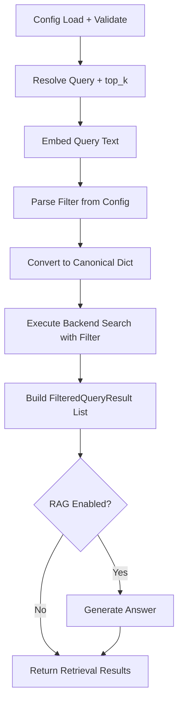

# LangChain: Metadata Filtering

## 1. What This Feature Is

Metadata filtering combines semantic vector search with structured metadata constraints to narrow retrieval results. This module provides two implementation layers:

### Layer 1: Modular Production Pipelines

Located in `indexing/` and `search/` subdirectories, these use:

- Unified VectorDB wrappers (`vectordb.databases.*`)
- Shared utilities in `utils/` (config, filters, embeddings, RAG)
- Consistent pipeline interface across all backends

### Layer 2: Native Backend-Specific Pipelines

Located in top-level backend files, these provide:

- Explicit backend-specific filter expression builders
- Pre-filter timing and candidate counting
- Filter selectivity analysis

Both layers model filters as structured conditions over document metadata (category, year, ticker, title) and apply constraints during retrieval.

## 2. Why It Exists in Retrieval/RAG

Pure vector similarity is often too broad for production use cases. Metadata filtering addresses three critical needs:

| Need | Solution |
|------|----------|
| **Precision** | Narrow candidate set to scoped tasks (tenant, domain, time window, source type) |
| **Efficiency** | Reduce search space when corpus is large and constraints are selective |
| **Controllability** | Enable reproducible evaluation with explicit deterministic metadata slices |

This mirrors official guidance across LangChain and vector databases: **filters are a first-class retrieval input, not a post-hoc cleanup step**.

### Common Use Cases

- **Domain slicing**: `category == "science"`
- **Temporal filtering**: `year >= 2022`
- **Source control**: `source in ["wikipedia", "arxiv"]`
- **Title matching**: `title contains "transformer"`
- **Finance fields**: `ticker == "AAPL"`, `quarter == "Q4"`, `speaker == "CEO"`

## 3. Indexing Pipeline: Step-by-Step



### Modular Indexing Flow (`*MetadataFilteringIndexingPipeline`)

1. **Load config with env resolution**:
   - `ConfigLoader.load()` accepts dict or YAML path
   - `${VAR}` and `${VAR:-default}` resolved recursively

2. **Validate required sections**:
   - Each backend enforces `dataloader`, `embeddings`, and backend section

3. **Initialize backend wrapper**:
   - Backend-specific `_init_db()` creates `vectordb.databases.*VectorDB` instance

4. **Load documents**:
   - `load_documents_from_config()` uses `DataloaderCatalog.create(...)`
   - Returns LangChain `Document` objects
   - Empty loads raise `ValueError`

5. **Embed documents**:
   - `EmbedderHelper.create_embedder()` builds and warms embedder
   - `embedder.embed_documents(documents=...)` returns embedded docs

6. **Create collection/index**:
   - Chroma/Weaviate/Milvus/Qdrant: `create_collection(...)`
   - Pinecone: `create_index(...)`

7. **Write documents**:
   - Chroma: `add_documents(...)`
   - Milvus: `insert_documents(...)`
   - Qdrant: `index_documents(...)`
   - Weaviate: `insert_documents(...)`
   - Pinecone: `upsert(...)`

8. **Return summary**: `{"documents_indexed": <count>}`

## 4. Search Pipeline: Step-by-Step



### Modular Search Flow (`*MetadataFilteringSearchPipeline`)

1. **Load and validate config**:
   - Requires `embeddings`, backend section, and `search`

2. **Resolve query and top_k**:
   - Query argument overrides config
   - Fallback: `metadata_filtering.test_query` or `"test query"`
   - `top_k` from `search.top_k` (default 10)

3. **Embed query text**:
   - `EmbedderHelper.embed_query(query)` returns query embedding

4. **Parse filter spec**:
   - `DocumentFilter.normalize()` reads filter dict
   - Returns normalized filter or empty dict if missing

5. **Convert to canonical dict**:
   - MongoDB-style: `{"field": {"$op": value}}`
   - Multi-condition: `{"$and": [...], "$or": [...]}`

6. **Execute backend search**:
   - Chroma: `db.query(query_embedding=..., top_k=..., where=...)`
   - Qdrant/Milvus/Weaviate: `db.search(query_embedding=..., top_k=..., filters=...)`
   - Pinecone: `db.query(vector=..., top_k=..., filter=...)`

7. **Build results**:
   - Relevance: `doc.metadata.get("score", 0.0)`
   - Rank starts at 1
   - Timing attached per backend

8. **Optional RAG**:
   - `RAGHelper.generate()` creates answer when `rag.enabled=true`

## 5. When to Use It

Use metadata filtering when:

- **Retrieval quality depends on known constraints**: Query-time metadata filters improve precision
- **Domain-specific slicing needed**: Category, time window, source type filtering
- **Large corpus with selective constraints**: Filtering before/during search improves efficiency
- **Reproducible benchmarks**: Fixed `test_query` + `test_filters` for eval runs
- **Multi-tenant scenarios**: Combine with tenant ID filtering for isolation
- **Structured data requirements**: Finance, legal, scientific domains with typed metadata

## 6. When Not to Use It

Avoid metadata filtering when:

- **Metadata is sparse or noisy**: Inconsistent metadata leads to unpredictable results
- **Fuzzy intent extraction needed**: Hard-coded filters don't match vague user intent
- **Complex boolean logic required**: Some backends limit filter expression complexity
- **Two filter stacks confusion**: This codebase has canonical dict vs native expression builders; mixing causes issues
- **Post-filtering acceptable**: For small corpora, filtering after retrieval may be simpler

## 7. What This Codebase Provides

### Core Shared Modules (`utils/`)

```python
from vectordb.langchain.utils import (
    ConfigLoader,              # Config loading with env resolution
    EmbedderHelper,            # Document/query embedder creation
    DocumentFilter,            # Filter normalization and application
    RAGHelper,                 # Optional RAG setup
)
```

### Modular Pipeline Classes

**Indexing**:

```python
from vectordb.langchain.metadata_filtering.indexing import (
    MilvusMetadataFilteringIndexingPipeline,
    QdrantMetadataFilteringIndexingPipeline,
    PineconeMetadataFilteringIndexingPipeline,
    ChromaMetadataFilteringIndexingPipeline,
    WeaviateMetadataFilteringIndexingPipeline,
)
```

**Search**:

```python
from vectordb.langchain.metadata_filtering.search import (
    MilvusMetadataFilteringSearchPipeline,
    QdrantMetadataFilteringSearchPipeline,
    PineconeMetadataFilteringSearchPipeline,
    ChromaMetadataFilteringSearchPipeline,
    WeaviateMetadataFilteringSearchPipeline,
)
```

### Filter Builders

```python
from vectordb.langchain.utils.filters import (
    FiltersHelper,  # Backend-specific filter translation
)

# MongoDB-style filter
filter_dict = {
    "$and": [
        {"category": {"$eq": "tech"}},
        {"year": {"$gte": 2020}},
    ]
}

# Convert to backend-native format
milvus_filter = FiltersHelper.to_milvus(filter_dict)
qdrant_filter = FiltersHelper.to_qdrant(filter_dict)
pinecone_filter = FiltersHelper.to_pinecone(filter_dict)
```

## 8. Backend-Specific Behavior Differences

### Filter Expression Formats

| Backend | Format | Example |
|---------|--------|---------|
| **Milvus** | Boolean expression string | `'metadata["category"] == "tech" && metadata["year"] > 2020'` |
| **Qdrant** | `models.Filter(must=[...])` | `Filter(must=[FieldCondition(key="category", match=MatchValue(value="tech"))])` |
| **Pinecone** | MongoDB-style dict | `{"$and": [{"category": {"$eq": "tech"}}, {"year": {"$gt": 2020}}]}` |
| **Weaviate** | Where-clause dict | `{"operator": "And", "operands": [{"path": ["category"], "operator": "Equal", "valueText": "tech"}]}` |
| **Chroma** | Mongo-style dict | `{"$and": [{"category": {"$eq": "tech"}}]}` |

### Modular vs Native Layer Differences

| Aspect | Modular Layer | Native Layer |
|--------|---------------|--------------|
| **Filter input** | Canonical dict from `DocumentFilter` | Native expression builders |
| **Empty filters** | Passed as `None` to backend | Validated strictly, raises if missing |
| **Candidate counts** | Not tracked | Actual counts reported |
| **Pre-filter timing** | Not measured | Measured and reported |
| **Exception handling** | Propagates backend exceptions | Catches and returns `0` for pre-filter |

### Operational Differences

| Backend | Notes |
|---------|-------|
| **Pinecone** | Explicit `namespace` handling in indexing/search |
| **Weaviate** | PascalCase collection names common in configs |
| **Chroma** | `where=None` passed for empty filters in modular search |
| **Qdrant** | `Filter` objects with `FieldCondition` for complex queries |
| **Milvus** | JSON path notation `metadata["field"]` in expressions |

## 9. Configuration Semantics

### Primary Configuration Keys

```yaml
# Dataloader configuration
dataloader:
  type: "triviaqa"
  dataset_name: "trivia_qa"
  config: "rc"
  split: "test"
  limit: 500

# Embedding configuration (must match between indexing and search)
embeddings:
  model: "sentence-transformers/all-MiniLM-L6-v2"
  dimension: 384
  batch_size: 32
  trust_remote_code: false

# Backend configuration (example: Qdrant)
qdrant:
  url: "http://localhost:6333"
  api_key: null
  collection_name: "metadata-filtering-demo"

# Search configuration
search:
  top_k: 10

# Metadata filtering configuration
metadata_filtering:
  schema:
    allowed_fields: ["category", "year", "source", "title"]
    allowed_operators: ["$eq", "$ne", "$gt", "$gte", "$lt", "$lte", "$in"]

  test_query: "What is the capital of France?"
  test_filters:
    - field: "category"
      operator: "$eq"
      value: "science"
    - field: "year"
      operator: "$gte"
      value: 2020

# RAG configuration (optional)
rag:
  enabled: true
  model: "llama-3.3-70b-versatile"
  api_key: "${GROQ_API_KEY}"
  api_base_url: "https://api.groq.com/openai/v1"
  temperature: 0.7
  max_tokens: 2048

# Logging configuration
logging:
  level: "INFO"
  name: "metadata-filtering-pipeline"
```

### Filter Schema Definition

```yaml
metadata_filtering:
  schema:
    allowed_fields:
      - "category"
      - "year"
      - "quarter"
      - "ticker"
      - "speaker"
      - "source"
      - "title"
    allowed_operators:
      - "$eq"   # Equality
      - "$ne"   # Not equal
      - "$gt"   # Greater than
      - "$gte"  # Greater than or equal
      - "$lt"   # Less than
      - "$lte"  # Less than or equal
      - "$in"   # In list
      - "$nin"  # Not in list
```

### Environment Variable Syntax

- `${VAR}`: Substitute with env var, empty string if unset
- `${VAR:-default}`: Substitute with VAR if set, else default

```yaml
qdrant:
  url: "${QDRANT_URL:-http://localhost:6333}"
  api_key: "${QDRANT_API_KEY}"  # Required, no default
```

## 10. Failure Modes and Edge Cases

### Configuration Failures

| Failure | Cause | Mitigation |
|---------|-------|------------|
| **Missing required sections** | `dataloader`, `embeddings`, or backend section missing | Raises `ValueError` in constructor |
| **Invalid operator** | Operator not in allowed list | Raises `ValueError` in filter validation |
| **Empty YAML file** | `yaml.safe_load()` returns `None` | Downstream code expects dict; add content or validate |

### Indexing Failures

| Failure | Cause | Mitigation |
|---------|-------|------------|
| **Empty document load** | Dataset empty or limit=0 | Raises `ValueError("No documents loaded...")` |
| **Embedding dimension mismatch** | Index dimension ≠ embedding dimension | Verify `embeddings.dimension` matches index config |
| **Backend connection error** | Invalid URL, API key, network issue | Validate credentials; check connectivity |

### Search Failures

| Failure | Cause | Mitigation |
|---------|-------|------------|
| **Missing test_filters** | Native parser requires filters | Modular parser returns empty spec; native raises |
| **Empty filter behavior** | Backend-dependent handling | Chroma passes `where=None`; others vary |
| **doc.metadata score is None** | Backend doesn't return scores | Normalized to `0.0` in result mapping |
| **RAG without model** | `rag.enabled=true` but no `rag.model` | Raises `ValueError`; generation returns `None` answer |

### Timing and Result Edge Cases

| Issue | Cause | Mitigation |
|-------|-------|------------|
| **Timing only on rank 1** | By design; reduces overhead | Accept limitation; extend if needed |
| **Candidate counts = -1** | Modular search doesn't track | Use native layer for accurate counts |
| **pre_filter_ms = 0.0** | Modular search doesn't measure | Use native layer for timing breakdown |

### Native Pipeline Limitations

| Issue | Cause | Mitigation |
|-------|-------|------------|
| **run() skips indexing** | Initializes empty `documents` list | Extend code to load documents properly |
| **_pre_filter() catches exceptions** | Returns `0` on error | Check logs for underlying issues |

## 11. Practical Usage Examples

### Example 1: Indexing with Qdrant

```python
from vectordb.langchain.metadata_filtering.indexing import (
    QdrantMetadataFilteringIndexingPipeline,
)

# Initialize pipeline
pipeline = QdrantMetadataFilteringIndexingPipeline(
    "src/vectordb/langchain/metadata_filtering/configs/qdrant_arc.yaml"
)

# Run indexing
summary = pipeline.run()
print(f"Indexed {summary['documents_indexed']} documents")
```

### Example 2: Search with Pinecone

```python
from vectordb.langchain.metadata_filtering.search import (
    PineconeMetadataFilteringSearchPipeline,
)

# Initialize pipeline
pipeline = PineconeMetadataFilteringSearchPipeline(
    "src/vectordb/langchain/metadata_filtering/configs/pinecone_triviaqa.yaml"
)

# Search with filter from config
results = pipeline.search("What is the capital of France?")

for result in results["documents"]:
    print(f"Rank {result.metadata.get('rank', 'N/A')}: Score {result.metadata.get('score', 0)} - {result.page_content[:100]}")
```

### Example 3: Search with Custom Query

```python
from vectordb.langchain.metadata_filtering.search import (
    WeaviateMetadataFilteringSearchPipeline,
)

pipeline = WeaviateMetadataFilteringSearchPipeline(
    "src/vectordb/langchain/metadata_filtering/configs/weaviate_earnings_calls.yaml"
)

# Override query and top_k
results = pipeline.search(
    query="What was the revenue growth?",
    top_k=5,
)
```

### Example 4: Search with RAG Enabled

```yaml
# In config.yaml
rag:
  enabled: true
  model: "llama-3.3-70b-versatile"
  api_key: "${GROQ_API_KEY}"
  prompt_template: |
    Based on the following context, answer the question.

    Context:
    {context}

    Question: {query}

    Answer:
```

```python
from vectordb.langchain.metadata_filtering.search import (
    ChromaMetadataFilteringSearchPipeline,
)

pipeline = ChromaMetadataFilteringSearchPipeline("config.yaml")

# Search returns results; RAG generates answer separately
results = pipeline.search("What is quantum computing?")
if results.get("answer"):
    print(f"Answer: {results['answer']}")
```

### Example 5: Multi-Condition Filters

```yaml
# Config with complex filter
metadata_filtering:
  test_filters:
    - operator: "and"
      conditions:
        - field: "category"
          operator: "$eq"
          value: "technology"
        - operator: "or"
          conditions:
            - field: "year"
              operator: "$gte"
              value: 2022
            - field: "source"
              operator: "$in"
              value: ["arxiv", "wikipedia"]
```

```python
from vectordb.langchain.metadata_filtering.search import (
    MilvusMetadataFilteringSearchPipeline,
)

pipeline = MilvusMetadataFilteringSearchPipeline("config.yaml")
results = pipeline.search()  # Uses complex filter from config
```

## 12. Source Walkthrough Map

### Primary Entrypoints

| File | Purpose |
|------|---------|
| `src/vectordb/langchain/metadata_filtering/__init__.py` | Public API exports |
| `src/vectordb/langchain/metadata_filtering/indexing/__init__.py` | Indexing pipeline exports |
| `src/vectordb/langchain/metadata_filtering/search/__init__.py` | Search pipeline exports |

### Shared Utilities (`utils/`)

| File | Key Components |
|------|----------------|
| `config.py` | `ConfigLoader`, env resolution |
| `embeddings.py` | `EmbedderHelper` |
| `filters.py` | `DocumentFilter`, `FiltersHelper` |
| `rag.py` | `RAGHelper` |

### Modular Indexing Pipelines

| File | Backend |
|------|---------|
| `indexing/chroma.py` | Chroma |
| `indexing/milvus.py` | Milvus |
| `indexing/pinecone.py` | Pinecone |
| `indexing/qdrant.py` | Qdrant |
| `indexing/weaviate.py` | Weaviate |

### Modular Search Pipelines

| File | Backend |
|------|---------|
| `search/chroma.py` | Chroma |
| `search/milvus.py` | Milvus |
| `search/pinecone.py` | Pinecone |
| `search/qdrant.py` | Qdrant |
| `search/weaviate.py` | Weaviate |

### Configuration Examples

| File | Backend + Dataset |
|------|-------------------|
| `configs/chroma_arc.yaml` | Chroma + ARC |
| `configs/milvus_triviaqa.yaml` | Milvus + TriviaQA |
| `configs/pinecone_triviaqa.yaml` | Pinecone + TriviaQA |
| `configs/qdrant_arc.yaml` | Qdrant + ARC |
| `configs/weaviate_earnings_calls.yaml` | Weaviate + Earnings Calls |

### Test Files

| Directory | Coverage |
|-----------|----------|
| `tests/langchain/metadata_filtering/test_common/` | Shared utilities tests |
| `tests/langchain/metadata_filtering/test_indexing/` | Indexing pipeline tests |
| `tests/langchain/metadata_filtering/test_search/` | Search pipeline tests |
| `tests/langchain/metadata_filtering/test_filters.py` | Filter builder tests |

---

**Related Documentation**:

- **Multi-Tenancy** (`docs/langchain/multi-tenancy.md`): Tenant isolation (often combined with metadata filtering)
- **Hybrid Indexing** (`docs/langchain/hybrid-indexing.md`): Dense+sparse retrieval (alternative to filtering)
- **Core Databases** (`docs/core/databases.md`): Backend wrapper filter formats
