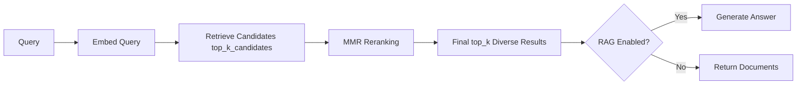
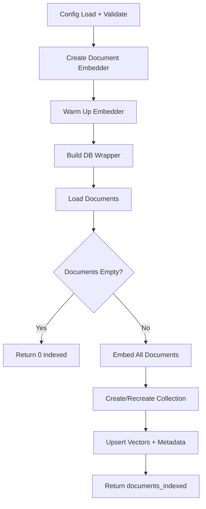
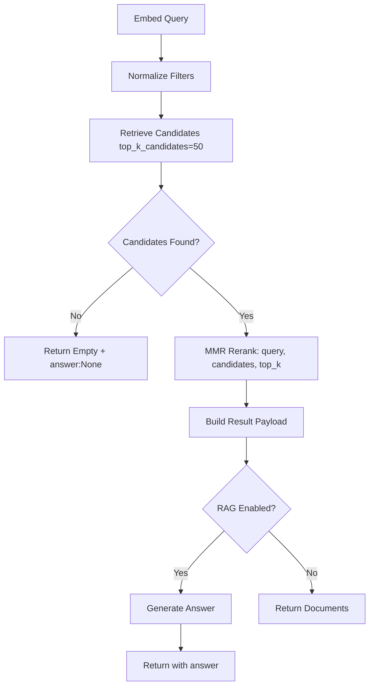

# LangChain: MMR

## 1. What This Feature Is

MMR (Maximal Marginal Relevance) implements **diversity-aware retrieval** pipelines for LangChain across five backends. In this repository, MMR is **integrated into backend-specific search pipelines** (not a standalone post-processing script).

| Backend | Indexing Pipeline | Search Pipeline |
|---------|-------------------|-----------------|
| **Chroma** | `ChromaMmrIndexingPipeline` | `ChromaMmrSearchPipeline` |
| **Milvus** | `MilvusMmrIndexingPipeline` | `MilvusMmrSearchPipeline` |
| **Pinecone** | `PineconeMmrIndexingPipeline` | `PineconeMmrSearchPipeline` |
| **Qdrant** | `QdrantMmrIndexingPipeline` | `QdrantMmrSearchPipeline` |
| **Weaviate** | `WeaviateMmrIndexingPipeline` | `WeaviateMmrSearchPipeline` |

All are exported from `vectordb.langchain.mmr`.

### Runtime Operation

Each search pipeline performs the same high-level operation:



1. **Embed the query**
2. **Retrieve larger candidate set** from vector database (`top_k_candidates`)
3. **Run MMR reranking** via `MMRHelper.mmr_rerank()`
4. **Optionally generate RAG answer** from selected documents

## 2. Why It Exists in Retrieval/RAG

**Problem**: Dense retrievers often return **near-duplicate passages** when many chunks are semantically similar. This hurts context breadth in RAG even when top-1 relevance is good.

**Example**:

```
Query: "What causes climate change?"

Dense-only top-5 (redundant):
1. "Climate change is caused by greenhouse gases..."  ← Same idea
2. "Global warming results from CO2 emissions..."     ← Same idea  
3. "The greenhouse effect traps heat..."              ← Same idea
4. "Carbon dioxide traps infrared radiation..."       ← Same idea
5. "Human activities increase atmospheric CO2..."     ← Same idea

MMR top-5 (diverse):
1. "Climate change is caused by greenhouse gases..."  ← Relevance #1
2. "Deforestation reduces carbon absorption..."       ← Different aspect
3. "Industrial processes emit methane..."             ← Different aspect
4. "Agricultural practices contribute nitrous oxide..." ← Different aspect
5. "Black carbon from soot accelerates ice melt..."   ← Different aspect
```

### MMR Formula

MMR selects documents that maximize:

```
MMR = λ × relevance - (1-λ) × redundancy
```

Where:

- **λ (lambda)**: Controls relevance vs. diversity tradeoff
- **relevance**: Similarity to query
- **redundancy**: Similarity to already-selected documents

**High λ (e.g., 0.9)**: Prioritize relevance, less diversity
**Low λ (e.g., 0.5)**: Balance relevance and diversity

## 3. Indexing Pipeline: Step-by-Step



### Actual Flow Inside Each `run()`

All indexing pipelines (`chroma.py`, `pinecone.py`, `milvus.py`, `qdrant.py`, `weaviate.py`) follow this sequence:

1. **Load config**: `ConfigLoader.load(...)`
2. **Validate sections**: Required: `dataloader`, `embeddings`, `<backend>`
3. **Create document embedder**: `EmbedderHelper.create_embedder(config)`
4. **Build DB wrapper**: From backend config
5. **Build dataloader**: `DataloaderCatalog.create(...)`
6. **Load + convert**: `dataset.to_langchain()`
7. **Early return**: If no docs, return `{"documents_indexed": 0}`
8. **Embed documents**: `embedder.embed_documents(documents=documents)`
9. **Create/recreate collection**: Backend-specific method
10. **Upsert**: `upsert(...)` with vectors and metadata
11. **Return**: `{"documents_indexed": <count>}`

### Backend-Specific Indexing Calls

| Backend | Collection Creation | Special Parameters |
|---------|---------------------|-------------------|
| **Pinecone** | Index creation with `namespace`, `dimension`, `metric` | `recreate` flag |
| **Milvus** | `create_collection` with `dimension` | `uri`, `recreate` |
| **Qdrant** | `create_collection` with `dimension` | `url`, `api_key`, `recreate` |
| **Weaviate** | `create_collection` with `dimension` | `url`, `recreate` |
| **Chroma** | Collection with `persist_directory`, `collection_name` | `dimension`, `recreate` |

## 4. Search Pipeline: Step-by-Step



### Actual Flow Inside Each `search()`

All search pipelines follow this sequence:

1. **Embed query**: `EmbedderHelper.embed_query(query)`
2. **Normalize filters**: Via `DocumentFilter.normalize(filters)` (if provided)
3. **Query backend**: Retrieve `top_k_candidates` (default 50)
4. **Early return**: If no candidates, return empty documents + `answer: None`
5. **MMR rerank**: `MMRHelper.mmr_rerank(documents, query_embedding, top_k, lambda_param)`
6. **Build result payload**:

   ```python
   {
       "documents": [...],
       "query": query,
       "candidates_retrieved": len(candidates),
       "documents_after_mmr": len(reranked),
   }
   ```

7. **Optional RAG**: If `rag.enabled=true`, create answer via `RAGHelper.generate(...)`
8. **Return**: Result dict with optional `answer` key

### MMR Reranking Implementation

```python
from vectordb.langchain.utils import MMRHelper

# MMR reranking
reranked = MMRHelper.mmr_rerank(
    documents=candidates,
    query_embedding=query_embedding,
    top_k=top_k,
    lambda_param=0.5,  # Balance relevance vs diversity
)
```

## 5. When to Use It

Use MMR when:

- **Semantic redundancy**: Retriever returns many similar chunks for one question
- **Broad evidence coverage**: Want diverse perspectives in fixed context budget
- **Cross-backend consistency**: Need same retrieval pattern across multiple vector DBs
- **RAG quality evaluation**: Redundancy hurts answer completeness

### Practical Signal

> **If increasing raw `top_k` mostly adds paraphrases of already-selected passages, MMR is usually the right next step.**

### Ideal Use Cases

| Use Case | Why MMR Helps |
|----------|---------------|
| **Multi-faceted queries** | "Causes of climate change" → Get different causes |
| **Comparative analysis** | "Pros and cons of X" → Get both sides |
| **Exploratory search** | "Machine learning applications" → Get diverse domains |
| **Summarization** | Need broad coverage for comprehensive summary |

## 6. When Not to Use It

Avoid or de-prioritize MMR when:

- **Single best snippet needed**: Fact lookup with strict precision
- **Tight latency budget**: Reranking adds overhead (~50-200ms for 50 candidates)
- **Tiny candidate pool**: If `top_k_candidates ≈ top_k`, diversity has little room
- **Exact rank matters**: Task values retriever similarity over breadth

### Latency Considerations

| Stage | Typical Latency |
|-------|-----------------|
| **Query embedding** | 10-50ms |
| **Candidate retrieval** | 50-200ms |
| **MMR reranking** | 50-200ms (depends on candidate count) |
| **RAG generation** | 500-2000ms (if enabled) |
| **Total** | ~110-450ms (without RAG) |

## 7. What This Codebase Provides

### Concrete Runtime Classes

```python
from vectordb.langchain.mmr import (
    # Indexing pipelines
    "ChromaMmrIndexingPipeline",
    "MilvusMmrIndexingPipeline",
    "PineconeMmrIndexingPipeline",
    "QdrantMmrIndexingPipeline",
    "WeaviateMmrIndexingPipeline",

    # Search pipelines
    "ChromaMmrSearchPipeline",
    "MilvusMmrSearchPipeline",
    "PineconeMmrSearchPipeline",
    "QdrantMmrSearchPipeline",
    "WeaviateMmrSearchPipeline",
)
```

### Guaranteed Behavior

| Behavior | Implementation |
|----------|----------------|
| **Indexing** | `run()` returns `documents_indexed` count |
| **Search** | `search(query, top_k, top_k_candidates, filters)` returns structured dict |
| **Config validation** | `ConfigLoader` checks required sections |
| **Embedder warm-up** | `EmbedderHelper` creates + warms embedders |
| **MMR rerank** | `MMRHelper.mmr_rerank()` with pure Python algorithm |
| **Optional RAG** | `RAGHelper.generate()` when `rag.enabled=true` |

### Search Result Structure

```python
{
    "documents": List[Document],       # Final top_k diverse documents
    "query": str,                       # Original query
    "candidates_retrieved": int,        # Pre-MMR candidate count
    "documents_after_mmr": int,         # Post-MMR count (same as top_k)
    "answer": Optional[str],            # RAG answer (if enabled)
}
```

### Test-Backed Behavioral Contracts

Tests in `tests/langchain/mmr/` validate:

- Indexing calls dataloader, embedder, DB upsert
- Search calls query embedding, DB retrieval, MMR rerank
- Optional RAG answer generation
- Integration tests gated by backend env vars + `GROQ_API_KEY`

## 8. Backend-Specific Behavior Differences

### Control Flow Uniformity

The MMR pipeline method calls assume **uniform adapter methods**:

- `create_collection()`
- `upsert()`
- `query()`

However, **concrete DB wrappers in `vectordb.databases/` are not perfectly symmetric**. This is an operational risk (mostly hidden in unit tests because DB classes are mocked).

### Backend Wiring Differences

| Backend | Connection Fields | Collection Creation | Special Handling |
|---------|-------------------|---------------------|------------------|
| **Pinecone** | `index_name`, `namespace` | `metric`, `dimension` exposed | Namespace in both indexing/search |
| **Chroma** | `persist_directory`, `collection_name` | Collection-oriented local persistence | Uses persist path |
| **Milvus** | `uri`, `collection_name` | Explicit `dimension` | Recreate option |
| **Qdrant** | `url`, `api_key`, `collection_name` | Explicit `dimension` | Recreate option |
| **Weaviate** | `url`, `collection_name` | Explicit `dimension` | Recreate option |

### Indexing Call Patterns

| Backend | Method | Notes |
|---------|--------|-------|
| **Pinecone** | `upsert(vectors, namespace=...)` | Namespace isolation |
| **Milvus** | `insert_documents(documents)` | Batch insert |
| **Qdrant** | `index_documents(documents)` | Uses `index_documents` |
| **Weaviate** | `upsert_documents(documents)` | Batch upsert |
| **Chroma** | `upsert(ids, embeddings, documents, metadatas)` | Chroma format |

## 9. Configuration Semantics

### Key Runtime Knobs

```yaml
# Dataloader configuration
dataloader:
  type: "triviaqa"        # Dataset type
  split: "test"           # Dataset split
  limit: 500              # Record limit for indexing

# Embedding configuration
embeddings:
  model: "sentence-transformers/all-MiniLM-L6-v2"
  device: "cpu"
  batch_size: 32

# MMR configuration
mmr:
  lambda_param: 0.5       # Relevance vs diversity balance (0-1)
  top_k: 10               # Final result count

# Search configuration
search:
  top_k: 10               # Final result count
  top_k_candidates: 50    # Pre-MMR candidate pool

# RAG configuration (optional)
rag:
  enabled: true
  model: "llama-3.3-70b-versatile"
  api_key: "${GROQ_API_KEY}"

# Backend connection (example: Pinecone)
pinecone:
  api_key: "${PINECONE_API_KEY}"
  index_name: "mmr-index"
  namespace: "tenant-1"
  dimension: 384
  metric: "cosine"
  recreate: false
```

### Critical Configuration Notes

| Config Key | Actual Behavior | Issue |
|------------|-----------------|-------|
| **`mmr.lambda_param`** | Passed to `MMRHelper.mmr_rerank()` | Controls relevance/diversity tradeoff |
| **`search.top_k_candidates`** | Used in search method | Default 50 if not specified |
| **`dataloader.name`** | Falls back to default `triviaqa` | Pipelines read `dataloader.type` |

### Method Parameters vs Config

```python
# Method signature
def search(
    self,
    query: str,
    top_k: int = 5,              # Final result count
    top_k_candidates: int = 50,  # Pre-MMR candidate pool
    filters: Optional[dict] = None,
) -> dict:
    ...

# You can override defaults:
result = pipeline.search(
    query="What is ML?",
    top_k=5,
    top_k_candidates=80,  # Override default 50
)
```

### Backend-Specific Keys

| Backend | Required Keys | Optional Keys |
|---------|---------------|---------------|
| **Pinecone** | `api_key`, `index_name` | `namespace`, `dimension`, `metric`, `recreate` |
| **Milvus** | `uri`, `collection_name` | `token`, `dimension`, `recreate` |
| **Qdrant** | `url` | `api_key`, `collection_name`, `dimension`, `recreate` |
| **Weaviate** | `url`, `collection_name` | `api_key`, `dimension`, `recreate` |
| **Chroma** | `collection_name` | `persist_directory`, `dimension`, `recreate` |

## 10. Failure Modes and Edge Cases

### Adapter Interface Mismatch Risk

**Issue**: MMR pipelines call DB methods assuming unified signatures, but concrete wrappers differ.

**Example**:

```python
# MMR pipeline expects:
db.create_collection(collection_name, dimension)

# But actual wrapper may have:
def create_collection(self, name: str, dim: int, use_sparse: bool = False)
```

**Mitigation**: Unit tests mock DB classes; mismatches surface only at runtime/integration.

### Configuration Issues

| Config | Issue | Impact |
|--------|-------|--------|
| **`lambda_param`** | Must be 0-1 | Values outside range produce invalid results |
| **`top_k_candidates`** | In YAML but may not be used | Search method uses default 50 unless caller overrides |

**Workaround**: Pass explicitly in code:

```python
result = pipeline.search(query="...", top_k_candidates=80)
```

### Empty Dataset Handling

```python
# Indexing returns gracefully:
{"documents_indexed": 0}
# With warning logged
```

### RAG Credential Failures

| Failure | Cause | Mitigation |
|---------|-------|------------|
| **`ValueError` at RAG init** | `rag.enabled=true` but no API key | Set `GROQ_API_KEY` or `rag.api_key` |
| **LLM runtime error** | External API failure | Wrap in try/except; check API status |

### Config Key Drift

```python
# MMR pipelines read:
config["dataloader"]["type"]

# But some tests use:
config["dataloader"]["name"]  # Falls back to default "triviaqa"
```

**Impact**: Silent fallback may load wrong dataset.

### Filter Pass-Through

Filters are passed through to backend calls, but **expression format is not normalized**:

- Milvus: Boolean expression string
- Qdrant: `Filter` object
- Pinecone: MongoDB-style dict
- Weaviate: `Filter` object
- Chroma: `where` dict

**Mitigation**: Test filters per backend.

## 11. Practical Usage Examples

### Example 1: Index TriviaQA into Pinecone MMR Collection

```python
from vectordb.langchain.mmr import PineconeMmrIndexingPipeline

pipeline = PineconeMmrIndexingPipeline(
    "src/vectordb/langchain/mmr/configs/pinecone_triviaqa.yaml"
)
stats = pipeline.run()
print(f"Indexed {stats['documents_indexed']} documents")
```

### Example 2: Search with Larger Candidate Pool

```python
from vectordb.langchain.mmr import QdrantMmrSearchPipeline

pipeline = QdrantMmrSearchPipeline(
    "src/vectordb/langchain/mmr/configs/qdrant_triviaqa.yaml"
)

# Override default top_k_candidates (50) to 80 for more diversity
result = pipeline.search(
    query="What is machine learning?",
    top_k=10,
    top_k_candidates=80,  # Explicit override
)

print(f"Candidates retrieved: {result['candidates_retrieved']}")
print(f"Documents after MMR: {result['documents_after_mmr']}")
```

### Example 3: Enable RAG with MMR

```python
from vectordb.langchain.mmr import WeaviateMmrSearchPipeline

pipeline = WeaviateMmrSearchPipeline(
    "src/vectordb/langchain/mmr/configs/weaviate_triviaqa.yaml"
)

# Ensure rag.enabled=true and GROQ_API_KEY is set
result = pipeline.search(
    query="Summarize the key idea",
    top_k=5,
    top_k_candidates=30,
)

if result.get("answer"):
    print(f"Answer: {result['answer']}")
```

### Example 4: Use Metadata Filters

```python
from vectordb.langchain.mmr import ChromaMmrSearchPipeline

pipeline = ChromaMmrSearchPipeline(
    "src/vectordb/langchain/mmr/configs/chroma_triviaqa.yaml"
)

result = pipeline.search(
    query="What causes climate change?",
    top_k=5,
    filters={"source": "triviaqa"},  # Filter by source
)

print(f"Retrieved {len(result['documents'])} diverse documents")
```

### Example 5: Milvus with Recreate

```python
from vectordb.langchain.mmr import MilvusMmrIndexingPipeline

# Recreate collection (drops existing data)
pipeline = MilvusMmrIndexingPipeline(
    "src/vectordb/langchain/mmr/configs/milvus_triviaqa.yaml"
)
stats = pipeline.run()
```

### Example 6: Tune Lambda Parameter

```yaml
# config.yaml
mmr:
  lambda_param: 0.7  # Higher = more relevance, less diversity
  top_k: 10
```

```python
from vectordb.langchain.mmr import PineconeMmrSearchPipeline

pipeline = PineconeMmrSearchPipeline("config.yaml")
result = pipeline.search(
    query="Applications of deep learning",
    top_k=5,
    top_k_candidates=50,
)

# Higher lambda_param = more relevant, less diverse results
```

## 12. Source Walkthrough Map

### Primary Entrypoints

| File | Purpose |
|------|---------|
| `src/vectordb/langchain/mmr/__init__.py` | Public API exports |
| `src/vectordb/langchain/mmr/README.md` | Feature overview |

### Indexing Implementations

| File | Backend |
|------|---------|
| `indexing/chroma.py` | Chroma |
| `indexing/pinecone.py` | Pinecone |
| `indexing/milvus.py` | Milvus |
| `indexing/qdrant.py` | Qdrant |
| `indexing/weaviate.py` | Weaviate |

### Search Implementations

| File | Backend |
|------|---------|
| `search/chroma.py` | Chroma |
| `search/pinecone.py` | Pinecone |
| `search/milvus.py` | Milvus |
| `search/qdrant.py` | Qdrant |
| `search/weaviate.py` | Weaviate |

### Representative Configs

| File | Backend + Dataset |
|------|-------------------|
| `configs/chroma/triviaqa.yaml` | Chroma + TriviaQA |
| `configs/pinecone/triviaqa.yaml` | Pinecone + TriviaQA |
| `configs/milvus/triviaqa.yaml` | Milvus + TriviaQA |
| `configs/qdrant/triviaqa.yaml` | Qdrant + TriviaQA |
| `configs/weaviate/triviaqa.yaml` | Weaviate + TriviaQA |

### Test Files

| File | Coverage |
|------|----------|
| `tests/langchain/mmr/test_base.py` | Base test class for all backends |
| `tests/langchain/mmr/test_chroma.py` | Chroma integration tests |
| `tests/langchain/mmr/test_pinecone.py` | Pinecone integration tests |
| `tests/langchain/mmr/test_milvus.py` | Milvus integration tests |
| `tests/langchain/mmr/test_qdrant.py` | Qdrant integration tests |
| `tests/langchain/mmr/test_weaviate.py` | Weaviate integration tests |

### Shared Utilities

| File | Purpose |
|------|---------|
| `src/vectordb/langchain/utils/embeddings.py` | Embedder factory |
| `src/vectordb/langchain/utils/mmr.py` | MMR algorithm implementation |
| `src/vectordb/langchain/utils/config.py` | Config loading |
| `src/vectordb/langchain/utils/rag.py` | RAG helper |

---

**Related Documentation**:

- **Diversity Filtering** (`docs/langchain/diversity-filtering.md`): Alternative diversity approach
- **Reranking** (`docs/langchain/reranking.md`): Relevance-based reranking (contrast with MMR)
- **Metadata Filtering** (`docs/langchain/metadata-filtering.md`): Filter before retrieval
