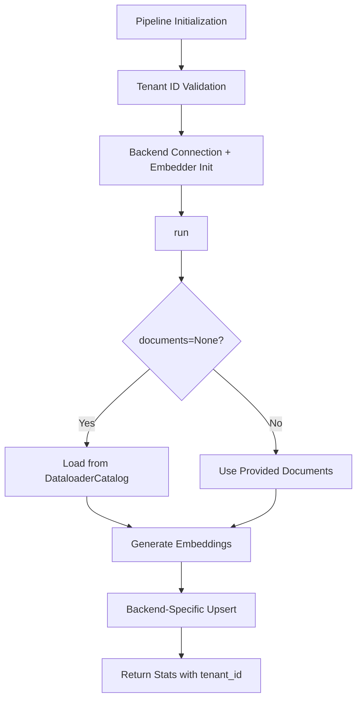
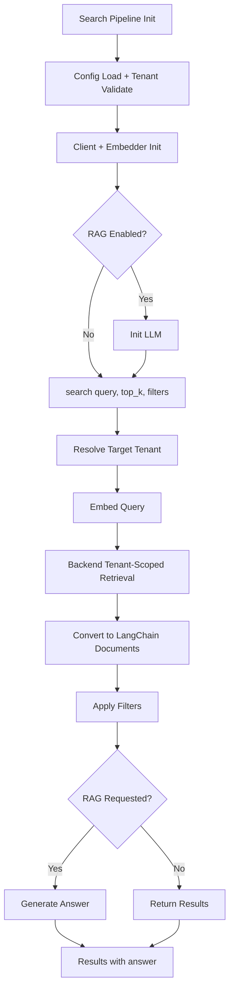

# LangChain: Multi-Tenancy

## 1. What This Feature Is

Multi-tenancy provides tenant-isolated indexing and retrieval pipelines for LangChain-based RAG across five vector backends. Each backend implements isolation differently:

| Backend | Isolation Mechanism |
|---------|---------------------|
| **Milvus** | Partition-key isolation (`tenant_id` field + filter expression) |
| **Weaviate** | Collection-based isolation (one collection per tenant) |
| **Pinecone** | Namespace isolation (`namespace=<tenant_id>`) |
| **Qdrant** | Collection-based isolation (dedicated collection per tenant) |
| **Chroma** | Collection-per-tenant naming plus tenant metadata filtering |

Each backend has three pipeline classes:

- **Base class**: `MultiTenancyPipeline` abstract base class defining the contract
- **Indexing pipelines**: Handle document ingestion with tenant isolation
- **Search pipelines**: Handle tenant-scoped retrieval with optional RAG

The shared contract is defined through the abstract base class with methods `index_for_tenant()`, `search_for_tenant()`, `delete_tenant()`, and `list_tenants()`.

## 2. Why It Exists in Retrieval/RAG

RAG systems frequently host multiple customers, teams, or applications on shared infrastructure. Without strict tenant boundaries, retrieval can leak context across tenants and produce incorrect or unsafe answers.

This implementation exists to enforce tenant boundaries **inside the retrieval path itself**, not only at API boundaries:

- **Index-time**: Tenant tagging or physical separation of documents
- **Query-time**: Tenant-scoped retrieval calls and filters
- **Result wrapping**: Tenant-aware result objects for audit trails

Key design goals:

- **Zero cross-tenant leakage**: Retrieval must never return documents from other tenants
- **Consistent interface**: Same API across all five backends despite different isolation mechanisms
- **Tenant-aware observability**: Timing metrics and result wrappers include tenant context for debugging
- **Flexible tenant resolution**: Support explicit tenant_id parameters at initialization

## 3. Indexing Pipeline: Step-by-Step



### Step-by-Step Flow

1. **Pipeline initialization**: `PineconeMultiTenancyIndexingPipeline(config_path, tenant_id="acme_corp")`
2. **Config loading**: `ConfigLoader.load(config_or_path)` with env var resolution
3. **Tenant validation**: Validate `tenant_id` is not empty (fail-fast)
4. **Backend _connect()**:
   - Establishes DB client
   - Ensures collection/index exists (backend-specific)
   - Initializes embedder from `EmbedderHelper.create_embedder()`
5. **run()**:
   - If `documents is None`, loads from `DataloaderCatalog.create(...).load()` using `dataloader.type` + params
   - If empty docs, returns stats with zero counts
   - Otherwise generates embeddings via `EmbedderHelper`
6. **index_for_tenant(...)**:
   - Applies backend isolation write behavior (see section 8)
   - Returns count of documents indexed
7. **Returns**: Dictionary with `documents_indexed` and `tenant_id`

### Backend-Specific Indexing

| Backend | Isolation Write Behavior |
|---------|-------------------------|
| **Pinecone** | Upsert vectors in `namespace=tenant_id`, batch operations |
| **Weaviate** | Ensure collection exists, batch add objects with tenant metadata |
| **Qdrant** | Upsert points to tenant-specific collection with metadata |
| **Milvus** | Insert with `tenant_id` metadata into partition-key-enabled collection |
| **Chroma** | Write into tenant-suffixed collection (`<prefix><tenant_id>`) with metadata |

## 4. Search Pipeline: Step-by-Step



### Step-by-Step Flow

1. **Pipeline initialization**: Backend search pipeline with config path or dict and `tenant_id`
2. **Config loading**: `ConfigLoader.load(...)`, validates tenant_id
3. **Component init**: Client and embedder, optionally LLM if `rag.enabled` is true
4. **search(query, top_k=10, filters=None)**:
   - Validate tenant_id
   - Embed query via embedder
   - Execute backend tenant-scoped retrieval (see table below)
   - Convert matches to LangChain `Document` objects
   - Apply optional metadata filters within tenant scope
5. **RAG generation** (if enabled):
   - Runs LLM with retrieved documents as context
   - Extracts answer from generation result
6. **Returns**: Dictionary with documents, query, tenant_id, and optional answer

### Backend-Specific Search

| Backend | Tenant-Scoped Retrieval |
|---------|------------------------|
| **Pinecone** | `index.query(..., namespace=tenant_id, include_metadata=True)` |
| **Weaviate** | Query with tenant collection context |
| **Qdrant** | `search(collection=tenant_collection, ...)` |
| **Milvus** | `retrieve(..., filter_expr=f"tenant_id == '{tenant}'")` |
| **Chroma** | `query(...)` on tenant-specific collection |

## 5. When to Use It

Use multi-tenancy when:

- **Multi-customer SaaS**: Multiple customers share infrastructure and must never see each other's retrieved context
- **Department isolation**: Different teams/departments need isolated knowledge bases on shared vector DB
- **Compliance requirements**: Data residency or privacy rules require logical isolation per tenant
- **Unified codebase**: You need one code-level interface across Milvus/Weaviate/Pinecone/Qdrant/Chroma
- **Consistent semantics**: Retrieval-only and RAG flows should share identical tenant-resolution behavior
- **Observability needs**: Tenant-aware result objects and timing metrics for debugging and auditing

## 6. When Not to Use It

Avoid multi-tenancy when:

- **Single tenant**: You have only one tenant and no isolation requirement (use simpler pipelines)
- **Cross-tenant analytics**: You need search/analytics across all tenants (this module enforces isolation)
- **Strict tenant lifecycle**: You need explicit tenant provisioning/deprovisioning APIs on all backends (some backends use implicit-on-write)
- **Graceful error handling required**: Many runtime client exceptions propagate directly without wrapping
- **Complex tenant hierarchies**: Your use case requires nested tenants or hierarchical isolation (not supported)

## 7. What This Codebase Provides

### Public API (from `src/vectordb/langchain/multi_tenancy/__init__.py`)

```python
from vectordb.langchain.multi_tenancy import (
    # Base class
    "MultiTenancyPipeline",

    # Full pipelines (per backend)
    "PineconeMultiTenancyPipeline",
    "WeaviateMultiTenancyPipeline",
    "ChromaMultiTenancyPipeline",
    "MilvusMultiTenancyPipeline",
    "QdrantMultiTenancyPipeline",

    # Indexing pipelines (per backend)
    "PineconeMultiTenancyIndexingPipeline",
    "WeaviateMultiTenancyIndexingPipeline",
    "ChromaMultiTenancyIndexingPipeline",
    "MilvusMultiTenancyIndexingPipeline",
    "QdrantMultiTenancyIndexingPipeline",

    # Search pipelines (per backend)
    "PineconeMultiTenancySearchPipeline",
    "WeaviateMultiTenancySearchPipeline",
    "ChromaMultiTenancySearchPipeline",
    "MilvusMultiTenancySearchPipeline",
    "QdrantMultiTenancySearchPipeline",
)
```

### Base Class Contract

```python
from abc import ABC, abstractmethod
from langchain_core.documents import Document

class MultiTenancyPipeline(ABC):
    @abstractmethod
    def index_for_tenant(
        self,
        tenant_id: str,
        documents: list[Document],
        embeddings: list[list[float]],
    ) -> int:
        """Index documents for a specific tenant in isolation."""

    @abstractmethod
    def search_for_tenant(
        self,
        tenant_id: str,
        query: str,
        top_k: int = 10,
        filters: dict[str, Any] | None = None,
    ) -> list[Document]:
        """Search within a specific tenant's data only."""

    @abstractmethod
    def delete_tenant(self, tenant_id: str) -> bool:
        """Delete all data for a specific tenant."""

    @abstractmethod
    def list_tenants(self) -> list[str]:
        """List all active tenants in the system."""
```

### Shared Behavior

- **Tenant validation**: All pipelines validate `tenant_id` is not empty at initialization
- **Embedding helpers**: Standardize model, device, batch size via `EmbedderHelper`
- **RAG helper**: Optional LLM integration via `RAGHelper.create_llm()`
- **Config loading**: Unified config format with env var resolution via `ConfigLoader`

## 8. Backend-Specific Behavior Differences

### Pinecone

| Aspect | Behavior |
|--------|----------|
| **Isolation** | Namespace-based at read/write |
| **Index creation** | Auto-created if missing in `_connect()` |
| **Tenant stats** | Via `describe_index_stats(filter={"tenant_id": ...})` |
| **Write batching** | Upserts in batches for efficiency |
| **Tenant existence** | Implicit on first upsert; no explicit tenant creation API |

### Weaviate

| Aspect | Behavior |
|--------|----------|
| **Isolation** | Collection-based with dedicated collections per tenant |
| **Class creation** | Created with tenant-specific naming |
| **Tenant creation** | Implicit on first document write |
| **Query scoping** | All queries target tenant-specific collection |

### Qdrant

| Aspect | Behavior |
|--------|----------|
| **Isolation** | Collection-based with dedicated collections per tenant |
| **Collection creation** | Created with tenant-specific naming |
| **Query filtering** | Via collection scoping |
| **Tenant listing** | Via collection listing |

### Milvus

| Aspect | Behavior |
|--------|----------|
| **Isolation** | Partition-key mode with `tenant_id` partition key |
| **Collection schema** | Created with partition key field |
| **Query filtering** | Filter expression on `tenant_id` |
| **Wrapper usage** | Uses `MilvusVectorDB` methods for all operations |

### Chroma

| Aspect | Behavior |
|--------|----------|
| **Isolation** | Tenant-suffixed collection naming (`<prefix><tenant_id>`) |
| **Collection creation** | One collection per tenant (closest to physical isolation) |
| **Character normalization** | Collection names sanitized for Chroma naming rules |
| **Metadata filtering** | Additional `where` filter on queries |

## 9. Configuration Semantics

### Primary Configuration Keys

```yaml
# Embedding configuration
embeddings:
  model: "sentence-transformers/all-MiniLM-L6-v2"
  device: "cpu"
  batch_size: 32

# RAG configuration (optional)
rag:
  enabled: true
  model: "llama-3.3-70b-versatile"
  api_key: "${GROQ_API_KEY}"
  temperature: 0.7
  max_tokens: 2048

# Backend configuration (example: Pinecone)
pinecone:
  api_key: "${PINECONE_API_KEY}"
  index_name: "my-index"
  dimension: 384
  metric: "cosine"
  recreate: false

# Dataloader configuration (for indexing)
dataloader:
  type: "triviaqa"
  split: "test"
  limit: 500

# Search configuration
search:
  top_k: 10
```

### Tenant ID Resolution

Tenant ID is passed explicitly at pipeline initialization:

```python
# Indexing pipeline
indexer = PineconeMultiTenancyIndexingPipeline(
    "config.yaml",
    tenant_id="acme-prod",  # Explicit tenant ID
)

# Search pipeline
searcher = PineconeMultiTenancySearchPipeline(
    "config.yaml",
    tenant_id="acme-prod",  # Must match indexing tenant ID
)
```

### Environment Variable Syntax

- `${VAR}`: Substitute with env var, empty string if unset
- `${VAR:-default}`: Substitute with VAR if set, else default

Example:

```yaml
pinecone:
  api_key: "${PINECONE_API_KEY:-pc-default-key}"
  index_name: "${PINECONE_INDEX}"  # Required, no default
```

### Important Semantic Caveats

- **Tenant ID consistency**: The `tenant_id` used at indexing must match the `tenant_id` used at search time
- **Collection naming**: Different backends use different naming conventions for tenant collections
- **Implicit tenant creation**: Most backends create tenants implicitly on first write (no explicit provisioning)

## 10. Failure Modes and Edge Cases

### Tenant Validation Failures

| Failure | Cause | Mitigation |
|---------|-------|------------|
| **Empty tenant_id** | `tenant_id=""` passed | Raises `ValueError` at initialization |
| **None tenant_id** | `tenant_id=None` passed | Raises `ValueError` at initialization |
| **Type mismatch** | `tenant_id` is not a string | May cause backend-specific errors; validate type |

### Indexing Failures

| Failure | Cause | Mitigation |
|---------|-------|------------|
| **Empty documents** | `documents=[]` passed | Returns stats with `documents_indexed=0` |
| **Embedding failure** | Embedder model unavailable | Verify model name; check network for HF models |
| **Backend connection error** | Invalid API key, network issue | Validate credentials; check connectivity |
| **Index/collection exists** | Index already exists with different schema | Use `recreate=True` or drop manually |

### Search Failures

| Failure | Cause | Mitigation |
|---------|-------|------------|
| **RAG not enabled** | `rag()` called with no LLM configured | Returns results without answer; not an error |
| **Backend query error** | Invalid filter syntax, network timeout | Backend-specific exceptions propagate; wrap in try/except |
| **Empty results** | No documents for tenant | Returns empty list; not an error |
| **Config returns None** | Empty YAML file | `ConfigLoader.load()` may return `None`; downstream code expects dict |

### Environment Interpolation Issues

| Issue | Cause | Mitigation |
|-------|-------|------------|
| **Partial resolution** | Env vars only resolved in full-string patterns | Use `ConfigLoader.resolve_env_vars()` for interpolation inside longer strings |
| **Nested vars not resolved** | Env var value contains `${...}` | Resolution is single-pass; pre-resolve env vars |

### Backend-Specific Edge Cases

**Chroma**:

- Tenant existence check is coarse (`collection is not None`)
- Collection naming must follow Chroma conventions

**Pinecone/Qdrant/Milvus**:

- `delete_tenant()` reflects implicit-on-first-write behavior
- No guaranteed provisioning semantics

**Weaviate**:

- Collection-based isolation requires proper naming conventions
- Collection creation has fallback paths on schema errors

## 11. Practical Usage Examples

### Example 1: Basic Multi-Tenant Indexing (Pinecone)

```python
from vectordb.langchain.multi_tenancy.indexing import (
    PineconeMultiTenancyIndexingPipeline,
)
from vectordb.langchain.multi_tenancy.search import (
    PineconeMultiTenancySearchPipeline,
)

# Initialize indexing pipeline with explicit tenant ID
indexing = PineconeMultiTenancyIndexingPipeline(
    "src/vectordb/langchain/multi_tenancy/configs/pinecone_triviaqa.yaml",
    tenant_id="acme-prod",
)

# Index documents
result = indexing.run()
print(f"Indexed {result['documents_indexed']} documents for tenant {result['tenant_id']}")

# Initialize search pipeline with same tenant ID
search = PineconeMultiTenancySearchPipeline(
    "src/vectordb/langchain/multi_tenancy/configs/pinecone_triviaqa.yaml",
    tenant_id="acme-prod",
)

# Query tenant-specific data
results = search.search("What is our return policy?", top_k=5)
print(f"Retrieved {len(results['documents'])} documents for tenant {results['tenant_id']}")
```

### Example 2: Multi-Tenant RAG

```python
from vectordb.langchain.multi_tenancy.search import (
    QdrantMultiTenancySearchPipeline,
)

config = {
    "qdrant": {
        "url": "http://localhost:6333",
        "api_key": "",
    },
    "embeddings": {"model": "qwen3"},
    "rag": {
        "enabled": True,
        "model": "llama-3.3-70b-versatile",
        "api_key": "${GROQ_API_KEY}",
        "temperature": 0.7,
        "max_tokens": 2048,
    },
}

searcher = QdrantMultiTenancySearchPipeline(
    config,
    tenant_id="tenant-42",
)

# RAG query (requires rag.enabled=true in config)
result = searcher.search(
    query="What is the capital of France?",
    top_k=5,
)

print(f"Answer: {result.get('answer', 'N/A')}")
print(f"Retrieved {len(result.get('documents', []))} documents")
```

### Example 3: Multi-Tenant Loop

```python
from vectordb.langchain.multi_tenancy.indexing import (
    ChromaMultiTenancyIndexingPipeline,
)
from vectordb.langchain.multi_tenancy.search import (
    ChromaMultiTenancySearchPipeline,
)

tenants = ["acme", "globex", "initech"]
docs_per_tenant = {
    "acme": [...],  # Documents for each tenant
    "globex": [...],
    "initech": [...],
}

# Index for all tenants
for tenant_id in tenants:
    indexer = ChromaMultiTenancyIndexingPipeline(
        "src/vectordb/langchain/multi_tenancy/configs/chroma_triviaqa.yaml",
        tenant_id=tenant_id,
    )
    indexer.run()

# Query each tenant
for tenant_id in tenants:
    searcher = ChromaMultiTenancySearchPipeline(
        "src/vectordb/langchain/multi_tenancy/configs/chroma_triviaqa.yaml",
        tenant_id=tenant_id,
    )
    results = searcher.search("company policies", top_k=3)
    print(f"{tenant_id}: {len(results['documents'])} results")
```

### Example 4: Tenant Isolation Verification

```python
from vectordb.langchain.multi_tenancy.indexing import (
    WeaviateMultiTenancyIndexingPipeline,
)
from vectordb.langchain.multi_tenancy.search import (
    WeaviateMultiTenancySearchPipeline,
)

# Index unique documents for each tenant
tenant_a_docs = ["Document A1", "Document A2"]
tenant_b_docs = ["Document B1", "Document B2"]

# Index for tenant A
indexer_a = WeaviateMultiTenancyIndexingPipeline(
    "config.yaml",
    tenant_id="tenant-a",
)
indexer_a.run()

# Index for tenant B
indexer_b = WeaviateMultiTenancyIndexingPipeline(
    "config.yaml",
    tenant_id="tenant-b",
)
indexer_b.run()

# Search tenant A - should only see tenant A docs
searcher_a = WeaviateMultiTenancySearchPipeline(
    "config.yaml",
    tenant_id="tenant-a",
)
results_a = searcher_a.search("Document", top_k=10)
print(f"Tenant A sees {len(results_a['documents'])} docs (should be 2)")

# Search tenant B - should only see tenant B docs
searcher_b = WeaviateMultiTenancySearchPipeline(
    "config.yaml",
    tenant_id="tenant-b",
)
results_b = searcher_b.search("Document", top_k=10)
print(f"Tenant B sees {len(results_b['documents'])} docs (should be 2)")
```

### Example 5: Metadata Filtering Within Tenant Scope

```python
from vectordb.langchain.multi_tenancy.search import (
    MilvusMultiTenancySearchPipeline,
)

searcher = MilvusMultiTenancySearchPipeline(
    "config.yaml",
    tenant_id="enterprise-customer",
)

# Search with metadata filters (applied within tenant scope)
results = searcher.search(
    query="quarterly earnings",
    top_k=10,
    filters={
        "conditions": [
            {"field": "metadata.year", "value": 2024, "operator": "equals"},
            {"field": "metadata.quarter", "value": "Q1", "operator": "equals"},
        ]
    },
)

print(f"Found {len(results['documents'])} documents for enterprise-customer")
```

### Example 6: Delete Tenant

```python
from vectordb.langchain.multi_tenancy import PineconeMultiTenancyPipeline

# Initialize base pipeline
pipeline = PineconeMultiTenancyPipeline(
    api_key="${PINECONE_API_KEY}",
    index_name="my-index",
    dimension=384,
)

# Delete all data for a tenant
success = pipeline.delete_tenant("tenant-to-remove")
print(f"Tenant deletion successful: {success}")

# List remaining tenants
tenants = pipeline.list_tenants()
print(f"Remaining tenants: {tenants}")
```

## 12. Source Walkthrough Map

### Core Orchestration and Contracts

| File | Purpose |
|------|---------|
| `src/vectordb/langchain/multi_tenancy/__init__.py` | Public API exports |
| `src/vectordb/langchain/multi_tenancy/base.py` | `MultiTenancyPipeline` abstract base class |
| `src/vectordb/langchain/multi_tenancy/README.md` | Feature overview |

### Backend Implementations (Full Pipelines)

| File | Backend |
|------|---------|
| `chroma.py` | Chroma |
| `milvus.py` | Milvus |
| `pinecone.py` | Pinecone |
| `qdrant.py` | Qdrant |
| `weaviate.py` | Weaviate |

### Indexing Implementations

| File | Backend |
|------|---------|
| `indexing/chroma.py` | Chroma |
| `indexing/milvus.py` | Milvus |
| `indexing/pinecone.py` | Pinecone |
| `indexing/qdrant.py` | Qdrant |
| `indexing/weaviate.py` | Weaviate |

### Search Implementations

| File | Backend |
|------|---------|
| `search/chroma.py` | Chroma |
| `search/milvus.py` | Milvus |
| `search/pinecone.py` | Pinecone |
| `search/qdrant.py` | Qdrant |
| `search/weaviate.py` | Weaviate |

### Shared Runtime Utilities

| File | Purpose |
|------|---------|
| `src/vectordb/langchain/utils/config.py` | Config loading with env resolution |
| `src/vectordb/langchain/utils/embeddings.py` | Embedder creation and embedding utilities |
| `src/vectordb/langchain/utils/rag.py` | RAG pipeline helper |

### Configuration Examples

| File | Backend + Dataset |
|------|-------------------|
| `configs/chroma/triviaqa.yaml` | Chroma + TriviaQA |
| `configs/milvus/triviaqa.yaml` | Milvus + TriviaQA |
| `configs/pinecone/triviaqa.yaml` | Pinecone + TriviaQA |
| `configs/qdrant/triviaqa.yaml` | Qdrant + TriviaQA |
| `configs/weaviate/triviaqa.yaml` | Weaviate + TriviaQA |
| `configs/*/earnings_calls.yaml` | Earnings Calls dataset |
| `configs/*/arc.yaml` | ARC dataset |
| `configs/*/factscore.yaml` | FActScore dataset |
| `configs/*/popqa.yaml` | PopQA dataset |

### Test Files

| Directory | Coverage |
|-----------|----------|
| `tests/langchain/multi_tenancy/` | All multi-tenancy tests |
| `tests/langchain/multi_tenancy/test_chroma.py` | Chroma indexing and search |
| `tests/langchain/multi_tenancy/test_milvus.py` | Milvus indexing and search |
| `tests/langchain/multi_tenancy/test_pinecone.py` | Pinecone indexing and search |
| `tests/langchain/multi_tenancy/test_qdrant.py` | Qdrant indexing and search |
| `tests/langchain/multi_tenancy/test_weaviate.py` | Weaviate indexing and search |

---

**Related Documentation**:

- **Namespaces** (`docs/langchain/namespaces.md`): Logical data segmentation (lighter-weight than multi-tenancy)
- **Metadata Filtering** (`docs/langchain/metadata-filtering.md`): Filter documents by metadata (used within tenant scope)
- **JSON Indexing** (`docs/langchain/json-indexing.md`): Structured document indexing (can be combined with multi-tenancy)
- **Core Databases** (`docs/core/databases.md`): Backend wrapper details
