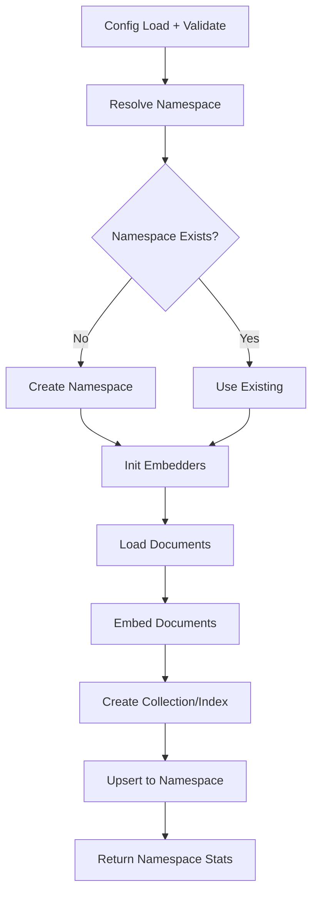
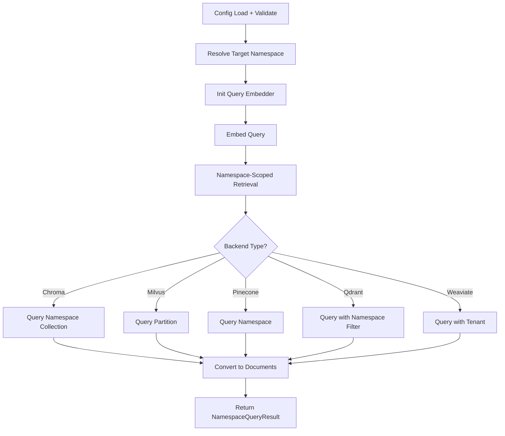

# LangChain: Namespaces

## 1. What This Feature Is

Namespaces provide **logical data partitioning** for environment, dataset, split, or tenant-scoped retrieval. This module implements namespace management across five backends:

| Backend | Pipeline Class | Isolation Mechanism |
|---------|----------------|---------------------|
| **Chroma** | `ChromaNamespacePipeline` | Collection-per-namespace |
| **Milvus** | `MilvusNamespacePipeline` | Partition-key isolation |
| **Pinecone** | `PineconeNamespacePipeline` | Native namespace isolation |
| **Qdrant** | `QdrantNamespacePipeline` | Payload-filter isolation |
| **Weaviate** | `WeaviateNamespacePipeline` | Tenant-scoped shards |

All are exported from `vectordb.langchain.namespaces` along with shared types (`IsolationStrategy`, `TenantStatus`, `NamespaceConfig`, etc.).

## 2. Why It Exists in Retrieval/RAG

**Problem**: Multi-tenant or multi-environment RAG systems need **logical isolation**:

- Different customers/teams shouldn't see each other's data
- Development/staging/production environments need separation
- Dataset splits (train/test/eval) should be isolated

**Namespace solutions**:

| Use Case | Namespace Strategy |
|----------|-------------------|
| **Multi-tenant SaaS** | Tenant-per-namespace isolation |
| **Environment separation** | Dev/staging/prod namespaces |
| **Dataset isolation** | Train/test/eval splits |
| **Domain segmentation** | Different knowledge domains |

This module exists to provide **backend-agnostic namespace management** with consistent APIs across all five vector databases.

## 3. Indexing Pipeline: Step-by-Step



### Indexing Flow

1. **Config Load + Validate**: Load namespace configuration
2. **Resolve Namespace**: Determine target namespace from config or runtime
3. **Namespace existence check**: Create if doesn't exist (backend-specific)
4. **Init Embedders**: Create and warm up document embedders
5. **Load Documents**: Via `DataloaderCatalog.create(...)`
6. **Embed Documents**: Batch embedding with embedder
7. **Create Collection/Index**: Backend-specific namespace-aware creation
8. **Upsert to Namespace**: Backend-specific namespace routing
9. **Return Stats**: `NamespaceStats` with timing metrics

### Backend-Specific Namespace Creation

| Backend | Creation Method |
|---------|-----------------|
| **Chroma** | Create collection with namespace-suffixed name |
| **Milvus** | Create partition within collection |
| **Pinecone** | Namespace created implicitly on first upsert |
| **Qdrant** | Create payload index for namespace field |
| **Weaviate** | Create tenant within collection |

## 4. Search Pipeline: Step-by-Step



### Search Flow

1. **Config Load + Validate**: Load namespace configuration
2. **Resolve Target Namespace**: From config or runtime parameter
3. **Init Query Embedder**: Create and warm up text embedder
4. **Embed Query**: Generate query embedding
5. **Namespace-Scoped Retrieval**: Backend-specific namespace targeting
6. **Convert to Documents**: Backend response → LangChain `Document` objects
7. **Return**: `NamespaceQueryResult` with documents and namespace metadata

### Backend-Specific Retrieval

| Backend | Namespace Targeting |
|---------|---------------------|
| **Chroma** | Query namespace-specific collection |
| **Milvus** | Query with partition filter |
| **Pinecone** | `query(namespace=...)` |
| **Qdrant** | Filter with `namespace_id` payload |
| **Weaviate** | `with_tenant(tenant_name)` |

## 5. When to Use It

Use namespaces when:

- **Multi-tenant SaaS**: Customer data isolation required
- **Environment separation**: Dev/staging/production isolation
- **Dataset splits**: Train/test/eval separation
- **Domain segmentation**: Different knowledge domains
- **Compliance requirements**: Data residency or privacy rules

## 6. When Not to Use It

Avoid namespaces when:

- **Single tenant**: No isolation requirement
- **Cross-namespace analytics**: Need to query across all data
- **Simple use cases**: Single collection sufficient
- **Frequent namespace switching**: High overhead for dynamic switching

## 7. What This Codebase Provides

### Public API

```python
from vectordb.langchain.namespaces import (
    # Pipeline classes
    "PineconeNamespacePipeline",
    "WeaviateNamespacePipeline",
    "MilvusNamespacePipeline",
    "QdrantNamespacePipeline",
    "ChromaNamespacePipeline",

    # Types
    "IsolationStrategy",
    "TenantStatus",
    "NamespaceConfig",
    "NamespaceStats",
    "NamespaceTimingMetrics",
    "NamespaceQueryResult",
    "CrossNamespaceComparison",
    "CrossNamespaceResult",
    "NamespaceOperationResult",

    # Errors
    "NamespaceError",
    "NamespaceNotFoundError",
    "NamespaceExistsError",
    "NamespaceConnectionError",
    "NamespaceOperationNotSupportedError",

    # Utilities
    "Timer",
    "NamespaceNameGenerator",
    "QuerySampler",
)
```

### Isolation Strategies

```python
from vectordb.langchain.namespaces import IsolationStrategy

# Available strategies
IsolationStrategy.NAMESPACE      # Pinecone-style
IsolationStrategy.PARTITION      # Milvus-style
IsolationStrategy.TENANT         # Weaviate-style
IsolationStrategy.PAYLOAD_FILTER # Qdrant-style
IsolationStrategy.COLLECTION     # Chroma-style
```

### Type Definitions

```python
from dataclasses import dataclass
from vectordb.langchain.namespaces import (
    NamespaceConfig,       # Namespace configuration
    NamespaceStats,        # Namespace statistics
    NamespaceQueryResult,  # Query result with namespace context
)

@dataclass
class NamespaceConfig:
    namespace_id: str
    isolation_strategy: IsolationStrategy
    backend_config: dict

@dataclass
class NamespaceStats:
    document_count: int
    vector_count: int
    memory_usage_bytes: int
    last_updated: datetime

@dataclass
class NamespaceQueryResult:
    documents: list
    namespace_id: str
    timing_metrics: NamespaceTimingMetrics
```

## 8. Backend-Specific Behavior Differences

### Chroma

| Aspect | Behavior |
|--------|----------|
| **Isolation** | Collection-per-namespace |
| **Naming** | Namespace-suffixed collection names |
| **Creation** | Explicit collection creation |
| **Query** | Query specific collection |

### Milvus

| Aspect | Behavior |
|--------|----------|
| **Isolation** | Partition-key within collection |
| **Schema** | Partition key field required |
| **Creation** | Create partition within collection |
| **Query** | Filter by partition key |

### Pinecone

| Aspect | Behavior |
|--------|----------|
| **Isolation** | Native namespace isolation |
| **Creation** | Implicit on first upsert |
| **Listing** | Via index statistics |
| **Query** | `query(namespace=...)` |

### Qdrant

| Aspect | Behavior |
|--------|----------|
| **Isolation** | Payload-filter based |
| **Index** | Payload index on namespace field |
| **Creation** | Create payload index |
| **Query** | Filter with namespace condition |

### Weaviate

| Aspect | Behavior |
|--------|----------|
| **Isolation** | Multi-tenancy with tenant shards |
| **Creation** | Explicit tenant creation |
| **Query** | `with_tenant(tenant_name)` |
| **Schema** | Multi-tenancy enabled per collection |

## 9. Configuration Semantics

### Namespace Configuration

```yaml
# Namespace definition
namespaces:
  - namespace_id: "tenant-acme"
    isolation_strategy: "partition"
    backend_config:
      partition_key: "tenant_id"

  - namespace_id: "tenant-globex"
    isolation_strategy: "partition"
    backend_config:
      partition_key: "tenant_id"

# Default namespace
namespace:
  default: "default-namespace"

# Backend configuration
milvus:
  uri: "http://localhost:19530"
  collection_name: "multi-tenant"
  use_partition_key: true
  partition_key_field: "tenant_id"
```

### Key Configuration Knobs

| Knob | Purpose |
|------|---------|
| **namespace_id** | Unique namespace identifier |
| **isolation_strategy** | Backend-specific isolation mechanism |
| **backend_config** | Backend-specific configuration |
| **default_namespace** | Fallback when no namespace specified |

## 10. Failure Modes and Edge Cases

### Configuration Failures

| Failure | Cause | Mitigation |
|---------|-------|------------|
| **Missing namespace config** | No namespace defined | Use default namespace |
| **Invalid isolation strategy** | Unsupported strategy for backend | Validate strategy compatibility |
| **Missing backend config** | Backend section missing | Add required backend config |

### Runtime Edge Cases

| Case | Behavior | Mitigation |
|------|----------|------------|
| **Namespace not found** | Raises `NamespaceNotFoundError` | Create namespace first |
| **Namespace exists** | Raises `NamespaceExistsError` (if strict) | Use existing or recreate |
| **Cross-namespace query** | Not supported by design | Query namespaces separately |
| **Empty namespace** | Returns empty results | Not an error |

### Backend-Specific Issues

| Backend | Issue | Mitigation |
|---------|-------|------------|
| **Chroma** | Collection naming conflicts | Use unique namespace names |
| **Milvus** | Partition limit | Monitor partition count |
| **Pinecone** | Namespace listing latency | Cache namespace list |
| **Qdrant** | Payload filter performance | Create payload indexes |
| **Weaviate** | Tenant creation overhead | Batch tenant creation |

## 11. Practical Usage Examples

### Example 1: Create Namespace

```python
from vectordb.langchain.namespaces import PineconeNamespacePipeline

pipeline = PineconeNamespacePipeline(
    "src/vectordb/langchain/namespaces/configs/pinecone_config.yaml"
)

# Create namespace
result = pipeline.create_namespace("tenant-acme")
print(f"Created namespace: {result.namespace_id}")
```

### Example 2: Index to Namespace

```python
from vectordb.langchain.namespaces import MilvusNamespacePipeline

pipeline = MilvusNamespacePipeline(
    "src/vectordb/langchain/namespaces/configs/milvus_config.yaml"
)

# Index documents to specific namespace
result = pipeline.index_documents(
    documents=docs,
    namespace_id="tenant-acme",
)
print(f"Indexed {result.document_count} documents")
```

### Example 3: Query Namespace

```python
from vectordb.langchain.namespaces import QdrantNamespacePipeline

pipeline = QdrantNamespacePipeline(
    "src/vectordb/langchain/namespaces/configs/qdrant_config.yaml"
)

# Query specific namespace
result = pipeline.query(
    query="What is machine learning?",
    namespace_id="tenant-acme",
    top_k=10,
)
print(f"Retrieved {len(result.documents)} documents from {result.namespace_id}")
```

### Example 4: List Namespaces

```python
from vectordb.langchain.namespaces import WeaviateNamespacePipeline

pipeline = WeaviateNamespacePipeline(
    "src/vectordb/langchain/namespaces/configs/weaviate_config.yaml"
)

# List all namespaces
namespaces = pipeline.list_namespaces()
for ns in namespaces:
    print(f"Namespace: {ns.namespace_id}, Status: {ns.status}")
```

### Example 5: Cross-Namespace Comparison

```python
from vectordb.langchain.namespaces import ChromaNamespacePipeline

pipeline = ChromaNamespacePipeline(
    "src/vectordb/langchain/namespaces/configs/chroma_config.yaml"
)

# Compare across namespaces
comparison = pipeline.compare_namespaces(
    query="machine learning",
    namespace_ids=["tenant-acme", "tenant-globex"],
    top_k=5,
)
print(f"Comparison results: {comparison.results}")
```

## 12. Source Walkthrough Map

### Primary Module Files

| File | Purpose |
|------|---------|
| `src/vectordb/langchain/namespaces/__init__.py` | Public API exports |
| `src/vectordb/langchain/namespaces/README.md` | Feature overview |

### Core Implementation

| File | Purpose |
|------|---------|
| `types.py` | Type definitions (`IsolationStrategy`, `NamespaceConfig`, etc.) |
| `pinecone_namespaces.py` | Pinecone namespace implementation |
| `weaviate_namespaces.py` | Weaviate namespace implementation |
| `milvus_namespaces.py` | Milvus namespace implementation |
| `qdrant_namespaces.py` | Qdrant namespace implementation |
| `chroma_namespaces.py` | Chroma namespace implementation |
| `chroma_collections.py` | Chroma collection management |

### Utilities

| File | Purpose |
|------|---------|
| `utils/embeddings.py` | Embedder utilities |
| `utils/name_generator.py` | Namespace name generation |
| `utils/query_sampler.py` | Query sampling utilities |

### Configuration Examples

| Directory | Backend |
|-----------|---------|
| `configs/pinecone/` | Pinecone namespace configs |
| `configs/weaviate/` | Weaviate tenant configs |
| `configs/milvus/` | Milvus partition configs |
| `configs/qdrant/` | Qdrant payload filter configs |
| `configs/chroma/` | Chroma collection configs |

### Test Files

| File | Coverage |
|------|----------|
| `tests/langchain/namespaces/test_types.py` | Type definitions |
| `tests/langchain/namespaces/test_pinecone.py` | Pinecone tests |
| `tests/langchain/namespaces/test_weaviate.py` | Weaviate tests |
| `tests/langchain/namespaces/test_milvus.py` | Milvus tests |
| `tests/langchain/namespaces/test_qdrant.py` | Qdrant tests |
| `tests/langchain/namespaces/test_chroma.py` | Chroma tests |

---

**Related Documentation**:

- **Multi-Tenancy** (`docs/langchain/multi-tenancy.md`): Tenant isolation patterns
- **Metadata Filtering** (`docs/langchain/metadata-filtering.md`): Constraint-based retrieval
- **Core Databases** (`docs/core/databases.md`): Backend wrapper details
