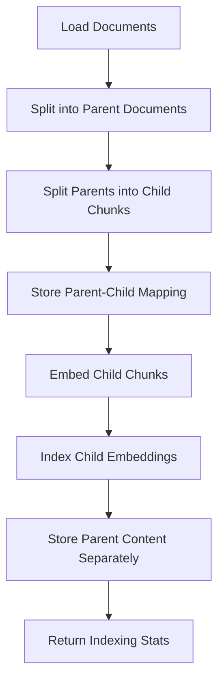
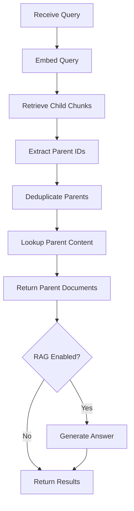

# LangChain: Parent Document Retrieval

## 1. What This Feature Is

Parent document retrieval implements a **two-level chunking strategy**:

1. **Index fine-grained chunks** for precise retrieval
2. **Return larger parent documents** for better LLM context

This module implements **five backend-specific pipeline pairs** using LangChain components:

| Backend | Indexing Pipeline | Search Pipeline |
|---------|-------------------|-----------------|
| **Chroma** | `ChromaParentDocIndexingPipeline` | `ChromaParentDocSearchPipeline` |
| **Milvus** | `MilvusParentDocIndexingPipeline` | `MilvusParentDocSearchPipeline` |
| **Pinecone** | `PineconeParentDocIndexingPipeline` | `PineconeParentDocSearchPipeline` |
| **Qdrant** | `QdrantParentDocIndexingPipeline` | `QdrantParentDocSearchPipeline` |
| **Weaviate** | `WeaviateParentDocIndexingPipeline` | `WeaviateParentDocSearchPipeline` |

All are exported from `vectordb.langchain.parent_document_retrieval`.

## 2. Why It Exists in Retrieval/RAG

**Problem**: Standard chunking creates a tradeoff:

- **Small chunks**: Precise retrieval but lack context for LLM
- **Large chunks**: Good context but imprecise retrieval

**Example**:

```
Document: 10-page technical report

Small chunks (200 tokens each):
- Chunk 42: "The algorithm uses gradient descent..." ← Retrieved
- Problem: Missing context about what algorithm, why, applications

Large chunks (2000 tokens each):
- Chunk 5: Full section on algorithm ← Too much noise, retrieval less precise

Parent document retrieval:
- Index: Small chunks for precise matching
- Retrieve: Return parent section (2000 tokens) for LLM context
```

### Benefits

| Benefit | Impact |
|---------|--------|
| **Precise retrieval** | Small chunks match query accurately |
| **Rich context** | Parent documents provide full context |
| **Better RAG answers** | LLM has complete information |
| **Flexible chunking** | Tune child/parent sizes independently |

## 3. Indexing Pipeline: Step-by-Step



### Indexing Flow

1. **Load documents**: Via `DataloaderCatalog.create(...).load().to_langchain()`
2. **Split into parents**: `parent_splitter.split_documents(documents)`
3. **Split parents into children**: `child_splitter.split_documents(parent_docs)`
4. **Store parent-child mapping**: Each child gets `parent_id` in metadata
5. **Embed child chunks**: `embedder.embed_documents(child_docs)`
6. **Index child embeddings**: Backend upsert with child vectors
7. **Store parent content**: Either in same DB (separate collection) or in-memory lookup
8. **Return**: `{"documents_indexed": child_count, "parent_count": parent_count}`

### Parent-Child Metadata Structure

```python
# Child chunk metadata
{
    "parent_id": "doc-123-parent",
    "parent_content": "Full parent section text...",  # Or reference
    "chunk_index": 2,  # Which child within parent
    "source": "original_source",
}
```

## 4. Search Pipeline: Step-by-Step



### Search Flow

1. **Embed query**: `embedder.embed_query(query)`
2. **Retrieve child chunks**: `db.search(query_embedding, top_k)`
3. **Extract parent IDs**: From child metadata `parent_id`
4. **Deduplicate parents**: Multiple children may map to same parent
5. **Lookup parent content**: From in-memory store or separate collection
6. **Return parent documents**: Full parent text for LLM context
7. **Optional RAG**: Generate answer from parent documents

### Deduplication Example

```python
# Retrieved children (top_k=10)
children = [
    {"id": "child-1", "parent_id": "parent-A", "score": 0.9},
    {"id": "child-2", "parent_id": "parent-A", "score": 0.8},  # Same parent
    {"id": "child-3", "parent_id": "parent-B", "score": 0.7},
]

# After dedup (unique parents)
parents = [
    {"id": "parent-A", "content": "Full parent A text..."},
    {"id": "parent-B", "content": "Full parent B text..."},
]
```

## 5. When to Use It

Use parent document retrieval when:

- **Long documents**: Reports, articles, books with clear section structure
- **Precise matching needed**: Small chunks for accurate retrieval
- **Context matters**: LLM needs full section for coherent answers
- **Hierarchical content**: Documents have natural parent-child structure

### Ideal Use Cases

| Use Case | Child Size | Parent Size |
|----------|------------|-------------|
| **Technical docs** | 200 tokens | 2000 tokens |
| **Legal documents** | 300 tokens | 3000 tokens |
| **Research papers** | 250 tokens | 2500 tokens |
| **Books** | 500 tokens | 5000 tokens (chapter) |

## 6. When Not to Use It

Avoid parent document retrieval when:

- **Short documents**: No meaningful parent-child structure
- **Simple QA**: Single chunks suffice for answers
- **Tight storage budget**: 2x storage for parent+child
- **Flat content**: No natural hierarchy to exploit

## 7. What This Codebase Provides

### Public API

```python
from vectordb.langchain.parent_document_retrieval import (
    # Indexing pipelines
    "ChromaParentDocIndexingPipeline",
    "MilvusParentDocIndexingPipeline",
    "PineconeParentDocIndexingPipeline",
    "QdrantParentDocIndexingPipeline",
    "WeaviateParentDocIndexingPipeline",

    # Search pipelines
    "ChromaParentDocSearchPipeline",
    "MilvusParentDocSearchPipeline",
    "PineconeParentDocSearchPipeline",
    "QdrantParentDocSearchPipeline",
    "WeaviateParentDocSearchPipeline",
)
```

### Configuration Types

```python
from vectordb.langchain.parent_document_retrieval.utils.types import (
    ChunkingConfig,      # parent_chunk_size, child_chunk_size, overlap
    RetrievalConfig,     # top_k, parent_top_k
    DataLoaderConfig,    # dataset type, split, limit
    EmbeddingConfig,     # model, device, batch_size
)
```

### Parent Store Utilities

```python
from vectordb.langchain.parent_document_retrieval.utils.parent_store import (
    create_parent_child_mapping,  # Build parent-child relationships
    get_parent_from_child,        # Lookup parent by child ID
    deduplicate_parents,          # Remove duplicate parents from results
)
```

## 8. Backend-Specific Behavior Differences

### Common Pattern

All backends follow the **same parent retrieval pattern**:

1. Index child chunks with parent metadata
2. Retrieve children via vector search
3. Lookup parents from store (in-memory or separate collection)
4. Return parent documents

### Backend Storage Differences

| Backend | Child Storage | Parent Storage |
|---------|---------------|----------------|
| **Chroma** | Main collection | Separate parent collection |
| **Milvus** | Main collection | Separate partition or collection |
| **Pinecone** | Main index, namespace | Separate namespace |
| **Qdrant** | Main collection payload | Payload or separate collection |
| **Weaviate** | Main class properties | Separate class or properties |

### Retrieval Differences

| Backend | Child Retrieval | Parent Lookup |
|---------|-----------------|---------------|
| **Chroma** | `collection.query()` | Separate `parent_collection.get()` |
| **Milvus** | `client.search()` | Separate collection query |
| **Pinecone** | `index.query()` | Separate namespace fetch |
| **Qdrant** | `client.search()` | Payload lookup or separate collection |
| **Weaviate** | `collection.query.near_vector()` | Separate class query |

## 9. Configuration Semantics

### Required Sections

```yaml
# Chunking configuration
chunking:
  parent_chunk_size: 2000    # Parent document size in tokens/chars
  child_chunk_size: 200      # Child chunk size for indexing
  overlap: 50                # Overlap between chunks

# Dataloader (for indexing)
dataloader:
  type: "triviaqa"
  split: "test"
  limit: 500

# Embeddings (for child chunks)
embeddings:
  model: "sentence-transformers/all-MiniLM-L6-v2"
  device: "cpu"
  batch_size: 32

# Retrieval configuration
retrieval:
  top_k: 10        # Number of child chunks to retrieve
  parent_top_k: 5  # Number of parent documents to return

# Backend section (one of)
chroma:
  collection_name: "parent-docs"
  persist_dir: "./chroma"

milvus:
  uri: "http://localhost:19530"
  collection_name: "parent-docs"
```

### Chunking Parameters

| Parameter | Default | Impact |
|-----------|---------|--------|
| **parent_chunk_size** | 2000 | Larger = more context, more noise |
| **child_chunk_size** | 200 | Smaller = more precise retrieval |
| **overlap** | 50 | Prevents context loss at boundaries |

### Retrieval Parameters

| Parameter | Default | Impact |
|-----------|---------|--------|
| **top_k** | 10 | More children = more parent candidates |
| **parent_top_k** | 5 | Final parent count for RAG |

## 10. Failure Modes and Edge Cases

### Configuration Failures

| Failure | Cause | Mitigation |
|---------|-------|------------|
| **child > parent** | `child_chunk_size > parent_chunk_size` | Validate config; swap or error |
| **Missing parent store** | Parent collection not created | Initialize parent store at setup |
| **Invalid overlap** | `overlap > child_chunk_size` | Validate overlap < child size |

### Runtime Edge Cases

| Case | Behavior | Mitigation |
|------|----------|------------|
| **Child without parent** | Missing parent_id in metadata | Skip or log warning |
| **Parent lookup fails** | Parent not in store | Return child as fallback |
| **All children same parent** | Dedup returns 1 parent | Accept; retrieval was precise |

### Backend-Specific Issues

| Backend | Issue | Mitigation |
|---------|-------|------------|
| **Chroma** | Parent collection must exist | Create at initialization |
| **Milvus** | Partition key setup needed | Configure at collection creation |
| **Pinecone** | Namespace isolation | Ensure parent namespace exists |
| **Qdrant** | Payload size limits | Store parents separately if large |
| **Weaviate** | Class schema required | Define parent class at setup |

## 11. Practical Usage Examples

### Example 1: Basic Parent Document Indexing

```python
from vectordb.langchain.parent_document_retrieval import (
    ChromaParentDocIndexingPipeline,
)

config_path = "src/vectordb/langchain/parent_document_retrieval/configs/chroma_triviaqa.yaml"

indexer = ChromaParentDocIndexingPipeline(config_path)
stats = indexer.run()

print(f"Indexed {stats['child_count']} child chunks from {stats['parent_count']} parents")
```

### Example 2: Parent Document Search

```python
from vectordb.langchain.parent_document_retrieval import (
    ChromaParentDocSearchPipeline,
)

searcher = ChromaParentDocSearchPipeline(config_path)
results = searcher.search(
    query="What is machine learning?",
    top_k=10,  # Retrieve 10 child chunks
)

# Results contain parent documents (full context)
print(f"Retrieved {len(results['documents'])} parent documents")
for doc in results["documents"]:
    print(f"Parent ({len(doc.page_content)} chars): {doc.page_content[:100]}...")
```

### Example 3: Custom Chunk Sizes

```yaml
# config.yaml
chunking:
  parent_chunk_size: 3000  # Large parent for full context
  child_chunk_size: 150    # Small child for precise matching
  overlap: 30

retrieval:
  top_k: 20         # Retrieve more children
  parent_top_k: 3   # Return fewer parents
```

### Example 4: Parent Document RAG

```python
from vectordb.langchain.parent_document_retrieval import (
    MilvusParentDocSearchPipeline,
)

config = {
    "chunking": {"parent_chunk_size": 2000, "child_chunk_size": 200},
    "retrieval": {"top_k": 10, "parent_top_k": 5},
    "rag": {"enabled": True, "model": "llama-3.3-70b-versatile"},
}

searcher = MilvusParentDocSearchPipeline(config)
result = searcher.search(query="Explain quantum computing", top_k=10)

if result.get("answer"):
    print(f"Answer: {result['answer']}")
```

### Example 5: Parent Store Utility

```python
from vectordb.langchain.parent_document_retrieval.utils.parent_store import (
    create_parent_child_mapping,
    deduplicate_parents,
)

# Create mapping
parent_child_map = create_parent_child_mapping(documents)
# Returns: {parent_id: [child1, child2, ...], ...}

# Deduplicate retrieved children
children = [{"parent_id": "A"}, {"parent_id": "A"}, {"parent_id": "B"}]
unique_parents = deduplicate_parents(children)
# Returns: [{"parent_id": "A"}, {"parent_id": "B"}]
```

## 12. Source Walkthrough Map

### Primary Module Files

| File | Purpose |
|------|---------|
| `src/vectordb/langchain/parent_document_retrieval/__init__.py` | Public API exports |
| `src/vectordb/langchain/parent_document_retrieval/README.md` | Feature overview |

### Core Implementation

| File | Purpose |
|------|---------|
| `utils/types.py` | Configuration type definitions |
| `utils/parent_store.py` | Parent-child mapping utilities |

### Indexing Implementations

| File | Backend |
|------|---------|
| `indexing/chroma.py` | Chroma |
| `indexing/milvus.py` | Milvus |
| `indexing/pinecone.py` | Pinecone |
| `indexing/qdrant.py` | Qdrant |
| `indexing/weaviate.py` | Weaviate |

### Search Implementations

| File | Backend |
|------|---------|
| `search/chroma.py` | Chroma |
| `search/milvus.py` | Milvus |
| `search/pinecone.py` | Pinecone |
| `search/qdrant.py` | Qdrant |
| `search/weaviate.py` | Weaviate |

### Configuration Examples

| Directory | Backend + Datasets |
|-----------|-------------------|
| `configs/chroma/` | Chroma + TriviaQA, ARC |
| `configs/milvus/` | Milvus + TriviaQA, ARC |
| `configs/pinecone/` | Pinecone + TriviaQA, ARC |
| `configs/qdrant/` | Qdrant + TriviaQA, ARC |
| `configs/weaviate/` | Weaviate + TriviaQA, Earnings Calls |

### Test Files

| File | Coverage |
|------|----------|
| `tests/langchain/parent_document_retrieval/test_indexing.py` | Indexing tests |
| `tests/langchain/parent_document_retrieval/test_search.py` | Search tests |
| `tests/langchain/parent_document_retrieval/test_parent_store.py` | Parent store tests |

### Shared Utilities

| File | Purpose |
|------|---------|
| `src/vectordb/langchain/utils/embeddings.py` | Embedder factory |
| `src/vectordb/langchain/utils/config.py` | Config loading |
| `src/vectordb/langchain/utils/rag.py` | RAG helper |

---

**Related Documentation**:

- **Semantic Search** (`docs/langchain/semantic-search.md`): Standard chunk retrieval
- **Contextual Compression** (`docs/langchain/contextual-compression.md`): Context trimming
- **Metadata Filtering** (`docs/langchain/metadata-filtering.md`): Constraint-based retrieval
