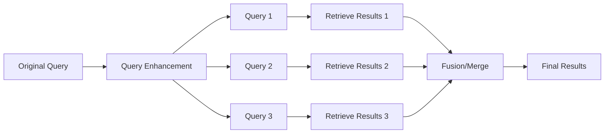
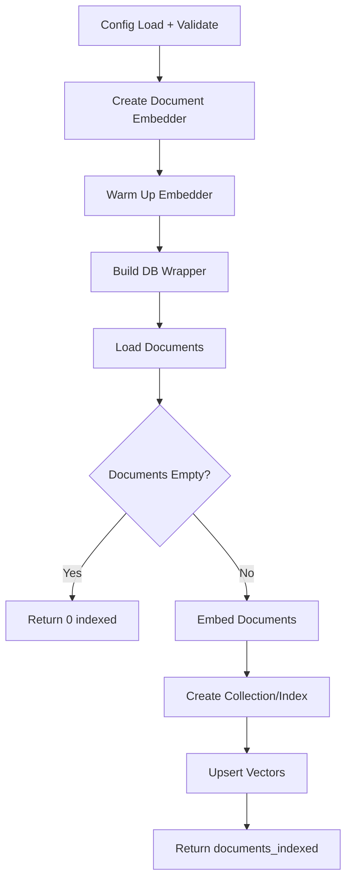
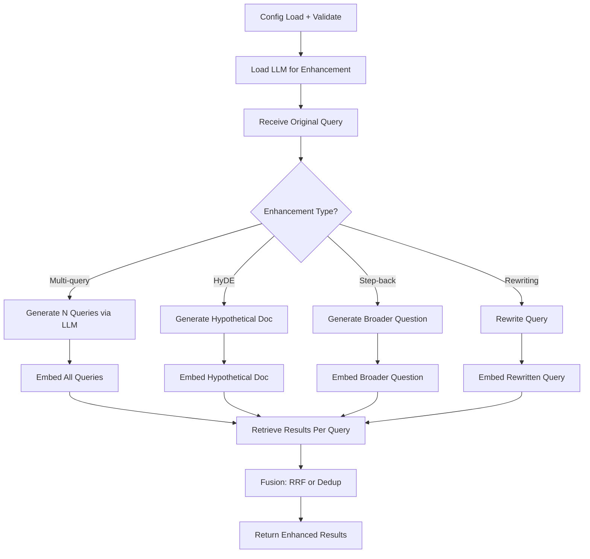

# LangChain: Query Enhancement

## 1. What This Feature Is

Query enhancement expands or reformulates queries to improve recall for ambiguous or sparse prompts. This module implements multiple query transformation techniques:

| Technique | Description | Use Case |
|-----------|-------------|----------|
| **Multi-query** | LLM generates multiple query variations | Ambiguous queries |
| **HyDE** (Hypothetical Document Embeddings) | Generate fake answer, embed as query | Domain-specific queries |
| **Step-back** | Generate broader "step-back" question | Complex multi-part queries |
| **Query rewriting** | LLM reformulates for retrieval | Conversational queries |

This module implements **five backend-specific pipeline pairs** using LangChain components:

| Backend | Indexing Pipeline | Search Pipeline |
|---------|-------------------|-----------------|
| **Chroma** | `ChromaQueryEnhancementIndexingPipeline` | `ChromaQueryEnhancementSearchPipeline` |
| **Milvus** | `MilvusQueryEnhancementIndexingPipeline` | `MilvusQueryEnhancementSearchPipeline` |
| **Pinecone** | `PineconeQueryEnhancementIndexingPipeline` | `PineconeQueryEnhancementSearchPipeline` |
| **Qdrant** | `QdrantQueryEnhancementIndexingPipeline` | `QdrantQueryEnhancementSearchPipeline` |
| **Weaviate** | `WeaviateQueryEnhancementIndexingPipeline` | `WeaviateQueryEnhancementSearchPipeline` |

All are exported from `vectordb.langchain.query_enhancement`.

## 2. Why It Exists in Retrieval/RAG

**Problem**: User queries are often:

- **Ambiguous**: "How does it work?" (what is "it"?)
- **Sparse**: "Python error" (which error? what context?)
- **Conversational**: "What about the second one?" (requires context)
- **Complex**: Multi-part questions needing decomposition

**Standard retrieval** fails on these because:

- Embedding models encode surface form, not intent
- Single query = single retrieval attempt
- No query reformulation or expansion

**Query enhancement** addresses these gaps:



### Technique Comparison

| Technique | LLM Calls | Retrieval Calls | Best For |
|-----------|-----------|-----------------|----------|
| **Multi-query** | 1 (generates N queries) | N | Ambiguous queries |
| **HyDE** | 1 (generate doc) | 1 | Domain-specific |
| **Step-back** | 1 (generate broader) | 1-2 | Complex queries |
| **Rewriting** | 1 (reformulate) | 1 | Conversational |

## 3. Indexing Pipeline: Step-by-Step



### Common Indexing Sequence

Query enhancement indexing is **identical to standard semantic indexing** because enhancement happens at query time:

1. **Load config**: Via `ConfigLoader.load()` with env var resolution
2. **Validate sections**: Required: `dataloader`, `embeddings`, `<backend>`
3. **Create document embedder**: For document indexing
4. **Warm up embedder**: Load model into memory
5. **Build DB wrapper**: Backend-specific connection
6. **Load documents**: `DataloaderCatalog.create(...).load().to_langchain()`
7. **Early return**: If empty, return `{"documents_indexed": 0}`
8. **Embed documents**: Standard dense embeddings
9. **Create collection/index**: Backend-specific method
10. **Upsert vectors**: With metadata
11. **Return**: `{"documents_indexed": <count>}`

**Note**: Query enhancement models (LLM) are **NOT used during indexing** — only at query time.

## 4. Search Pipeline: Step-by-Step



### Multi-Query Enhancement Flow

1. **Load config**: With `query_enhancement.type = "multi_query"`
2. **Initialize LLM**: For query generation via `QueryEnhancer`
3. **Generate queries**: `enhancer.generate_multi_queries(query, num_queries)`
4. **Embed each query**: `embedder.embed_query(q)` for each
5. **Retrieve per query**: `db.search(query_embedding, top_k)` for each
6. **Fuse results**: `ResultMerger.rrf_fusion_many(result_lists)` for deduplication
7. **Return**: Top-k fused results

### HyDE (Hypothetical Document Embeddings) Flow

1. **Generate hypothetical doc**: `enhancer.generate_hypothetical_documents(query, num_docs)`
2. **Embed hypothetical doc**: `embedder.embed_documents(hypothetical_docs)`
3. **Retrieve with doc embedding**: `db.search(doc_embedding, top_k)`
4. **Return**: Retrieved documents (hypothetical doc discarded)

### RRF Fusion Algorithm

```python
from vectordb.langchain.utils import ResultMerger

# RRF fusion across multiple result lists
fused = ResultMerger.rrf_fusion_many(
    result_lists=[results1, results2, results3],
    k=60,
    top_k=10,
)
```

## 5. When to Use It

Use query enhancement when:

- **Ambiguous queries**: User intent unclear from surface form
- **Sparse queries**: Too short for good embedding
- **Conversational context**: Requires query rewriting
- **Domain-specific**: HyDE helps with technical domains
- **Complex questions**: Step-back improves recall

### Technique Selection Guide

| Query Type | Recommended Technique |
|------------|----------------------|
| **Ambiguous** | Multi-query |
| **Technical/Domain** | HyDE |
| **Multi-part** | Step-back |
| **Conversational** | Query rewriting |
| **Uncertain** | Multi-query (safest) |

## 6. When Not to Use It

Avoid query enhancement when:

- **Clear, specific queries**: Standard retrieval suffices
- **Tight latency budget**: LLM adds 500-2000ms overhead
- **High throughput**: LLM calls are expensive
- **No LLM access**: Requires API key or local model

### Latency Breakdown

| Stage | Typical Latency |
|-------|-----------------|
| **LLM query generation** | 500-2000ms |
| **Multiple embeddings** | 10-50ms × N queries |
| **Multiple retrievals** | 50-200ms × N queries |
| **RRF fusion** | 5-20ms |
| **Total with enhancement** | ~600-2500ms |
| **Total without enhancement** | ~60-250ms |

## 7. What This Codebase Provides

### Public API

```python
from vectordb.langchain.query_enhancement import (
    # Indexing pipelines (standard)
    "ChromaQueryEnhancementIndexingPipeline",
    "MilvusQueryEnhancementIndexingPipeline",
    "PineconeQueryEnhancementIndexingPipeline",
    "QdrantQueryEnhancementIndexingPipeline",
    "WeaviateQueryEnhancementIndexingPipeline",

    # Search pipelines (with enhancement)
    "ChromaQueryEnhancementSearchPipeline",
    "MilvusQueryEnhancementSearchPipeline",
    "PineconeQueryEnhancementSearchPipeline",
    "QdrantQueryEnhancementSearchPipeline",
    "WeaviateQueryEnhancementSearchPipeline",
)
```

### Configuration Types

```python
from vectordb.langchain.query_enhancement.utils.types import (
    QueryEnhancementConfig,
    DataLoaderConfig,
    EmbeddingConfig,
    LLMConfig,
)
```

### Fusion Utilities

```python
from vectordb.langchain.query_enhancement.utils.fusion import (
    stable_doc_id,        # Generate consistent doc IDs
    rrf_fusion_many,      # RRF fusion across N result lists
    deduplicate_by_content, # Remove duplicate content
)
```

## 8. Backend-Specific Behavior Differences

### Common Pattern

All backends follow the **same enhancement pattern**:

1. Generate/enhance queries via LLM (backend-agnostic)
2. Retrieve using backend's native search
3. Fuse results in Python (RRF or dedup)

### Backend Retrieval Differences

| Backend | Retrieval Method | Enhancement Integration |
|---------|------------------|------------------------|
| **Chroma** | `query(query_embedding, n_results)` | Python-side fusion after retrieval |
| **Milvus** | `search(query_embedding, top_k)` | Python-side fusion after retrieval |
| **Pinecone** | `query(vector, top_k, namespace)` | Python-side fusion after retrieval |
| **Qdrant** | `search(query_vector, top_k)` | Python-side fusion after retrieval |
| **Weaviate** | `query.near_vector(vector, limit)` | Python-side fusion after retrieval |

### Key Point

**Query enhancement is backend-agnostic** — the LLM and fusion run in Python, so enhancement behavior is consistent across all backends.

## 9. Configuration Semantics

### Required Sections

```yaml
# Dataloader (for indexing)
dataloader:
  type: "triviaqa"
  split: "test"
  limit: 500

# Embeddings (for retrieval)
embeddings:
  model: "sentence-transformers/all-MiniLM-L6-v2"
  device: "cpu"
  batch_size: 32

# Query enhancement configuration
query_enhancement:
  type: "multi_query"  # or "hyde", "step_back", "rewriting"
  num_queries: 5       # For multi-query
  num_hyde_docs: 3     # For HyDE
  llm:
    model: "llama-3.3-70b-versatile"
    api_key: "${GROQ_API_KEY}"
    api_base_url: "https://api.groq.com/openai/v1"
    temperature: 0.7
    max_tokens: 256

# Search configuration
search:
  top_k: 10  # Final result count after fusion

# Backend section (one of)
milvus:
  uri: "http://localhost:19530"
  collection_name: "enhancement-demo"

pinecone:
  api_key: "${PINECONE_API_KEY}"
  index_name: "enhancement-index"
```

### Enhancement Type Options

| Type | Config Keys | Description |
|------|-------------|-------------|
| **multi_query** | `num_queries` | Generate N query variations |
| **hyde** | `num_hyde_docs` | Generate N hypothetical docs |
| **step_back** | N/A | Generate broader question |
| **rewriting** | N/A | Reformulate for retrieval |

### LLM Configuration

```yaml
llm:
  model: "llama-3.3-70b-versatile"  # Or other Groq model
  api_key: "${GROQ_API_KEY}"        # Required
  temperature: 0.7                   # Creativity control
  max_tokens: 256                    # Output length limit
```

## 10. Failure Modes and Edge Cases

### Configuration Failures

| Failure | Cause | Mitigation |
|---------|-------|------------|
| **Missing LLM config** | No `query_enhancement.llm` | Raises error at LLM init |
| **Invalid enhancement type** | Unknown `query_enhancement.type` | Validate against allowed types |
| **Missing API key** | `${GROQ_API_KEY}` not set | Set env var or provide in config |

### Runtime Edge Cases

| Case | Behavior | Mitigation |
|------|----------|------------|
| **LLM returns empty** | No queries generated | Fallback to original query |
| **All queries fail retrieval** | Empty result lists | Return empty results |
| **Duplicate queries** | LLM generates same query | RRF dedup handles automatically |
| **LLM timeout** | API call fails | Retry or fallback to original |

### Fusion Edge Cases

| Case | Behavior |
|------|----------|
| **Single result list** | RRF returns as-is |
| **Empty result lists** | RRF returns empty |
| **All duplicates** | Dedup returns single copy |

### LLM-Specific Issues

| Issue | Impact | Mitigation |
|-------|--------|------------|
| **Rate limiting** | API throttling | Implement retry with backoff |
| **Token limit** | Long queries truncated | Truncate input query |
| **Model unavailable** | API error | Fallback to simpler model |

## 11. Practical Usage Examples

### Example 1: Multi-Query Enhancement

```yaml
# config.yaml
query_enhancement:
  type: "multi_query"
  num_queries: 5
  llm:
    model: "llama-3.3-70b-versatile"
    api_key: "${GROQ_API_KEY}"
```

```python
from vectordb.langchain.query_enhancement import MilvusQueryEnhancementSearchPipeline

searcher = MilvusQueryEnhancementSearchPipeline("config.yaml")
results = searcher.search(
    query="How does it work?",  # Ambiguous query
    top_k=10,
)

# Internally generates 5 variations, retrieves, fuses with RRF
print(f"Retrieved {len(results['documents'])} enhanced results")
```

### Example 2: HyDE for Domain-Specific Query

```yaml
# config.yaml
query_enhancement:
  type: "hyde"
  num_hyde_docs: 3
  llm:
    model: "llama-3.3-70b-versatile"
    api_key: "${GROQ_API_KEY}"
```

```python
from vectordb.langchain.query_enhancement import QdrantQueryEnhancementSearchPipeline

searcher = QdrantQueryEnhancementSearchPipeline("config.yaml")
results = searcher.search(
    query="What is the mechanism of action of metformin?",  # Domain-specific
    top_k=10,
)

# Generates hypothetical answer, embeds as doc, retrieves
```

### Example 3: Step-Back for Complex Query

```yaml
# config.yaml
query_enhancement:
  type: "step_back"
  llm:
    model: "llama-3.3-70b-versatile"
    api_key: "${GROQ_API_KEY}"
```

```python
from vectordb.langchain.query_enhancement import PineconeQueryEnhancementSearchPipeline

searcher = PineconeQueryEnhancementSearchPipeline("config.yaml")
results = searcher.search(
    query="Compare the economic policies of FDR and Reagan and their impact on inflation",
    top_k=10,
)

# Generates broader question, retrieves, returns results
```

### Example 4: RRF Fusion Utility

```python
from vectordb.langchain.query_enhancement.utils.fusion import rrf_fusion_many

# Simulate results from 3 queries
result_lists = [
    [doc1, doc2, doc3],  # Query 1 results
    [doc2, doc4, doc5],  # Query 2 results
    [doc1, doc3, doc6],  # Query 3 results
]

# Fuse with RRF
fused = rrf_fusion_many(result_lists, k=60)
# Returns deduplicated, ranked list
```

### Example 5: Fallback to Original Query

```python
from vectordb.langchain.query_enhancement import ChromaQueryEnhancementSearchPipeline

searcher = ChromaQueryEnhancementSearchPipeline("config.yaml")

try:
    results = searcher.search(
        query="test query",
        top_k=10,
    )
except LLMError:
    # Fallback to standard search without enhancement
    results = searcher.search_without_enhancement(
        query="test query",
        top_k=10,
    )
```

## 12. Source Walkthrough Map

### Primary Module Files

| File | Purpose |
|------|---------|
| `src/vectordb/langchain/query_enhancement/__init__.py` | Public API exports |
| `src/vectordb/langchain/query_enhancement/README.md` | Feature overview |

### Core Implementation

| File | Purpose |
|------|---------|
| `search/base.py` | `BaseQueryEnhancementSearchPipeline` |
| `indexing/base.py` | `BaseQueryEnhancementIndexingPipeline` |
| `utils/types.py` | Configuration type definitions |
| `utils/fusion.py` | RRF fusion utilities |

### Backend Implementations

| Directory | Files |
|-----------|-------|
| `search/` | chroma.py, milvus.py, pinecone.py, qdrant.py, weaviate.py |
| `indexing/` | chroma.py, milvus.py, pinecone.py, qdrant.py, weaviate.py |

### Configuration Examples

| Directory | Backend + Datasets |
|-----------|-------------------|
| `configs/chroma/` | Chroma + TriviaQA, ARC |
| `configs/milvus/` | Milvus + TriviaQA, ARC |
| `configs/pinecone/` | Pinecone + TriviaQA, ARC |
| `configs/qdrant/` | Qdrant + TriviaQA, ARC |
| `configs/weaviate/` | Weaviate + TriviaQA, Earnings Calls |

### Test Files

| File | Coverage |
|------|----------|
| `tests/langchain/query_enhancement/test_base.py` | Base pipeline tests |
| `tests/langchain/query_enhancement/test_fusion.py` | RRF fusion tests |
| `tests/langchain/query_enhancement/test_*.py` | Per-backend integration tests |

### Shared Utilities

| File | Purpose |
|------|---------|
| `src/vectordb/langchain/utils/embeddings.py` | Embedder factory |
| `src/vectordb/langchain/utils/rag.py` | LLM helper for query generation |
| `src/vectordb/langchain/utils/config.py` | Config loading |

---

**Related Documentation**:

- **Semantic Search** (`docs/langchain/semantic-search.md`): Standard retrieval baseline
- **Reranking** (`docs/langchain/reranking.md`): Post-retrieval scoring
- **Contextual Compression** (`docs/langchain/contextual-compression.md`): Result compression
