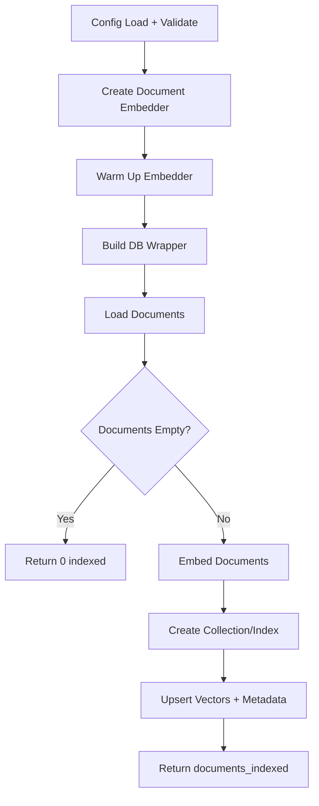
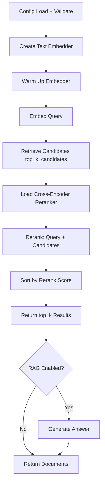

# LangChain: Reranking

## 1. What This Feature Is

Reranking applies **second-stage scoring** to improve precision over initial retrieval candidates. This is a **two-stage retrieval** technique:

1. **First Stage (Retrieval)**: Fast vector similarity search retrieves a larger candidate set (typically 3x the desired results) using bi-encoder embeddings
2. **Second Stage (Reranking)**: A more accurate cross-encoder model reorders candidates by computing relevance scores for each query-document pair

This module implements **five backend-specific pipeline pairs** using LangChain components:

| Backend | Indexing Pipeline | Search Pipeline |
|---------|-------------------|-----------------|
| **Chroma** | `ChromaRerankingIndexingPipeline` | `ChromaRerankingSearchPipeline` |
| **Milvus** | `MilvusRerankingIndexingPipeline` | `MilvusRerankingSearchPipeline` |
| **Pinecone** | `PineconeRerankingIndexingPipeline` | `PineconeRerankingSearchPipeline` |
| **Qdrant** | `QdrantRerankingIndexingPipeline` | `QdrantRerankingSearchPipeline` |
| **Weaviate** | `WeaviateRerankingIndexingPipeline` | `WeaviateRerankingSearchPipeline` |

All are exported from `vectordb.langchain.reranking`.

## 2. Why It Exists in Retrieval/RAG

### Bi-Encoder vs Cross-Encoder

| Aspect | Bi-Encoder (Retrieval) | Cross-Encoder (Reranking) |
|--------|------------------------|---------------------------|
| **Architecture** | Encodes query/doc independently | Processes query-doc pair together |
| **Speed** | Fast (pre-compute doc embeddings) | Slow (O(n) forward passes) |
| **Accuracy** | Good for recall | Better for precision |
| **Use case** | First-stage retrieval | Second-stage reranking |

### Why Reranking Improves Results

**Problem**: Bi-encoders may miss subtle query-document relevance signals because they encode independently.

**Solution**: Cross-encoders capture richer interactions:

```
Query: "How to reset iPhone password?"

Bi-encoder retrieval (top 3):
1. "iPhone password recovery guide"     ← Surface match
2. "Reset your Apple device"            ← Semantic match
3. "Forgot iPhone passcode solutions"   ← Semantic match

Cross-encoder reranking (top 3):
1. "Forgot iPhone passcode solutions"   ← Deep relevance (mentions steps)
2. "iPhone password recovery guide"     ← Good but generic
3. "Reset your Apple device"            ← Too broad
```

### When Reranking Matters

| Scenario | Reranking Impact |
|----------|------------------|
| **High precision needed** | QA, fact verification, legal search |
| **Subtle relevance** | Query requires deep understanding |
| **Long documents** | Cross-encoder captures document-level coherence |
| **Domain-specific** | Technical, medical, legal domains |

## 3. Indexing Pipeline: Step-by-Step



### Common Indexing Sequence

Reranking indexing is **identical to semantic search indexing** because reranking happens at query time:

1. **Load config**: Via `ConfigLoader.load()` with env var resolution
2. **Validate sections**: Required: `dataloader`, `embeddings`, `<backend>`
3. **Create document embedder**: Bi-encoder for retrieval
4. **Warm up embedder**: Load model
5. **Build DB wrapper**: Backend-specific connection
6. **Load documents**: `DataloaderCatalog.create(...).load().to_langchain()`
7. **Early return**: If empty, return `{"documents_indexed": 0}`
8. **Embed documents**: Bi-encoder embeddings
9. **Create collection/index**: Backend-specific method
10. **Upsert vectors**: With metadata
11. **Return**: `{"documents_indexed": <count>}`

**Note**: Reranking model is **NOT used during indexing** — only at query time.

## 4. Search Pipeline: Step-by-Step



### Common Search Sequence

1. **Load config**: Via `ConfigLoader.load()`
2. **Validate sections**: Required: `embeddings`, `<backend>`, `reranking`, `search`
3. **Create text embedder**: Bi-encoder for query
4. **Warm up embedder**: Load model
5. **Embed query**: `embedder.embed_query(query)`
6. **Retrieve candidates**: `top_k_candidates` (default 3x final `top_k`)
7. **Load reranker**: Cross-encoder model via `RerankerHelper`
8. **Rerank**: `reranker.rerank(query=query, documents=candidates)`
9. **Sort by rerank score**: Descending order
10. **Return top_k**: Final results
11. **Optional RAG**: Generate answer if enabled

### Reranking Flow Example

```python
# 1. Retrieve candidates (bi-encoder)
candidates = db.search(query_embedding, top_k=30)  # 3x final top_k

# 2. Rerank (cross-encoder)
reranked = reranker.rerank(query=query, documents=candidates, top_k=10)

# 3. Return sorted results
results = sorted(reranked, key=lambda x: x.metadata['score'], reverse=True)[:top_k]
```

## 5. When to Use It

Use reranking when:

- **High precision required**: QA, fact verification, legal/medical search
- **Latency budget allows**: Reranking adds 100-500ms overhead
- **Query-document relevance is subtle**: Deep semantic understanding needed
- **Cost trade-off favorable**: Expensive reranking on few candidates

### Ideal Use Cases

| Use Case | Why Reranking Helps |
|----------|---------------------|
| **Question answering** | Precise answer matching |
| **Fact verification** | Exact claim-evidence alignment |
| **Legal search** | Precise statute/case matching |
| **Medical literature** | Accurate condition-treatment matching |
| **Code search** | Exact function/API matching |

## 6. When Not to Use It

Avoid reranking when:

- **Low latency required**: Reranking adds significant overhead
- **High throughput needed**: Cross-encoder is O(n) per query
- **Simple queries**: Bi-encoder alone may suffice
- **Budget constraints**: Cross-encoder inference costs more

### Latency Breakdown

| Stage | Typical Latency |
|-------|-----------------|
| **Query embedding** | 10-50ms |
| **Candidate retrieval** | 50-200ms |
| **Reranking (30 candidates)** | 100-500ms |
| **Total with reranking** | ~160-750ms |
| **Total without reranking** | ~60-250ms |

## 7. What This Codebase Provides

### Public API

```python
from vectordb.langchain.reranking import (
    # Indexing pipelines
    "ChromaRerankingIndexingPipeline",
    "MilvusRerankingIndexingPipeline",
    "PineconeRerankingIndexingPipeline",
    "QdrantRerankingIndexingPipeline",
    "WeaviateRerankingIndexingPipeline",

    # Search pipelines
    "ChromaRerankingSearchPipeline",
    "MilvusRerankingSearchPipeline",
    "PineconeRerankingSearchPipeline",
    "QdrantRerankingSearchPipeline",
    "WeaviateRerankingSearchPipeline",
)
```

### Pipeline Interface

**Indexing** (same as semantic search):

```python
pipeline = MilvusRerankingIndexingPipeline(config_path)
result = pipeline.run()  # Returns {"documents_indexed": int}
```

**Search** (with reranking):

```python
pipeline = MilvusRerankingSearchPipeline(config_path)
result = pipeline.search(
    query="...",
    top_k=5,
    top_k_candidates=15,  # Retrieve 3x for reranking
)
# Returns {"documents": [...], "query": "...", "db": "milvus", "reranked": True}
```

### Reranker Models

Common cross-encoder models:

| Model | Description |
|-------|-------------|
| `cross-encoder/ms-marco-MiniLM-L-6-v2` | Fast, good quality |
| `cross-encoder/ms-marco-TinyBERT-L-2-v2` | Very fast, lower quality |
| `cross-encoder/stsb-roberta-base` | High quality, slower |

## 8. Backend-Specific Behavior Differences

### Common Pattern

All backends follow the **same reranking pattern**:

1. Retrieve candidates using backend's native search
2. Apply cross-encoder reranking in Python (not backend-specific)
3. Return sorted results

### Backend Retrieval Differences

| Backend | Retrieval Method | Reranking Integration |
|---------|------------------|----------------------|
| **Chroma** | `query(query_embedding, n_results)` | Python reranker after retrieval |
| **Milvus** | `search(query_embedding, top_k)` | Python reranker after retrieval |
| **Pinecone** | `query(vector, top_k)` | Python reranker after retrieval |
| **Qdrant** | `search(query_vector, top_k)` | Python reranker after retrieval |
| **Weaviate** | `query.near_vector(vector, limit)` | Python reranker after retrieval |

### Key Point

**Reranking is backend-agnostic** — the cross-encoder runs in Python after retrieval, so reranking behavior is consistent across all backends.

## 9. Configuration Semantics

### Required Sections

```yaml
# Dataloader (for indexing)
dataloader:
  type: "triviaqa"
  split: "test"
  limit: 500

# Embeddings (bi-encoder for retrieval)
embeddings:
  model: "sentence-transformers/all-MiniLM-L6-v2"
  device: "cpu"
  batch_size: 32

# Reranking configuration
reranking:
  model: "cross-encoder/ms-marco-MiniLM-L-6-v2"
  top_k_candidates: 30  # Retrieve 3x final top_k
  device: "cpu"
  batch_size: 32

# Search configuration
search:
  top_k: 10  # Final result count after reranking

# Backend section (one of)
milvus:
  uri: "http://localhost:19530"
  collection_name: "rerank-demo"

pinecone:
  api_key: "${PINECONE_API_KEY}"
  index_name: "rerank-index"

qdrant:
  url: "http://localhost:6333"
  collection_name: "rerank-demo"

chroma:
  collection_name: "rerank-demo"
  persist_dir: "./chroma"

weaviate:
  cluster_url: "https://xxx.weaviate.cloud"
  api_key: "xxx"
  collection_name: "RerankDemo"
```

### Key Configuration Knobs

| Knob | Default | Impact |
|------|---------|--------|
| **`reranking.model`** | Required | Cross-encoder model for reranking |
| **`reranking.top_k_candidates`** | 30 | Candidates to retrieve for reranking |
| **`reranking.device`** | "cpu" | Device for cross-encoder inference |
| **`search.top_k`** | 10 | Final results after reranking |

### Reranking Ratio

Recommended `top_k_candidates` / `top_k` ratio:

| Use Case | Ratio | Example |
|----------|-------|---------|
| **Standard** | 3:1 | `top_k_candidates=30`, `top_k=10` |
| **High precision** | 5:1 | `top_k_candidates=50`, `top_k=10` |
| **Low latency** | 2:1 | `top_k_candidates=20`, `top_k=10` |

## 10. Failure Modes and Edge Cases

### Configuration Failures

| Failure | Cause | Mitigation |
|---------|-------|------------|
| **Missing reranking section** | No `reranking.model` | Raises error at reranker creation |
| **Invalid model path** | Unknown cross-encoder model | Verify HuggingFace model exists |
| **top_k_candidates < top_k** | Invalid ratio | Validate config; enforce minimum ratio |

### Runtime Edge Cases

| Case | Behavior | Mitigation |
|------|----------|------------|
| **Fewer candidates than top_k** | Rerank returns available count | Accept partial results |
| **Reranker model load failure** | OOM or network error | Retry with smaller model |
| **Empty retrieval results** | No candidates to rerank | Return empty results |

### Latency Edge Cases

| Case | Impact | Mitigation |
|------|--------|------------|
| **Large top_k_candidates** | Linear latency increase | Use 3:1 ratio max |
| **Long documents** | Slower cross-encoder | Truncate documents before reranking |
| **GPU unavailable** | CPU fallback slower | Use smaller model (TinyBERT) |

### Quality Edge Cases

| Case | Impact | Mitigation |
|------|--------|------------|
| **Domain mismatch** | Cross-encoder trained on different domain | Fine-tune on domain data |
| **Query length** | Very long queries may exceed model max_length | Truncate query |
| **Language mismatch** | Cross-encoder language ≠ query language | Use multilingual model |

## 11. Practical Usage Examples

### Example 1: Milvus Reranking Search

```python
from vectordb.langchain.reranking import (
    MilvusRerankingIndexingPipeline,
    MilvusRerankingSearchPipeline,
)

# Index documents (bi-encoder embeddings)
indexer = MilvusRerankingIndexingPipeline(
    "src/vectordb/langchain/reranking/configs/milvus_triviaqa.yaml"
)
stats = indexer.run()
print(f"Indexed {stats['documents_indexed']} documents")

# Search with reranking
searcher = MilvusRerankingSearchPipeline(
    "src/vectordb/langchain/reranking/configs/milvus_triviaqa.yaml"
)
results = searcher.search(
    query="Who discovered penicillin?",
    top_k=5,
    top_k_candidates=15,  # 3x final top_k
)

print(f"Retrieved {len(results['documents'])} reranked results")
for doc in results["documents"]:
    print(f"Score {doc.metadata.get('score')}: {doc.page_content[:100]}")
```

### Example 2: Custom Reranking Model

```yaml
# config.yaml
reranking:
  model: "cross-encoder/stsb-roberta-base"  # Higher quality model
  top_k_candidates: 50  # More candidates for better recall
  device: "cuda"
  batch_size: 64

embeddings:
  model: "sentence-transformers/all-mpnet-base-v2"
```

```python
from vectordb.langchain.reranking import QdrantRerankingSearchPipeline

searcher = QdrantRerankingSearchPipeline("config.yaml")
results = searcher.search(query="machine learning basics", top_k=10)
```

### Example 3: Reranking with RAG

```yaml
# config.yaml
rag:
  enabled: true
  model: "llama-3.3-70b-versatile"
  api_key: "${GROQ_API_KEY}"

reranking:
  model: "cross-encoder/ms-marco-MiniLM-L-6-v2"
  top_k_candidates: 30
```

```python
from vectordb.langchain.reranking import PineconeRerankingSearchPipeline

searcher = PineconeRerankingSearchPipeline("config.yaml")
result = searcher.search(query="What is RAG?", top_k=5)

if result.get("answer"):
    print(f"Answer: {result['answer']}")
```

### Example 4: Latency-Optimized Reranking

```yaml
# config.yaml
reranking:
  model: "cross-encoder/ms-marco-TinyBERT-L-2-v2"  # Faster model
  top_k_candidates: 20  # Fewer candidates
  device: "cpu"

search:
  top_k: 5
```

```python
from vectordb.langchain.reranking import ChromaRerankingSearchPipeline

searcher = ChromaRerankingSearchPipeline("config.yaml")
results = searcher.search(query="quick question", top_k=5)
```

### Example 5: Compare With/Without Reranking

```python
from vectordb.langchain.semantic_search import MilvusSemanticSearchPipeline
from vectordb.langchain.reranking import MilvusRerankingSearchPipeline

# Without reranking
semantic_searcher = MilvusSemanticSearchPipeline("config.yaml")
semantic_results = semantic_searcher.search(query="...", top_k=10)

# With reranking
rerank_searcher = MilvusRerankingSearchPipeline("config.yaml")
rerank_results = rerank_searcher.search(query="...", top_k=10)

# Compare
print("Semantic search top result:", semantic_results["documents"][0].page_content[:100])
print("Reranked search top result:", rerank_results["documents"][0].page_content[:100])
```

## 12. Source Walkthrough Map

### Primary Module Files

| File | Purpose |
|------|---------|
| `src/vectordb/langchain/reranking/__init__.py` | Public API exports |
| `src/vectordb/langchain/reranking/README.md` | Feature overview |

### Indexing Implementations

| File | Backend |
|------|---------|
| `indexing/chroma.py` | Chroma |
| `indexing/milvus.py` | Milvus |
| `indexing/pinecone.py` | Pinecone |
| `indexing/qdrant.py` | Qdrant |
| `indexing/weaviate.py` | Weaviate |

### Search Implementations

| File | Backend |
|------|---------|
| `search/chroma.py` | Chroma |
| `search/milvus.py` | Milvus |
| `search/pinecone.py` | Pinecone |
| `search/qdrant.py` | Qdrant |
| `search/weaviate.py` | Weaviate |

### Configuration Examples

| Directory | Backend + Datasets |
|-----------|-------------------|
| `configs/chroma/` | Chroma + TriviaQA, ARC |
| `configs/milvus/` | Milvus + TriviaQA, ARC |
| `configs/pinecone/` | Pinecone + TriviaQA, ARC |
| `configs/qdrant/` | Qdrant + TriviaQA, ARC |
| `configs/weaviate/` | Weaviate + TriviaQA, Earnings Calls |

### Test Files

| File | Coverage |
|------|----------|
| `tests/langchain/reranking/test_indexing.py` | Indexing pipeline tests |
| `tests/langchain/reranking/test_search.py` | Search pipeline tests |
| `tests/langchain/reranking/test_*.py` | Per-backend integration tests |

### Shared Utilities

| File | Purpose |
|------|---------|
| `src/vectordb/langchain/utils/reranker.py` | `RerankerHelper` for cross-encoder |
| `src/vectordb/langchain/utils/embeddings.py` | Embedder factory |
| `src/vectordb/langchain/utils/config.py` | Config loading |
| `src/vectordb/langchain/utils/rag.py` | RAG helper |

---

**Related Documentation**:

- **MMR** (`docs/langchain/mmr.md`): Diversity-aware reranking
- **Semantic Search** (`docs/langchain/semantic-search.md`): First-stage retrieval
- **Hybrid Indexing** (`docs/langchain/hybrid-indexing.md`): Dense+sparse retrieval
