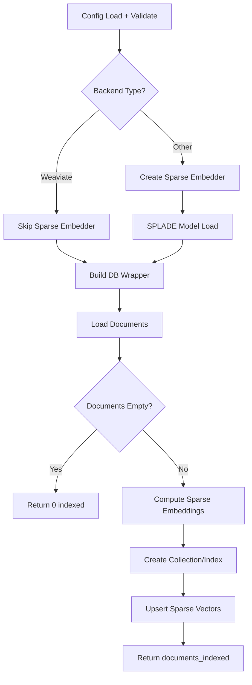
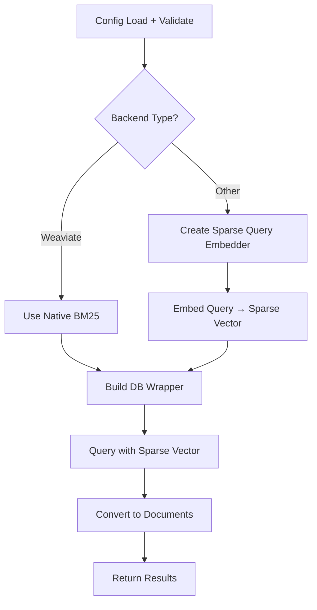

# LangChain: Sparse Indexing

## 1. What This Feature Is

Sparse indexing enables **lexical (keyword-based) retrieval** as an alternative or complement to dense semantic search. While dense embeddings capture meaning, sparse representations excel at:

- **Exact term matching**: IDs, product codes, specific names
- **Domain-specific vocabulary**: Technical terms, acronyms, jargon
- **Term importance weighting**: TF-IDF, BM25-style scoring

This module implements **five backend-specific pipeline pairs** using LangChain components:

| Backend | Indexing Pipeline | Search Pipeline | Sparse Approach |
|---------|-------------------|-----------------|-----------------|
| **Chroma** | `ChromaSparseIndexingPipeline` | `ChromaSparseSearchPipeline` | Sparse vectors (Cloud only) |
| **Milvus** | `MilvusSparseIndexingPipeline` | `MilvusSparseSearchPipeline` | SPARSE_FLOAT_VECTOR |
| **Pinecone** | `PineconeSparseIndexingPipeline` | `PineconeSparseSearchPipeline` | sparse_values parameter |
| **Qdrant** | `QdrantSparseIndexingPipeline` | `QdrantSparseSearchPipeline` | Named sparse vectors |
| **Weaviate** | `WeaviateBM25IndexingPipeline` | `WeaviateBM25SearchPipeline` | Native BM25 (no embedder) |

All are exported from `vectordb.langchain.sparse_indexing`.

## 2. Why It Exists in Retrieval/RAG

**Dense embeddings** excel at semantic similarity but struggle with:

- Exact term matching ("API-123-X" vs "API-123-Y")
- Domain-specific vocabulary (chemical formulas, medical codes)
- Acronym-heavy queries ("NLP" vs "natural language processing")

**Sparse embeddings** address these gaps:

### SPLADE (Sparse Lexical and Expansion Model)

A learned sparse representation that uses a pretrained language model to predict term importance weights:

| Property | Description |
|----------|-------------|
| **Sparse vectors** | Mostly zeros, few non-zero term weights |
| **Term expansion** | Document mentions "car", index includes "vehicle" |
| **Inverted index compatible** | Efficient retrieval via term lookup |

### BM25 (Best Matching 25)

Classical probabilistic retrieval model based on term frequency and inverse document frequency. Weaviate provides native BM25 support without requiring external sparse embeddings.

## 3. Indexing Pipeline: Step-by-Step



### Common Indexing Sequence

1. **Load config**: Via `ConfigLoader.load()` with env var resolution
2. **Validate sections**: Required: `dataloader`, `indexing`, `<backend>`
3. **Create sparse embedder**: SPLADE model via `SparseEmbedder` (except Weaviate)
4. **Build DB wrapper**: Backend-specific connection
5. **Load documents**: `DataloaderCatalog.create(...).load().to_langchain()`
6. **Early return**: If empty, return `{"documents_indexed": 0}`
7. **Compute sparse embeddings**: `sparse_embedder.embed_documents(documents)`
8. **Create collection/index**: Backend-specific sparse configuration
9. **Upsert sparse vectors**: With term indices and values
10. **Return**: `{"documents_indexed": <count>}`

### Backend-Specific Sparse Storage

| Backend | Storage Mechanism | Index Type |
|---------|-------------------|------------|
| **Milvus** | `SPARSE_FLOAT_VECTOR` field | `SPARSE_INVERTED_INDEX` |
| **Pinecone** | `sparse_values` with `indices`/`values` | Native sparse index |
| **Qdrant** | Named sparse vectors | Inverted index |
| **Weaviate** | Native BM25 (inverted index) | Built-in |
| **Chroma** | Sparse vectors (Cloud only) | Experimental |

## 4. Search Pipeline: Step-by-Step



### Common Search Sequence

1. **Load config**: Via `ConfigLoader.load()`
2. **Validate sections**: Required: `embeddings`, `<backend>`, `query`
3. **Create sparse query embedder**: SPLADE model via `SparseEmbedder` (except Weaviate)
4. **Build DB wrapper**: Backend-specific connection
5. **Embed query**: `sparse_embedder.embed_query(query)`
6. **Query backend**: Backend-specific sparse search method
7. **Convert results**: To LangChain `Document` objects
8. **Return**: Documents list

### Backend-Specific Search

| Backend | Search Method | Query Format |
|---------|---------------|--------------|
| **Milvus** | `search(query_sparse_embedding=...)` | Sparse embedding dict |
| **Pinecone** | `query(sparse_vector={"indices": [...], "values": [...]})` | Dict format |
| **Qdrant** | `search(query_vector=sparse_vector)` | `SparseVector` object |
| **Weaviate** | `hybrid_search(query=text, alpha=0.0)` | Text query (BM25) |
| **Chroma** | `query(query_embeddings=sparse)` | Sparse embedding |

## 5. When to Use It

Use sparse indexing when:

- **Exact term matching critical**: IDs, codes, specific terminology
- **Domain-specific vocabulary**: Technical, medical, legal jargon
- **Acronym-heavy queries**: "NLP", "API", "SQL"
- **Complement to dense**: Hybrid retrieval (combine both signals)
- **Low-resource languages**: Where dense embeddings are weak

### Ideal Use Cases

| Use Case | Why Sparse Helps |
|----------|------------------|
| **Code documentation** | Exact function names, API endpoints |
| **Scientific literature** | Chemical formulas, gene names |
| **Legal/medical** | Precise terminology, case numbers |
| **Product catalogs** | SKUs, model numbers, part codes |

## 6. When Not to Use It

Avoid sparse-only indexing when:

- **Semantic understanding needed**: Synonyms, paraphrases, intent
- **Cross-lingual retrieval**: Sparse is language-specific
- **Conceptual queries**: "How do I..." questions
- **Short documents**: Insufficient term statistics for TF-IDF

### Better Alternatives

| Limitation | Solution |
|------------|----------|
| **Semantic gaps** | Use dense or hybrid indexing |
| **Cross-lingual** | Use multilingual dense embeddings |
| **Conceptual queries** | Use semantic search |
| **Short texts** | Use dense embeddings |

## 7. What This Codebase Provides

### Public API

```python
from vectordb.langchain.sparse_indexing import (
    # Indexing pipelines
    "ChromaSparseIndexingPipeline",
    "MilvusSparseIndexingPipeline",
    "PineconeSparseIndexingPipeline",
    "QdrantSparseIndexingPipeline",
    "WeaviateBM25IndexingPipeline",  # Note: BM25, not sparse embedder

    # Search pipelines
    "ChromaSparseSearchPipeline",
    "MilvusSparseSearchPipeline",
    "PineconeSparseSearchPipeline",
    "QdrantSparseSearchPipeline",
    "WeaviateBM25SearchPipeline",
)
```

### Sparse Embedding Format

```python
# Sparse embedding structure (dict format)
sparse = {
    "indices": [0, 5, 10, 100],  # Term indices (vocabulary positions)
    "values": [0.2, 0.5, 0.8, 0.1]  # Term weights
}
```

### Backend Format Conversion

```python
from vectordb.langchain.utils.sparse_embeddings import SparseEmbedder

sparse_embedder = SparseEmbedder(model="naver/splade-cocondenser-ensembledistil")

# Embed documents
sparse_docs = sparse_embedder.embed_documents(documents)

# Embed query
sparse_query = sparse_embedder.embed_query(query)
```

## 8. Backend-Specific Behavior Differences

### Milvus

| Aspect | Behavior |
|--------|----------|
| **Field type** | `SPARSE_FLOAT_VECTOR` |
| **Index type** | `SPARSE_INVERTED_INDEX` with IP metric |
| **Query format** | Dict with indices/values |
| **Schema** | Separate sparse field alongside dense |

### Pinecone

| Aspect | Behavior |
|--------|----------|
| **Storage** | `sparse_values` with `indices`/`values` arrays |
| **Query format** | `{"indices": [...], "values": [...]}` |
| **Namespace** | Sparse vectors respect namespace isolation |
| **Hybrid** | Combine with dense via `hybrid_search()` |

### Qdrant

| Aspect | Behavior |
|--------|----------|
| **Named vectors** | Sparse vectors use separate name (e.g., "sparse") |
| **Query format** | `SparseVector(indices, values)` |
| **Fusion** | RRF fusion with dense via `search_type="hybrid"` |

### Weaviate

| Aspect | Behavior |
|--------|----------|
| **Approach** | Native BM25 (no external sparse embedder) |
| **Query** | `hybrid_search(query=text, alpha=0.0)` for pure BM25 |
| **Index** | Built-in inverted index |
| **No embedder** | Skip sparse embedding step entirely |

### Chroma

| Aspect | Behavior |
|--------|----------|
| **Availability** | Sparse vectors in Chroma Cloud only |
| **Open-source** | Not supported in local Chroma |
| **Fallback** | Use dense-only for open-source deployments |

## 9. Configuration Semantics

### Required Sections

```yaml
# Indexing configuration
indexing:
  sparse_model: "naver/splade-cocondenser-ensembledistil"
  max_length: 512
  batch_size: 32

# Dataloader (for indexing)
dataloader:
  type: "triviaqa"
  split: "test"
  limit: 500

# Backend section (one of)
milvus:
  uri: "http://localhost:19530"
  collection_name: "sparse-demo"
  dimension: 0  # Not needed for sparse-only

pinecone:
  api_key: "${PINECONE_API_KEY}"
  index_name: "sparse-index"

qdrant:
  url: "http://localhost:6333"
  collection_name: "sparse-demo"

weaviate:
  cluster_url: "https://xxx.weaviate.cloud"
  api_key: "xxx"
  collection_name: "SparseDemo"

chroma:
  collection_name: "sparse-demo"
  persist_dir: "./chroma"
```

### Sparse Model Options

| Model | Description |
|-------|-------------|
| `naver/splade-cocondenser-ensembledistil` | SPLADE ensemble (recommended) |
| `naver/splade-cocondenser-selfdistil` | SPLADE self-distilled |
| `prithvida/Splade_v2_Distilbert_uncased` | SPLADE v2 variant |

### Weaviate BM25 Configuration

```yaml
# No sparse embedder needed for Weaviate
weaviate:
  cluster_url: "https://xxx.weaviate.cloud"
  api_key: "xxx"
  collection_name: "BM25Demo"

query:
  text: "machine learning"  # Direct text query for BM25
```

### Search Configuration

```yaml
search:
  top_k: 10

query:
  text: "machine learning basics"
```

## 10. Failure Modes and Edge Cases

### Configuration Failures

| Failure | Cause | Mitigation |
|---------|-------|------------|
| **Missing sparse_model** | No `indexing.sparse_model` for non-Weaviate | Raises error at embedder creation |
| **Chroma open-source** | Sparse not supported in local Chroma | Use dense or switch backend |
| **Invalid model path** | Unknown SPLADE model | Verify HuggingFace model exists |

### Runtime Edge Cases

| Case | Behavior | Mitigation |
|------|----------|------------|
| **Empty vocabulary** | Query has no matching terms | Returns empty results |
| **All-zero sparse vector** | Invalid sparse embedding | Validate before upsert |
| **Index dimension mismatch** | Sparse dim ≠ model vocab size | Use consistent model |

### Backend-Specific Issues

| Backend | Issue | Mitigation |
|---------|-------|------------|
| **Milvus** | Sparse index requires explicit creation | Call `create_collection(use_sparse=True)` |
| **Pinecone** | Sparse vectors add storage overhead | Monitor index size |
| **Qdrant** | Named vectors need consistent naming | Use `sparse_vector_name` config |
| **Weaviate** | BM25 only (no learned expansion) | Accept limitation or use dense |
| **Chroma** | Sparse unsupported in open-source | Use dense-only or Chroma Cloud |

### Query Edge Cases

| Case | Behavior |
|------|----------|
| **Single term query** | Works well with sparse |
| **Very long query** | Truncated to `max_length` |
| **No matching terms** | Empty result set |

## 11. Practical Usage Examples

### Example 1: Milvus Sparse Indexing + Search

```python
from vectordb.langchain.sparse_indexing import (
    MilvusSparseIndexingPipeline,
    MilvusSparseSearchPipeline,
)

# Index documents with SPLADE
indexer = MilvusSparseIndexingPipeline(
    "src/vectordb/langchain/sparse_indexing/configs/milvus_triviaqa.yaml"
)
stats = indexer.run()
print(f"Indexed {stats['documents_indexed']} documents with sparse vectors")

# Search with sparse query
searcher = MilvusSparseSearchPipeline(
    "src/vectordb/langchain/sparse_indexing/configs/milvus_triviaqa.yaml"
)
results = searcher.run(query="API documentation", top_k=10)

for doc in results["documents"]:
    print(f"Score {doc.metadata.get('score')}: {doc.page_content[:100]}")
```

### Example 2: Weaviate BM25 (No Sparse Embedder)

```python
from vectordb.langchain.sparse_indexing import (
    WeaviateBM25IndexingPipeline,
    WeaviateBM25SearchPipeline,
)

# Index documents (no sparse embedder needed)
indexer = WeaviateBM25IndexingPipeline(
    "src/vectordb/langchain/sparse_indexing/configs/weaviate_triviaqa.yaml"
)
indexer.run()

# Search with native BM25
searcher = WeaviateBM25SearchPipeline(
    "src/vectordb/langchain/sparse_indexing/configs/weaviate_triviaqa.yaml"
)
results = searcher.run(query="machine learning", top_k=10)
```

### Example 3: Pinecone Sparse with Namespace

```python
from vectordb.langchain.sparse_indexing import (
    PineconeSparseIndexingPipeline,
    PineconeSparseSearchPipeline,
)

config_path = "src/vectordb/langchain/sparse_indexing/configs/pinecone_triviaqa.yaml"

# Index to namespace
indexer = PineconeSparseIndexingPipeline(config_path)
indexer.run()

# Search within namespace
searcher = PineconeSparseSearchPipeline(config_path)
results = searcher.run(query="Python API reference", top_k=5)
```

### Example 4: Qdrant with Named Sparse Vectors

```python
from vectordb.langchain.sparse_indexing import QdrantSparseIndexingPipeline

config = {
    "qdrant": {
        "url": "http://localhost:6333",
        "collection_name": "sparse-demo",
        "sparse_vector_name": "sparse",  # Named vector
    },
    "indexing": {
        "sparse_model": "naver/splade-cocondenser-ensembledistil",
    },
    "dataloader": {"type": "arc", "limit": 200},
}

indexer = QdrantSparseIndexingPipeline(config)
indexer.run()
```

### Example 5: Custom SPLADE Model

```yaml
# config.yaml
indexing:
  sparse_model: "naver/splade-cocondenser-selfdistil"
  max_length: 512
  batch_size: 64
  device: "cuda"

milvus:
  uri: "http://localhost:19530"
  collection_name: "efficient-sparse"
```

```python
from vectordb.langchain.sparse_indexing import MilvusSparseIndexingPipeline

indexer = MilvusSparseIndexingPipeline("config.yaml")
indexer.run()
```

## 12. Source Walkthrough Map

### Primary Module Files

| File | Purpose |
|------|---------|
| `src/vectordb/langchain/sparse_indexing/__init__.py` | Public API exports |
| `src/vectordb/langchain/sparse_indexing/README.md` | Feature overview |

### Indexing Implementations

| File | Backend |
|------|---------|
| `indexing/chroma.py` | Chroma |
| `indexing/milvus.py` | Milvus |
| `indexing/pinecone.py` | Pinecone |
| `indexing/qdrant.py` | Qdrant |
| `indexing/weaviate.py` | Weaviate (BM25) |

### Search Implementations

| File | Backend |
|------|---------|
| `search/chroma.py` | Chroma |
| `search/milvus.py` | Milvus |
| `search/pinecone.py` | Pinecone |
| `search/qdrant.py` | Qdrant |
| `search/weaviate.py` | Weaviate (BM25) |

### Configuration Examples

| Directory | Backend + Datasets |
|-----------|-------------------|
| `configs/chroma/` | Chroma + TriviaQA, ARC |
| `configs/milvus/` | Milvus + TriviaQA, ARC |
| `configs/pinecone/` | Pinecone + TriviaQA, ARC |
| `configs/qdrant/` | Qdrant + TriviaQA, ARC |
| `configs/weaviate/` | Weaviate + TriviaQA, Earnings Calls |

### Shared Utilities

| File | Purpose |
|------|---------|
| `src/vectordb/langchain/utils/sparse_embeddings.py` | Sparse embedding creation |
| `src/vectordb/langchain/utils/embeddings.py` | Dense embedder factory |
| `src/vectordb/langchain/utils/config.py` | Config loading |

---

**Related Documentation**:

- **Semantic Search** (`docs/langchain/semantic-search.md`): Dense-only retrieval
- **Hybrid Indexing** (`docs/langchain/hybrid-indexing.md`): Dense+sparse combination
- **Core Databases** (`docs/core/databases.md`): Backend sparse vector support
